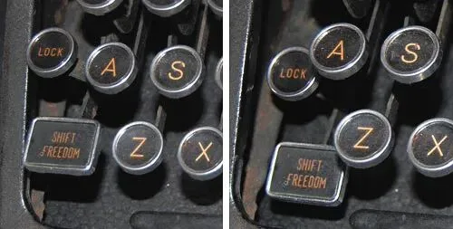
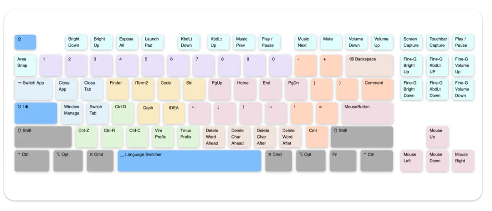
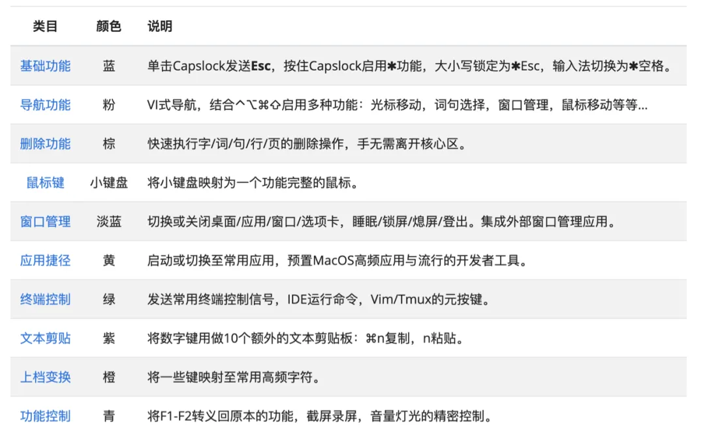
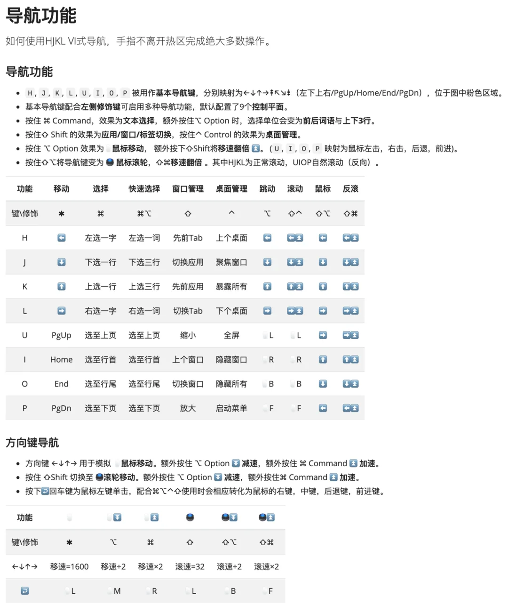
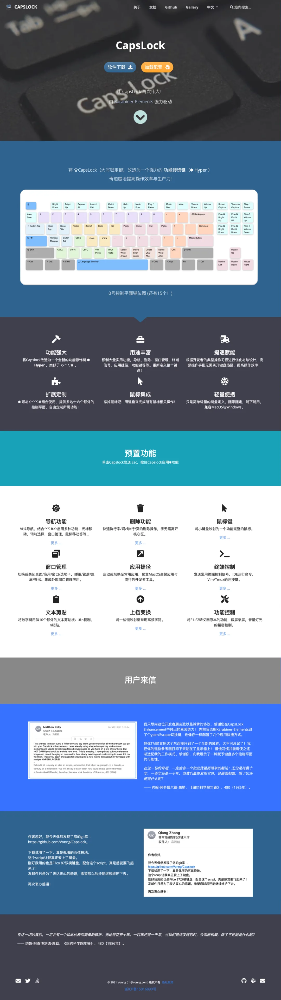
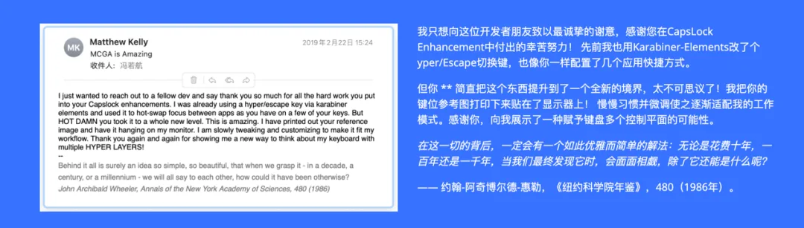

时隔五年，Capslock Enhancement 推出 3.0 版本。正所谓酒香也怕巷子深，好东西还是要多推广。今儿就来介绍如何用 Capslock 让你的键盘焕然一新。

## 前言

⇪ **CapsLock**，即大写锁定键（Caps=大写，Lock=锁定），其起源可追溯至打字机时代。

打字机是纯机械的设备，当按下⇧**Shift** 时，整套设备会与墨条纸带发生位移，使小写字母 “**上档**“ 为大写字母。

机械按键非常费劲，这样的操作对小拇指是不小的负担，以致连续输入两到三个大写字母都相当吃力。于是键盘上逐渐出现了 **⇪Capslock**：可以在大小写状态之间**切换**与**保持**。这样的设计减轻了打字员的负担，更是解决了一指禅选手的打字困境。

然而随着技术进步，Shift 能够毫不费力的满足人们的需求了（除了一指禅打字选手）。CapsLock 要解决的问题已经不复存在。而⇪**Capslock**这个“多余”的按键因为强大的历史惯性与路径依赖，依然占据了绝大多数键盘的黄金位置。

在历史上有很多人注意到了这一点，不少人都琢磨着让这个占了好位置的按键发挥出更大的作用。在某些语言的 MacOS 中，⇪**Capslock**的默认功能已经不再是大小写切换，而是输入法切换了。一些键盘直接去掉了⇪**Capslock** 键，而另一些则直接把它作为 ⌃**Ctrl** 或者 ⎋**Esc** 使用。有些人有更机智的想法：将⇪Capslock 改为复合功能键：单独键入时是⎋**Esc**，而按住不放时是⌃**Ctrl**。

尽管如此，我们所能做到的远比这要多：

譬如，创造一个类似于 ⇧**Shift**、⌃**Ctrl**、⌥ **Option**、⊞ **Win**、⎇ **Alt**、 ⌘ **Command** 等修饰键的全新功能键：✱ **Hyper**

## Capslock 改造计划

**Capslock 改造计划（Capslock Enhancement）** 就是这一想法的最终产物，这是对键盘的重新定义。

它将 Capslock 重新改造为一个类似于 ⇧⌃⌥⌘ 的全新的功能修饰键：

**✱ Hyper**。

按下✱，你的键盘从此大不一样。

如下图所示，单纯按下 Capslock 键后，每个键都被赋予了合理的功能，您还可以通过按下额外的 ⇧**Shift**、⌃**Ctrl**、⌥ **Option**  ⌘ **Command** 进行**排列组合**，启用 15 个额外的控制平面。

您可以在手**完全不离开键盘热区**的情况下，进行灵活的光标移动与鼠标导航；快速执行文本编辑、选择、删除功能；使用多个额外的剪贴板；快速打开并切换常用应用程序；切换窗口布局，应用、选项卡；执行亮度音量调整等常规功能…… 相当于集成了好几个辅助工具应用的功能，还不要钱。\

完整的功能介绍还请移步[官方文档站](https://capslock.vonng.com/zh/)。毕竟，这张图上只有最常用的 0 号控制平面，还有 15 个额外的控制平面可供自由选用与定制。\

### 一个例子

以 Capslock 提供的导航功能为例，HJKL 作为 VIM 的标准方向导航键，现在默认被全局应用为上下左右**方向键**，您可以在任何应用中都使用这种导航方式，并保持**手指不离开中央热行**。与此同时按下⌘Command，光标移动便切换为文本选择；再按下⌥Option 则上下左右会变成按词或按多行进行的**快速文本选择**。单独按下⌥Option，这个方向键又会变成**鼠标移动**操作，再额外按下⇧ Shift，鼠标移动又会变为**触摸板滚动**。配合 ⇧**Shift**与⌃**Ctrl**，HJKL 导航键又可以用于**桌面**与窗口的管理。仅仅四个键，就可以通过✱与原有修饰键的排列组合提供 72 种功能。

**当然看到这么复杂的映射请不要焦虑，您一定不会用到这里的所有功能**，但即使只有一个上下左右**移动✱**、 **选取**⌘、和**鼠标⌥**功能，也足以将日常操作的效率翻 n 倍了。

尽管它是针对**开发者**（特别是 vi 用户）进行定制优化的键盘改造方案，**但普通用户也完全可以从中受益**。例如同样是鼠标功能，HJKL 能提供的，方向键，和小键盘也可以提供。完整的 Capslock 在您的键盘上定义了三个功能完整的鼠标（HJKL，十字键，小键盘），您可以按照自己的喜好任意启用选用。

## 缘起

2013 年的时候，我特别喜欢折腾编辑器和 IDE：Sublime，Notepad++，UltraEdit，Vim，Visual Studio，Eclipse。不得不说，这些都是很好用的软件。但非常令人烦恼的一点，就是不同的软件快捷键不一样，有时候经常会记串。所以我就想有没有办法可以把这些编辑器的操作体验都统一起来。一个个地配置编辑器键位显然不太现实，所以我决定通过修改键盘键位的方式进行，于是就有了基于 AutoHotKey 的改键方案。

改造键盘的效果惊人的好：例如，使用 vim 时单击⇪ **CapsLock** 时输入 ⎋**Esc**手指不再漂移，在所有软件中都可以统一使用 vim 式的光标导航，和统一的删除操作。无论是打游戏还是敲代码，工欲善其事，必先利其器。**对键盘的定制**可以终结一切 IDE 编辑器之争。Capslock 预置的一系列的按键布局设计凝结了作者多年键盘侠心得，一切围绕着提高操作效率而设计。经过近 8 年的迭代调整改进，已经臻至化境。

习惯 Capslock 后日常操作速度将呈**倍数增加**，行云流水，天马行空。Capslock 改造方案能**省却按键次数**，**保护手指**与手腕健康；维持心流状态，不让琐碎的编辑操作干扰思路。并且它还是跨平台、跨编辑器的，您可以通过定制，在 Windows 与 MacOS 上，在不同的编辑软件中保持相同的操作系统。作为一个轻量的脚本和应用，您可以在几十秒内迅速在另一台机器上安装启用该配置。让风骚的操作不因环境变幻而受影响。

## 如何开始？

Capslock 是一个免费开源软件，不收取任何费用，没有任何广告，不搜集任何用户信息。完全基于强大的开源改键软件 Karabiner-Elements（macOS）与 AutoHotKey（Windows）进行开发，提供 macOS 版与 Windows 版。官网地址为 [capslock.vonng.com](https://capslock.vonng.com/)。

Capslock 的完整功能请参考[官方网站](https://capslock.vonng.com/)，您也可以从这里快速下载并体验 Capslock。

## 关于 Capslock

笔者第一次发布 Capslock 改进，还是大学使用 Windows 时，后来用了 MacOS 以后又开发了 MacOS 版。是 Karabiner 官方博物馆里第一个进行此类 Capslock 全面改造的方案。发布以后广受好评，有时还有来自世界各地的用户写来的感谢信。

> 这是我印象最深的一封感谢信……

目前，Capslock 在 Github 上每日约 50 访问量，已经有 677 个 Star 与 137 个 Fork，对于一个完全没有宣传推广的项目，已经是很不错了。不过，正所谓酒香也怕巷子深，有时候推广还是要积极一点嘛。让更多人享受到键盘的乐趣～～

既然有了用户的关注与支持，作为作者也得稍微负起责任来。所以最近我进行了一次兼容改进（rev 3），添加了这几年来攒下的大量实用功能，顺便做了一个官方网站，用于展示文档，发布版本，充个门面。也欢迎大家到 Github 加星与 Fork 哈。

---

发布版本：[微信公众号](https://mp.weixin.qq.com/s/D43tF39KAtDu19Ao8glAWw)
