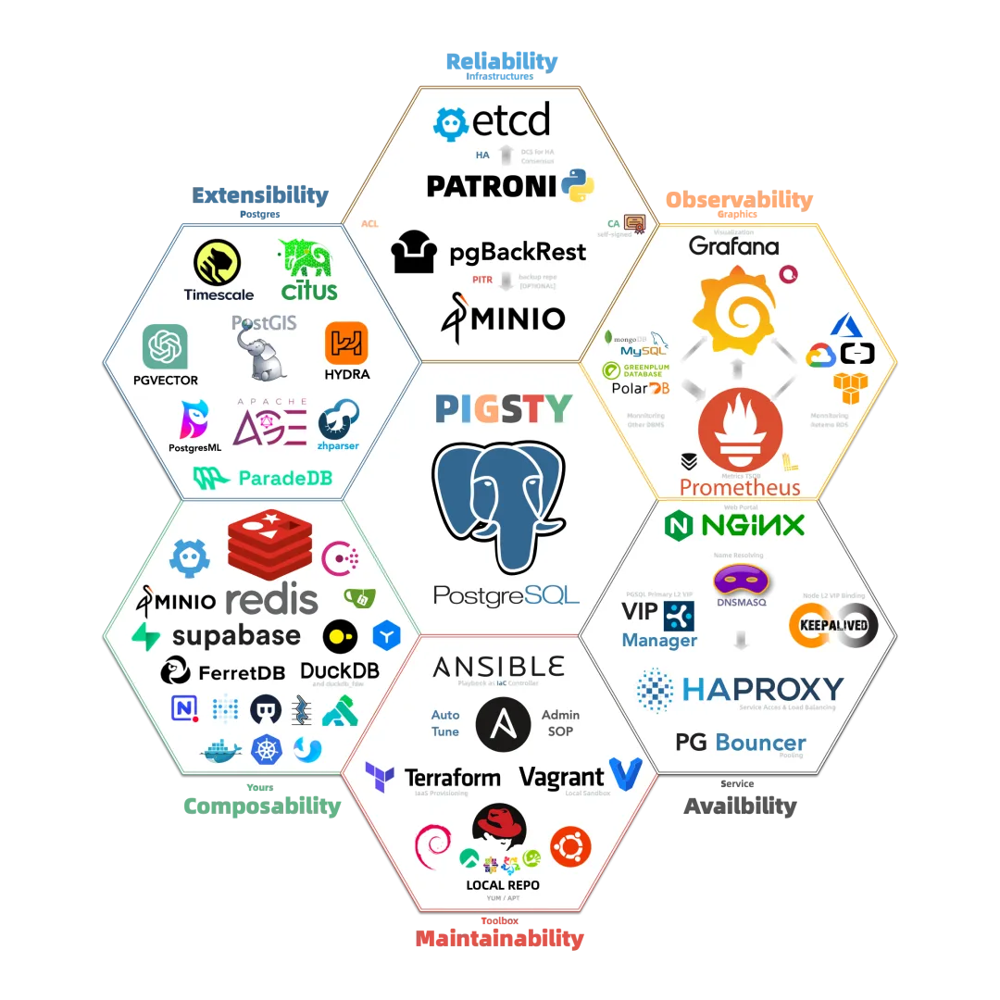
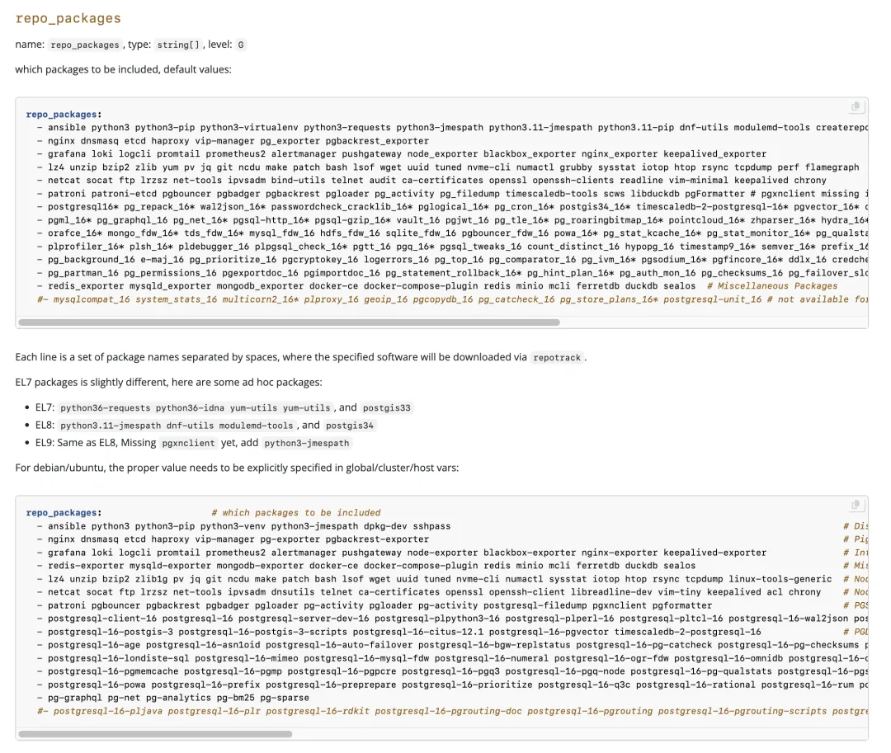
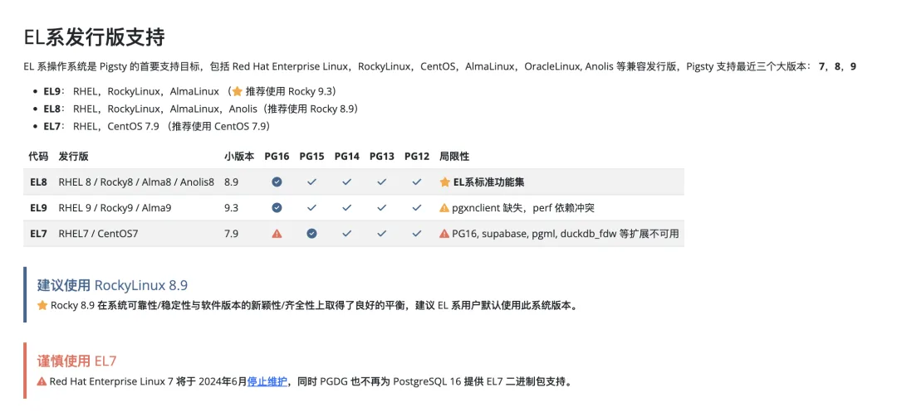
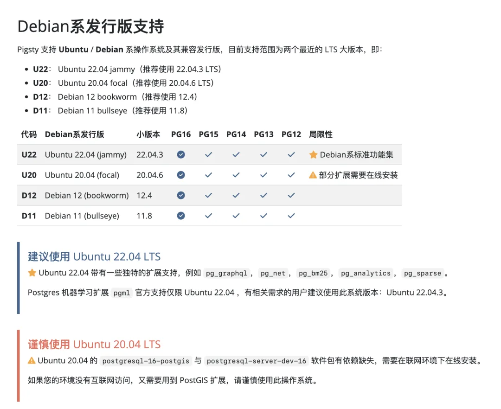

去年我写过一篇《[EL 操作系统兼容性哪家强](/db/rhel-compatibility/)》，聊起 CentOS 7 过保后换什么操作系统的问题。现在这个问题变得火烧眉毛了 ——  2024.06.30，也就是后天，CentOS 7 就真的 EOL 了。BTW，Debian 11 也会在一个月后正式 EOL。

那么在这个时间点，就让我们再来看一看，**服务器端 Linux 操作系统**，到底哪个发行版更合适？

---

## 太长不看

EL 的兼容发行版中，**RockyLinux** 的兼容性最好，建议使用 8.9 或 9.3。如果有“国产化”要求，**Anolis** 8 （RHCK 内核）也有极好的兼容性。AlmaLinux，OracleLinux，CentOS Stream 有些兼容性上的小问题，谨慎按需使用。Euler 属于独一档的拉垮 —— 谁要是用这个，祝他好运。

Debian 系发行版稳定性也非常不错，鉴于 Debian 11 下个月就 EOL 了，当下最合适的选择是 **Debian 12 bookworm**。Ubuntu 的话桌面不错，但作为服务端操作系统还是拉垮了，如果不是有特殊需求（比如 NVIDIA 驱动），还是用 Debian 更合适。如果用 Ubuntu，当下最合适的版本仍然是 **22.04 jammy**。

---

## 测试场景

[Pigsty](/pigsty/db-allrounder/)，作为一个不使用容器/编排方案，直接基于裸操作系统发行版的 PostgreSQL 数据库发行版，几乎跟所有的主流 Linux OS 发行版都需要打交道。

Pigsty 作为这些操作系统发行版的直接用户，场景非常具有代表性 —— 在裸操作系统上[运行世界上最先进且最流行的开源关系型数据库 PostgreSQL](/pg/pg-is-no1/)，以及企业级数据库服务所需要的完整软件组件 —— 包括：

PostgreSQL 生命周期中的 6 个大版本（12 - 17），255 个扩展插件；还有几十个常用的主机节点软件包，Prometheus / Grafana 可观测性全家桶，以及 ETCD / MinIO / Redis 等辅助组件。

我们的标准也很简单 —— 这些发行版官方仓库以及 PGDG、Pigsty 提供的 APT / RPM 软件包能否在没有任何依赖冲突的情况下成功安装。

我们测试了 EL / Deb 系的主要操作系统发行版，最后保留了 7 个主要的发行版大版本：EL 7,8,9；Debian 11/12；以及 Ubuntu 20.04 与 22.04 的支持。在这个过程中，也对各个操作系统发行版的体验有了一个直观认识。

任何上游 OS 软件包的变化，也会第一时间在我们的发行版构建过程中体现出来。每当有执行在线安装的用户反馈 RPM / APT 装不上，或者原本跑的好好的工作流出现依赖错漏，我们就知道上游操作系统发行版又翻车了。

---

## CentOS 7.9

当然，不同系统，翻车的频率是不一样的。我不得不承认，很多用户停留在 CentOS 7.9 是有原因的 —— [就跟很多 MySQL 用户仍然在使用 5.7 一样](/db/sakila-where-are-you-going/)。在我们这几年的构建过程中，CentOS 7.9 确实是最稳定的操作系统 —— 一次 Break 的记录都没有。

当然这一点也很好理解，EL7 作为一个已经不再更新的版本，当然很难再出现什么幺蛾子。同时，它对于大多数用例场景已经足够好了 —— 至少能跑起来 Docker。

CentOS 7.9 有一些特定的优点，例如在我们的场景中，离线软件包大小是最小的（比其他系统少了 20 % ～ 30% ），安装速度是最快的，稳定性也是最高的 —— 我从来不担心在 7.9 上翻车。

但是，CentOS 7.9 确实太老了，在一些新功能、新软件、新版本的支持上已经跟不上脚步了。例如，PostgreSQL 16 已经不在再提供对 CentOS 7.9 的支持了，使用 Rust 编写的 PG 插件也没法在 EL7 上编译运行。

综上所述，对于那些也不需要什么新功能，也懒得升级打补丁，在隔离内网安静地跑到地老天荒的系统，EL 7 也许还是一个不错的选择。但因为功能实在太老了，在下一个版本的 Pigsty 中，我们也会正式在开源版中放弃对 EL7 的支持。

---

## EL 8 & EL9

**EL8** 和 **EL9** 是目前 EL 系的主力版本，目前小版本号已经到了 8.9 与 9.3 （ 8.10 与 9.4 刚出）。对于我们的场景来说，EL8 的 PostgreSQL 软件包支持要比 EL9 更齐全丰富一些，所以我们默认推荐使用的版本是 EL8 （RockyLinu 8.9）。

从软件稳定性上看，EL8 和 EL9 都 **偶尔**会出现依赖崩裂的情况。（频率大概一两个月一次），PGDG YUM 仓库的维护者 Devrim 跟我吐槽说，每两周上游系统软件一更新，他那儿就有一堆活要整。当然，Devrim 老爷子要是来不及调整梳理依赖变动，我这里就会感知到 Break，最常见的就是 LLVM 包版本冲突问题。

当然这些问题一直都是存在的，Pigsty 采用的办法就是每次发行新版本的时候，把所有要用的 RPM/APT 及其依赖都下载下来，打一个**离线软件包**。这样用户在安装的时候，就不需要使用互联网访问，也不会遇到某个包一升级把整个环境给带崩的问题。

尽管 EL 8，EL9 在稳定性上不如 CentOS 7.9。但反过来说，在功能活性上就要比 EL 7 好太多了：有持续更新的安全补丁，编译器版本更高了，软件包也更齐全，也支持 ebpf 一类的新特性。作为利弊权衡，确实是当下 EL 系统的更优选。

---

## Debian & Ubuntu

另一个与 **CentOS 7** 几乎同样稳定的操作系统是 **Debian** 12，同样没有出现什么编译错误。这一点其实让我非常惊讶 —— 很多运维老师傅都说 Debian 很稳，但只有自己用过才对这一点有深刻体验。作为一个与 PostgreSQL 调性极为相合，同样由纯粹开源社区驱动的操作系统发行版来说，这一点实为不易。\

作为 Debian 的衍生发行版，**Ubuntu** 以 Linux 中极为出色的桌面体验与支持而著称。但服务器操作系统不 Care 这个 —— 然而 Ubuntu 服务器系统的使用体验确实比 Debian / EL 落后一个档次。出现依赖崩坏的次数最为频繁，瞎 JB 改的地方也最多。但 Ubuntu 也有着自身的优点，那就是 NVIDIA 驱动支持。如果你要运行 PostgresML 这样的机器学习扩展，那么确实没有其他好办法 —— 你只能选择 Ubuntu。

Ubuntu 20.04 和 Debian 11 因为版本更老，所以出现错误的频率会更高一些。特别是考虑到下个月 Debian 11 就 EOL 了，明年四月 20.04 也 EOL 了，如果没有其他的理由，我认为在当下，用这两个系统就是给自己找不自在。\

从另一个方向上，Ubuntu 24.04 noble 虽然出来了，但它太新了，以至于 PostgreSQL 相关的软件包都还不齐全，所以目前还不适合生产环境。\

---

## EL 兼容版本哪家强

当然，EL （Enterprise Linux）是一个操作系统发行版家族，有许多的“兼容发行版”。我们使用的是 RockyLinux 8.9 和 RockyLinux 9.3，这是有原因的。

RockyLinux 的创始人就是原来 CentOS 的创始人，CentOS 被红帽收购后又另起炉灶搞的新 Fork。目前基本已经占据了原本 CentOS 的生态位 —— 免费的企业级 Linux 发行版。

最重要的是，PostgreSQL 官方源明确声明支持的 EL 系 OS 除了 RHEL 之外就是 RockyLinux。PGDG 构建环境就是 Rocky 8.9 与 9.3（6/7 用的是 CentOS）。说白了，在 PG 这个用例里面，EL 系里兼容性最好的肯定是 Rocky，甚至 RedHat 的 EL 都不一定有 Rocky 好。

****AlmaLinux / **Oracle Linux** / **CentOS Stream** 的兼容性相比 Rocky  要拉跨一些，不是所有的 EL RPM 包都能直接安装成功：经常性出现依赖错漏问题。大部分包可以从它们自己的源里面找到补上 —— 有些兼容性问题，但基本上属于可以解决的小麻烦。

AlmaLinux 的兼容性问题相对小一点，可以作为 RockyLinux 的下位替代。其他这几个 OS 发行版整体体验很一般，考虑到 **Rocky** 已经足够好了，如果没有特殊理由，我觉得没有必要折腾自己。

---

## 国产操作系统

也有一些 EL 兼容的 “国产化” 操作系统 —— 比如 龙蜥 / OpenAnolis 是阿里云牵头的国产化操作系统，就号称 100% 兼容 EL。本来我并没抱太大期望：只是有用户想用，我就支持一下，但实际效果超出了预期：EL8 的所有 RPM 包都一遍过，适配除了处理下 `/etc/os-release` 之外没有任何额外工作。

适配了 Anolis 一个，就等于适配了十几种 “国产操作系统系统”发行版：阿里云、统信软件、中国移动、麒麟软件、中标软件、凝思软件、浪潮信息、中科方德、新支点、软通动力、博彦科技，可以说是很划算了。

腾讯的 openCloudOS 兼容性也还可以，有个小问题是内核模块里没有 softdog，其他倒是问题不大，但总归是比 Anolis 差一点。如果您有“国产化”操作系统方面的需求，选择 **OpenAnolis** 或衍生的商业发行版，是一个不错的选择。

**OpenEuler** 属于最 **拉 **的独一档，欧拉要是泉下有知估计能给气活过来。号称 EL 兼容，但用起来完全不是这么回事。例如：在 PostgreSQL 内核与核心扩展中，postgresql\*，patroni，postgis，pgbadger，pgbouncer 全部都需要重新编译。而且因为使用了不同版本的 LLVM，所有插件的 LLVMJIT 也都必须重新编译才能使用，费了非常多的功夫才完成支持，还不得不阉割掉一些功能，总的来说使用体验非常糟糕。（当然这种糟心的“国产”兼容性支持是**永远**不可能开源的，必须定一个天价卖给那些 **选择吃翔**的客户，才能弥补一些精神损失）

其他的一些 “国产操作系统”，有的是纯换皮或者做个桌面，这种还能凑合用用，有些喜欢乱魔改的，这种我的建议是碰都不要碰。

关于国产操作系统的评价，请看《[EL 系操作系统兼容性哪家强](/db/rhel-compatibility/)》

题图为 [加拿大 **Rocky** 山脉](/trip/20240627-banff-jasper/)

---

## 数据库老司机

---

发布版本：[微信公众号](https://mp.weixin.qq.com/s/aVFI1vC9goekD-XYAAj0ug)
