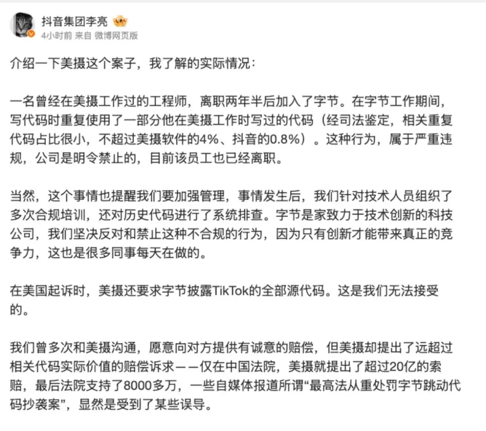

> 原作者：瑞典马工

近日，最高人民法院判决抖音公司侵害美摄 SDK 软件著作权，责令赔礼道歉并且赔偿 8266.8 万元。这是一个非常振奋人心的判决。本文作者和美摄科技没有任何关系，也感到由衷的高兴。著作权是软件从业者的命脉。最高法院通过案例来保护从业者吃饭的家伙，自然大家都鼓掌叫好。

当然，抖音集团是不太愿意大家这么开心的。一方面他们不敢不尊重最终判决，一方面他们试图重新组织语言，把一个典型的代码抄袭案件包装为一个小小的管理失误。

把这位抖音集团副总裁的官腔去掉，他表达了几层意思

1. 抖音只是“重复使用”了美摄的代码。

2. “重复使用”是员工的行为，公司反对。

3. 美摄要求的赔偿太高。

这每个辩护都是站不住脚的。

## 抖音对美摄著作权的侵犯有多严重？

一个单位职工如果把公车私自卖掉，那就是贪污，属于严重的违法犯罪。如果他只是”重复使用“公车去接送小孩上学，那仅仅是违纪。这两者的区别很明显。

最高人民法院明明认定了抖音集团抄袭了美摄科技的代码，但是李亮硬要说是”重复使用“，就是想把一个严重的代码剽窃案件淡化为一个小小的不规范行为。实际上，和车子不同，代码作为非实物产权，未经授权的“重复使用”就等于盗窃，并没有比”重复使用”更严重的著作权侵犯行为。

李亮还刻意提出几个数字，说剽窃的代码只占抖音的 0.8%，美摄的 4%，也非常荒谬……

首先一点，作为十万员工字节跳动集团最主要的产品之一，抖音是一个非常大的应用，其 0.8% 的代码，绝对数量非常大。用常理推测，不到五百人的美摄科技 4% 的代码不太可能达到抖音的 0.8%，李亮的 0.8% 实际上是一个高估的数字，非常不专业。

更核心的问题是，和人民币不同。大多数代码没有抄袭价值，有抄袭价值的只是数量很少的关键代码。如果一个小偷说“虽然我偷了你一百张百元人民币，但是只占你背包的 4% 重量，占我背包的 0.8%”，大家会觉得这人可笑到荒谬。美摄指出，被抄袭的代码是其核心的音视频代码。李亮把这部分代码和那些低门槛的代码，（比如鉴权代码），放在一起，得到个 0.8% 的占比，没有实际意义，无非就是在搅混水。

换个角度看，占比越小，说明抄袭者身家越高，其实更为可耻。《悲惨世界》的主人公冉阿让偷了一块面包，其价值超过他个人财富的 100%，因为他根本买不起面包喂饱小孩，他应该被社会原谅。有些腐败村干部伪造资料帮助家人骗取国家低保，一个月几百块的低保占其收入比例很小，实际上更加可恶。抖音集团作为超大科技企业，本应该为社会做出严格表率，结果他们反而用超大规模作为剽窃的辩护理由，实在令人费解。

## 抖音的侵权是离职员工的责任吗？

李亮强调离职员工把代码带进了抖音的代码库，而”公司是明令禁止的“，试图把公司侵权行为转化为个人侵权行为，把抖音也打扮成受害者。

任何一个有法务的公司，都会明令禁止抄袭代码，这是最基本的合规动作。但是，这种禁止有两种层次

1. 在纸面上和实践中，真正的禁止员工抄袭代码，

2. 在纸面上禁止，但是并不真的实施禁令。出事的时候把纸面规定拿出来把责任撇给员工。

第二种做法非常普遍。多年以前，我老家有人去广东打工，在工地受了工伤。家属索赔的时候，对方就拿出一些纸说“我们明令禁止不戴安全帽的行为，但是他违规了，所以如此如此”。实际上，那个工地的管理层从来没有检查过安全帽，管理层自己也不戴安全帽，安全帽的规定只是停留在“明令禁止”层面，只是为了出事的时候撇清责任。

李亮自己也承认，他们针对技术人员的合规培训是“在事情发生后”。他说的这个“事情”指的恐怕不是抄袭这个事，而是抖音被人告了这个事。如果没有美摄提起诉讼，抖音也会组织多次培训吗？

如果抖音想要证明自己对代码抄袭不知情，一个很简单的做法就是公开代码提交记录。只要抖音公开相关代码的 Git 历史记录，显示每次提交代码都有其他同事的讨论，有迭代纠错，规模合适，符合抖音的代码风格，自然就可能说服法庭：“该名员工欺骗了所有同事，我们也是受害者”。不熟悉 Git 的朋友需要注意，此处并不需要抖音公布其代码本身，需要的只是代码提交记录，没有李亮担心的代码安全问题。然而抖音并没有这样做，那么很可能的情况是，Git 历史记录并不支持他们的这种清白辩护。

在抖音拒绝提供详细信息的前提下，普通从业者其实还有一个方法可以合理的推断：违法犯罪行为的最大受益人，会是这种行为最大的赞助者。

如果方恒时尚中心一只狗咬了人，狗主人骂他的狗说“出门之前我明令禁止你咬人”，没人会觉得他就无辜了。重要的问题是：他遛狗的时候有没有系狗绳。如果他为了追求自己的轻松而不系绳子，他就负全部责任，至于他在家里立了什么假规矩，根本无关紧要。打这个比喻，我绝对没有侮辱当事人的意思，但是同为工程师，我不得不承认，很多大公司的管理层心态和狗主人是差不多的：收益我来摘取，风险由员工承担，出事的时候我只需要骂员工几句就可以脱责了。

## 美摄的赔偿要求不合理吗？

字节作为一个巨头，使用盗窃的代码获利，这是李亮也没有否认的事实。目前法院判决 8 千万赔偿金听起来很多，但是考虑到字节半年收入 730 亿美元，这个数字其实还不够他们一个小时的收入。

如果笔者本人去了村头超市偷一斤汤圆（占本人体重 0.8%，占超市汤圆数 4%）被抓了，然后打了三年官司，最终判决我赔偿一个小时的工资收入，我也不太会吸取教训。那么其他人有样学样，恐怕本村治安风气好不起来。

中国科技业一个很大的弊病就是大公司经常抄袭小公司的创意，代码甚至数据。三年前，阿里云计算有限公司的一个团队就直接抄袭北京 IPIP 公司的数据库，做成自己的产品，和苦主公司直接竞争。在 IPIP 公司 CEO 高春辉的严厉谴责下，阿里云快速调查并且道歉了。作为对比，字节公司缺乏阿里云的操守，在法院判决之后，字节/抖音的副总裁还在狡辩，试图用各种方法淡化自己的责任，实在令人不齿。

作为软件从业者之一，我衷心的希望司法系统能够更严厉的制裁不法行为，约束有超大杠杆的科技巨头，为中小企业创造一个更为公平的竞技场，让从业者安心研发，不断创新。

---

发布版本：[微信公众号转载页](https://mp.weixin.qq.com/s/72Yp7d6yjIezS9iQZgNw9w)
