最近疫情成了关注焦点，各类消息此起彼伏，传言漫天飞舞。如果每天看到的都是各种死亡的案例与绝望的求救，真的很容易有种世界末日来临的感觉，陷入恐慌绝望中。数据有助于认知真相，起码能够帮助人们形成正确的比例感（当然前提是**数据真实**）。比较遗憾的是各个疫情地图站点都没有提供市/区级别历史数据查询的接口，所以我特意把鹅厂公布的疫情数字撸下来归档并简单分析了一下。

TL；DR：湖北省内省外冰火两重天

## 全国概览

截止至 2 月 12 号凌晨，根据腾讯（卫健委）数据，全国累计确诊 42714 人，疑似 21675 人，死亡 1017 人。

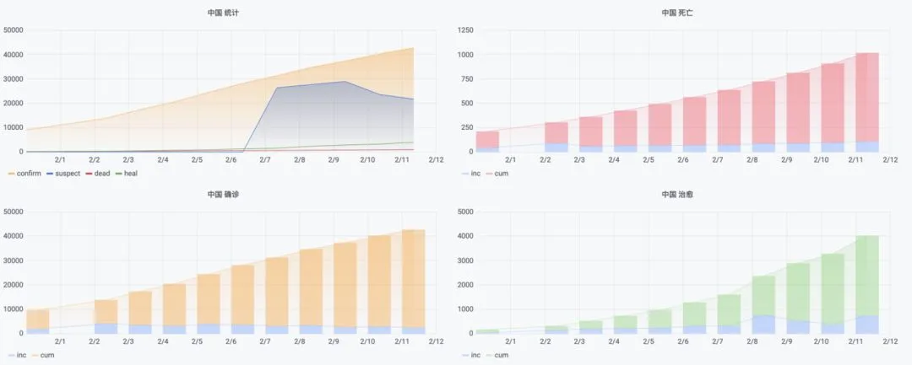

作为参考，非典确诊 5327，死亡 349。按照香港管教授到说法是非典十倍起跳，看来是板上钉钉了。死亡率按照 总累积死亡 /  总累积确诊来算，在 2.4% 左右。

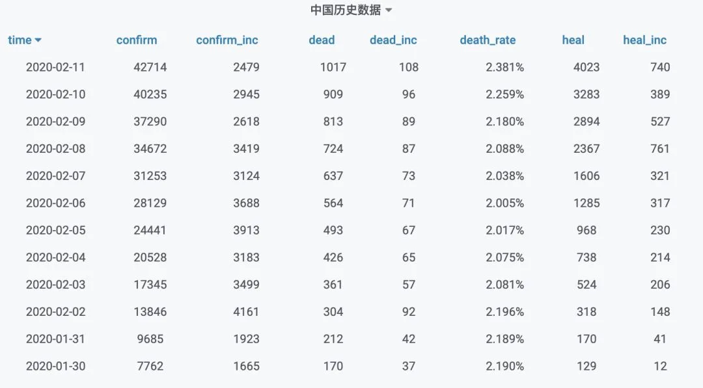

不过确诊到死亡有一个周期，另一种死亡率计算方式是用当日死亡除以几天前的累积确诊，不同的周期选取会产生不同的结果，可以入院后 7 到 12 天死亡作为一个参考基准来计算，这样看上去死亡率就有点吓人了。

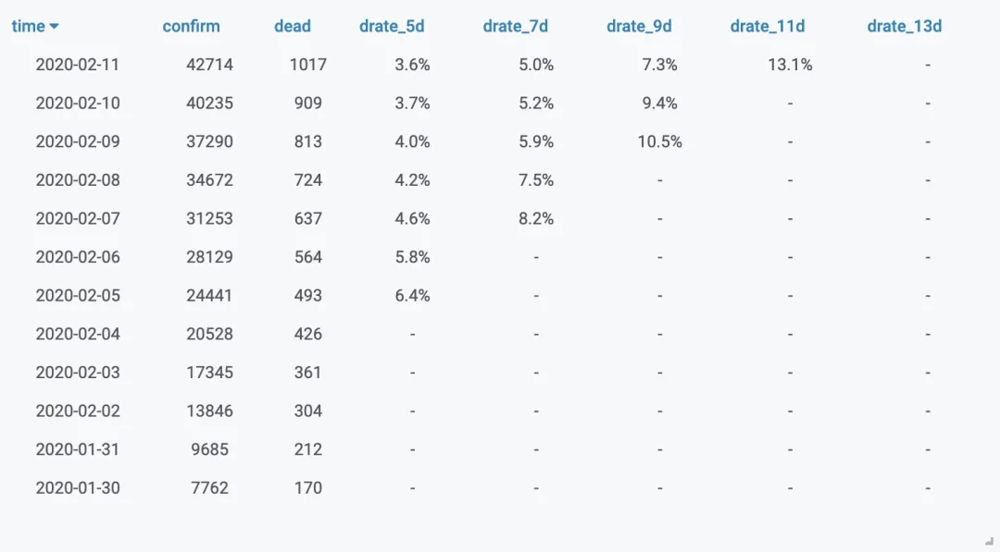

**但是**，全国的疫情统计数字其实是被湖北和武汉带起来的，比如看下图全国分省数据就能发现。

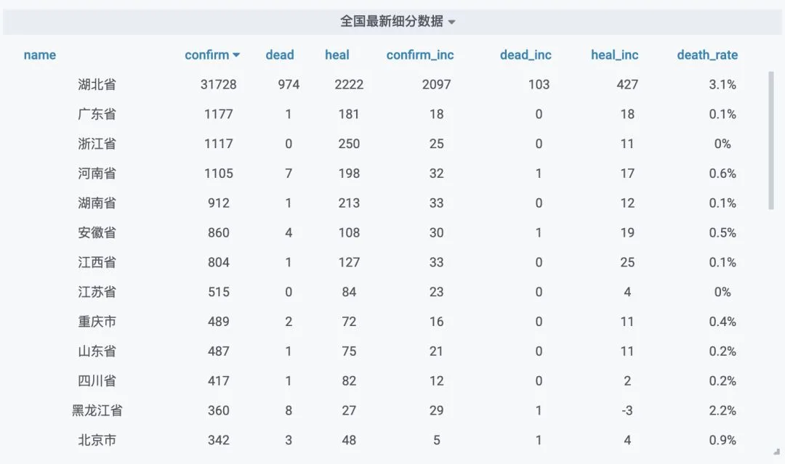

确诊人数的分布上，湖北一省就占了六成。而武汉一市就占了全国确诊人数的四成，更是包揽了全国死亡数的四分之三（假设武汉死亡数据真实）。

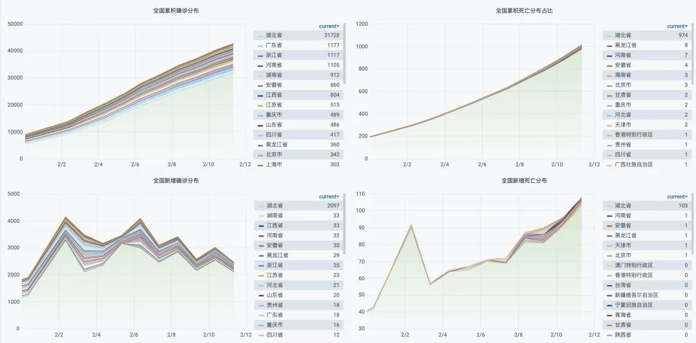

## 除湖北外疫情基本控制

就目前而言的官面数字来看，除湖北省外的地区疫情都得到了基本控制，表现特征就是：确诊增加，但增速放缓。一阶导数为正，二阶导数为负。抛开湖北省，确诊累积和新增都能反映这一趋势。

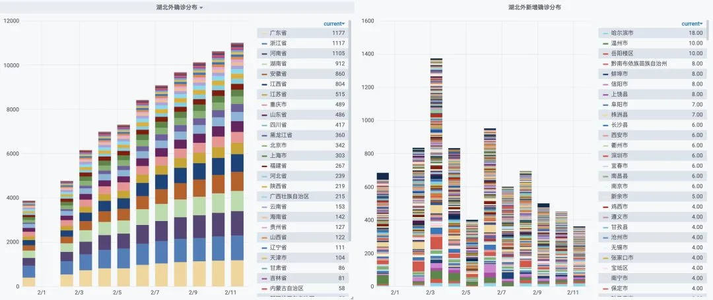

封城确实效果立竿见影，例如 2 月 3 号宁波封城，2 月 3 号一片红，2 月 4 号就开始缓和了（去除湖北）

更重要的是因为资源相对充沛，这些省份的数据还是比较准确的，某些城市甚至会精确到个例来公布疫情。下了血本隔离封城砸出来的效果确实很好，

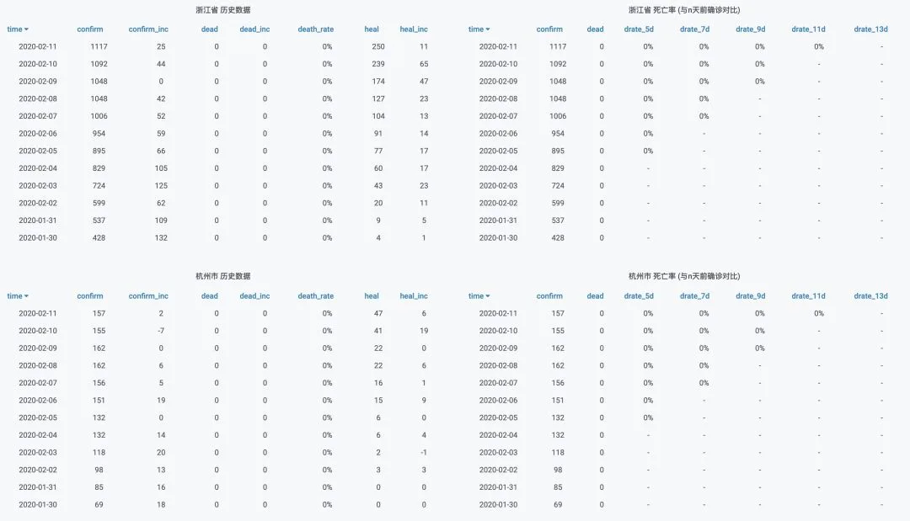

疫情一度第二严重的浙江，其实仔细看也还好。如果看湖北省外的数据，可能甚至会觉得新冠怎么这么弱鸡，杀伤力还没流感大，但如果把镜头切到湖北，那就是完全另一副光景了。

## 湖北武汉

湖北，特别是武汉是核心疫区。湖北占了确诊总数六成，武汉就占了四成。

不由得让人想起那个段子：世界钢产量前三名分别是中国，河北，唐山。

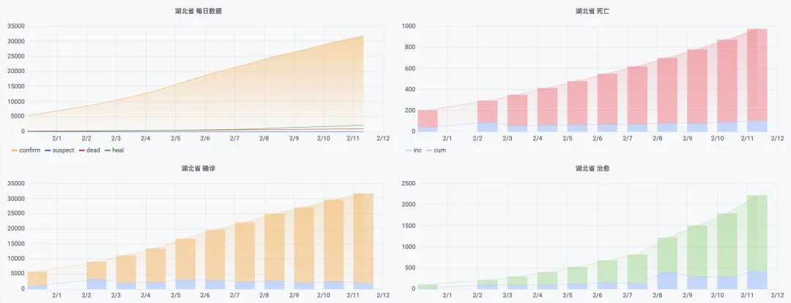

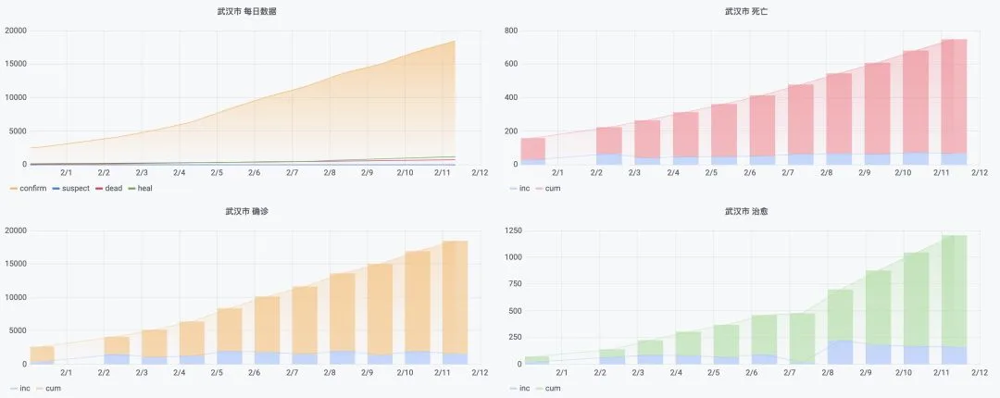

湖北省的其他城市也比较严重，但相对武汉都是小巫见大巫了。

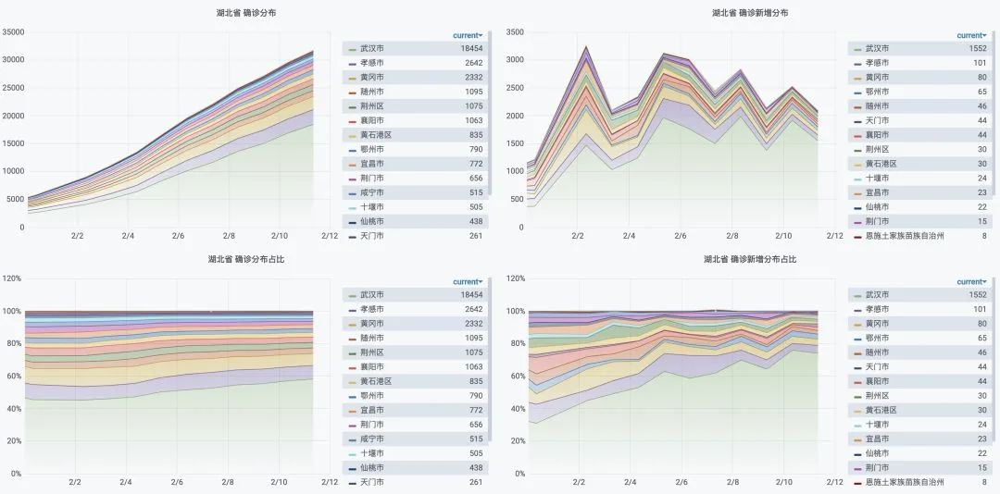

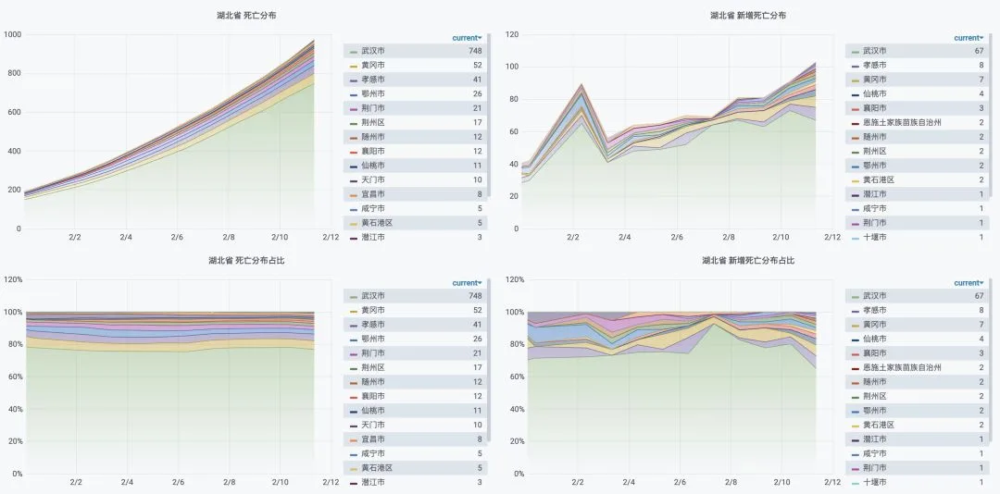

但另一个非常关键的问题是，湖北，武汉的数据可靠性存在很大的问题。例如这里是官方给出的数据，到今天确诊 31728 人，以武汉 900 万人计，感染率也就是千分之三。

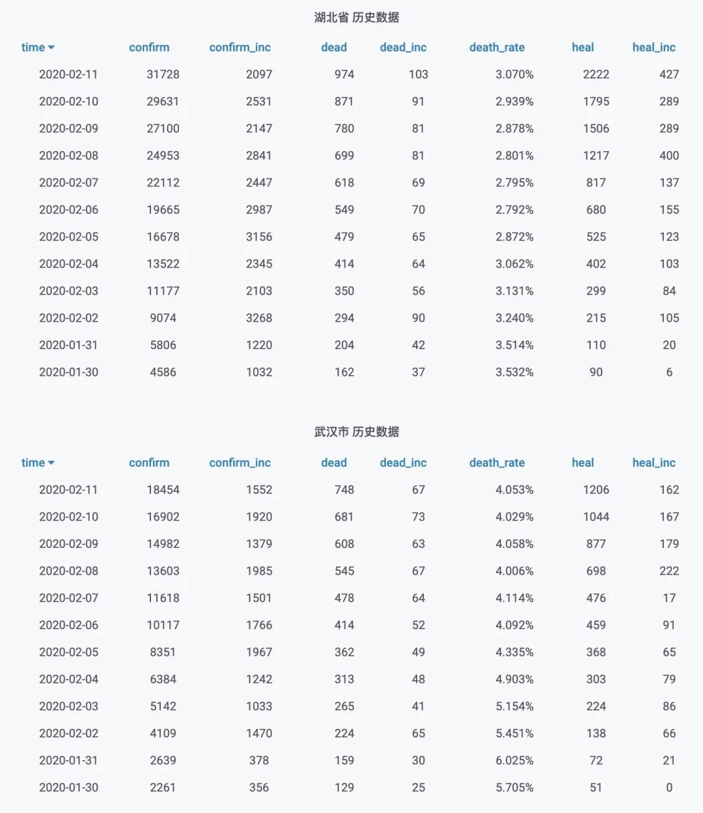

但这个数字和其他几个数据没法对上。例如最典型的就是撤侨。撤侨其实是一次比较均匀的抽样了，例如在 2 月 2 日，日本撤侨抽样(3 / 206) 感染率是千分之四点六，而当时武汉感染数字 4109 为万分之四点六，正好差了一个数量级。再比如从死亡数据来看，一个很有价值的参考信息是火葬场满载烧不过来，缺乏人手与尸袋。那么估算日均死亡可以用：

- 火葬场满载烧人：30 炉 * 28 人/日 - 正常死亡 136 人/日 ≈ 700 人/日
- 温州返乡抽样：(241 / 5.2W) *900W* 11% / 14 天 ≈ 330 人/日

- 日本撤侨抽样：(3 / 206) *900W* 11% / 14 天 ≈ 1030 人/日

- 单医院单日收户数（某视频）：10 人/日·家 * 24 家 ≈ 240 人/日

数据可能有较大出入，但在大体上的数量级上估算是不容易出错的，大概可以认为几百人一天。

所以某些香港专家，英国专家的判断预测很可能是对的，说了什么自己去找吧。

所以武汉内外，冰火两重天。各类人间惨剧实况上演，真的是人道主义灾难。19 省援鄂 WH 都没人敢认领，只能“自限”一下了，真心祝愿愿武汉人民熬过这一关…。

省外的人，起码从数据上确实看不出有啥好担心（肺炎本身）的。恐慌与其说是因为肺炎，倒不如说是对封城这种应对措施本身的反应，毕竟经历上一个庚子年的人不少还活着。

当然，不用担心肺炎本身不代表高枕无忧了。在疾病之外产生的冲击和影响可能会远超想象，这次凭借肺炎的势会走到哪一步也尚未可知。春耕滞阻虫涝灾，鼠疫猪瘟禽流感，倒闭失业裁员潮，脱钩换届毛衣占，债爆闭关张献忠，战时计划总动员。指不定会碰上哪个？毕竟惊涛骇浪的 2020 才开始一个月，这就是题外话啦。

---

发布版本：微信公众号（原发布记录已失效）
