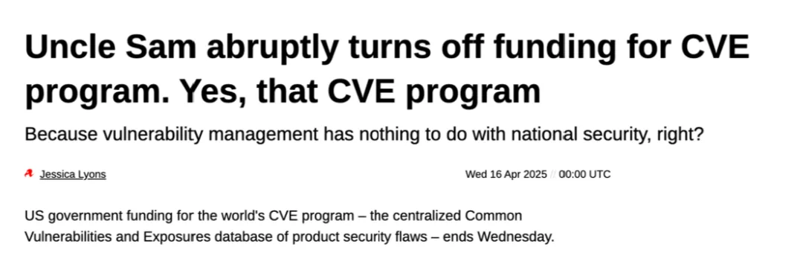
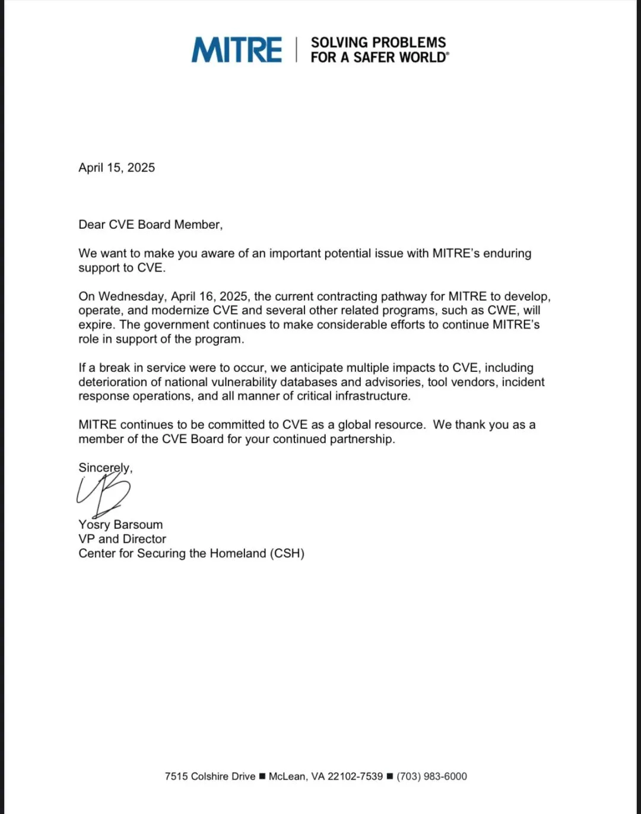

## 没错，就是那个报漏洞的 CVE 项目，美国政府竟然掐断了它的资金。这不是自毁长城是什么？中国的 CNCVE 估计能笑晕在厕所了。

=

最近安全圈子又起了一场惊天波澜：报漏洞的 CVE 组织被美国政府断奶了。

CVE（Common Vulnerabilities and Exposures），也就是通用漏洞披露标准，简单说就是给每个漏洞发放全球统一的“身份证号”，让厂商、研究员和用户交流时都能精准对号入座。MITRE 则一直扮演着 CVE 的“管理员”，给全球每年四万多个漏洞地分配编号。

## 发生了什么？

据 Tib3rius 爆料，MITRE 对 CVE 项目的支持将于明天到期，而且他们已经给 CVE 董事会成员发过警示信。

随后，圈内知名组织 vx-underground 紧急备份了 MITRE 的 CVE 数据库，并公开在 [CVE Archive](https://vx-underground.org/Archive/CVE)，表示万一 CVE 数据库哪天神奇消失了，至少还有备份。

## 为啥要砍 CVE？

英国科技媒体 The Register 进行了跟进报道（具体翻译内容见后）与进一步挖掘，事情的根源要追溯到特朗普政府上台后的财政政策。他们为削减预算四处寻找节流之处，似乎觉得漏洞管理这种“虚无缥缈”的东西也能省下不少钱。

根据美国政府公开数据库 USASpending.gov，MITRE 自 2008 年以来累计从美国政府获得了约 15 亿美元的资金。每年上千万美元投入，换来的是全球安全行业的井然有序，现在要为了节省区区几千万美元的年度预算就彻底掐断 CVE？美国政府这算盘打得可真够神奇的。

这场预算削减带来的结果相当明显：MITRE 可能在短时间内无法继续为新漏洞分配 CVE 编号，全球漏洞信息系统将陷入混乱状态。Trend Micro 的漏洞情报负责人 Dustin Childs 接受 The Register 采访时直言不讳：“没有 CVE，我们又将回到各家自说自话的原始年代，那将是一场真正的灾难。”

圈内组织当然也没闲着。安全公司 VulnCheck 已经提前为 2025 年预留了 1000 个 CVE 编号，以防止短期内出现彻底的混乱。但每月全球需要 300 到 600 个编号，1000 个也就能撑上一两个月。之后该怎么办？VulnCheck 的研究员 Patrick Garrity 表示：“如果政府真不给 CVE 续命，安全业界必须自发组建一个新联盟，填补这个真空。”

## CNCVE 机会来了？

MITRE 所负责的 CVE 断供，意味着全球统一的漏洞信息体系可能出现中断；美国像是在自拆长城，以后“漏洞靶子”摆上桌，黑客可就一点儿都不会手软了。有人说这是“懂王”上台后做过最 “SB” 事之一，也是美国技术领导地位逐渐衰退的又一例证。

砍掉 CVE 看起来是省了点钱，但正如历史上无数次财政短视一样，节流之后的代价往往更为高昂。当年崇祯皇帝裁撤驿站人员，看似微不足道的小钱，结果却间接催生了李自成。美国政府这回掐掉 CVE 的资金供应，等到漏洞带来的大麻烦真的爆发，恐怕要花出去的钱就不是区区数千万美元那么简单了。

这件事对美国来说是灾难，但对中国却可能是个绝佳的机会。近年来，中国也在搭建属于自己的漏洞披露平台 CNCVE，由 CNCERT/CC 国家计算机网络应急处理协调中心牵头。

之前曾经出现过阿里巴巴发现 log4j 漏洞后直接提交给 CVE 而没有通报中国主管部门，结果遭到工信部批评与惩治。如今老美主动撤退，未来全球的安全研究者如果想稳定、高效地披露漏洞，说不定就只能敲中国 CNCVE 大门了

The Register 报道原文翻译如下：<https://www.theregister.com/2025/04/16/homeland_security_funding_for_cve/>

---

## Uncle Sam 说停就停，CVE 项目经费惨遭断奶

### 没错，就是那个 CVE 项目

**因为管理漏洞跟国家安全一点儿关系都没有，对吧？**

Jessica Lyons　2025 年 4 月 16 日（周三）/ 00:00 UTC

美国政府对全球 CVE 项目的资金支持 —— 也就是那个集中管理各种产品安全漏洞的通用漏洞与披露（Common Vulnerabilities and Exposures）数据库 —— 于本周三正式到期。想当年，这个已经走过 25 年风雨的 CVE 项目可是漏洞管理的中坚力量。它负责监督并组织独一无二的 CVE ID 编号分配（例如 CVE-2014-0160 和 CVE-2017-5754），对应的就是 OpenSSL 的 Heartbleed 和英特尔的 Meltdown。这么做的好处，就是在谈到修复补丁、交流漏洞信息时，每个人都能对着同一个点儿说话，而不是公说公有理、婆说婆有理。

CVE 项目是绝大多数企业、开发者、研究人员、公共部门等等的核心漏洞标识系统，所有人都用它来发现并修补漏洞。要是不同人撞上了同一个洞，CVE 就能帮忙确认大家其实是在聊同一件事，这在混乱的安全圈里可宝贵得很。

> “CVE 是网络安全的基石，一旦出现任何支持缺口，我们的关键基础设施和国家安全都会面临无法接受的风险。”

虽然说全世界的漏洞管理并不会在一夜之间就陷入混乱，但真给它一两个月的时间拖下去，也许就会出事儿。美国政府的拨款突然没了，除非有别的主儿接着续命，否则这个标准化漏洞命名和跟踪体系恐怕难以为继，新漏洞的 CVE ID 很可能不再发布，CVE 官网 也有可能下线。

眼下，不以营利为目的的 MITRE 机构（它和美国国土安全部有合约）在运营 CVE 项目。可周二这个机构就证实，这份合约没续签。事情的来龙去脉要从特朗普政府到处削减政府开支开始说起。

“周三（4 月 16 日）之后，美国政府给予 MITRE 用于开发、运营和改进 CVE 项目和相关项目（包括 Common Weakness Enumeration Program，简称 CWE）的资金就将到期，”MITRE 负责国土安全中心的副总裁兼主任 Yosry Barsoum 在接受 *The Register* 采访时表示。

“政府还在努力支持 MITRE 的项目角色，MITRE 方面也将继续为全球资源般重要的 CVE 项目效力，”Barsoum 进一步补充道。

提到的 Common Weakness Enumeration Program（通用弱点枚举）其实是一个中心化管理的漏洞类型数据库。

这个政府“撤资”消息最初是在 MITRE 给 CVE 董事会成员的一封信中被泄露出来的，Barsoum 在那份备忘录中坦言：

> “如果届时真的断了款，CVE 会受到多方面的冲击，可能会对国家漏洞数据库及各类安全公告、工具厂商、事件响应行动，以及形形色色的重要基础设施产生负面影响。”

好在历史上已经发布过的 CVE 记录至少还会留在 GitHub 上。

“CVE 是网络安全的基石，一旦出现任何支持缺口，我们的关键基础设施和国家安全都会面临无法接受的风险，”Luta Security 创始人兼 CEO Katie Moussouris 在接受 *The Register* 采访时警告道。她当年可是微软漏洞披露项目的开创者。

“全世界的各行各业都在靠 CVE 系统艰难地应对威胁，突然一刀切，把行业的‘氧气’断了，就指望安全界集体进化出‘鱼鳃’？想想就知道那会有多尴尬。”Moussouris 调侃道。

基本流程是这样的：当一位研究员或某个组织发现了某个产品的新漏洞，他们会联系 CVE 项目的合作伙伴（目前全球有数百家，遍布 40 多个国家），由这些伙伴负责评估漏洞报告并分配唯一的 CVE 编号。如果确认这个漏洞确有其事，就能让大家对号入座，避免重复造轮子。

CVE 项目一直由美国国土安全部旗下的网络安全与基础设施安全局（CISA）赞助和大部分出资。

“我只能说，我在这个行业干得比 CVE 出世还早些，失去这个体系之后的后果肯定不好，”Trend Micro（趋势科技）零日漏洞行动（Zero Day Initiative）威胁情报负责人 Dustin Childs 接受 *The Register* 采访时直言不讳。

> “我在这个行业的时间都比 CVE 自己还长，如果没了它，后果肯定好不到哪去。”

“在 CVE 出现之前，每家厂商都用自己的命名方式描述漏洞。结果用户摸不清自己到底有没有受影响，也不知道有没有打上正确的补丁。何况那还是漏洞和厂商都少得多的时代呢。”Childs 解释道。

做个对比就知道：去年一年就发布了超过四万条新 CVE。

“要是 MITRE 被停掉了 CVE 这笔经费，我们又会回到从前那些混乱的日子，直到有其他机构来扛起这面大旗，可要建立那样的行业联盟可不是三两天的事儿，”Childs 说。“漏洞管理将变得一团糟，很多企业要搞清自己有没有遵守各项法规、指令，恐怕要抓瞎。我们只能祈祷这事儿能尽快解决。”

- MITRE 重磅推出新 CVE 系统，起因竟是 *The Register* 的曝光
- 工程师怒怼 MITRE 积压漏洞，给它起名“ROFL”边造品牌边抗议
- NIST 安全漏洞数据库依然积压 1.7 万条没处理的漏洞，场面不忍直视
- 国会网络安全议员要求先答疑，才肯对 CISA 预算开刀
- CISA 为削减经费做准备，威胁情报共享将受冲击

与此同时，一家私营漏洞情报公司 VulnCheck，也是一家 CVE 命名权威机构（CNA），周二宣布他们已经预留了 2025 年的 1000 个 CVE 名额。

不过这也只能维持一两个月罢了。

> “安全业界必须挺身而出，填补这场真空。”

“MITRE 作为 CNA，每个月会分配 300 ～ 600 条左右的 CVE，我们这次一次性锁定 1000 个，也就意味着可以在核心服务还能跑的情况下再撑 12 个月，”VulnCheck 安全研究员 Patrick Garrity 在接受 *The Register* 采访时说。

“CVE 项目是全球通用的关键资源，几乎所有组织都依赖它来做漏洞管理。所以一旦停摆，就会对安全工具、安全团队，以及任何一个在意安全的组织造成连锁影响。”他补充道。

“如果政府真不给 CVE 项目续命，那就是该安全行业自己站出来的时候了。”®

---

发布版本：[微信公众号](https://mp.weixin.qq.com/s/FgAtUpcpdw19VMI_uYUV4A)
