赛博佛祖 Cloudflare CEO 与赛博菩萨 Vercel CEO 在 X 上中门对狙，互相嘲讽甚至还做了梗图，堪称互联网一大奇景。

Cloudflare 是一家著名的 CDN/网络安全/SaaS 云厂商，因为提供慷慨的免费计划而广受开发者好评，承载了几乎 20% 的全球互联网流量，被一些开发者尊称为 “[赛博佛祖](/cloud/cloudflare/)”。Vercel 则是前端界的扛把子，凭借一手 Next.js 绝活，深受开发者青睐，基本成为各类网站的新一代标配，它也有着很慷慨的免费计划，因此被人戏称为 “赛博菩萨”。

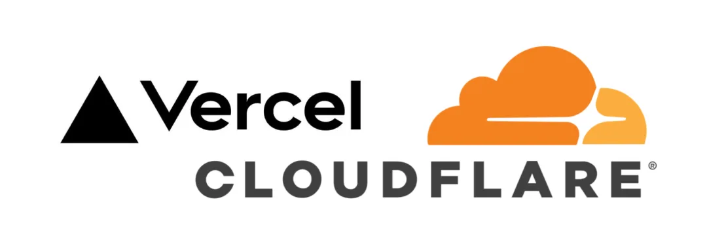

这两家都算是全球互联网的关键基础设施了，一个在 CDN 领域呼风唤雨，一个在前端生态风生水起。按理说，这两位也算江湖同道，各忙各的就好，偏偏最近却结下了新“梁子”。Cloudflare 的 的 CEO Matthew Prince 和 Vercel 的 CEO Guillermo Rauch 在推特上毫无形象的大打出手，成为了互联网上一道靓丽的风景线……

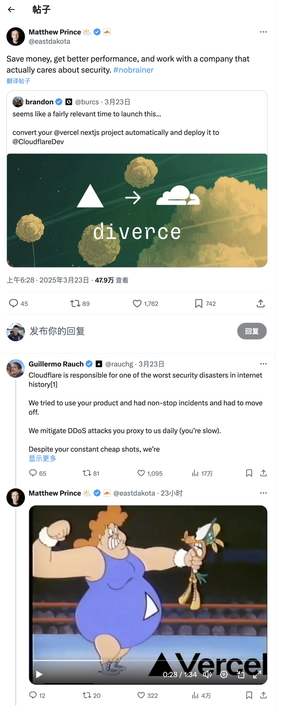

Cloudflare CEO：（把你的 Vercel 应用一键迁移到 Cloudflare 上！）节省资金、获得更好的性能、并与真正关心安全的公司合作。

Vercel CEO：Cloudflare 造成了互联网历史上最严重的安全灾难之一：我们尝试使用您的产品但不断出现事故，所以不得不放弃。我们每天都要解决您转发给我们的 DDoS 攻击（您太慢了）。尽管你们不断进行卑鄙的攻击，我们仍与你们的团队保持联系，以便将来更好地合作。我们想要一个安全的网络。

Cloudflare CEO：呵呵，锤扁你个三角男（视频）

[嵌入媒体](https://mp.weixin.qq.com/mp/readtemplate?t=pages/video_player_tmpl&action=mpvideo&auto=0&vid=wxv_3912539061054930957)

## 前因后果

故事的起因很简单：Next.js 出了个非常幽默的高危漏洞，一旦被利用，就相当于给小偷留了后门，直接绕过登录做想做的事。

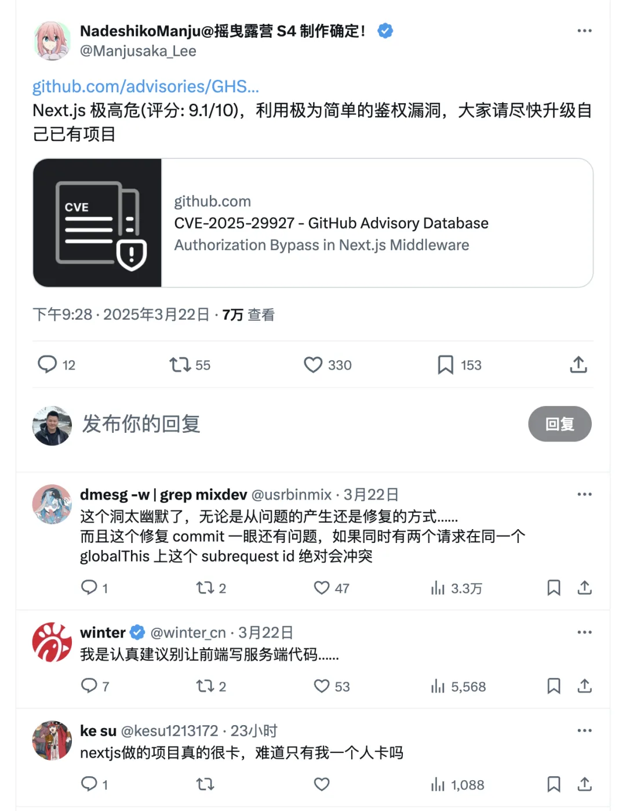

Vercel 作为 Next.js 的金主爸爸，刚被推上“欠解释、缺修复”的风口浪尖，Cloudflare 这边就先拿出补丁，摆出一副“我先替你们收拾烂摊子”的姿态。还在 X 上抛出几句酸溜溜的嘲讽。就像一个隔壁大哥突然跑到你家门口说：“房顶漏了，我给你搭好防水布啦。对了，你们家装修可真够脆弱的嘛。” 这搁谁家听了，不恼也难。

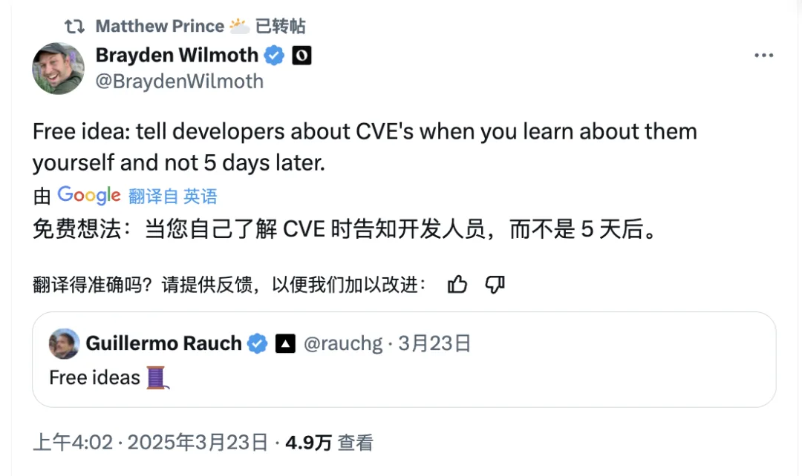

Cloudflare 自己修了这个问题，然后转了个贴，揶揄 Rauch 爆出这么大漏洞拖延瞒着不告诉开发者，还在搞些扯犊子的 “免费想法”。

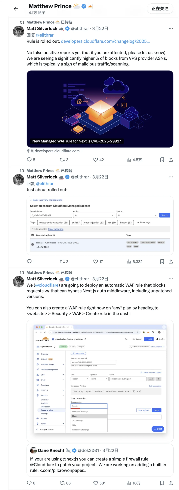

最后点燃战火的是这条推特：Matthew 转发了这条叫 “Diverce” 的服务，号称能“一键把 Vercel 上托管的 Next.js 应用通通迁移到我家来”。这招就更像当面骑脸了：你这个 Next.js 的爹不行啊，还是来我们这儿吧。不仅管你漏不漏，还干脆要把你客户都抢走。这个 Diverce 的名字也是绝了（离婚 Divorce，以及 di - vercel，干掉/去掉 Vercel）

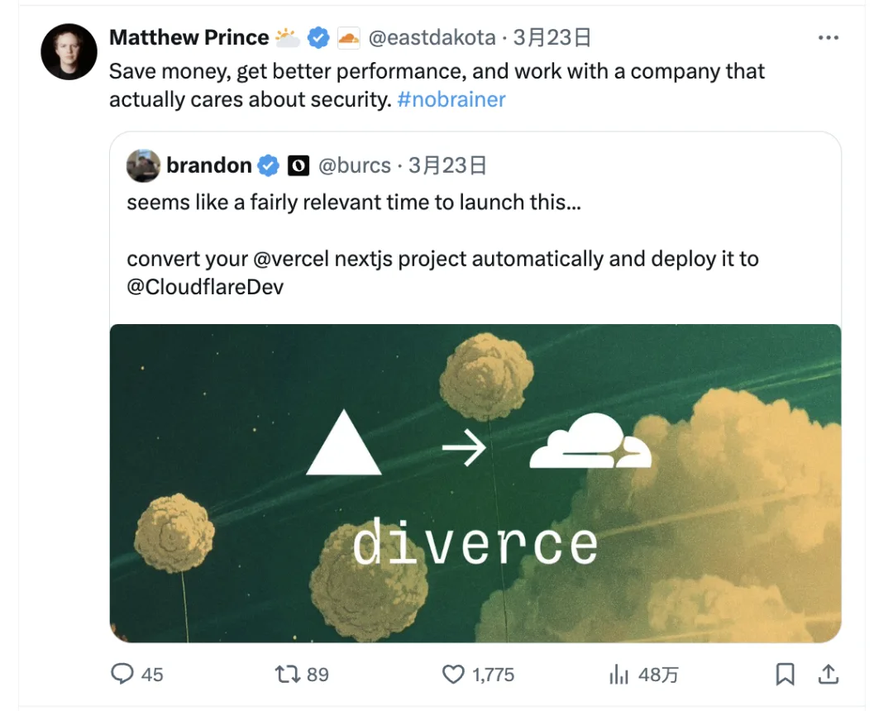

这下 Vercel CEO 给气炸了，直接贴脸开怼，说 Cloudflare DDoS 是垃圾，而且服务天天故障

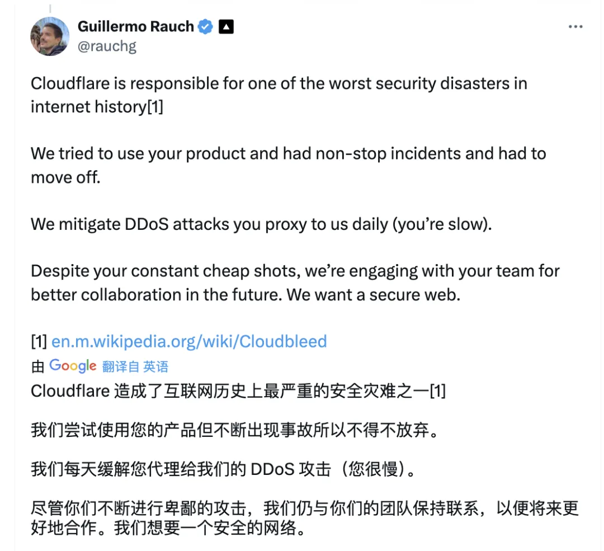

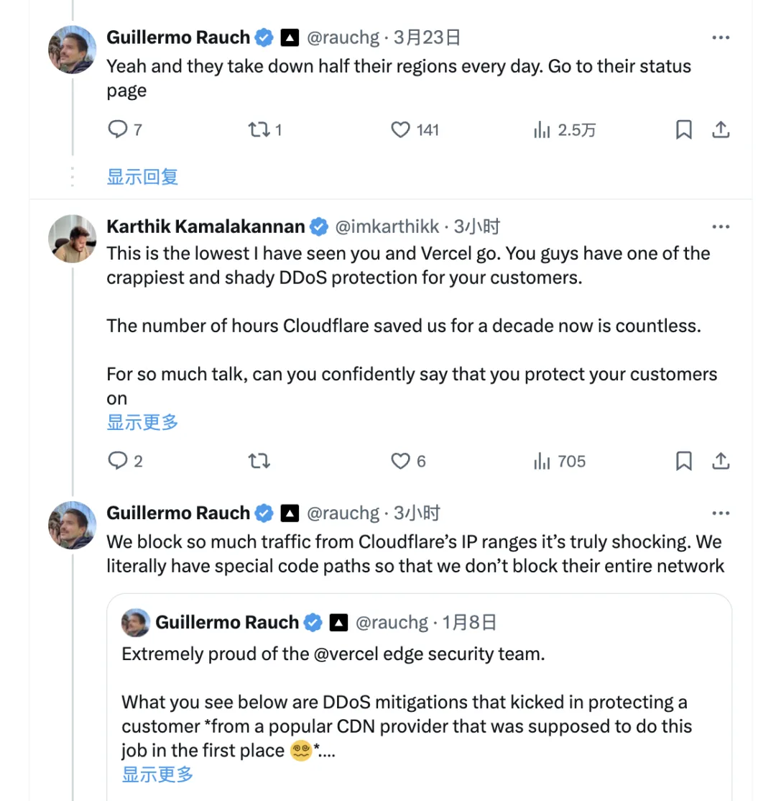

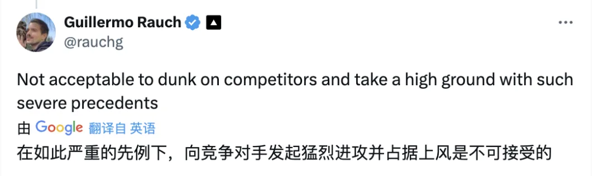

各种过去的大面积宕机事件也被翻了个底朝天。—— “忍不了啊，你骑在我头上拉屎，竟然还在站在道德高地？”

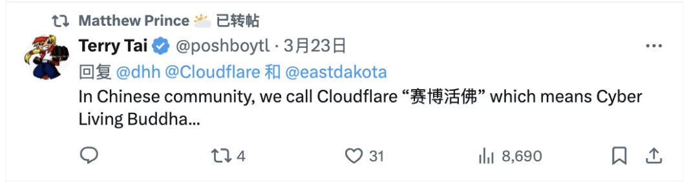

Matthew 得意洋洋的转：“我是赛博活佛”

这下 Cloudflare CEO 都懒得回复了，直接贴了个梗视频，又在 X 上贴出了一段老动画视频，一个胖大妈在拳台上锤穿三角形 Logo 的可怜人，配了句“最糟糕的是，我评论区三角男让我脑袋里一直回响着这首蠢歌”。

啧啧，这隔着屏幕都能感觉到嘲讽的火力。黑客与画家，硅谷投资教父 Paul Graham 还跟帖问了句“谁是三角男”，算是给围观群众再加一层调侃滤镜

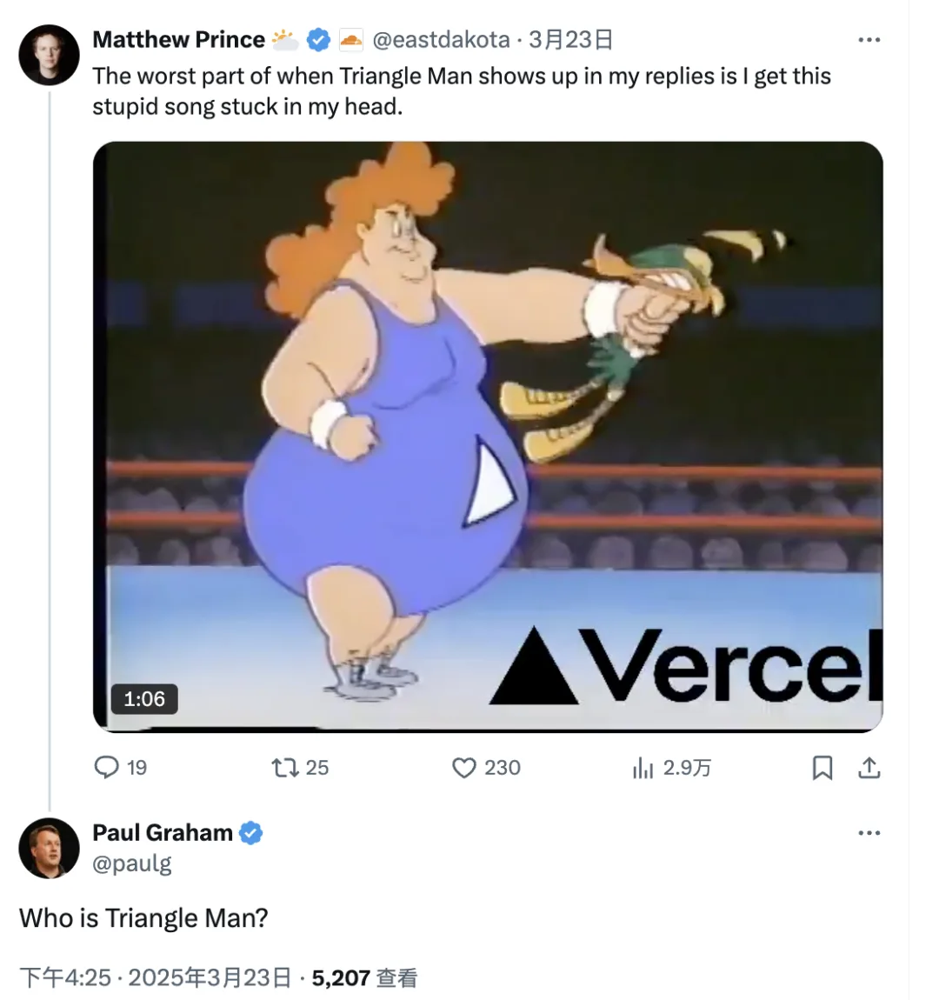

---

老实说，我感觉非常滑稽，我是真没想到这两家能打起来。这两家都称得上是全球互联网关键基础设施了。有人评论到：”我感觉自己就像那个父母现在正在吵着要离婚的孩子，在所有可用平台中，cloudflare 和 vercel 是两个对我来说非常好用的平台。请不要争吵“。

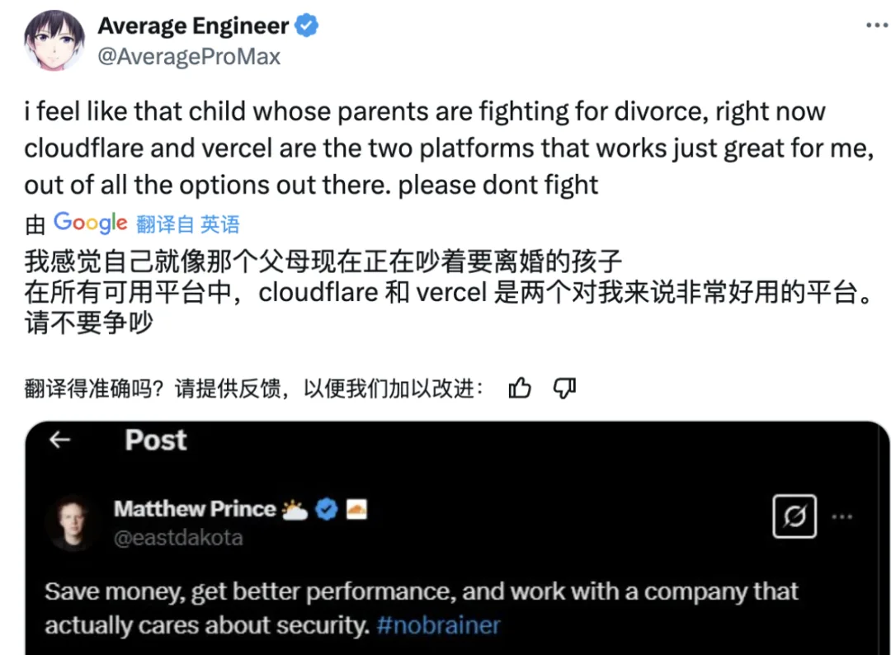

不过在我看来，这次掐架算是 Vercel 有错在先，搞出来这么愚蠢的大漏洞，遮遮掩掩，没看到 CEO Rauch 有多诚恳的道歉，反而首页置顶来一句“Vercel 代表着更好，更安全的网络“ （出了傻 B 故障置顶说我们牛 B，这也太装逼了）

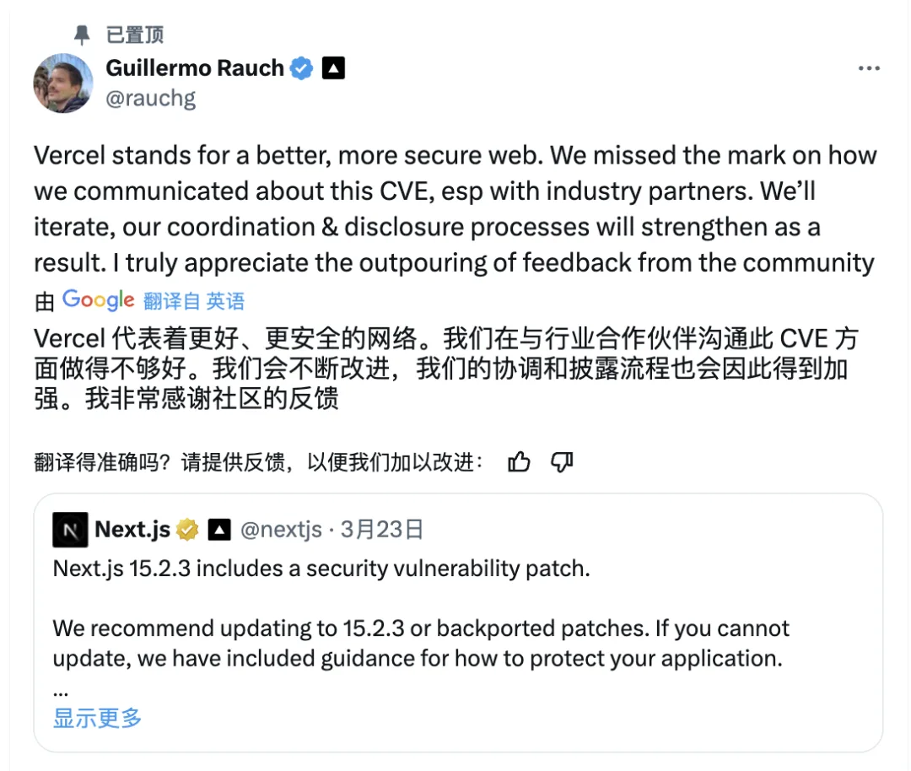

所以我完全能理解 Matthew 作为钢铁技术直男程序员对此的不屑与嘲讽 ——，这个回应也确实是洒脱的直抒胸臆 —— 很符合他一贯的风格 …，虽然斯文扫地，但装逼遭雷劈到故事看着就特别喜感与解气哈哈…

我自己是 Cloudflare 的用户，也是 Vercel 的用户。我的网站是用 Next.js 开发的，首页本来放在 vercel 上，文档/软件仓库则放在 Cloudflare Pages / R2 上，都是免费套餐，用的很不错。所以，我还是希望这两家能在进行良性竞争，不断为用户提供更优质，更慷慨的服务。那么，今天的瓜就到这里，如果有后续我会第一时间跟进；）

[云计算泥石流](/cloud/exit/)点一个关注 ⭐️，精彩不迷路\

---

发布版本：[微信公众号](https://mp.weixin.qq.com/s/1jjBMe525CtDaq1XrDztHQ)
