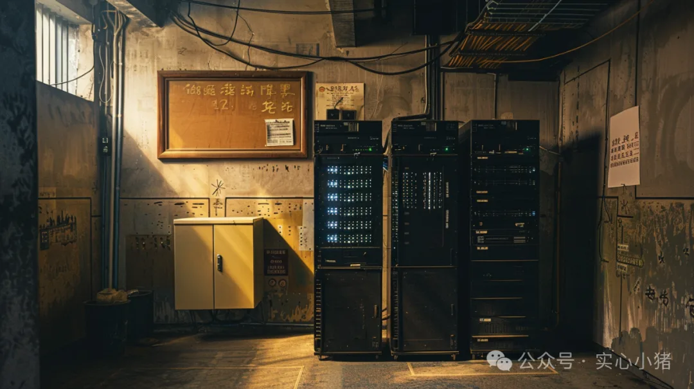
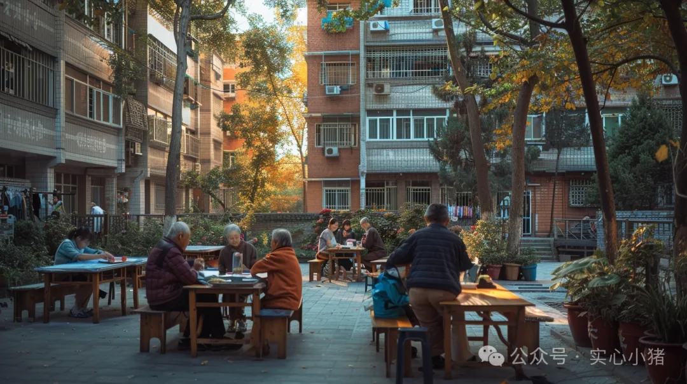

> 原作者：巫师小猪

北京西城区胡同里的老张，美团店铺的接单已经很久没有打开过了。他的副食店货架上贴着五毛钱硬币大小的薄膜传感器，街道数据中心的系统正根据隔壁小学的春游通知，把矿泉水库存悄悄调高两成。同一时刻，三公里外的居民王女士刚起床，对着空气说了句“**小爱同学，家里没水啦，送点水来**”。十分钟后，社区配送员把 12 升桶装水挂在她家门把手上，价格比美团便宜三块五。这种看似琐碎的日常场景，正悄然撕开互联网平台经济的裂缝。

---

**\****数据流动的重构：从中心化集权到分布式自治**

传统互联网模式的核心竞争力，建立在“数据黑洞”效应之上。以王女士的买水需求为例，当她的语音指令传向美团服务器时，平台算法在 0.3 秒内完成三次收割：先根据手机定位附加 2 元“紧急需求费”，再比对历史订单判定她习惯用高价水，最后从附近三家水站抽成最高的那家派单。**标价 30 元**的订单里，**水站实收 22 元**，剩下的 8 元中有 2.5 元是平台和劳务中间商的利润，3 元用于养活算法工程师和云计算集群，只有 2.5 元真正覆盖配送成本。这种**精密剥削**的根基，在于数据必须向平台总部“**朝贡**”。王女士的语音数据从北京传至上海数据中心，再带着处理指令返回北京，2000 公里的数字迁徙为平台创造了抽成空间。**区级数据中心掐断了这条利益链**。当王女士再次说“买水”时，数据流动发生了三个根本转变：

- - 语音指令在客厅路由器完成声纹识别，被拆解为“12 升、纯净水、今日达”；

  - 胡同口老张店里的传感器自动上报库存：32 桶今早刚到的燕京水厂直供品；

  - 街道服务器检索到社区网格员的电动三轮正在 300 米外巡逻；

整个过程的数据传输不超过 1.5 公里，价格直接挂钩水厂的出厂价。老张的水站发现**同样卖 30 元**的桶装水，接入本地系统后实际**多赚了 6 元**——因为免去了平台的推广费和竞价排名支出。这些钱变成实实在在的让利：老人订水满 5 桶送 1 包抽纸，打工族晚十点后下单免配送费。

---

## 技术基座的颠覆性迭代

朝阳区某社区活动站的储物间里，三台贴着“街道资产”标签的黑色机箱正微微发烫些由矿机改造的边缘计算设备，**成本不到两万元**，却**承载着五万居民**的日常需求。

当居民对智能音箱说“修水管”，系统不会调用全国维修工数据库，而是检索社区物业的值班表。张师傅刚结束 18 栋的检修，工具箱里还剩三根密封胶带，他的电瓶车电量足够支撑接下来三单。这种精准调度的背后，是三项关键技术的成熟。**边缘计算的平民革命 2022 年**训练一个**社区级 AI 模型**需要烧掉**五个街道办的年度预算。**如今**国产算力芯片**的突破让**成本骤降**。深圳某科技公司推出的“麻雀”模组，巴掌大的体积塞进了 130 亿参数模型，能同时处理独居老人用药提醒、小学生课后托管需求预测、社区健身器材维护预警等任务。海淀区某街道用这类设备搭建的系统，每月电费仅相当于两台空调的耗能，却能提前三天预判 80% 的居民服务需求。**数据的确权与流动**区块链技术正在社区场景中找到新生命。杭州某社区早餐铺的油锅旁，贴着“**食安链**”标签的传感器**实时监测食用油品质**。当酸价指标超过安全阈值时，数据被加密上传至街道食药监系统，同时触发三个动作：自动锁定商户的电子支付功能、向周边居民推送预警通知、生成食安部门的检查工单。这些数据碎片通过区块链分散存储，平台企业试图破解时，只能得到“某商户触发食品安全规则”的结论，而无法获取具体经营信息。商户老李的经历印证了这种改变——他的油条摊因误操作被短暂封停，但营业额数据始终未被平台抓取用于竞品分析。

**物联网的毛细血管**南京某菜市场的鱼摊上，贴着“水产智联”标签的摄像头正默默工作。这个售价 285 元的设备不仅能统计客流量，还会通过鱼鳃颜色变化判断新鲜度。当某批鲫鱼的**变质风险超过阈值**，系统立即向全社区推送“鲜鱼限时特惠”通知，同时**触发**买一斤送半斤的**促销活动**。这些毛细血管般的节点渗透在社区每个角落：水果店的智能货架能感知芒果熟度，在最佳食用期前 48 小时启动折扣；理发店的物联网镜柜记录着顾客发质变化，自动推荐护理套餐。**它们构成的感知网络，让平台企业引以为傲的“大数据”显得笨重而迟缓**。\

---

## **交易逻辑的范式革命**

这场迁徙的本质，是技术对"原子化社会"的无声反抗。

当**数据不再流向云端平台**，而是沉淀在街道的物理半径内，那些被算法割裂的**人际网络开始重新编织**。**课后托管的邻里共建**东城区的社区活动中心里，下午三点半的铃声响起。在平台经济时代，这本该是各类教育机构争抢生源的时段，但在社区数据中心的调配下，它呈现出不一样的图景。五楼创客工作室的程序员们正好在这个时间段需要休息，自然就成了孩子们的编程启蒙教练；隔壁健身房的瑜伽老师发现自己上午的课程收入足够，便主动分出下午时段来教孩子们简单的伸展运动；写字楼里的年轻人们也不再把时间全部献给工作，每周抽出两个小时来给孩子们讲故事。**这种转变的关键在于：社区数据中心没有把这些资源包装成昂贵的课程，而是让它们基于居民间的互助自然流转。**当系统发现创客工作室的程序员小陈的女儿也在托管班，便顺理成章地匹配他来做编程启蒙；当检测到退休教师王奶奶每天都散步经过活动中心，就邀请她来当故事会的主讲人。

这些原本存在但被商业平台忽视的社区资源，在数据中心的串联下焕发出新的活力。**最显著的变化发生在资源配置上。**传统托管平台会将家长的需求转化为**标准化的收费项目**。但社区系统则着眼于**双向的需求匹配**：主动带孩子写作业的高中生获得了免费使用健身房的机会；退休老教师教授围棋的同时，也找到了陪伴聊天的好去处；写字楼里的年轻人在辅导功课时，意外发现了缓解工作压力的方式。当数据不再仅仅用于商业变现，而是着眼于社区的互助共生，每个人都成为了资源的供给者和使用者。这种运作模式证明：社区中本就蕴含着丰富的互助潜能，只是过度商业化的平台模式让这些资源无法有效流转。当五楼写字楼的年轻人不必把全部精力投入职场竞争，当退休老人的经验不必被打包成收费课程，当创客空间不必急于商业变现，社区的互助体系就自然形成了。这不是技术的创新，而是对社区原有人情味的恢复。

**家政服务的邻里互助**北京东城区的李阿姨不再盯着手机接单。在平台经济时代，过年前、节日后，这本该是各类家政公司激烈抢单的时段，但在社区数据中心的调配下，它呈现出不一样的图景：清晨六点，她的智能工牌收到提示："7 栋 202 张奶奶关节炎复发"。这不是竞价派单的结果——因为系统知道，过去十年里李阿姨每次照料张奶奶，都会顺手多煮一份姜茶。**这些细微但重要的生活习惯，在平台数据里无足轻重，却是社区信任的根基。**在社区洗衣房等待的间隙，系统不再推送焦虑的接单提醒，而是发来"技能互换"的联结：8 栋的赵老师下周要出差，需要找人照看家里的盆栽，而她可以教李阿姨的孙子练琴。这种匹配的关键在于：社区数据中心没有把这些需求包装成标准化服务，而是让它们在居民间自然流转。当系统发现赵老师家的盆栽正好是李阿姨最爱的品种，一次简单的技能互换就这样达成了。**最显著的变化发生在服务定价上。传统平台会将家政服务切割成精确、标准化的时薪项目。**但社区系统则着眼于双向的需求匹配：帮忙照看宠物的阿姨获得了免费的水管维修；擅长修理的电工师傅在日常走访中，找到了帮带午饭的好去处；退休的老裁缝教大家改衣服，年轻人则帮她解决手机问题。当数据不再仅仅用于商业变现，而是着眼于社区的互助共生，每个人都成为了服务的供给者和使用者。这种运作模式证明：**社区中本就蕴含着丰富的互助潜能，只是过度商业化的平台模式让这些资源难以有效流转。**某个暴雨夜，李阿姨用平日积累的几次宠物照看换来了电工老刘连夜修缮漏水的屋顶——这种互助在平台经济里可能被视为低效，但恰恰体现了社区生活的本质。

在这张重新编织的社区网络中，每一次服务交换都不仅仅是一次交易，更是社区信任的积累。**当数据不再追逐利润最大化，而是着眼于激活街坊邻里的互助传统，一个更有温度的生活场景正在悄然形成。**

---

### 正在浮现的新生态

这场数据迁徙不仅重构了技术架构，更在悄然改写着城市生活的底层逻辑。**当数据不再向平台集中，一种以人为本的社会协作模式正在涌现。社区商业的温度回归**杭州西湖区的"咖啡邻里联盟"揭示了这种转变。二十家独立咖啡馆**不再为了流量疲于奔命**，而是找回了服务街坊的初心。当得知社区举办读书会，咖啡师会准备一些不打扰阅读的茶点；因为抽成的变低有了足够的利润，老住户来店里长聊，店家不再因为翻台率而困扰；在西安的早点铺，老板娘**不再盯着没钱打榜的评分愁眉苦脸**。这些看似"不够效率"的时光，正是社区生活最珍贵的部分。最显著的变化发生在服务态度上。咖啡馆不再追求标准化的"客单价"指标，而是能够静下心来。晴天时，露台会留给久未外出的独居老人晒太阳；课后时段，店里的角落成了孩子们写作业的港湾。当商业不再以数据增长为唯一目标，反而找回了最初服务邻里的本心。

**生活服务的人情温度**深圳福田区的"全龄友好计划"展示了另一种可能。社区不再用冰冷的数据对老人进行"画像"，而是真正理解他们的需求。当独居老人想吃家乡菜，系统会找到会做这道菜的街坊；当老人想学使用智能手机，附近的年轻人会收到"科技助老"的邀请。这些在平台经济里被量化成"市场规模"的需求，在社区里重新披上了人情味的外衣。最令人欣慰的是服务理念的转变。过去平台将老年服务简化为"时薪+评分"。如今却焕发出更多人性化的关怀：便利店老板会记住独居老人最爱的牌子，主动留货；年轻人不再因为"耽误时间"而躲避老人的唠叨。当服务不再追求标准化的"效率"，人与人之间的温度自然流露。**邻里互助的纽带重织**北京回龙观的"社区互助圈"展现了新的可能。这里的生活服务不再是冷冰冰的交易，而是邻里互助的自然延伸。退休老师不必将知识包装成"付费课程"，而是快乐地和孩子们分享智慧；社区里的手艺人不用担心"差评"，能真诚地传授技艺；写字楼里的年轻人下班后，也愿意花时间帮老邻居解决生活难题。这种互助模式证明：社区中本就存在着人与人之间的温暖联结，只是曾被平台经济的逐利思维淡化。当服务重新回归互助本质，人与人之间的距离反而更近了。

---

#### 转型浪潮的不可逆性

推动这场变革的，不是技术的迭代，而是人们对温暖生活的共同向往。

当我们发现**科技不必主导生活**，而是**可以服务生活**；**数据不必控制人**，而是**可以连接人**，改变就自然而然地发生了。

当数据终于回到它应该服务的街区，当技术不再高高在上而是融入人情，我们或许找到了最宝贵的平衡。**让人重新成为科技的主人，而不是数据的奴隶。**这不是效率的对立面，而是对生活本质的回归。

---

发布版本：[微信公众号转载页](https://mp.weixin.qq.com/s/3hS_dP5Db6dyOKRT3fBwAQ)
