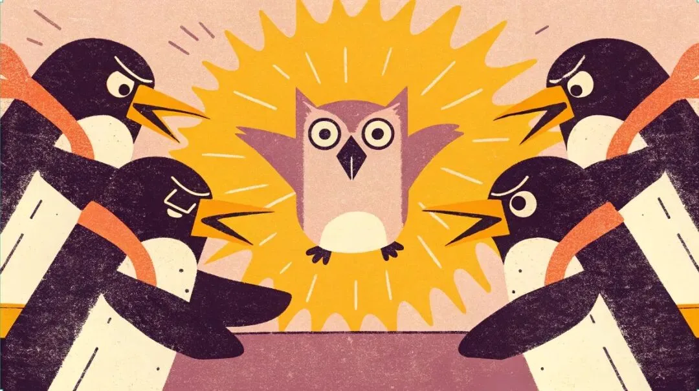
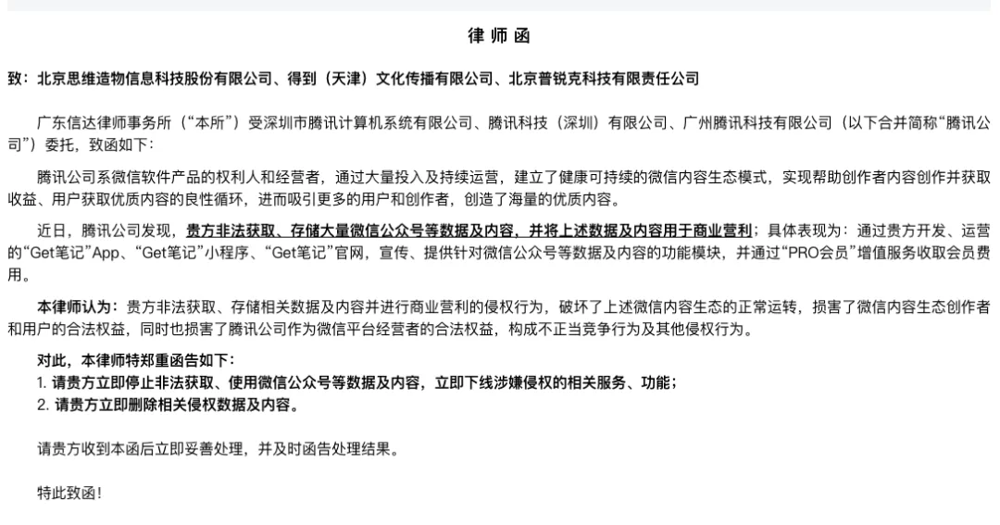
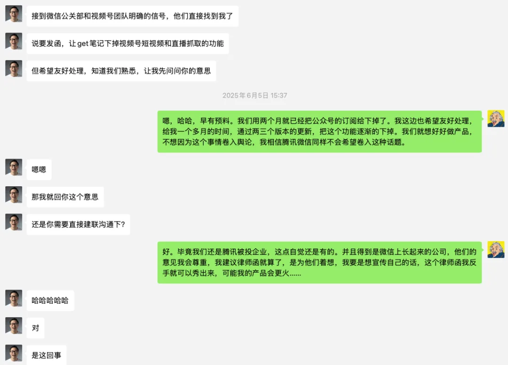
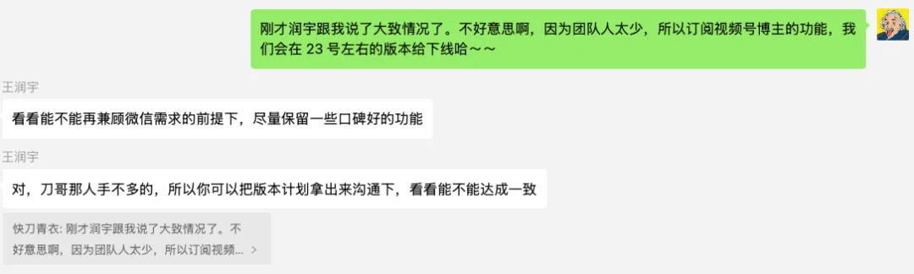
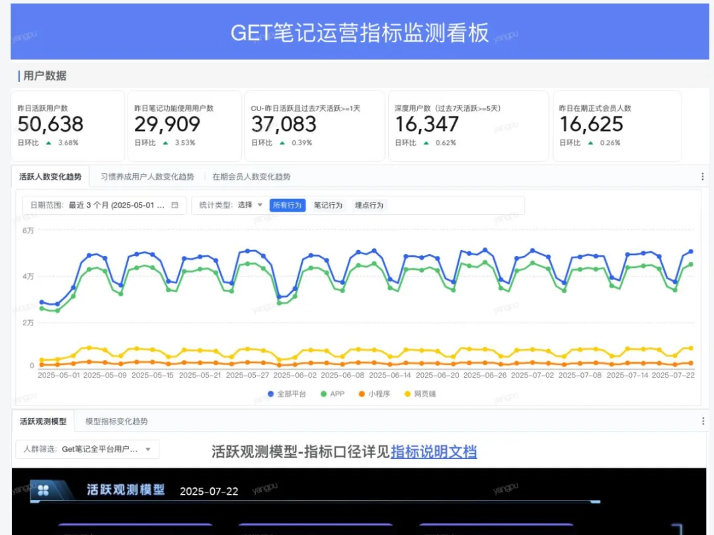

> 原作者：快刀青衣

7 月 23 日上午十时许，在北京朝阳区八里庄街道温特莱写字楼下，一位同事看到有三十多位穿着各个政府部门制服的人在等电梯，单纯的他以为是在抓传销组织或者无证黑作坊，抱着八卦的心态就跟上了电梯。

没想到，小丑竟然是我们自己。

他们是冲着 Get 笔记来的。

这一行 30 多人，他们来是接到了某大厂的举报，来对我们 Get 笔记进行深入调查，举报的理由是“涉嫌不正当竞争”，举报的根源是我们在 Get 笔记里，给用户提供了对视频号直播和视频号短视频，可以变成图文笔记的功能，节约用户时间。

当这三十多位执法人员，发现我们 Get 团队一共只有 13 个人，其中 9 名技术，1 名产品，1 名设计，1 名运营，也表示很吃惊，有种杀鸡用了牛刀的荒诞感。

对，作为“被执法对象”，我也觉得有点“受宠若惊”了，在心里问自己，原来 Get 笔记已经这么厉害了吗？

当然，这些执法工作人员，我特别理解，他们接到举报，是肯定要来上门落实的。他们不肯透露举报的大厂是谁，我也特别理解，毕竟保护举报人的信息很重要。

不过我猜测，对，我只是猜测一下，这家大厂大概率会是腾讯吧。毕竟字节啊，阿里啊没有必要跳出来为视频号抱不平。

在这里，我也必须诚挚的道歉。作为一名单纯的理工男，我一直以为“转发短视频链接”“订阅博主”这种无论抖音还是 YouTube 都非常基础的功能，视频号没有做，仅仅是因为他们要忙的事情太多了，顾不上这么基础的功能。

所以作为 Get 笔记的负责人，我以为把这种功能做出来提供给用户，是帮助视频号更好的跟抖音做斗争。

没想到我错了，错误的把腾讯当友军了。

用“友军”来形容我们跟腾讯的关系，应该不过分。

我来简单列几条。

第一。我们是腾讯被投企业，对，现在腾讯也是我们的一个股东。

第二。我们公司起家就是靠“罗辑思维”公众号，我们对腾讯平台是有感情的。

第三。罗胖在公众号上做了 10 年的每天早上 60 秒语音，哪怕没有一个人听，至少他也是一个三千多天的忠实日活用户。

第四.Get 笔记是从一个微信小程序发展起来的创新 AI 产品，按理说应该成为小程序创新的标杆产品吧？（声明：这是我自己不要脸给的称号，官方没有任何人说过）

第五.Get 笔记里最重要的语音转写功能，用的是腾讯云的服务，也就是说我们还是一个腾讯的“微小企业客户”。在去年 12 月 31 号的跨年晚上，Get 笔记发布时，腾讯云还有不少技术同学和我们一起加班。

从这角度来说，我自称一句“友军”并不过分，并不算自己给自己贴金吧？

二。整个事件的简单时间线

上面描述了简单的情况，下面我来梳理一下时间线和过程中发生的一些事情。

- 去年 12 月底，跨年演讲前，Get 笔记上线“帮你听直播”功能，上传视频号海报，可以订阅直播，帮你生成文字总结笔记；

- 今年 1 月，上线订阅抖音博主功能，抖音博主更新后，AI 帮你跟踪最新动态（抖音至今还没举报我们）；

- 今年 3 月，上线订阅微信公众号功能，我们在 APP 商店更新说明里，写道“在个人知识库，支持订阅你喜欢的微信公众号”；

- 今年 3 月 19 日，一个非工作日的深夜，我们海外短信验证码被恶意攻击，攻击前三大来源国家是阿富汗、塔吉克斯坦、索马里，整个攻击造成我们损失 36.26 万，因为这些国家都是非常冷门的、单条短信非常贵的国家。

  Get 笔记作为新产品，没有做好这种方式的技术防护，原因也比较简单，之前单纯的我不认为有人会花钱干这种“损人不利己”的事情；（只是陈述被攻击的事实，至今攻击方是谁，还没有查出来，跟今天的事情没有绝对关联）

- 今年 4 月 17 日，Get 笔记收到创立以来的第一封律师函。对，直接邮箱收到的。说实话，看到律师函里面说我们针对公众号的一些功能，破坏了上述微信内容生态的正常运转，损害了微信内容生态创作者和用户的合法权益，当时我有一些恍惚，震惊于自己的能量居然这么大，一个日活不到 5 万的产品，居然就影响了“大环境”。

- 4 月 18 日，我拉着 Get 笔记团队迅速开会。强调了两个事情，第一，任何人不能把律师函发到朋友圈去。

  原因很简单，我当时确实担心影响和腾讯友军的关系，毕竟我只要写一篇“Get 笔记收到腾讯律师函了”，不管是放到小红书，还是放到公众号，肯定都会特别受关注。所以在没有任何腾讯人找我的情况下，我主动的帮助腾讯“灭火”，要知道对 Get 笔记来说，可能几百万投放都换不来这样的宣传效果。当然，肯定会给腾讯带来“小麻烦”。

  第二，在产品功能上，下一版本停止向用户提供公众号订阅功能，并且发布公告时，我还特意强调，咱们就说是自己进行系统调整，别说是大厂给了律师函，要不一些人肯定会借此炒作。

  对，这时的我，终于理解了电影里的那个人，为何会如此神情落寞的说“我本将心向明月，奈何明月照沟渠”。

- 4 月 25 日，订阅公众号功能下线。但是，当时我幼稚了，做出了产品上的错误判断。我对同事说，咱们一共有三个功能跟腾讯或者微信有关，分别是订阅公众号，订阅视频号博主，和订阅视频号直播。

  现在腾讯都已经发了律师函，但是律师函里只说公众号，只字未提视频号或者直播。

  我的理解就是其他两个功能没有触犯天条，可以存在。当时我还感叹，“看来视频号真的是腾讯全村的希望，看，他们没让我们下架这个功能。”

  这主要怪自己没见过市面。

  

- 6 月 5 日，微信团队托我们双方的好朋友润宇老师来传话，希望我们下掉视频号和直播的抓取功能。我当时让润宇老师转达的反馈是“给我一个多月的时间，我来通过两三个版本的迭代，把这两个重要功能下掉。”大家可以看到我和润宇老师的聊天记录。

- 7 月 8 日，润宇老师帮我和微信的一位同学拉了一个群，追问了一下视频号功能下架的具体时间。我当时反馈的是因为团队人太少了，我们会在 7 月 23 号的版本把功能下线。这里是小群聊天截屏，我不放具体微信同学的信息了，我不希望这个事情影响到具体的人。

- 然后我们开始研发相应的功能，准备各种安抚用户的话术，希望能开发几个有特色的功能，来弥补用户不能订阅视频号的损失。就准备在这个版本里，彻底把跟微信视频号/公众号相关的功能都下线。

- 万万没想到的是，7 月 23 号的上午，我们作为一个跟腾讯不正当竞争的“黑窝点”，迎来了各部门多达二三十人的联合执法团队。

这就是整个事件的来龙去脉。

三。几个疑问求好心人解惑

我刚才简单的介绍了一下 Get 笔记的人员情况，现在我把 Get 笔记的核心产品数据公开一下。要知道上周还有付费调研团队，要一个小时 3 千块钱找我们团队的小伙伴刺探产品数据军情呢，这里我全放出来。

昨天，7 月 22 日，Get 笔记的日活用户数是 50638，正式的在期会员是 16625 人，我们的会员费用是一年 199 元。

里面有一些用户折扣，所以 Get 笔记这个项目上线至今一年，我们的总收入是 432.92 万，嗯，计算单位是人民币。

但是，我还想说另外一个数字：145.6 万。

这个数字，就是我们 Get 笔记在腾讯云上花的技术费用，也就是说 Get 笔记所有收入的 33.6320798%，都贡献给了腾讯。

所以现在这个巨亏的项目，这个被腾讯律师函里说是“通过 Pro 会员增值服务收取会员费用”的项目，要是不收钱，怎么能支付给腾讯钱呢？

虽然我们给的钱不多，但你们的财报里，这 145.6 万蚊子肉再小，也是肉啊。

最后，说一下“不正当竞争”这个罪名，作为一名理工男，我有几个特别不理解的问题，想寻求解惑。

在我浅薄的认知里，我这个日活五万的产品，应该很难有能力对腾讯内容生态造成破坏力，并且能调动起一个如此庞大的联合执法团队，更是超出了我的想象。

如果我低估了 Get 笔记对腾讯生态的破坏力，欢迎有专业人士可以给我解惑，我会认真学习。

我到今天才理解了很多很多很多年前，一条我这种远古网民才熟悉的搞笑段子：

一只蚂蚁在路上看见一头大象，蚂蚁钻进土里，只有一只腿露在外面。小兔子看见不解地问：“为什么把腿露在外面？” 蚂蚁说：“嘘！别出声，老子绊他龟儿子一跤！”

20 年前听的段子，到了今天，我才懂得这故事里面的精髓。原来“大象”真的会去举报“蚂蚁”在路上绊了自己啊。

腾讯内部也有一款知识管理产品叫 IMA。我在很多地方都表达过，我希望这种知识管理产品越多越好，大家不管谁拿出更解决用户痛点的功能，对用户来说都是一件好事，对整个生态的发展都是一件好事。

但是不管在小红书还是在视频号上，或者抖音上，其实有很多博主直接拿来对比 Get 笔记和腾讯的 IMA 具体功能，很多短视频为了流量，都会捧一踩一，例如这样的标题“说真的，用了 Get 笔记后，我要先冷落腾讯 IMA 了”。

在这里，我必须要说，Get 笔记只有一个运营同学，并且这个项目还处在亏损中，我们不会花钱，也没有钱去做投放。

所以各个平台上，大家看到的关于 Get 笔记的文章或者短视频，不管是夸的，还是骂的，都是用户自发行为。

如果看到这篇文章的用户，如果你在任何地方夸过我们，我希望你能站出来说一句“Get 笔记没有给钱。”

但是，我很好奇，Get 笔记的竞争对手，有没有在很多自媒体上花钱投放呢？

四。未完待续

现在已经是 23 号的下午 14 点 50 分，为了写这篇文章，我已经饥肠辘辘了。

但最后还是要表扬一下，这次来联合执法的各个部门工作人员，虽然规模很大，但是都非常规范和文明。中午所有人都是自己点盒饭外卖，连矿泉水都是自己带着。并且在各种询问过程中，从态度到细心程度，都非常专业。

并且拷走了我们所有的代码和各种文档，回去要做进一步的调查。

所以，这事情肯定还没完，我也不知道后面等待 Get 笔记的命运是什么，不过我肯定会随时跟大家分享一下事情的进展。

当然，我在想，Get 笔记会不会成为第一个因为巨头举报，而宣告下架或者失败的 AI 产品呢？

那作为产品经理来说，是不是也够光宗耀祖的了。

当然，

这篇文章，我依然会发在公众号上，因为我相信在我心目中的微信团队，不会删掉这篇文章……的吧？

---

发布版本：[微信公众号转载页](https://mp.weixin.qq.com/s/DZLTieg5JowZP5WZVWRhjA)
