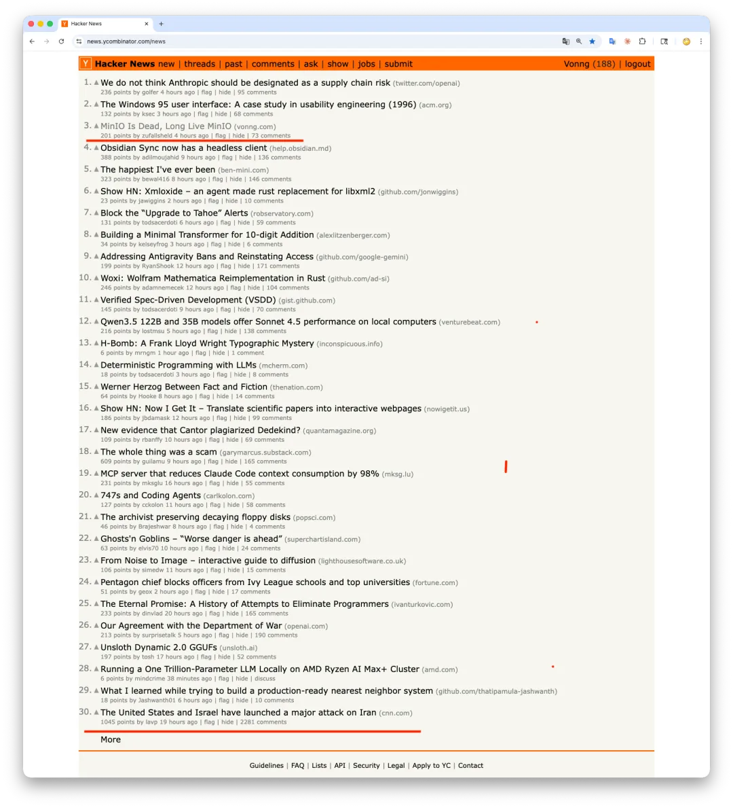
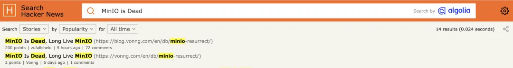
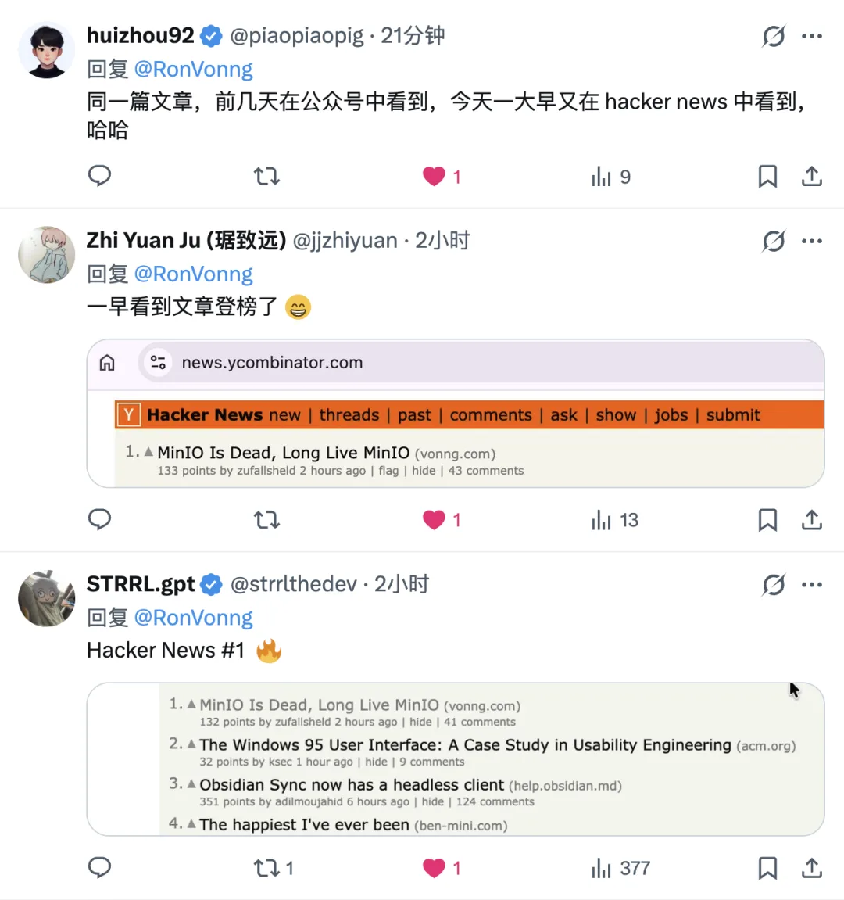
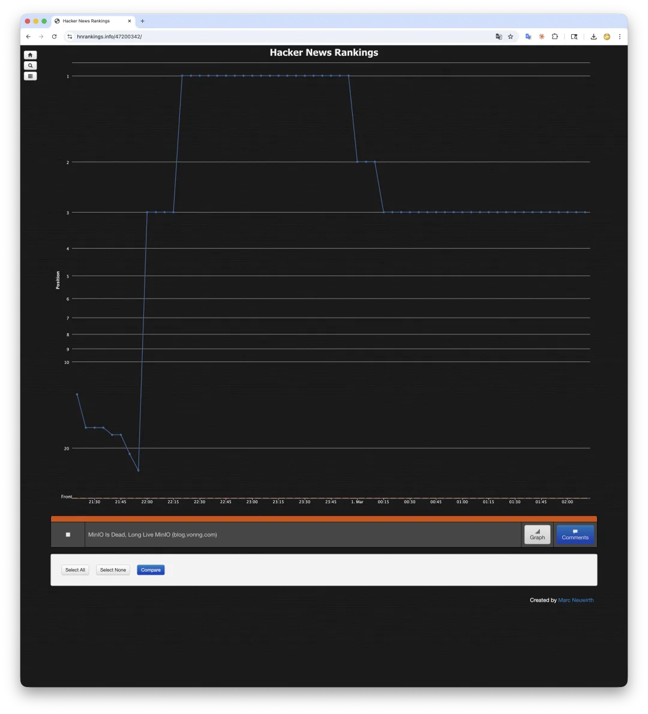
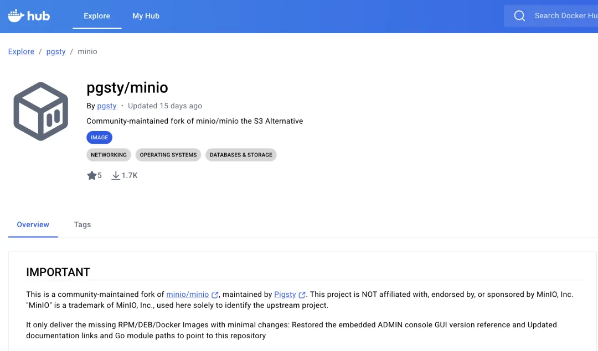
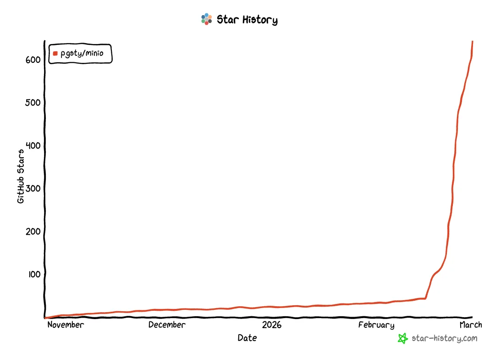

早上醒来看看仗打得怎么样了，结果发现 X 上有人 @我说上了 Hacker News \#1。好家伙一看，这不是前几天那篇 MinIO 复活的文章嘛

虽然是我的文章，但这不是我发的。说来好笑，前几天我自己发过一模一样的链接，瞬间石沉大海，2 Points，连个水花都没有。

这次别人转发我压根不知道，一下子冲到 200+ Points，在榜首待了两个小时，现在还挂在 \#3 —— 所以说这玩意太玄学邪乎了。

HN 头条还是挺难上的。上一次是那篇《[PostgreSQL 正在吞噬数据库世界](/pg/pg-eat-db-world/)》，这次运气不错又来了一次。最巧的是正好赶上美伊开打，大战新闻排在首页最后一条——在这种时候还能抢到头条位，也算是一种奇妙的运气。评论区倒也有意思。最大的槽点是说文章一股子 AI 味——确实，英文版是 Claude 帮我翻译润色的，被人一眼看穿了。我老老实实认了：母语不是英文，用了 AI 辅助，下次注意。HN 社区就是这样，你坦诚他就放过你，你狡辩他就追着咬。总的来说，老冯搞的这个 MinIO 社区分支能帮到别人，还是挺开心的。GitHub Star 到 644 了，DockerHub Pull 1.7K，也有开发者主动来问需不需要帮忙。

哈哈，虽然开心，但老冯也会担心这玩意万一把 MinIO 惹毛了来干我一炮，那就不好玩了。

---

发布版本：[微信公众号](https://mp.weixin.qq.com/s/6Rz3jOFqujXXWQBXv819YA)
