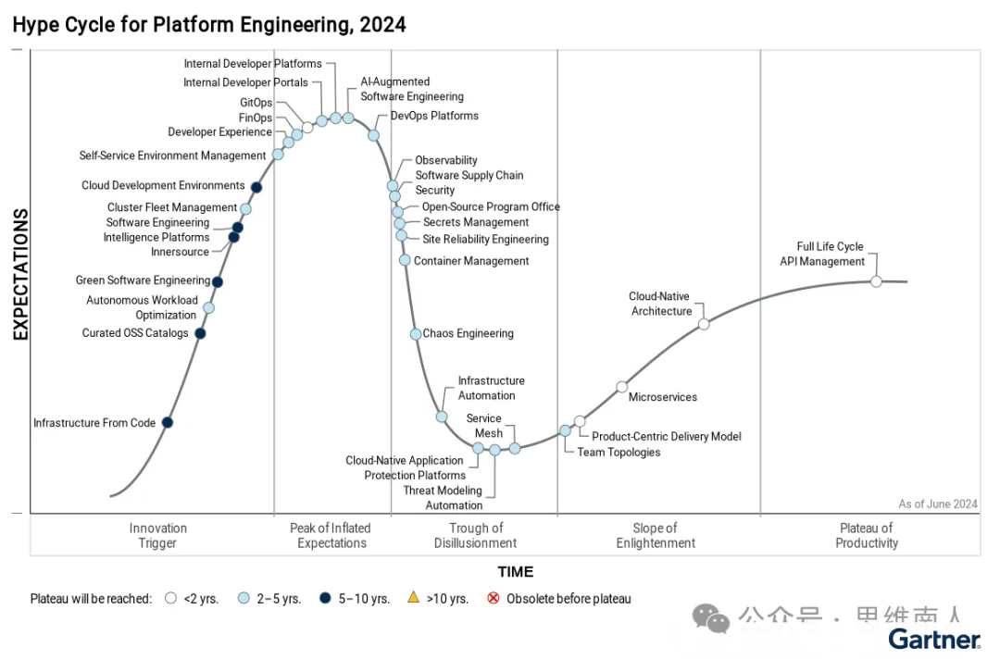
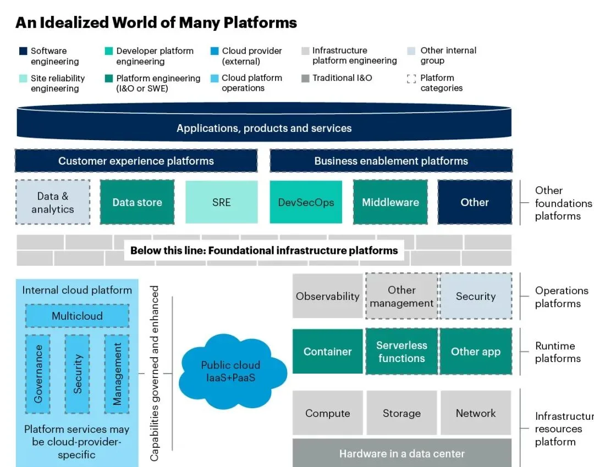
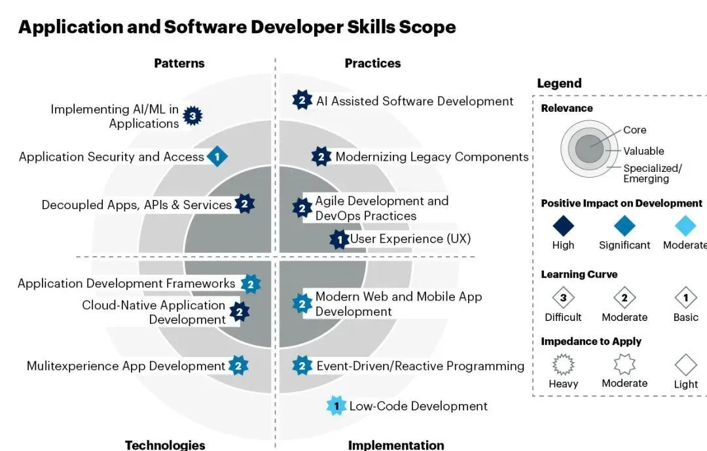
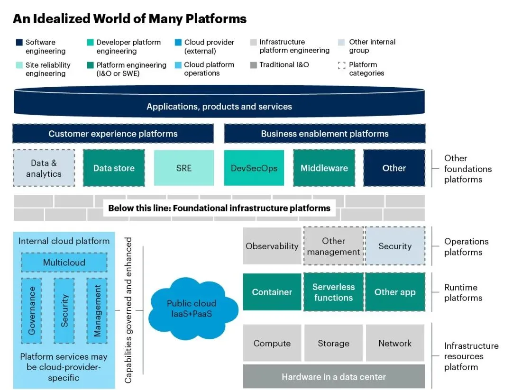
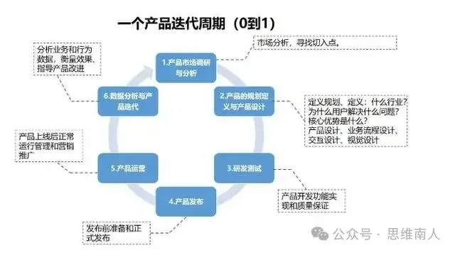
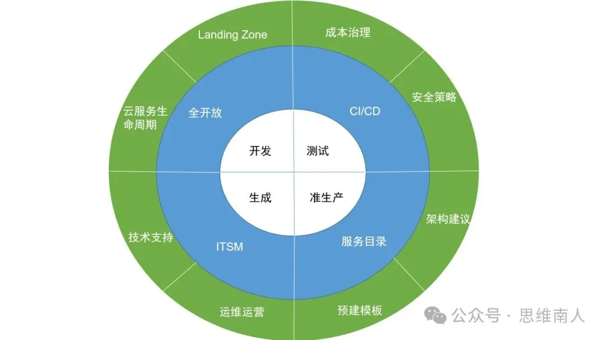
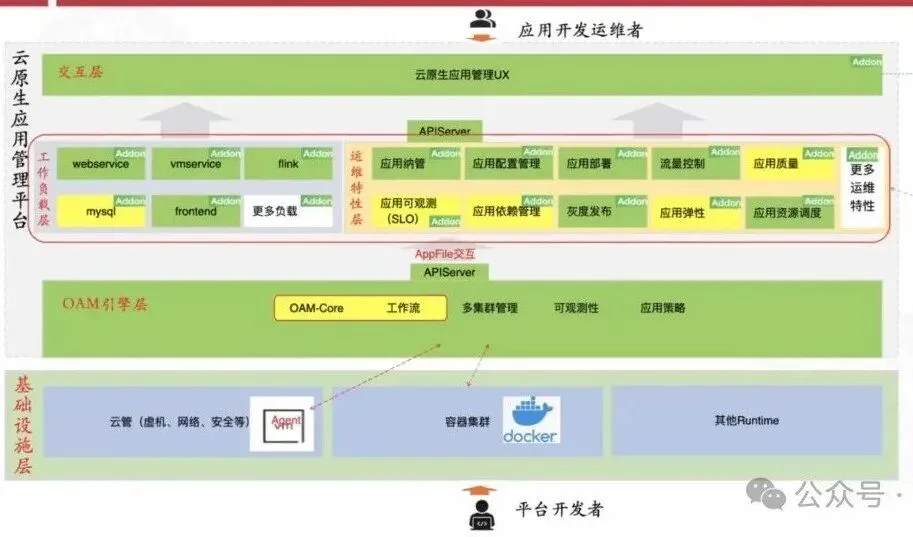

> 原作者：思维男人

前两天，瑞典马工发了一篇《基础架构部，还有必要吗？》，文章的逻辑是基础架构部（或者技术平台部，或者运维开发部，或者架构平台部）为业务单元提供技术支撑，然后技术支撑需要自身有优秀技术，然后尝试列出一些反例去证明基础架构没有优秀技术，所以支撑不了业务单元，就该解散或者消失了。

我当时看完，觉得文章逻辑就不对，因为支撑业务单元不一定要优秀技术，很多时候只需要补充业务单元的弱项和空白就行了；然后列出来的反例都是些表象，但这些表象放在不同组织内是否真的都是反例？不同组织架构有不同的资源储备，不同的风险偏好，很多所谓的反例可能是组织刻意为之，而不是错；最后，即使撇开所有的前提，光看业界发展方向，平台工程作为近两年如火如荼重点的新名词、新领域，已成为 GARNTER 2024 年十大顶级战略趋势之一。GARNTER 也于今年 6 月中发布了平台工程的首个魔力象限（见图一），并推断到 2026 年，80% 的大型软件工程组织将建立平台工程团队，作为应用交付可重用服务、组件和工具的内部提供商，而基础架构部作为其中的一个重要建设者，反而应该消失？？？

图一 平台工程 2024 年魔力象限

综上所述，我作为一个 20 年传统金融 IT 经验的技术管理者，觉得基础架构部的存在可行性都不值得讨论，这么明显，还值得讨论和传播吗。所以在他那文章只有几百阅读量的时候，我就在群里和马工说，你这篇文章应该火不了。BUT，现实打脸，一两天就 4 万多阅读，传播性极强。那就可能代表了一个现实情况，有一大票业务单元的开发同学对基础架构部的输出有很大的抱怨，苦天下久矣，现在有人写出了他们的共鸣，就不断分享传播。\

马工文章的内容限制在互联网领域，而我一直在金融甲方，互联网和金融在业务特性、监管要求、社会责任和文化有很大的区别，在金融业，基础架构部是必然存在的，我在微信群和朋友圈也没有看到任何一个金融的同学转发这篇文章，所以我觉得没有必要写文章去回应，因为马工这文章可能只是互联网的讨论盛宴。但马工不断拱我，他说他不懂金融业，所以文章不敢把金融框进去，希望我说一下在金融业是怎么看这个部门的，这个部门干什么的，有啥意义，也给互联网的同学给一个另外的角度，所以我也站在我的视角，以我的理解抽空写下了这篇文章。

## 一、基础架构部存在的背景和目标

### 1、技术日趋复杂

现代的应用软件系统大规模采用微服务架构和敏捷交付实践，使应用软件在开发、交付、运营的过程比过往涉及更多的工具、子系统和底层服务（无论是自建还是第三方的，如云厂商），复杂性逐年增加。而在金融业，监管对于网络安全的要求也是逐年增加，影响了几十笔的正常交易都可能需要上报监管部门，导致应用软件在刚刚说的复杂基础上，还要考虑服务隔离、安全通信、权限控制、应急、可观察性和业务连续性等非功能性要求。所以应用软件现代化带来的复杂度和网络安全带来的非功能性要求，注定了现代应用系统软件在其生命周期内将涉及大量的功能域和平台系统（如图二）。此外，随着开源软件的大规模应用，组织内的各团队如能自行选择工具、版本和架构，将导致组织内即使同一个功能域也存在不同的技术栈，功能域和技术栈的乘积关系将使组织内的技术进一步变得更加复杂。

图二 现代应用平台能力

### 2、业务研发同学无法全面掌控

研发同学应用图二列的许多这些工具和技术的原因是它们可以提高应用的敏捷性、灵活性或安全性，然而，学习、集成和维护这些技术却是一项负担。业务单元的研发同学一般只精于业务逻辑和相关代码，通常只会做图二中间标蓝的那部分，也就是写那个业务逻辑的微服务，不太可能成为其工作流程所依赖的数百种服务的主题专家并进行准确操作。如果去问业务研发同学，他们通常会说他们不想也不愿意搞懂这么多东西，他们连业务需求都做不过来，搞这些其他东西严重影响他们效率，令其无法专注于创造业务和客户价值。另外，对于业务研发同学来说，他们在代码编写、程序设计和业务领域知识方面较强，但在安全性、架构、合规性和资源浪费等 IT 治理方面的知识储备和风险敏感度会通常会较弱（即使在研发人员技能示意框架内，如图三，也少有提及），而业务研发人员的大规模外包和流动性大的特性，使业务研发人员的经验参差不齐，牛的可以很牛，但弱的也可以弱的很普遍，最终导致写出来的代码，业务功能可能是满足了，但留下的风险也可能很大。

图三 研发人员技能框图

随着云技术栈对传统技术栈的更新，资深业务研发同学原来可能还懂的一些知识储备，又被刷没了，他们可能由于 WLB 的关系，无法再像年轻的时候，投入巨大的精力来重学和重新实践一遍新技术栈，陷入旧的没用，新的不太懂的状况。更悲催的是，这将很有可能导致研发同学在对某些新技术处于一知半解的情况，机械照搬旧方式在新环境、新技术上再做一遍，最终造成不可预知的大坑和恶果。如前两年在公有云 ES 上的硬编码存访问密码情况，如果这做法放在内网，那就风险较少，但放在公网，那就自然产生了大规模数据泄露事件。新东西越来越多，历史经验也越来越难以复用，业务研发同学的全面掌控成为越走越远的神话。

## 3、平台工程目标

技术复杂度提升和研发人员精力有限的矛盾，使只有个别精英业务研发团队能交不错的答卷，但剩下的大部分团队估计只能交个偏科卷。对于一个有众多业务研发团队的中大型企业，都不说能不能用上先进技术来促进业务，光技术栈混杂、软件版本众多、代码和配置安全漏洞百出、循环和强弱依赖错配，业务连续性建设薄弱、资源随意浪费、缺乏可观察性、经验和教训无法共享复用等种种问题，就对企业的 IT 治理造成了巨大的风险。这些问题可能在部分互联网企业不被看重，但在金融业，尤其看重这些风险。而即使是精英业务研发团队，也不愿意自身全面承担基础设施建设和维护的负担、安全风险的识别和防护、法律法规的研读和遵循等问题，他们会觉得这会影响他们投入到实现客户价值的时间和人力。至此，平台工程应运而生。平台工程的出现是为了应对现代软件工具和架构复杂性带来的认知负担不断增加的问题，通过构建精心设计的自助服务平台帮助用户驾驭复杂的架构、工具和服务，同时还尝试解决治理、安全、合规性、业务连续性等具有挑战性的要求。平台是由专门的平台团队以产品形式维护的工具、服务、自动化和信息层，旨在通过抽象不必要的复杂性来支持软件开发人员或其他工程师。平台工程旨在**优化开发人员和工程师体验并加速交付客户价值**，并在软件生命周期的**效率、质量、安全**和**成本**上做出贡献，以下举一些例子：

- 效率：以统一、专业的平台服务降低业务研发团队在其非业务部分功能的认知负荷和投入负担；以平台间的 API 交互代替人工的流程断点执行和语言沟通，以缩短开发周期、加快交付速度并提高部署频率；平台工程的专职人员能有更多精力专门投入到某些领域的技术预研和引入，能更有前瞻性的为业务研发人员提供有业务相关性价值的技术能力，从而加快业务价值变现

- 质量：将安全要求、架构准则、合规控制、业务连续性和组织的其他治理要求以技术实现的方式嵌入到平台中，为业务研发团队提供组织级的专业建议或严格限定的模板，以供其应用，摆脱规章制度和落地实现两张皮的情况，大幅提升程序质量；平台工程构建的全面可观察性，使软件的设计、开发、测试、运维整个全生命周期都能详细观测、提前修正、及时应急，大幅提升应用系统稳定性

- 安全：平台工程实现的技术架构收敛、最佳配置模板、专业组织统一运维等，都是组织提升网络安全的重要保障。

- 成本：越多的研发团队，创建由多个团队共享使用的平台功能带来的规模经济就越有效，这在大型组织中尤为重要；平台工程带来的标准化资源治理能有效压降成本，特别是在云时代背景下云资源获得的便利性带来的云资源滥用，更需要进行治理

   那么平台工程应该建哪些，由哪个团队负责，均无定数。在这里我列出一个 GARTNER 的理想框架图（见图四），但要注意，这仅供参考，因为连 GARTNER 都特意标明这是“Idealized”而不是他们常用的“recommend”。每个企业应该根据自身需要，通过四象限法则并结合自有资源、团队规模、技能储备等情况确定各功能域的平台工程化优先级和相关负责人。

图四 平台理想分类图

注：图中的 I&O=infrastructure and operations 基础设施运维，SWE=software engineering 软件开发团队

综上所述，我认为不设立平台工程的企业，只有三种极端情况。一就是企业内的所有研发团队均是精英，他们牛到能全知全能，能自行高质量搞定一切；二就是企业老板对 IT 特别不看重，无所谓研发团队做的怎样，反正赚钱不靠研发，研发做错也影响不了啥；三就是企业特别小，只有几个人的一个小团队，那就没必要抽资源搞什么共享服务，单干就好了。

金融业大部分都是中大规模软件组织，人数从几百到过万人不等，很早就识别到建设共享服务带来的好处，所以清一色均有各类平台工程团队，团队名字就像马工列的那些名字，基础架构部、技术平台部、运维开发部、架构平台等等，负责研发统一开发框架的、效能平台的，PAAS 服务的、一体化运维平台的，林林种种。建设共享服务带来的便捷和安全不会因为技术栈的不一样而带来变化，所以对于我个人，我是无法理解为啥互联网企业这么多同学会觉得这部门不需要存在，我也不太相信互联网企业的高层技术管理者会觉得这个部门可有可无。

### 二、基础架构部的问题

马工列出了基础架构部“没有核心技术、无法交付业务价值、技术理念落后、沉迷于已经解决的 Scalability 问题、ClickOps、阻碍 DevOps、猜疑专业软件供应商、和业务单元的关系扭曲、守旧的心态”的“九宗罪”，在我看来大部分的都是错误的，或者说这些只是表象但深层次的原因并未被深挖和揭露。

- 第 1、3、8 罪，都是关于技术方面，其实平台工程是用来解决企业内部的问题，没有说一定要采用先进技术才能解决，够用和恰当就行，第 8 宗罪里面的文字也写了“大多数互联网公司的技术并非核心竞争力，只需要通用软件技术，并没有那么多独特的需求”。打死个蚊子何必用大炮呢？用个大炮你自己 HOLD 不 HOLD 的住？

- 第 2 和 4 罪，说的都是架构选型能力，实际上运维出身的同学提供的这些架构能力，都是为了满足企业研发同学的需求，比如大数据平台选啥，大概率还是大数据研发同学选的，而提供 Scalability 能力，很现实来讲，大部分的业务研发同学目前的确还搞不清楚如何实现安全有效的可扩展性，处于听都听过，但不知道怎么做的状态。那么提供恰当的支持服务的基础架构部同学，还有罪了？

- 第 5、6、9 罪，说到了人为卡点和不更新的情况，其实都指向了安全性的问题，这个和企业的风险偏好相关，无关对错。你要敏捷，那么 5、6 直接研发 IAC 命令干到底就好，开发、测试、生产环境一把来，但在金融业这个就不可行了，比如银行，就有明确的监管规定，研发不能直接操控生产环境。很多互联网同学觉得，这是落后，这是老土，但当你见识过因为这些没管控好，导致部分研发人员自己写个恶意代码发布至生产环境，最终犯罪犯案，之前有判无期的，最近几年有个判 10 年的；也有研发同学发包导致系统宕机，最终 CIO 撤职的，那么互联网同学应该就可以理解这种“落后”。对于 9，你要及时更新操作系统和软件版本，那么在大规模软件环境下，投入的研发测试资源可能占总体研发投入的 20%，毕竟底层软件多如牛毛，版本之间、与应用之间的兼容性保证是个大投入，而且变的越多，错的肯定越多，减少不必要的变更很正常，根据应用系统的重要性和部署区域的风险等级，建立适合企业自身的软件版本生命周期管理才是王道，一把无脑升更是一种不负责任的基础架构团队选择。

- 第 6 罪，那的确是问题，也是个普遍问题，圈地养马，建立护城河是很多 IT 团队的主动或者潜意识之举，而不只是基础架构部所独有，竞争越大、淘汰率越高的地方越容易出现这种现象。如果想解决这种问题，只能靠更科学、更完整的事前分析、事后审计、持续跟踪等流程去揭示和打击这种现象。

分析下来，这“九宗罪”很多都是表象甚至是错误的表达，但从马工文章的传播量来看，得到了很多互联网企业的业务研发的同学认可，这证明有相当多的基础架构部产出不被一线研发同学所认可，这是为什么？在我看来，**核心问题是在部分基础架构部同学是纯以技术思维，把平台当成一个项目或技术实现去做，按照自己的想法做完就拉倒，而并不是以产品思维去建设平台、持续运营和迭代优化。**

产品和项目的区别很多，但主要集中在以下几点：

- 持续性 vs. 临时性：产品是持续存在的，项目是临时的

- 管理焦点：产品经理关注的是长期的市场和用户需求，项目经理关注的是短期的目标和任务完成

- 生命周期：产品生命周期是一个不断循环的过程，而项目生命周期是一个线性过程，从启动到收尾

- 成功标准：产品的成功基于市场反应和用户满意度，项目的成功基于是否在规定的时间、预算和质量要求内完成

我上百度找了个产品迭代周期的图（图五），基础架构部的平台的拉跨主要出现在调研，运营、迭代这几个部分的问题：

图五产品迭代\

- **调研：**未正确定义和细化目标客户需求，未坚定的视一线研发同学是其核心客户，很多时候把自己的想象和擅长的领域作为平台需求强加给一线研发同学去用，不关注用户体验，强扭的瓜永远不会甜。需知道，即使组织和高层领导对平台功能做出了一些要求和指示，但用的，还是一线研发同学，他们不爽，自然会用各种聪明才智来规避、攻击和投诉这个平台，最终导致平台废弃、人员对立、治理目标未实现等恶果。

- **运营：**1）不太重视宣传角度，未能以同理心站在用户视角，只是一味强调平台有啥功能，而不是强调用户能基于平台在什么场景下获得啥益。这很重要，因为不是个个平台都能带来便利性的，有些时候带来安全性和保护的护栏效应是藏的比较深的，用户不太能自行发现。2）不太重视推广方式，老是出现两种极端，要不就忸扭捏捏，觉得自己平台好，虽然养在深闺但自然会有人识，要不就拿着领导的旗号，狐假虎威的强推，导致要不就毫无存在感，要不就大规模恶感。3）不太重视经营用户在平台上的参与感，未能通过邀请、访谈、立标杆、奖励等方式激发用户的良性互动，将使平台建设方和使用方壁垒分明，需知道，如果能让用户成为“自来水”，平台的效果和生命力将大幅提升。

- **迭代：**调研不准确，不以 MVP 的方式快速解决一线研发同学的核心痛点和摩擦，还在那里憋大招。研发同学有迫切新需求的时候，你又无法快速迭代满足，甚至更恶劣的情况是做完第一个版本你拿完业绩就不再迭代，导致研发同学会有种恶感，要你的时候你不在，不要你的时候你就在刷存在感，研发同学很难视你为靠谱的帮手。

最终，一线研发同学会不理解、不认可基础架构部门的产出，觉得你萝卜又没给我吃，只是一个劲给我棒子，鞭打着我去载着你去领奖，心理极度不爽和不平衡。大量业务研发同学认同马工《《基础架构部，还有必要吗？》的文章也就可以理解了。

#### 三、基础架构部平台工程的正确实现

要避免出现上面说的那些问题，个人觉得，平台工程就应遵循科学原则构建并主动规避和解决主要风险，才有可能获得成功实现。

#### 8 个关键原则：

- **用户为中心：**采用平台工程来改善受高门槛、难用和断点的工具、技术和流程影响的开发人员其他工程师体验。通俗讲就是降低用户的使用心智和门槛，降到足以让“傻白甜”的用户都能根据基础架构部提供的平台轻松、愉悦地完成自己的技术目标和实现。

- **平台即产品：**平台必须被视为产品来构建与运营，任命产品负责人来分析用户和开发人员使用复杂技术的痛点，更需要关心需求的本质

- **TVP（thinnest viable platform）**：不要过度设计平台，平台应该从小处着手，每次迭代解决用户的最急迫需求，构建切合实际的平台功能范围，并随着有效性和使用情况的验证，快速迭代而获得不断成长。

- **需求驱动：**平台产品所有者必须建立用户反馈循环来确定需求

- **自助服务：**在安全可控的情况下，提供尽可能多和链条完整的自助服务，减少人为断点和卡点，并以 API 方式促成平台间的联动，拼接成一个能够实现高度自动化的连贯工作流程和场景的，从而进一步加强自助服务的范围

- **构建护栏：**安全、架构等团队必须“左移”，尽早将安全性、架构规范等治理内容嵌入平台，并尽量以护栏方式体现，强调保护而不是控制，减少用户反感

- **最佳实践**：平台应提供易用且能切实帮助用户的功能，并形成各种最佳实践和模板应用场景，而产品所有者将专注于持续建设和和营销这些内容，主要通过吸引而不是强迫，让开发人员多使用该平台

- **架构治理：**平台产品团队应遵循企业架构这个高维存在对企业内的现存或将出现的各种各样平台进行统一指导和治理，有效管理各平台之间的相互依赖关系，平台的一些底层构建原则（如安全性、合规性等）应是一致且连贯的，解决的问题应该是互补而不是重复的，这将保证用户在各平台上的体验是一致和丝滑的，组织也能避免短板效应和浪费效应。**8 个主要风险：**

- **新瓶装旧酒：**将一些传统的控制性、非自动化的平台重新命名就作为平台工程的新实现，纯自欺欺人，不会达到真正的提升

- **外购完全解决：**不要期望通过只购买就能构建一个企业级完整的平台工程，因为任何商用工具都不太可能提供企业需要的全部平台功能，至少需要企业内部的平台团队定制部分功能满足所在企业的特定需求

- **技能不足：**平台工程需要软件工程、产品管理和现代基础设施方面的扎实技能，应通过学习、交流和引进人才完成技能的积极储备

- **内部政治斗争：**组织内部的争斗和部门墙可能会破坏平台工程。业务研发团队可能不愿意放弃对其定制工具链的控制，各平台的分工与协作也可能因部门墙的存在而变得困难，对于此类问题只能通过 IT 企业文化的改善，或者获得强有力的更高层的支持来解决

- **过度设计：**平台建设方通常倾向于根据先前在特定领域的成功经验对平台进行过度设计和扩展，容易习惯性地假设只要构建更多特性或能力，就会取得同样的成功，一直到迭代无法带来好处，最终导致部分时间和资源的浪费。而实际上，建设方应专注于开发人员的需求、平台工程能力和人自身的能力，每次迭代都应添加当前所急需的功能，专注于从平台中获取最大价值。

- **无法清晰显示投资回报：**平台的持续发展需要对工具和人员进行持续投资，而组织通常拒绝为没有明确投资回报或者长时间看不到投资回报的平台工程提供资金，所以平台建设方应遵循 TVP 原则，高频展现每次的迭代价值，也应积极获得平台用户的认可，从而能更有效地在组织和高层管理者获得资源。为此，平台建设方不仅应该根据平台访问量和程序发布速度、质量来衡量开发人员的体验，还应重点关注开发人员的满意度和推荐率。

- **平台大包大揽：平**台建设者不要鲁莽的认为并承诺平台的技术实现和功能就能解决开发者和用户的所有问题。从员工自身情况、企业文化、管理流程、人际关系、奖励和认可、甚至到工作环境，这一切都有可能对开发者和用户体验有直接影响。

- **平台团队瓶颈：**平台团队的时间和能力是有限的，很多时候难以按用户所期盼的时间全部完成用户各类需求，而且做的越好，用户范围越广，需求就越多，团队的瓶颈问题也就越严重。为此，平台团队可以采用社区贡献模式，使平台用户可以投入自己的时间和资源来提供或改进平台功能，让平台用户了解平台路线图和待办事项，并鼓励他们做出贡献。除了能帮助平台团队分担开发负担外，这也是围绕平台建立社区并让用户参与平台持续改进的有效方式。**云时代的变化**

诚然，马工在文章里面提到云时代下基础架构部的原有经验和做法是否能持续，也有不少互联网企业的同学提出，既然公有云大行其道，所有基础架构都已完全交由云厂商供给，研发人员直接遵循 Werner Vogels 的名言“You build it，You run it”，那不是效率最高，最佳实践吗，基础架构部还能干啥？有啥存在意义，解散不是应有的结果？

的确，云的 IaaS 和 PaaS 对研发人员来说很易用。开发人员只要账号有钱，就可以完全通过云厂商提供的云门户-点点点、命令行界面-敲敲敲和对 API 接口-用 TF 调调调，以访问云环境，可以随意新增、修改和删除各类云组件，好像可以完全没有基础架构部啥事。我不否认云专业知识水平较高的研发团队可以且应该获得更大的自助服务自由度和更宽松的监管。但问题是，云专业知识和传统知识存在巨大差异，不同云厂商的配置和用法也各不相同，且开发人员素质和经验也参差不齐，每个研发人员都能真的自行承担起科学用云、安全用云、稳定用云的效果和责任吗？有多少研发人员能掌握云上的网络和安全策略，能清晰了解云厂商各种服务的优劣点，能熟练使用 infrastructure as code（如 HashiCorp Terraform）和 Policy as Code（如 AWS Iam、AWS Config、Chef InSpec），知道跨分区带宽费用贵等成本坑？如果企业只有一个精英研发团队，或者这个企业是个摆烂企业，那这种放任的做法无所谓。但只要是有多研发团队的企业，对 IT 有要求的企业，都已认识到这种不受监管的云应用模型，既不可持续，又存在大量安全和浪费风险。因此，这些企业都会通过基础架构部建实施恰当的云治理。在云时代下。基础架构部应该做的或者说可以做的，我画了一个示意图（见图六）：

图六 基础架构云工作范畴

内圈是四类常见的不同环境。中圈是研发人员访问云资源的四种主要方式，管控力度以顺时针方式从松到紧，第一种是给予研发同学直接触碰云资源的完整授权，第二种是研发同学通过 CI/CD 管道以自行配置 IAC 等方式直接创建云资源和发布应用，第三种是基础架构部同学封装云资源能力形成限定的服务目录，研发同学以自服务方式获取服务目录内的服务套餐，第四种是研发同学提交工单，基础架构同学异步提供云服务。基础架构部应综合考虑企业自身的风险偏好、安全策略、IT 人员技能水平、敏捷和创新需要，对不同的环境设立不同的云资源创建、发布和访问应用策略。而无论哪种环境、哪种云资源访问方式，都需要或多或少的采用外圈那八个由基础架构部提供的治理和运营服务。

无论底层基础设施是公有云、私有云、本地虚拟化甚至是裸金属的自动化环境，平台工程方法都是有效的，也都是需要基础架构团队去落地，只是落地细节各不相同，该团队不需要担心没活干，只需担心没干活。

#### 四、平台工程在金融业的一些实现

各金融企业的基础架构部（或者技术平台部，或者运维开发部，或者架构平台部）的工作内容和范畴都略有不同，但都是在设计、研发、发布、运行等各软件生命周期研发和提供各类平台，大幅提升整个组织的效率和安全性，我这里尝试罗列一些例子。

- **设计：**建设银行建设数字化架构全景视图，根据设计态的架构信息，构建“应用-物理子系统-场景-交易线”的四层资产关系模型，其中颗粒度最细的交易线是指联机业务在请求和应答过程中经过的应用平台、交易接口、调用顺序等的集合，目前已达 60 多万条，且与全行运行态的调用链链路（TRACE）进行融合比较后以可视化方式呈现，切实提升架构信息质量，有力支持架构设计，实施及管理工作。

- **研发：**广发银行建设统一应用研发平台（RTP）支撑行内所有业务的自主研发，从支撑分行初级研发人员快速开发分行应用，到支撑总行数百中高级研发人员集体攻坚分布式核心系统服务重构。该平台由基础应用平台架构和分布式平台架构组成，基础应用平台助力快速构建业务系统，实现前后端分离开发，提供企业级服务化体系，封装了数据库访问、文件操作、日志管理、异常处理、中间件管理等多种基础功能组件，提供符合金融行业高要求的安全组件和安全能力；集成全行统一的研发标准和技术规范，适配国内信创的软硬件资源，融合研发全生命周期的持续集成体系。分布式平台架构提供全行级的注册中心、消息中心、配置中心和缓存中心等平台，形成强大的分布式技术生态。

- **发布和运行**：招商银行基于开放应用模型（OAM）和 KubeVela 构建云原生应用管理平台（图七），围绕应用声明式描述，解决云原生应用管理问题。该平台为除核心交易系统外的所有应用系统提供可视化的一站式交付能力，研发人员只需通过简单的工作负载选择和少量的可视化配置，无需关心灰度发布、弹性、可观测性、两地三中心高可用架构等非功能性需求的具体技术配置和实现方式，即可快速实现多个关联应用服务单元，以及相关云服务的整体发布和部署，大幅提升应用的交付效率。此外，平台还与大量的运维数据类系统进行对接，使应用的非敏感运维数据同时展现在研发人员眼前，方便其进行应用管理。

图七 招商银行云原生应用管理平台

以上种种，基础架构部的同学们，无需焦虑，只要你持续学习、有客观的技术视角、增强自己的产品思维和架构思维，那么肯定还是有存在价值的，且有巨大的发展空间。而且你想想，OPENAI 引出的 AIGC 浪潮，当对话式，多 AGENT 等各类大模型生态真正成熟的时候，需要这么多业务研发去研发业务应用系统吗，所以哪个团队先会被解散掉，并不好说。

---

发布版本：[微信公众号转载页](https://mp.weixin.qq.com/s/9AEJZ4GumaHtK_Yeh0n-Yw)
