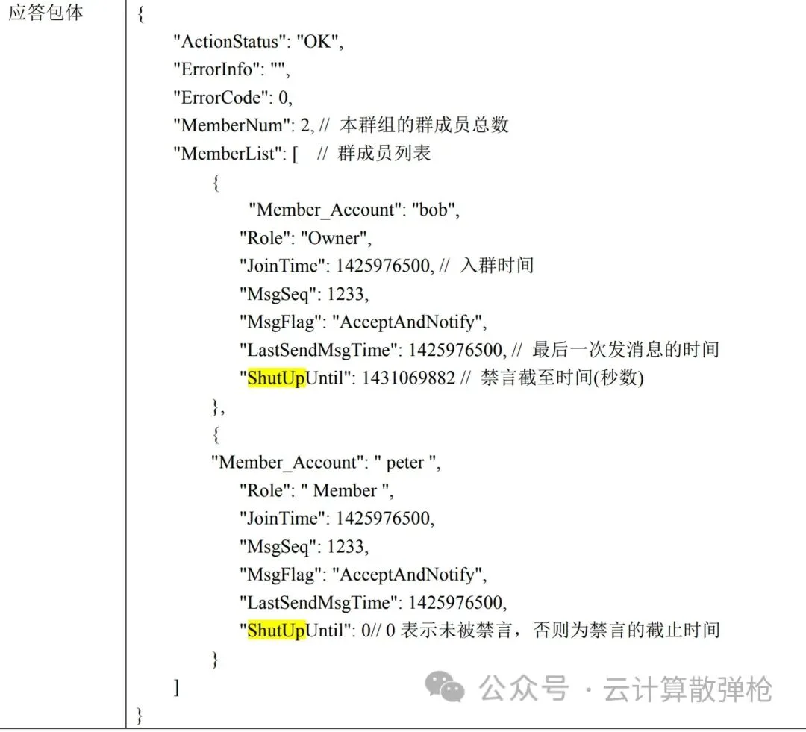
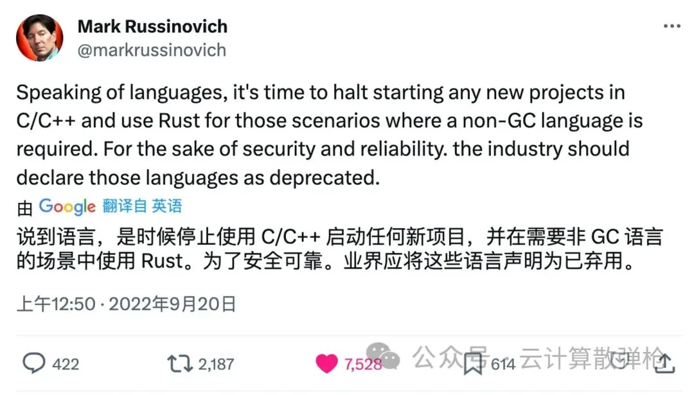
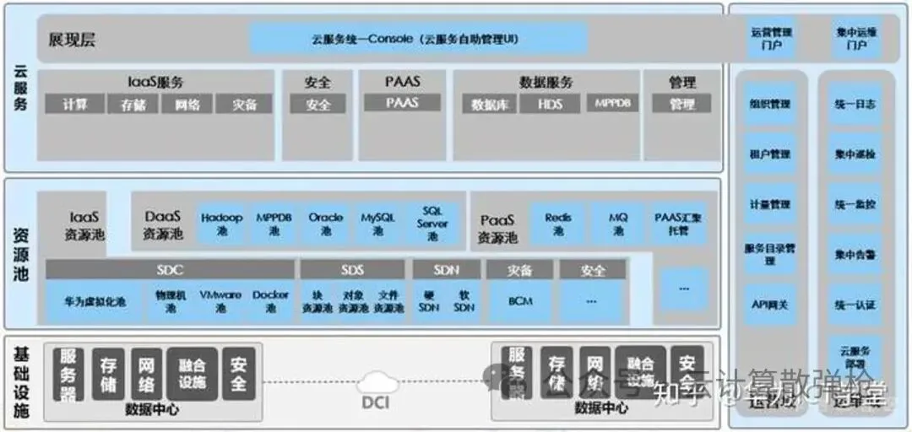
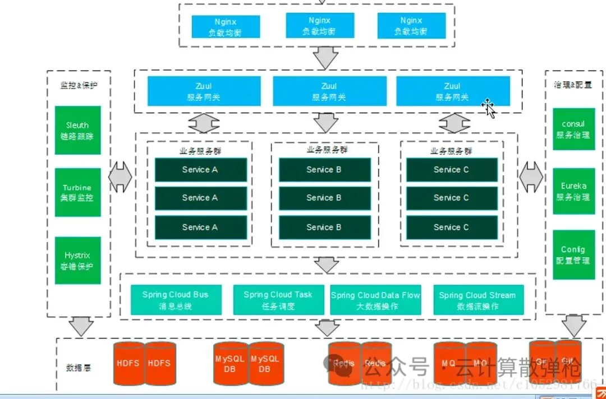
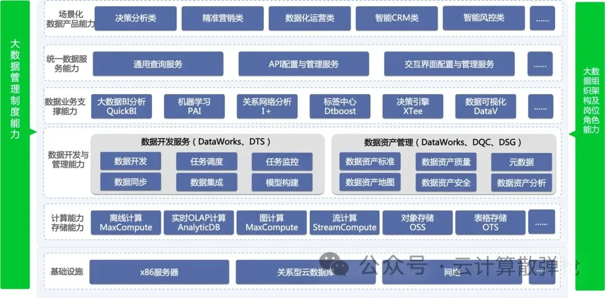
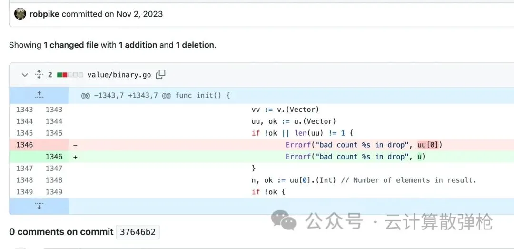
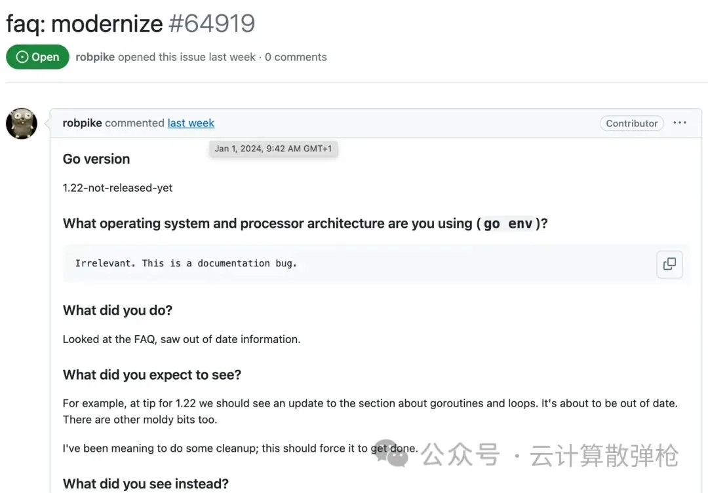

> 原作者：瑞典马工

人人都知道，互联网是个钱多责小离家近的好行业。这个行业流传着许多飞檐走壁技术大师的故事，激励了很多学过高数课的年轻人。本文意在讨论互联网技术大师的修炼之道，试图找到一个共通的速成模式，希望对年轻人有所助益。

## 第一步：先进大厂

进大厂是成为大师的第一步，无可通融。

有些小朋友说“大厂 HR 卡学历，不让我进，可我还是想当技术大师，怎么办啊？“

我只能遗憾的表示，小朋友你生不逢时啊。

你看那些到处开课的技术大师，他们十几年前入职 Google /阿里/腾讯的时候，你还系着红领巾在小学校园里玩老鹰捉小鸡；今天你都参加工作了，大师的头衔还是 Ex-Googler/前腾讯架构师/前阿里云研究员。你简历里没有这么个招牌，名片都不好印啊，到时候你请的水军都不太好吹啊。

有小朋友问我：“按你这么说，Linus Torvalds 也不够格了？”

我查了一下，这个叫 Linus Torvalds 的，本硕学校倒是不错。赫尔辛基大学在 QS 排名 96，算是荣誉 985 吧，可以保他的简历不会因为双非被扔掉。但是毕业后的工作经验不太行，先是在没名气的 Transmeta 干了五年，连个小组长都没升上去，后来在一个叫 OSDL 的莫名其妙的公益组织干，估计 package 里只有基本薪酬。HR 这一关，他恐怕难过。

等等，我眼睛是不是坏了？他是 1969 年出生的？今年 55 岁了？大厂 35 岁的工程师都算重点清理对象。他这个超龄 20 年还没当上小组长的工程师，只能当晚班保安啦，就不要谈什么技术大师了。

## 第二步：要公开的鄙视工程技术

围棋大师要热爱围棋，电影大师要热爱电影，文学大师要热爱文学，这好像是天经地义的。

但是我们习惯于降维打击的互联网行业从业者从来不在乎这些规矩，恰恰相反，互联网的技术大师是鄙视和憎恨技术的。

你和中国互联网技术大师坐下来吃火锅，90% 的可能性，你还没吃到第一块羊肉卷，就会听到一句话：“技术是为业务服务的。“

90% 的可能性有另外一个技术大师附和：“是啊，是啊，技术不赚钱，赚钱的才是技术。”

那么，“技术是为业务服务的”这句话究竟意味着什么呢？我大概归纳一下，有两点：

1. 软件工程团队是业务方的施工队。

2. 施工队不需要什么工程能力建设。

### 软件工程团队是施工队

这是一个事实。互联网公司的竞争力不来自于 IT 技术。滴滴不是由于 App 做得好才被司机采纳的，淘宝不是由于 Java 写得好才吸引商家的。马化腾和张小龙想要揽功的时候，都号称自己是第一产品经理，或者谦虚的说第一产品体验官，从来不说自己是第一架构师或者第一程序员，这也说明产品经理才是团队的核心角色。

互联网公司里，软件工程团队的任务是把产品经理的图纸在机器上用代码落地；工地上，施工队的任务是把设计师的图纸在地基上用混凝土落地。两者定位几乎雷同，最大的区别是，设计院不能随便修改图纸，而产品经理可以半夜在钉钉群里 @倒霉的码农改需求。

所以，有年轻人问技术大师：“大师，你怎么还在用过期三年的 MySQL 5.1/过期四年的 CentOS 6/过期十多年以至于算不清究竟过期十几年的 GCC 4.2?” 大师就会坐下来，语重心长的和年轻人说：“技术是为业务服务的。新版本的 MySQL 能给产品带来营收吗？不能。老版本的 MySQL 会妨碍公司毛利润吗？不会。所以，年轻人，不要盲目追求新技术，要围绕业务价值思考问题。” 不等被绕晕的年轻人醒过来，大师已经飘走了。

像芬兰 Aiven 公司这种通知邮件，技术大师们是一定不会发的：

> 所有在我们平台上运行的、已开启的 Aiven for Kafka 3.5 版本服务，在 2024 年 7 月 31 日之后将接受强制性维护更新至升级路径中的下一个版本 3.6。
>
> 这些更新对于服务的持续安全和稳定至关重要，并为您提供新功能和增强。为了简化流程，Aiven 将完全代表您管理版本更新。
>
> 因此，这些更新无法被禁用，但您可以通过在到期日 2024 年 7 月 31 日之前随时启动升级来定制体验，以测试与您的应用程序的兼容性，并减轻任何与 Aiven for Kafka 3.5 依赖相关的意外问题。

要知道，Aiven 公司的主营业务就是代客户维护 Kafka 集群。他们居然冒着触怒客户的风险，强迫客户升级 Kafka 版本，简直是以下犯上，和互联网技术大师们的理念完全不符。

### 施工队不需要工程能力建设

承上所述，既然是施工队，那么吃苦耐劳就是第一美德。技术大师作为施工队的包工头，从经理那里接活，派到码农头上，就尽到主要职责了。

有些人说软件工程团队也是工程团队，因此要写文档，写测试用例，做代码评审，建持续发布系统，扫描安全漏洞，还要维护 API 兼容，甚至对变量命名规则挑剔得很，要用什么 linter 工具在什么 CI 系统里自动检查。实不相瞒，互联网从业者管他们叫繁琐学派的老学究。互联网从业者们在技术大师的带领下，就一个字：快。如果你要三个字，那就是：短！平！快！

我们以 API 为例。像 Werner Vogels 这些外企老学究，就在发布 API 的时候怕这怕那，他在**2020 年接受 Tom Killalea 采访[1]**的时候说：

> 我想指出另一件事。亚马逊作为零售商和 AWS 在技术上的一个重大区别在于，零售业可以大胆实验，如果客户不喜欢，你可以关闭它。但在 AWS 中你不能这么做。客户会在你的基础上构建他们的业务，你不能仅仅因为不再喜欢它或认为其他东西更好就拔掉插头。
>
> 你必须非常谨慎地关注 API 设计。API 是永恒的。

作为对比，我们可以看下**腾讯大师们怎么快速制定 API [2]**的：

互联网行业里，这是一个非常好的文档。只有学究们才会注意到：

1. Json 不支持注释符号，这实际上是一个非法的 json。

2. 大多数变量命名是帕斯卡命名法，但是 Member_Account 是独创的蛇形帕斯卡双重命名法。

3. 人类看到的第二个 Member_Account 的值是“peter”，但是愚蠢的计算机看到的是前后有空格的“ peter ”，这会导致测试案例失败。

4. Shutup 英文的意思是“闭嘴”，对应的中文写成禁言，实在是太客气了。

但是，如上所述，技术是为业务负责的。即时通信业务大获成功，根本不需要在乎这些软件工程中无关紧要的细节。

我们的技术大师们，主要关注点更高的维度：

正如技术大师们常说的那样，初级程序员才会在意计算机语言的优劣。像 Mark Russinovich 这样，身为微软 Azure CTO，却故意引发 Rust 和 C/C++ 语言的争论，很可能是因为他没有掌握上面那个词汇表，所以他只能谈点技术。

## 第三步：当好画家

有时候，在成为大师的路上，在写 PPT 和听 PPT 之余，你也会被逼着搞技术，比如要你做个架构设计。

这时候，你就要祭出大绝招：四横三竖藏宝图。

这个图几乎像孙悟空一样多变，可以用来应付一切差事。下面我列举几个样板。

1. 这个**云平台架构图[3]**

1. 这个**微服务架构图[4]**

1. 这个**大数据平台图[5]**

细心的朋友能看出来，这些图虽然来自不同的厂商，但是结构上有共通的模式：

1. 横向的分为三层，四层或者五层。

    1. 先不管什么架构，最底下一层放计算，存储，网络三个方块，总是没错的。

    2. 然后往上堆两个中间层，可以是资源池，可以是 PaaS 能力，也可以是机器学习模块，凭你兴趣，随便自选，反正没人认真看。

    3. 上面一层，就比较讲究了

        1. 如果是卖出去的产品，你这一层最好是金融应用/政务应用/新能源应用三个小方块，显得你已经考虑过业务场景适配了，是懂得支持业务的技术老专家。

        2. 如果不巧是公司内部使用的平台，你这一层就可以画一条长长的横线，写上“流量统一接入层”，或者“用户自助服务 Console”，显示你在为公司打造一个通用的技术底座。

        3. 如果实在不是有多个用户的系统，你就画个虚线，然后放个火柴人，注明“系统用户”，显示你充分考虑到公司跨部门的拉通协作，形成了价值闭环，是值得提拔的高潜人才。

2. 竖向的，就分三列。

    1. 中间一列，放上面说的几层。不再赘述。

    2. 左边放运维系统。你把统一日志，统一告警，统一巡检几个小方块放进去，就很合适。注意统一两个字不能少，这显示你设计系统的时候，充分考虑了要给公司打下共享的技术底座。

    3. 右边放安全系统。这一列必须是一个绿色大长条一查到底，显示你这个图里有一个全栈的安全考量，让人感到放心。当然，长条里面，你还是可以放点认证，权限，DDoS，漏洞扫描，安全教育之类的方块。

    4. 有时候，你需要拔高高度，可以把上述两列合并成一列，让运维和安全挤一挤，腾出地方画一列“大数据管理制度建设”，显示你不仅负责做技术架构，还考虑了整个软件生命周期的交付阶段，连客户的制度建设都在你的规划之中。

3. 没有了。

    有年轻朋友问：“你这个架构图全是长条块和小方块，看不出模块关系，也无法指导开发，有什么用啊？”

    我就要代技术大师们说一句了：“差不多得了。架构师不是神笔马良，画出来就可以了，难道还真的负责变现啊？”

    记住，你是架构师，也是画家。高级画家要留白，留下空白供观众去想象。你的架构图也要留白，留下空白供码农去猜测。

## 第四步：不要写代码

这一条很直观，我们就不加解释了。互联网的技术大师没有一个写代码的，就像外企员工都有个 Peter/Sunshine 英文名一样，属于行业惯例。

我们倒是可以看看外国的一些反面例子。

Rob Pike 生于 1956 年，比上面那个芬兰来的 Linus 还大十三岁。本来他心智的调性还是有体感的，进了 Google 公司，但是因为没能调到山景城总部的原因，缺乏端到端的拉齐能力和高维度的认知格局，在发明 golang 之后没能打出联动组合拳，无法塑造一个有感知度的护城河作为业务抓手，总而言之，没有给 Google 赚到钱，所以他 **67 岁了还在一行一行的写代码[6]**。

甚至在 **2024 年新年第一天，还在改文档[7]**。

年轻朋友们，引以为戒，不要重蹈他的覆辙了。

## 后续

技术大师自然不是四步可以练成的，还有第五步开源软件参数炼丹，第六步开源软件魔改毁容，第七步自建三角轮子，第八步造百亿用户高并发系统，第九步提出哲学理念云原生 4.0，第十步跪求公关发稿打造神话。但是限于时间，我们就下期再谈了。

### 参考资料

[1]

2020 年接受 Tom Killalea 采访： *<https://queue.acm.org/detail.cfm?id=3434573>*

[2]

腾讯大师们怎么快速制定 API : *<https://avc.qcloud.com/wiki/im/wiki_pdf/4_jishitongxunyun/3_shujuguanlirestjiekou/6_qunzuguanli.pdf>*

[3]

云平台架构图： *<https://bbs.huaweicloud.com/blogs/299434>*

[4]

微服务架构图： *<https://cloud.tencent.com/developer/article/2071724>*

[5]

大数据平台图： *<https://help.aliyun.com/document_detail/85629.html>*

[6]

67 岁了还在一行一行的写代码： *<https://github.com/robpike/ivy/commit/37646b2ee1ca79a56aa7c8d4866ba307567eb3fc>*

[7]

2024 年新年第一天，还在改文档： *<https://github.com/golang/go/issues/64919>*

---

发布版本：[微信公众号转载页](https://mp.weixin.qq.com/s/8ZffsCgchv8LH5ujv0lRGQ)
