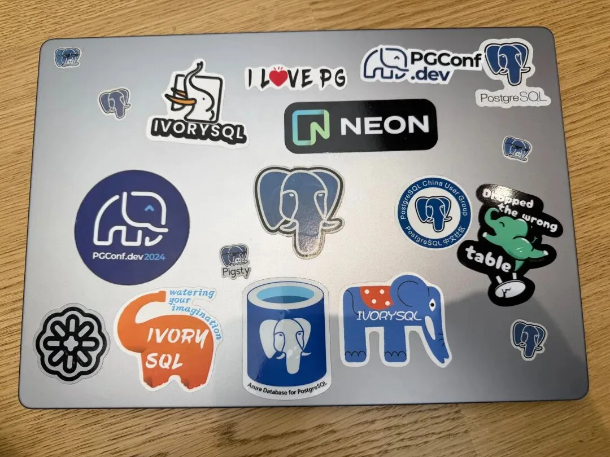
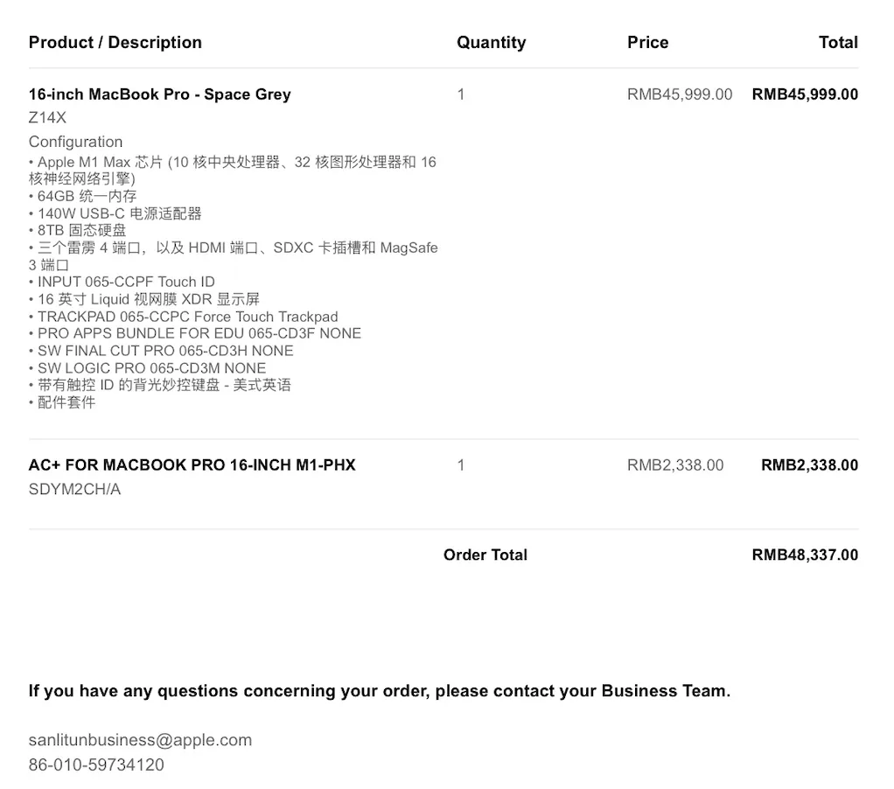
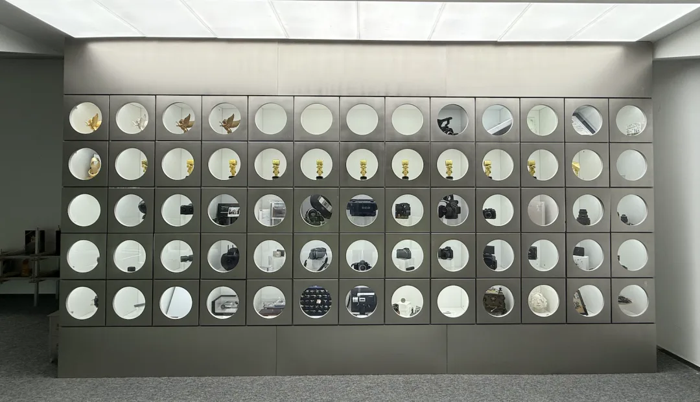
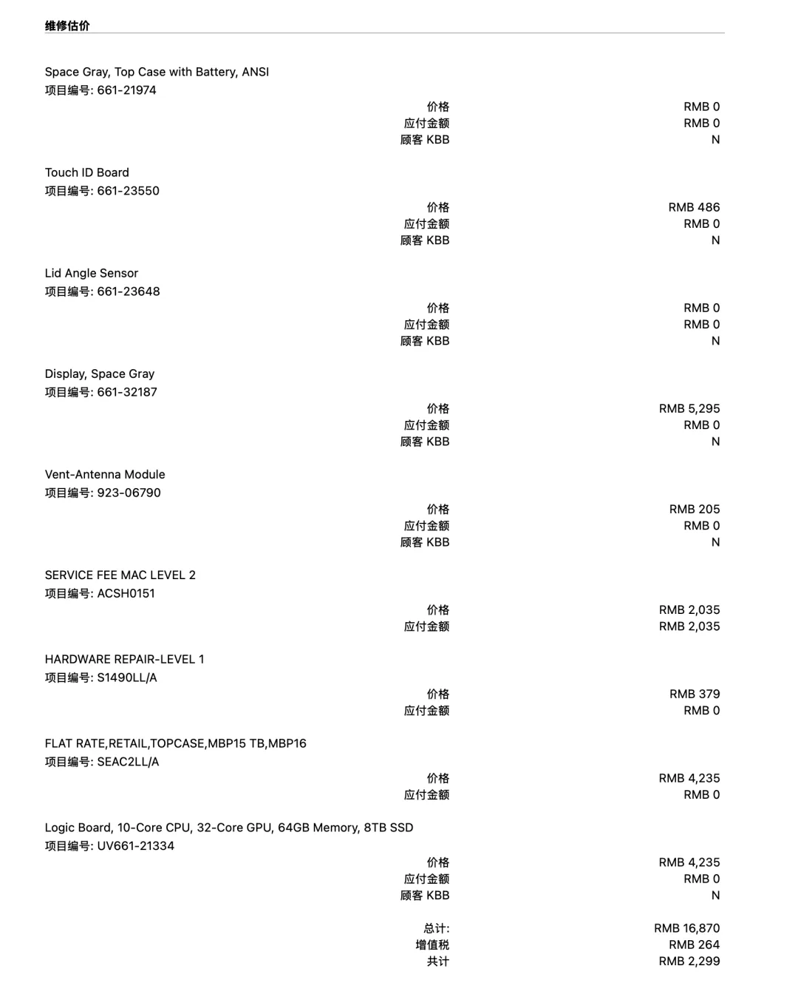
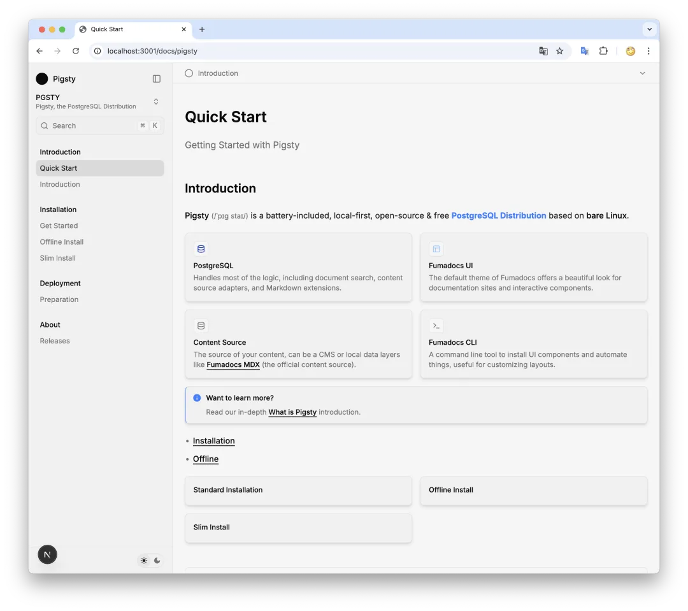
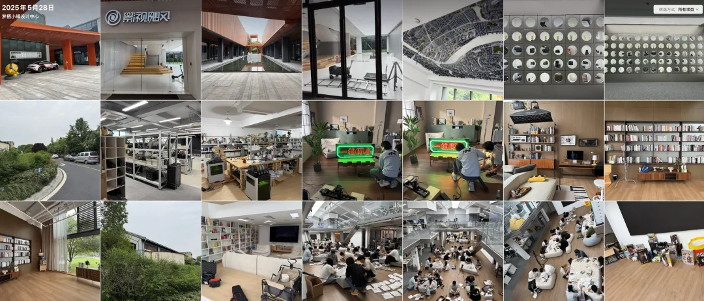

首先住各位读者朋友们端午安康快乐。

但端午节老冯的心情有些郁闷，前天老冯坐高铁去拜访客户影视飓风，结果被邻座的老奶奶撒了一身酱油，直接给俺笔记本干报废了。今天 Apple 电话打给我说恢复不了了，GG。

老冯这次上海虹桥坐高铁到杭州西，然后坐我旁边的是一位老太太，上车就点了个老娘舅外卖。老冯在边上用 Macbook 写一篇 DuckLake 的文章。然后乘务员来收垃圾的时候她把饭盒一伸，里面的酱油哗啦一下就倒我身上了，衣服是黑色的倒是看不出来，但淋进 Macbook 键盘和散热口的酱油是真的给笔记本干报废了。

笔记本的遗照

老冯这台 Macbook 是 22 年的 M1 Max 顶配加配到满，当初买的时候把所有选配项都拉满了，使用体验非常给力，跑点数据库，小模型，拉起几台虚拟机都不在话下，整个 Pigsty 项目就是在这台笔记本上闭包完成的。

虽然非常心痛，但我马上到站了，也没工夫和老太太斗智斗勇，自己捏着鼻子认栽了，然后去客户那儿就只能无实物表演了。

好在生意聊的很顺利，我还顺带得以来了一趟电子爱好者的圣地巡礼，看了看影视飓风豪横的数码产品收藏。大开眼见，大开眼界，这算是用互联网模式降维打击影视行业的典范代表了。

回到上海我就直奔 Apple 浦东，约了个天才吧检修。万幸的是当初买的 AppleCare+ 还有两个月到期，这次正好用上了。当然浸液损坏是例外，还是需要支付 2299 ¥ 的费用，但总比整个修完 16870 ¥ 要好太多了。这种时候才能感觉到买个保险真的是太太太太明智了……

理论上换完主板屏幕电池硬盘跟新的应该没啥区别，又能焕发第二春了，撑到换 M6 不成问题 —— 只能这样自我安慰一下了。

今天苹果打电话过来，开不了机，数据没法恢复了，老冯只能说 5 月去蒙特利尔前特意全盘备份了一次放在 NAS 里，正好用上，丢了 20 多天的数据，但基本也都有办法回补一下，主要的损失是 Pigsty 网站文档的源代码，还好渲染结果还在，只好重新把 HTML 成品一个个拉下来重新修改为 Markdown 格式，趁这个机会也正好修缮下文档，估计得忙几天了。

这次准备整个文档站都用 Next.js 糊一遍

这件事给老冯两个教训。第一个是备份真的很重要，数据库要备份，个人工作电脑更是要多多备份。回来我就把 TimeMachine 给重新开上了，并且所有项目资料都在服务器 / NAS / 两台笔记本上每天定时 rsync 一遍。

第二个教训是不要贪小便宜了，以前和老婆出门都买商务座或一等座，但俺自己出门的时候一看，一等座售罄，只剩商务和二等了。我嫌商务座贵就买了个二等座。然后遇上了这种奇葩邻居，所以有时候商务/一等的价格倒不是座位就多舒服了，而是遇上奇葩的概率会小很多。

影视飓风几年前就在用 Pigsty 自建 PostgreSQL 集群了 《[影视飓风达芬奇千万级数据库演化及实践](/db/davinci-database/)》，这次成为了客户，算是难过一天中的慰藉了。

参观影视飓风留念：我这还真是第一次见到数码设备用筐装，按打来计的。非常令人印象深刻：

---

发布版本：[微信公众号](https://mp.weixin.qq.com/s/7epKw8KSZ0KsrXPFh8V8zQ)
