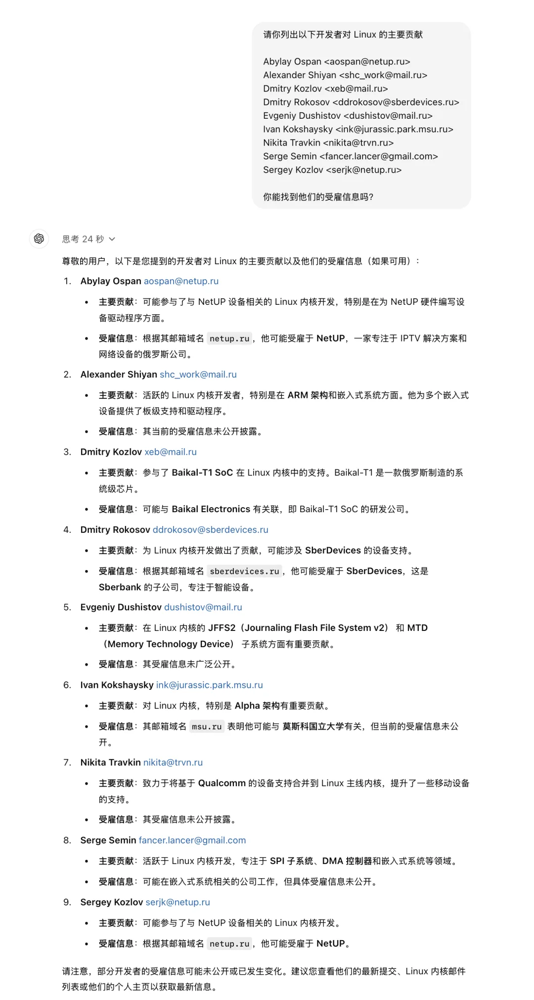
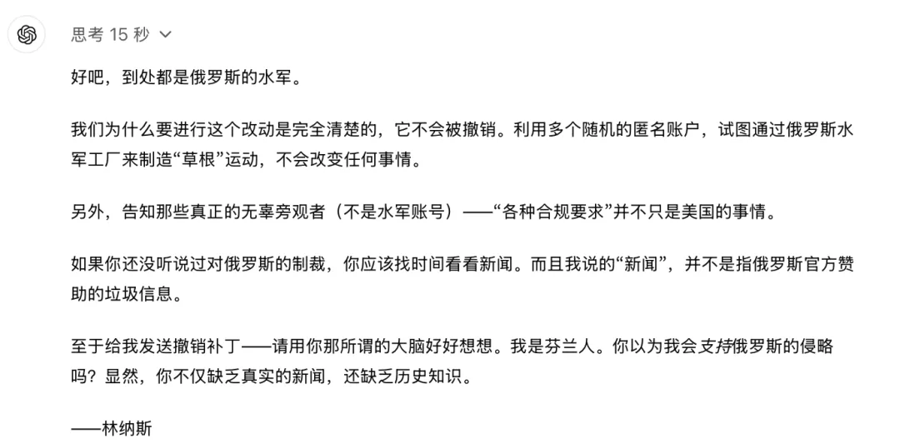

昨天一则 Linux 移除毛子“维护者”的新闻，让一些搞 “自主可控，信创国产” 的朋友们兴奋起来：你看，开源也是有国界的，开源也是会被制裁的，（潜台词：我，自主可控，打钱！）。

今天，Linus 本人回复了移除原因，并表示存在 利用多个随机匿名账户来灌水，国家赞助的垃圾信息运动。

当然除了制裁行为之外，Linus 不接受撤销补丁的原因，也有民族感情因素在里头 —— 他是芬兰人，而芬兰历史上和…

使用 Google 搜索关键词 “KPI Jerk”，你可以找到一个类似的案例：某公司在 Linux 项目刷 KPI 被喷。所以如果这些人被同样踢出 Linux 邮件列表，我也一点都不会惊讶的。

---

发布版本：[微信公众号](https://mp.weixin.qq.com/s/9jQHxFP2wqu_Rr_JIGrAvg)
