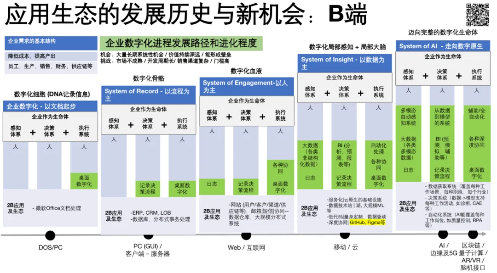
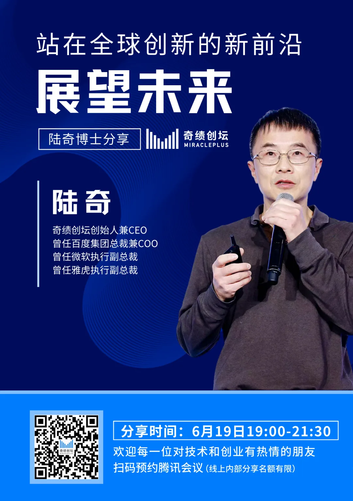

> 原作者：陆奇

本文节选自陆奇博士 2021 年的演讲，我们整理了其中一节《应用生态的发展历史与新机会：B 端》，从应用数字化生态的历史发展角度，来梳理今天企业服务（to B 市场）所面临的机会。

在陆奇博士看来，数字化的本质是“人的知识和能力的延伸”，人们收集信息，建立模型并做出决策，指导我们行动、去满足我们的需求，这是一个不变的趋势。企业就像生命体一样进化，数字化的进程就是“感知体系+决策体系+执行体系”不断形成、成熟和进化的过程。

如果你有创业点子或正考虑加入初创公司——2022 年 6 月 19 日，奇绩创坛创始人兼 CEO 陆奇博士将在线上分享科技创新趋势和创业机会，我们也欢迎所有对科技抱有热忱的爱好者预约参会（报名请扫头图二维码）。

﹀﹀

﹀

在中国，to B 的机会更多，我们一起来分析一下。\
首先，就企业的需求而言，任何一个企业的目标永远都是降低成本、提高产出，以及管理员工、客户、上下游、资金等，它的需求非常稳定。\
在企业需求的满足上，用数字化的方法解决 B 端需求的方式都跟这个时代主流的计算平台有关。通过分析企业数字化的进程可以帮助我们理解数字化未来发展的方向、创业的机会以及创业公司该怎么走。\
在分析企业数字化进程之前，我们先要看企业的结构。企业本身也是个复杂体系，跟人一模一样，它也有三个组成部分，包括**感知体系**，即每个企业都要获取信息，要了解自己的上下游和员工的信息。有了信息之后会需要一个**决策体系**，基于决策体系企业要做执行，那么就需要**执行体系**。\

**有了企业的“感知体系+决策体系+执行体系”结构，我们来看企业数字化的进程：\
第一阶段：以文档起步的企业数字化\**
最早的企业数字化，是从 IBM 和微软开始，微软做了办公软件，它把全球 7 亿办公室员工的部分工作数字化了，取代了大部分打字机、信封、纸张等，把企业信息的获取和流通通过数字化的方式来做。如果把企业比喻为一个生命体的话，这相当于形成了生命体的基因（DNA），可以存储信息。从商业价值的角度看，大家可以参考今天的微软。\

## 第二阶段：以流程为主的企业数字化\

这个时代企业的数字化是基于数据库、分布式事物处理来做，都是 ERP、CRM、LOB，主要数字化的是企业的决策流程，尤其是有了决策流程的记录。最早的 CRM 不是客户关系管理（Customer Relationship Management），而是客户记录管理（Customer Records Management），客户信息只是名字、地址等，我们还看不见客户关系。\
总结而言，第二阶段相当于把企业的决策流程部分数字化了，从比喻上讲企业的“骨骼”被数字化了。\

### 第三阶段：以人为主的企业数字化\

这个阶段是 PC 互联网的时代，企业开始有网站、邮箱、短信等工具。这个时候的企业可以“看得见”客户与用户了，每个企业都有网站，企业的员工之间、以及与上下游的合作伙伴之间都开始通过邮箱、短信更多地协同。同时，后台数据仓库、大规模的分布式系统也出现，所以企业真正能够用数字化工具感知和“看见”更多信息。\
这个时期的软件大多都是以人为主、基于人的沟通和交互进行工作，我们叫做“System of Engagement”。企业的员工之间、企业与客户的关系和交互被数字化了。比喻上来讲，这个时代的企业“血液系统”被数字化了\

#### 第四阶段：以数据为主的企业数字化\

今天我们处在“云和移动”这个时代，这个时代的体系是一个大的数据系统。除了日志，我们把企业各种各样的数据，结构化的和非结构化的数据都放入感知体系，市场部门、销售部门等通过这些大数据做预测，在决策上有了更多自动化和更多的协同。\
这个时代，主流的企业数字化创新创业的机会有四个类别：\

#### 1. 服务化和云原生基础设施\

这是一个巨大的 to B 赛道，“云化”基本上就是一种高度的虚拟化，它可以很快地沉到每一个工作流程当中，有大量基础和应用开发的机会值得创业公司去做。\

**2. 新的数据栈/湖**\
大家可能听说过 Snowflake，它是做云数据仓库很成功的，但今天的数据栈的需求已近超越数据仓库和数据湖，比如越来越多的边缘数据是不能搬走的，需要新一代数据经纬（Data Fabric)。\
**3. 低代码/量身定制**\
这是值得大家每个人关注的赛道。

为什么低代码重要？如果你仔细观察就会发现，几乎所有的企业软件都长得非常丑、非常难用，本质原因是做产品的人与用产品的不是同一个人群。为销售软件写代码的，并不是个销售人员，他不可能做得好产品。\
但今天变了，今天关于销售的知识、客户的知识都通过大数据沉淀下来了，所有的数据（关于销售的数据、客户相关的知识等）都沉淀到表格里面去了。有了这些表格之后，我们可以通过模板来搭建我们要的应用。所以，低代码的核心是让每个团队、每个部门都能够被量身定制，得到最适合它用的软件，这就是低代码的本质。\
如果写代码需要把人的经验、人的思考变成代码，那它永远是高代码。\
低代码本质上是数据驱动的，企业的知识已经成为表格了，你就把这些表格连接在一起就可以了。中国有很多类似的公司，但是这只是开始，还有大量的机会。\

### 4. 深度协同

这是一个全新的、非常宽的商业赛道。\

Github、Figma 开启了这样一个时代。这样的软件核心是，人是其中一个关键因素，用的人越多，协同越多，体验越好。更为重要的是，它把协同放当中，重置了整个工作流。在商业化方面，在产品的销售和推广中，根本性地解决了办公软件销售难的问题。

在美国，企业软件几十年的历史，大部门企业都“死”在销售上，销售成本/周期超过赚到的钱。但是深度协同的软件，从根本上解决了这个问题，它可以从下而上地把产品带进一个企业。

总结一下，第四个阶段的企业数字化，它相当于企业作为生命体有了数字化的局部感知和局部大脑，它能更有效地帮助企业做分析、预测等，决策体系更加智能。

**第五个阶段（未来）：走向数字原生**\

这个时代，企业将逐步发展成为一个完整的数字化生命体，我们目前看到这样几个主流趋势和机会：

第一，数据获取系统。比如生命科学领域，你只要获得足够的蛋白信息、病理信息，你就可以快速建立模型。大量的创业机会一开始专注数据获取系统。这种机会可以覆盖每一个工作、各种职能，每个行业越来越多的工作场景是可以通过这种创业项目来创造价值。\

收集数据就是像制作数字化生命体的“眼睛”，之后逐步形成数字化的”大脑“，那就是建立模型形成知识，模型会越来越多，建立越来越多企业和行业知识；再下一步是通过软件用这些模型帮助企业做决策，尤其是通过模拟；比如物流要用哪个策略，我们可以将所有的决策路径模拟之后，再选出最有效的决策。

在企业的执行与实施方面。人的工作都可以逐步用数字化的方法来做，尤其是人工智能技术，在每一个工种、每一个行业中，人的眼睛、手、脚都可以被逐步替代和扩充。在这方面也有很多创业公司的机会，比如 RPA 帮你填表、计算机视觉帮你做质量监测等。

可以说在这个时代，企业开始成为完整的数字化企业，有数字化的眼睛、数字化的大脑、数字化的执行体系。未来这些企业产生的商业价值会远远高于今天的企业，在中国我们更是有大量的系统性机会。

最后总结一下，在中国做 To B 创业是要面临一些挑战的：比如市场不够成熟，开发周期长，销售门槛比较高等。但是机会很多，很系统性；商业价值是长期而且价值够深，能够形成壁垒，因为 2B 产品很难卖进去，一但进去之后也很难出来。

（全文完，本文节选自陆奇博士演讲）\

---

**-关于奇绩创坛-奇绩创坛，**原 YC 中国，由陆奇博士（前百度总裁兼 COO、微软执行副总裁、雅虎执行副总裁）于 2018 年创立。作为早期创业生态圈的新物种，我们投资早期创业项目，然后全身心投入近 3 个月的时间，像联合创始人一样，与创始团队一起高强度地工作，高密度、高效益地提升每一个创业企业的核心能力，特别是加速产品与市场的匹配，以帮助团队在路演日获得下一轮融资。\

---

**“大厂”出身？酷爱技术？****有绝妙的点子，还是正在创业？****扫码添加企业微信小助手****立刻加入奇绩创坛朋友圈**👇

---

#### -推荐阅读-奇绩创业营往期投资并加速的项目

- [奇绩创坛 2021 秋季路演日，53 个项目，覆盖元宇宙、商业航天、生物科技等 30 多个主题](https://mp.weixin.qq.com/s?__biz=MjM5MzE3NzE1OA==&mid=2247497875&idx=1&sn=8c77efff5abe486d1f855ef1507b6175&scene=21#wechat_redirect)

- [奇绩创坛 2021 春季路演日，33 个项目，100% 技术驱动](https://mp.weixin.qq.com/s?__biz=MjM5MzE3NzE1OA==&mid=2247494916&idx=1&sn=32c756635312fdc91d1d0c43a3bd08d8&scene=21#wechat_redirect)

- [奇绩创坛首届路演，83% 为前沿技术驱动型创业公司](https://mp.weixin.qq.com/s?__biz=MjM5MzE3NzE1OA==&mid=2247493185&idx=1&sn=450db6dbd4135290a52f89cd6bd4c690&chksm=a699ad6891ee247e07f0737b4f6001d6829e55edc59677aa8a27f667ca5668a3a1f831ffa3e1&scene=21#wechat_redirect)

- [YC 中国首个 Demoday：1700+个申请项目，最终毕业的是这 22 家](https://mp.weixin.qq.com/s?__biz=MjM5MzE3NzE1OA==&mid=2247489924&idx=2&sn=29f032a9aa0e4084497c34451e648de1&scene=21#wechat_redirect)

#### 奇绩相关媒体报道

- [陆奇：从 10000 个创业项目里，看见中国的未来｜36 氪专访](http://mp.weixin.qq.com/s?__biz=MzI2NDk5NzA0Mw==&mid=2247823493&idx=1&sn=b462fe3c85db23dfd5b880a7c3cd34f7&chksm=eaaba159dddc284fdbfbf43e1168b7487cffb53d058e4fc79a89a45e9bec7e6db2f34728b1cc&scene=21#wechat_redirect)

- [陆奇的 benchmark：技术趋势与商业变革](http://mp.weixin.qq.com/s?__biz=MzI2NDk5NzA0Mw==&mid=2247562589&idx=1&sn=f9c2725e5d66534a9a09dbbe8ce09464&chksm=eaa7a481ddd02d97d30474c4b06420b5373511db1a9bc9539f7f9b10da0eced938355f178fa4&scene=21#wechat_redirect)

- [对话陆奇：做一件长期有价值的事，不被人理解是必然的](http://mp.weixin.qq.com/s?__biz=MzU3Mjk1OTQ0Ng==&mid=2247484455&idx=1&sn=c3ea8ea73300029a526d8609990d0be2&chksm=fcc9bb9ecbbe32880a2b260437e46ea1412eeb3369e03eb36b0dd0b60a0590b88ee12c2cd1e3&scene=21#wechat_redirect)

#### 👇 欢迎扫码预约陆奇博士 2022 年线上演讲

---

发布版本：[微信公众号转载页](https://mp.weixin.qq.com/s/lmqKgFUMu__l2jigoEPCnQ)
