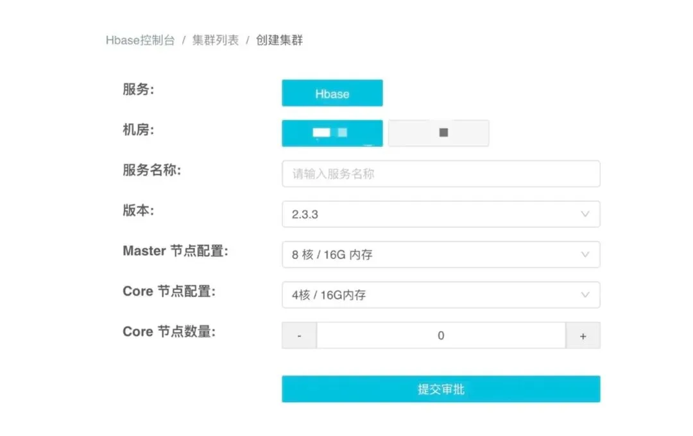
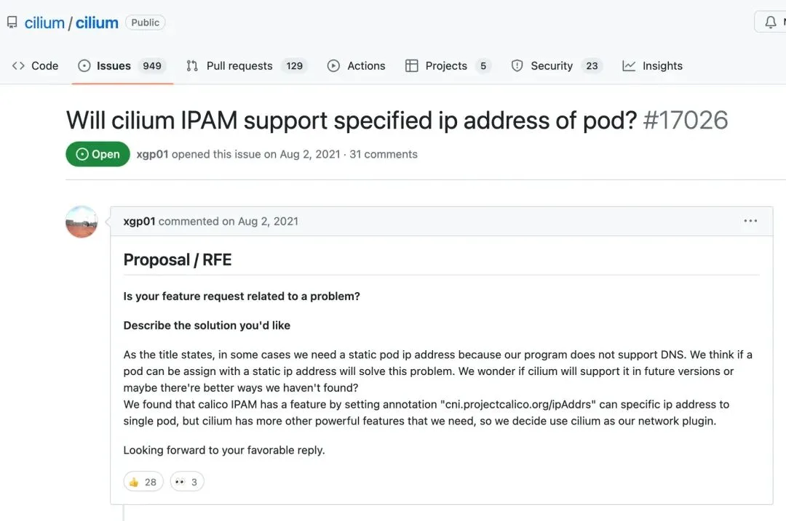

> 原作者：瑞典马工

过去二十年，中国互联网公司取得了巨大的成就。基础架构部（或者技术平台部，或者运维开发部，或者架构平台部）作为互联网公司的技术底座维护者，贡献巨大。但是随着技术的进步，此类部门的老经验在云时代，越来越不适用，而他们又普遍跟不上新问题。两项加起来，使得大家不得不问一个问题：基础架构部，真的还有价值吗？

## 基础架构部的价值是向业务单元交付技术

基础架构部出于一个目的建立：集中公司的基础设施和架构人才，为业务单元提供技术支撑。

要达到这个目的，基础架构部需要达到两个条件

1. 自己要有优秀的技术。

2. 要能引导业务部门使用优秀的技术。

很不幸的，在过去若干年来，我们发现基础架构部在两点上得分越来越低。下面我抛砖引玉，指出基础架构部们的一些常见问题，有情各位读者转发，点赞和讨论。

## 没有核心技术

基础架构部年终 PPT 最喜欢强调的就是自己打造了 X，Y，Z 平台，为业务单元提供了大数据/运维/可观测性/安全加固能通用能力。

有些基础架构部的技术大师，还会嘲笑业务单元的开发者是 CRUD 码农，很以自己的技术积累自豪。

但是打开这些高大上的中台一看，你就会发现，基础架构部的技术大神们其实就是一群开源软件组装老师傅。他们的主要工作就是上 github 找到开源软件 X1，X2 和 X3，跑一些莫名其妙的 benchmark，然后选型一个，在自己的机房部署一套。这个过程中，老实人就直接部署社区版本，自己把参数调一调；聪明人就魔改一个，让别人接手不了；更聪明的就仿造一个，让别人根本不想接手。我分别称之为调参师傅，魔改师傅和仿造师傅。

### 调参师傅

组装师傅听起来比较低端，实际上是组装师傅里最靠谱的。毕竟师傅离职后，雇主还能找到人接手。

#### 腾讯云负载均衡 CLB[1]

> 七层主要基于 Secure Tencent Gateway（STGW）实现负载均衡，STGW 是腾讯基于 Nginx 自研的支持大规模并发的七层负载均衡服务，承载了腾讯内大量的七层业务流量，包括腾讯新闻、理财通、腾讯游戏、微信等。

这个案例里，都基于 Nginx 了，还自研个啥？估计自研了个安装脚本。

### 魔改师傅

魔改师傅改起来很爽，但是几乎没有例外的，这些魔改项目都会烂尾。

#### 阿里 AliSQL[2]

> AliSQL is a MySQL branch originated from Alibaba Group. It is based on the MySQL official release and has many feature and performance enhancements. AliSQL has proven to be very stable and efficient in production environment. It can be used as a free, fully compatible, enhanced and open source drop-in replacement for MySQL.

### 仿造师傅

#### 腾讯云 CDN NWS[3]

> 腾讯云 CDN 边缘节点均采用 NWS（Next Generation Webserver）服务器为客户提供最优的服务性能，作为腾讯自研的高性能 HTTP 服务器，比常用的 nginx 等服务器，功能和性能上均有明显提升：NWS 不使用多进程的机制，而是采用单进程多线程事件驱动模型。每个链接由独立线程处理，减少上下文切换带来的开销，进程间的调度更节省时间和性能。

NWS 其实就是 Nginx 的一个仿制品。功能有明显提升是胡扯，性能提升纯粹是因为对比的 Nginx 没有优化参数。

## 无法交付业务价值

过去几年，大数据老师傅玩调参/魔改/仿造这一套最熟练了。最开始大家都用 Hadoop。基础架构部找几个人比较一下 Impala 和 Presto，或者给 Spark streaming 和 Storm 做个测评，就对 CTO 宣称自己掌握了大数据技术，开始建设大数据中台。拿到了预算，闷头干一年，你发现老哥们就做了 web 界面，美其名曰《统一大数据管理平台》。申请到人头多的，还会顺手做一个用户管理平台，结果连个 SSO 都不支持。

过了几年，当整个 Hadoop 生态被欧美抛弃之后，这些老师傅又开始抓住 Clickhouse 这个救生艇。同样的手法又来一遍。老实人就老实的说“我们部署了若干套 Clickhouse”；不老实的就魔改一个 Clickhouse，也不管上游兼容不兼容；滑头的就干脆对着 Clickhouse 仿一个。

全国起码有上百个基础架构部（或者大数据平台部，或者数据中台）过去十年就干这些事。这些老师傅凑在一起，就是比拼“你要用六百台机器啊，我只要三百台”，或者“我消化 5T 数据只要一个小时，比你的 70 分钟快了 14%”。从业务单元的视角来看，其状非常幼稚，类似两个初中男生在比拼“你只能尿两米，我能尿三米”。

实际上，业务单元在乎的不是你用了几台机器。他们关心的是你的大数据平台能不能产生业务价值。

1. 你的大数据平台能否自主接入新数据源？

2. 你的大数据平台能不能和 BI 工具方便的对接？

3. 你的大数据平台有没有精细的访问控制和访问审计？

4. 你的大数据平台能不能精确的给业务单元计费？

5. 你的大数据平台怎样帮助业务部门做到个人信息保护合规？

但是由于基础架构部的运维文化，他们几乎不会考虑这些高层次的问题，每天就在自己的舒适区，从机器上抠性能。有时候甚至会发一些很奇怪的喜报，比如“经过三个工程师半年的努力之后，我们给公司节省了半台机器，合计五万块钱”。

现在，业界大数据发展到下一阶段，以 Snowflake/BigQuery/Athena 为代表的大数据平台，特别强调易用性，从全流程上降低数据的使用门槛，尽量把更多的公司员工发展为大数据用户，最大化的把数据变现。但是他们都是云服务，而不是开源软件，你就看到老师傅们根本玩不转了。

## 技术理念落后

过去十几年，软件工程行业缓慢但是坚定的发生了一系列技术革新，使得软件行业和十五年前的差别非常大了。但是没有一个单一的进步像 iPhone 或者 ChatGPT 那样具备戏剧性效果，因此很多从业者没有感受到这种进步，这其中，就有很多架构平台部的决策者和工程师。在理念的落后，导致一系列的技术落后，他们已经失去了和业务单元的技术势差，甚至出现了倒势差。

## 沉迷于已经解决的 Scalability 问题

基础架构部们技术大师们最喜欢谈的就是高并发问题。阿里的出门就谈双十一有多少笔交易，腾讯的上台就甩一个 QQ 的十亿用户数，百度的开口就提中国用户一天搜索多少次，往往把初学者们吓得一愣一愣的。

实事求是的说，二十年业界普遍使用 LAMP 架构，很多团队被 C10K 问题困扰，那时候 BAT 们摸索出一些海量服务工程实践，是有价值的，毕竟支撑了公司的业务增长。

但是二十年过去了，可扩展性（Scalability）是一个已经被解决的问题。基本做法大同小异：

1. 使用微服务，各个服务拥有独立的资源

2. 确保 web server 都保持 stateless，以使其自动 scale out/in。

    1. 使用负载均衡承接外部请求。

    2. 使用容器分发，拒绝手工部署二进制；

    3. 不使用难以扩展的文件系统，而使用和计算节点脱偶的对象存储；

    4. 确保每个 pod 都是可以替换的；

3. 使用支持自动扩容的分布式数据库，必要的时候加缓存。

4. 使用消息队列缝合不同系统的处理能力差别。

5. 使用 Infra as Code 确保上述系统 immutable，并且可以复制。

6. 建立一个包含代码，配置，secrets 的 CI/CD 流程，确保代码质量。

7. 为每个微服务提供 out of box 的可观测性 dashboard。

8. 如果有必要，在业务层面对用户做 partition。

基本上，这个最佳实践能够覆盖绝大多数负载。并且，每一步都有工具可以支撑，任何一个工程师都可以在自己的团队落地。

作为对比，基础架构部大师们讲高并发的时候，要么在线程/进程的细节上喋喋不休，要么就念叨一些“双活”之类半通不通的话，你问多几句，对方就会生气的反问：“你处理过双十一吗？你知道我管多少机器吗？你用户有十亿吗？”，说句难听的，基本就是神棍们在跳大神。

## 死抱着 ClickOps

总所周知，中国软件工程师长期处于过劳状态，以至于从业者过劳死新闻都没有热度了。其中一个重要原因，就是行业自动化非常不普遍。

这个现象非常具备讽刺性。工程师们的工作就是开发软件，通过互联网为用户自动化一些年底报税，入学申请，核酸检测等工作，但是工程师自己拒绝自动化，大量的工作依靠肩挑背扛。

比如同程公司软件工程师编写了大量软件自动化大家的出行，但是他们的**工程师想要一个 HBase 集群还是[4]**在 web 界面上点来点去，然后生成一个工单，再有一个可怜的运维工程师接单去跑一个祖传脚本创建集群，再通 IM 告知申请人。整个过程即繁琐，又容易出错，两边都需要加班。

这种 **ClickOps[5]** 在十五年前是可以接受的，但是业界早就发展出**Infra as Code[6]** 理念。工程师应该通过 IaC 代码和资源 provider 直接通信获取资源，去掉运维中间人。

## 阻碍 DevOps

除了技术落后，有时候基础架构还会出于团队利益，故意为团队效率设置障碍。比如有的部门会打着各种旗号，一手掌控所有基础资源。开发者需要一个对象文件桶？打报告申请！开发者需要一个数据库？打报告申请！开发者更新一句 SQL？排队等 DBA 老师傅审批！开发者查看系统状态？不给权限！

基础架构部主导的持续集成持续部署（CI/CD）流水线，往往只有持续集成 CI 部分，故意切断 CD 部分，美其名曰“保障现网稳定性”。实际上他们就是担心开放持续部署系统之后，业务单元的开发团队发现没有中间人效率更高质量更可靠，他们部门就无事可做了。

## 猜疑专业软件供应商

尽管都是同一公司的部门，但是在关系上，基础架构部和业务单元其实是甲方和供应商的关系。非常自然的，供应商会天然的排斥其他供应商。尽管外部有优秀的可观测性供应商，基础架构部就是不用，要自己搭建难用的 ELK。尽管外部有可靠的 RDS，基础架构部就是要自己搭建 MySQL。

在飞书和钉钉流行之前，中国五百强里起码有两百个企业养了一个团队在研发内部 IM 工具。大量的人力浪费在造劣质轮子上。这些所谓更适应企业特殊需求的 IM，不仅难用，而且很不安全，往往用着用着，整个团队就提桶跑路了。多说一句，游戏公司研发自己的 HR 系统，外卖公司研发自己的代码管理工具，电信设备企业研发自己的差旅管理系统，都是吃得太饱了，拿着雇主的钱给自己招兵买马占地盘。

## 和业务单元的关系扭曲

很多基础架构部主张自己的价值是：“老板，我是自己人，更懂业务需求！”听上去似乎很有道理。

实际上，大多数互联网公司的技术并非核心竞争力，只需要通用软件技术，并没有那么多独特的需求。恰恰相反的是，如果业务单元有很多独特的，业界普遍不支持的软件需求，很可能说明他们的软件选型出了问题。

一个典型的例子就是 Zabbix 用 MySQL 存储时序数据，会对 MySQL 有很多需求，但是这些需求一个都不应该满足，因为 MySQL 就不是设计能处理时序数据的。

另外一个典型的例子是国内常见的 Kubernetes 固定 IP 需求。实际上，需要固定 IP 的业务就不应该上 Kubernetes。一定要用容器的话，就应该直接部署在虚拟机上。可是由于基础架构部们的曲意逢迎，这个需求在国内泛滥成灾，大家可以看下这个需求甚至泛滥到 **Cilium[7]** 项目去了。Cilium 项目可没惯着他们，把 issue 凉置了三年。

## 守旧的心态

大多数公司的基础架构部，都脱胎于运维团队，非常强调可靠性（reliability）。一方面这是优势，但是另外一方面形成了一种守旧文化。运维老师傅的口头禅是“如果能工作就不要动它”

如果你打开很多先进公司的技术栈，会发现成堆的 MySQL 5.7，CentOS，Python 2.X，GCC 4.9，这些基础软件都已经不再维护了，即使有安全漏洞也不再有补丁，因此不管兼容性还是安全性都非常不可靠。本来应该对这些过期软件负责的基础架构部，由于肩负着可用性指标，往往是最反对升级技术的部门。

## 恳请转发和批评

作者一直在互联网公司的基础架构部/架构平台工作，批评的对象当然包括我自己。十几年来，我总在思考这类部门的价值，目前有初步结论。但是用什么替换此类部门，答案仍然不清晰。此文纯属抛砖引玉，希望激发从业者参与，热切的盼望各位读者转发，点赞和评论，尤其盼望坦率和具体的批评。

### 参考资料

[1]

腾讯云负载均衡 CLB： *<https://cloud.tencent.com/document/product/214/530>*

[2]

阿里 AliSQL： *<https://github.com/alibaba/AliSQL>*

[3]

腾讯云 CDN NWS： *<https://mccdn.qcloud.com/CDN.pdf>*

[4]

工程师想要一个 HBase 集群还是： *<https://www.infoq.cn/article/mxpc2rqxmwbwjyps5mih>*

[5]

ClickOps: *<https://www.lastweekinaws.com/blog/clickops/>*

[6]

Infra as Code: *<https://aws.amazon.com/what-is/iac/#:~:text=Infrastructure%20as%20code%20(IaC)%20is,%2C%20database%20connections%2C%20and%20storage>.*

[7]

Cilium: *<https://github.com/cilium/cilium/issues/17026>*

---

发布版本：[微信公众号转载页](https://mp.weixin.qq.com/s/LicoWCEui78_xeQ5FKS54g)
