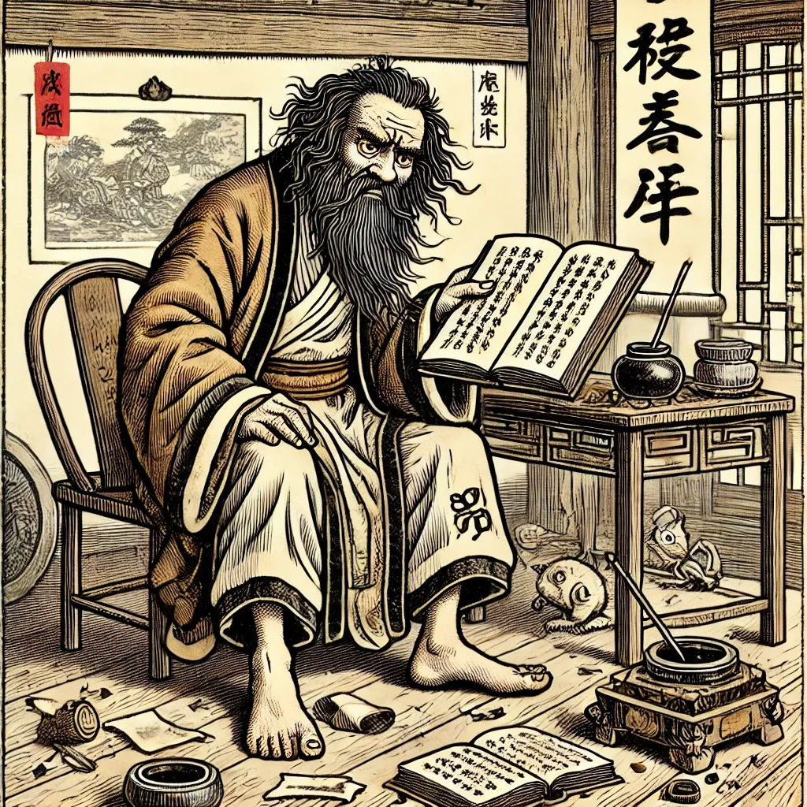

> 原作者：瑞典马工

瑞典马工在软件行业里干了二十年，干了不少岗位，换了不少公司。在这无聊的北欧乡村，有时候就把这些年目睹之怪现状记下来聊以自娱。如果各位看官觉得有趣，也请转发评论。

第一篇要谈一谈软件行业的 **废话文学家**。废话文学家就像一个个劣质的大语言模型，不管你用的什么提示词，他总可以接上话，但是不会给你有用的内容。

为了研究的方便，瑞典马工把废话文学家再细分为几类，分别是：**性学家**，**化学家**，**辩证哲理家**。

---

## 性学家

性学家每天在办公室里无所事事，时不时的就开会谈性。每次谈资都是一样的模版：“我们这个系统啊，一定要保障 **可靠性**，维护**安全性**，提供**扩展性**，不能丢掉**兼容性**，还要顾及**易用性**。”

然后性学家就开始分发性学帽子，让张三负责安全性，请李四镇守稳定性，派王五麻子掌管合规性，张三李四王五各自咬破手指头，当面签署血色军令状，性学家就完成技术架构了，班师回朝！

至于这些性怎么在整个 SDLC 落地，部门之间怎么配合，流程如何衔接，工具怎么集成，性学大师一概不管。只等年终的时候，各路先锋上报漂亮数据，性学家让 CTO office 的表哥们在 Excel sum 一把，一年绩效就完成了。如果性学家在年中的时候让表哥们在 Excel 表 sort 一把，发个邮件通报各部门排名，就算特别有心了的，是“不仅能做架构，还能推动团队落地”的大师中的战斗机。

---

## 化学家

如上所述，张三李四王五麻子从性学家那里领了性学课题，自然要有个交代。这时候他们往往就变身为化学家。

化学家，顾名思义，用的武器就是“**化**”，什么都可以“化”一下。比如你说一个词“开发”，那化学家就会接上：“这个开发啊，必须要规范化，质量化，敏捷化，标准化，系统化。”

你说一个词“平台工程”，化学家就会插嘴：“这个平台工程啊，其本质就是平台化，集中化，规范化。平台工程要落地呢，我看必须系统化，流程化，规范化。”

你让一些走火入魔的化学家去吃屎，他都能搞出十八页 PPT，详细的描述软件开发者应该怎么“集成化，无毒化，个性化，规模化”的吃屎。

---

## 辩证哲学家

化学家和性学家们的一个爱好是谈技术哲学。他们自然是不会真的去研究 卡尔·波普尔 那种硬核科技哲学，只是从一些微信公众号里读过一些爆款文章，看到有些句子很有哲理，就划线发给下属微信群，然后坐等下属排队点赞。

一般来说，这种哲理名言包括但不限于如下几句：

1、所有的技术都是要为业务服务的。

2、技术没有先进和落后，只有合适和不合适。

3、软件工程的本质，就是权衡和取舍。

4、辩证的看，每个方案都有优点和缺点。

5、不能为了安全牺牲效率，也不能因为效率而忽视安全

6、编程语言/操作系统/通信协议不是最重要的。

7、再好的工具，也不能自动解决所有问题。

和意林杂志上的 “*世界上没有两片一样的树叶*” 之类的哲理精华一样，这些话基本属于正确的废话，即缺乏量化分析，也缺乏上下文权衡。唯一的作用是帮助哲理家推脱必须要做的技术选型，让他本人在任何情况下处于进可攻退可守的有利位置，使得一线工作的人还没开始工作就把锅背稳了。

但是下属们自然无法反驳。哲理家们玉音放送之后，会议室就会响起掌声，微信群就会冒出一堆引用，李组长陈架构，依照自己的亲疏关系，有序的表示：“深刻，王首席果然一眼看穿本质，受益匪浅。”哲理家会谦虚的表示：“也没有，也没有，就是干了几十年，多多少少有点心得。”大家愉快的散会，留下一头雾水的工程师继续一头雾水。

在废话文学家之外，还有 **PPT 画家**，**调参大师**，**点菜家**，**硅谷概念搬运工**，**神童家**，限于时间，我们就下回再叙了。

---

- [互联网技术大师速成班](/misc/internet-tech-masterclass/)
- [云计算：菜就是一种原罪](/cloud/cloud-incompetence/)
- [从降本增笑到真的降本增效](/cloud/smile/)
- [Oracle 最终还是杀死了 MySQL！](/db/oracle-kill-mysql/)
- [PostgreSQL 正在吞噬数据库世界](/pg/pg-eat-db-world/)
- [腾讯云：颜面尽失的草台班子](/cloud/tencent-disgrace/)
- [数据库真被卡脖子了吗？](/db/db-choke/)
- [国产数据库到底能不能打？](/db/db-china/)
- [国产数据库是大炼钢铁吗？](/db/great-leap-db/)
- [分布式数据库是伪需求吗？](/db/distributive-bullshit/)
- [EL 系操作系统发行版哪家强？](/db/rhel-compatibility/)
- [基础软件到底需要什么样的自主可控？](/db/sovereign-dbos/)
- [中国对 PostgreSQL 的贡献约等于零吗？](/pg/china-pg-contribution/)
- [Redis 不开源是“开源”之耻，更是公有云之耻](/db/redis-oss/)
- [PostgreSQL 会修改开源许可证吗？](/pg/pg-license/)
- [RDS 阉掉了 PostgreSQL 的灵魂](/cloud/rds-castrates-pg/)
- [DBA 会被云淘汰吗？](/cloud/dba-vs-rds/)

---

发布版本：[微信公众号转载页](https://mp.weixin.qq.com/s/qAnEmtLz3EpSophz1TbFGA)
