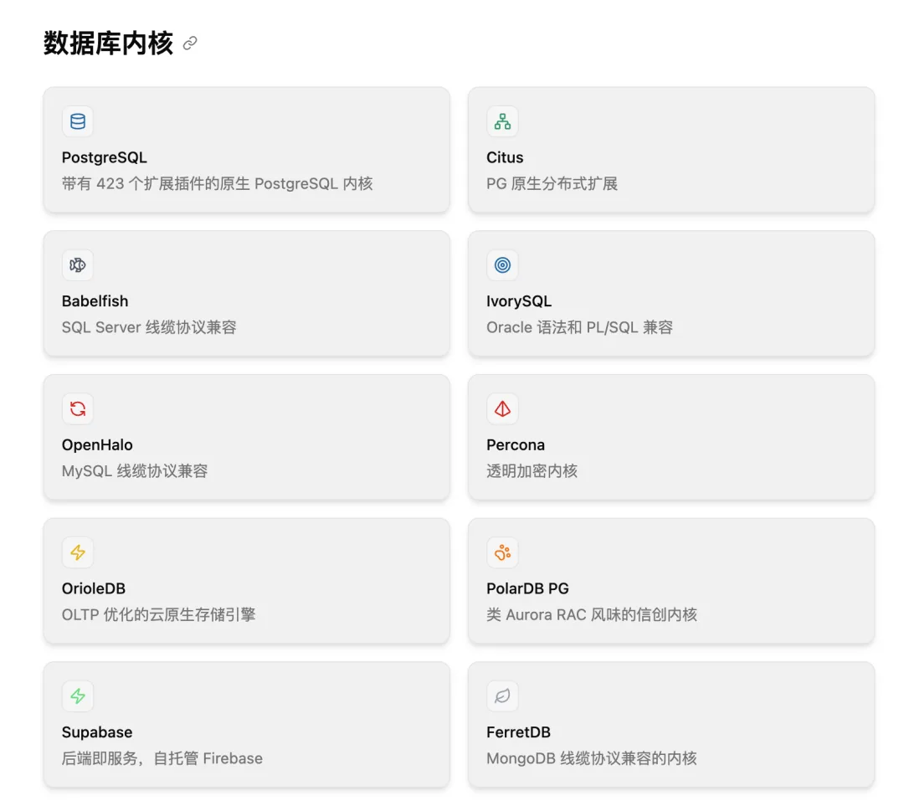
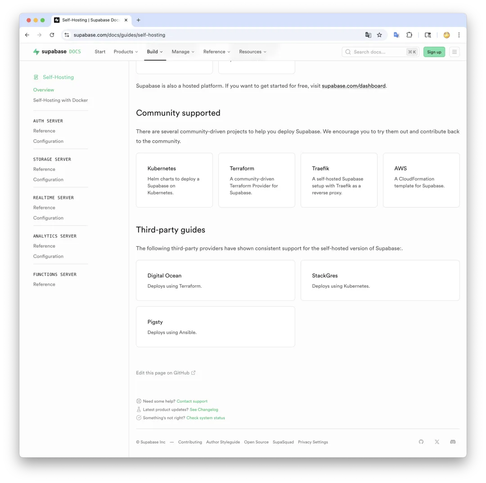
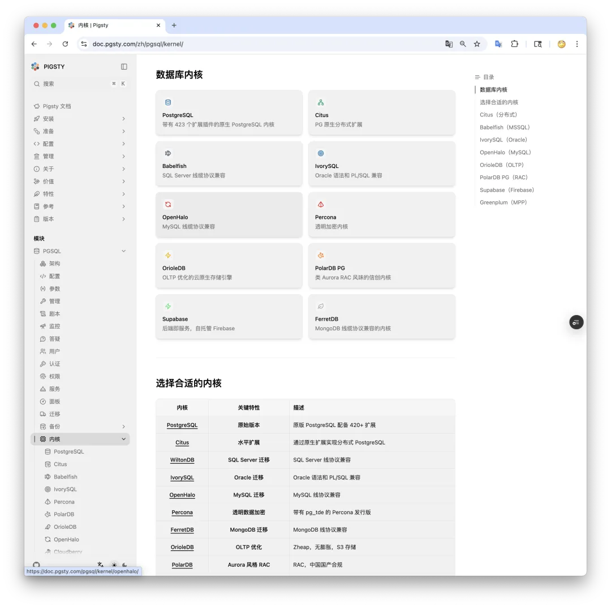
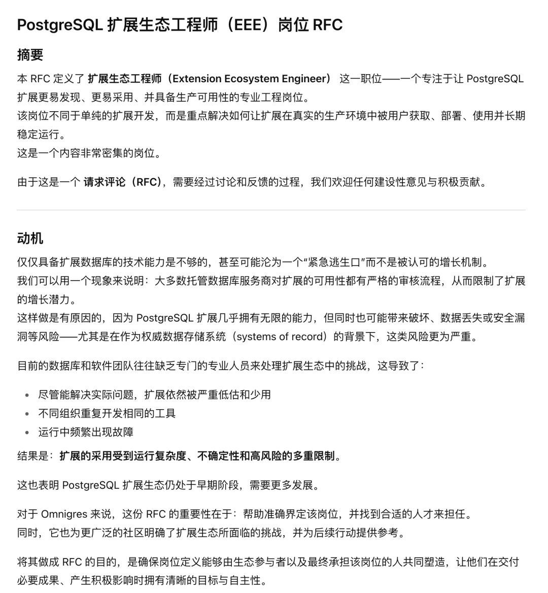
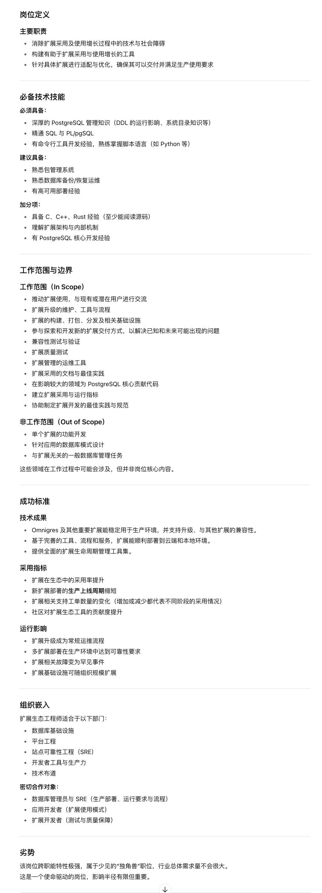

最近我的朋友，Omnigres 的创始人尤里跟我聊天，他说想要招一个 PostgreSQL 打包专家 —— 当然具体的岗位名字，他起了个 EEE —— Extension Ecoystem Engineer，也就是 “扩展生态工程师”，倒是挺有意思。他发的这个 JD 吧，是公开的（<https://github.com/omnigres/rfc/pull/2/files），我就直接贴在下面了>。

## 稀缺的技能：Linux 打包

我觉得他的这个 JD 有点儿过分，DevRel + SRE + DBA + Building Engineer + PostgreSQL 专精 六边形战士，简直是照着我写的，但老冯还真没见过其他有这种组合的人，所以我还是建议他老老实实找一个精通 Debian/EL 打包的构建工程师更实际一些…。但尽管如此，我认为难度还是挺大的，因为熟悉 “打包构建” 这个技能的人，咱都不能说用”稀缺“来形容了（更稀缺的应该是 DevRel）。

当然这里其实上下文语境，说的是 PostgreSQL 数据库内核/扩展在 Linux 操作系统上的构建打包。主要是 C 和 C++，还有一些 Rust，Java，Go 之类的扩展与工具。打包的产物主要是 RPM 和 DEB 包，以 APT / YUM 软件仓库的形式交付。老冯认为，这是一个相当不为人知的高价值稀缺技能。

## 什么时候意识到这一点？

老冯第一次意识到构建打包这个事是在 2017 年，那时候我去聊 Pivotal，面试官就问了我一嘴，你会打包吗，我们现在没有会这个的。我就嘀咕，什么包？RPM 包？嘿还真是。后来 Pivotal 出来的姚老板（YMatrix）也问过我这个事，你是不是打包构建比较熟悉，我们现在就特别缺这个，又让我加深了印象。

后来其实我也看过许多国内国外的数据库公司发布的软件，打包这一块确实惨不忍睹。比如之前的 Greenplum 是怎么交付给客户的呢？是一个 CentOS 7.9 RPM 包。啊对，这个软件它就提供一个 EL 7.9 RPM 包，您想要在 EL 8，EL9，或者 Ubuntu / Debian 或者其他 Linux 上运行？拜拜了您呐！

包括阿里云的 PolarDB for PG，瀚高的 IvorySQL，本来也就是一两个 EL RPM 包的样子，在老冯的 Push 下总算是支持齐活主流 Linux 发行版了。MySQL 兼容的 OpenHalo 内核和 OrioleDB，干脆就是我直接自己上替他们打包了。

## 构建打包的价值

打包这个技能很稀缺，但价值在哪里？其实你会发现，绝大多数终端用户 **并不在乎你是不是开源**，他们在乎的是有没有一个稳定可靠（**最好免费**）的二进制软件包可以下载。就比如说 Greenplum 闭源了，但现在还时不时的有朋友来管我要 Greenplum 的 RPM 包。姚老板的 YMatrix （GP7 闭源分支）虽说是闭源商业软件，但因为免费提供试用下载，大家也照样能用着，谁管你开不开源。

更鲜活的例子是[最近 Kubesphere 社区断供](/cloud/kubesphere-rugpull/)—— 源代码其实还是在那里的，但是你把二进制产物（镜像）给直接删掉了，这就影响到终端用户了 —— 你开不开源其实对用户毛影响都没有。真正会出现供应链卡脖子问题的，从来都不是软件的源代码，而是软件制成品。

## 构建打包让开源软件自主可控

开源专家 Tison 在他的公众号文章《[如何安心使用开源软件？](https://mp.weixin.qq.com/s?__biz=MzIzMDEwODM5OQ==&mid=2647852959&idx=1&sn=54447d633589061f469174818654e958&scene=21#wechat_redirect)》和 《[开源软件有断供的风险吗？](https://mp.weixin.qq.com/s?__biz=MzIzMDEwODM5OQ==&mid=2647852894&idx=1&sn=a18cb659f93dbef7bfab20ed312311e3&scene=21#wechat_redirect)》其实深入聊过这个问题。结论就是：开源软件是没法断供的，但是开源制品是可以断供的 —— 想要安心使用开源软件，最重要的还是拥有一份本地的软件副本，或者建设自己的软件仓库。这里的核心就是打包构建。

就比如最近的 《[PostgreSQL PGDG 仓库断供](/pg/pg-mirror-pigsty/)》这件事，全世界几乎所有镜像站都跟 PGDG 上游失去同步了，停留在五个月前的过时版本。目前全世界只有德国的 XTOM，俄罗斯的 YANDEX，和老冯在中国的 PIGSTY 提供手动更新的 PGDG 最新软件镜像。

当然，镜像站也只不过是同步一下人家做好的软件二进制制成品，退一万步讲，如果 PGDG 不是停止增量同步而是直接彻底锁死。那你要是想完全独立从零搭建起一个软件仓库出来，针对 RISC-V，MIPS，ARM 等乱七八糟的国产架构分门别类构建，那么打包构建依然是绕不过去的一道门槛。

## 打包和打包不一样

当然有人会说，哎呀，都是开源软件，你可以自己从源代码编译呀？这话说的不假，使用现代语言编写的软件已经针对打包构建流程做了很多优化了。比如，用 Go 语言写的程序就非常容易构建打包，甚至还有 goreleaser 这样的神器，可以一键帮跨平台构建所有组合，生成 RPM / DEB 包，构建并推送 Docker 镜像然后自动创建 GitHub Release，而你让 Vibe Coding 帮你实现这样的工作流可能都要不了半个小时。

但是，我们说的并不是这些，而是像 Debian，PostgreSQL 这样的巨无霸生态型项目（基本上基于 C / C++）。而且，构建打包 PostgreSQL 数据库，可不是几个 RPM 包就完事了。我这么说，现在我提供的 10 个发行版 Linux 发行版 x 5 个 PG 大版本，再加上扩展和工具，总共有 4 万多个左右的 RPM/DEB 包。

打包构建并不是一件轻松的工作：要处理好各种依赖，glibc，icu，openssl，PostGIS 带着的一颗硕大无朋的依赖数。各种插件依赖的各种奇奇怪怪的系统库，不同操作系统发行版甚至是大版本上的版本冲突，cmake，make，ninja，cargo 各种构建工具的用法，诸如此类。

## 你为什么不用 Docker？

Docker 似乎是来 “解决” 打包构建的一种捷径 —— 一次构建，到处运行 —— 才怪。我的意思是：用 Docker 你可以不用处理 Linux 操作系统大版本的组合因子（比如 el9，d12，u24 这种差异），但你依然要针对 PG 大版本，系统架构，以及几百个扩展和他们的多个版本进行构建。第二，如果你去看 Postgres Docker 镜像，就会发现其实它的 Dockerfile 里也还是用 apt install 去安装 PGDG 的 DEB 包的…。Linux 软件包是 Docker 镜像的上游，而不是相反。

第三，PG 的扩展是它区别于其他数据库的核心特色之一，而 Docker 容器镜像至今也没有办法优雅解决 PostgreSQL 扩展插件持久化的问题 —— 你不知道用户到底需要几百个扩展中的哪一个，然而全部装上又显得过于臃肿和愚蠢。Alvaro 在这一方面正在进行一些前沿探索，但老冯感觉距离成熟实践还有距离。

[把数据库放入 Docker 是一个好主意吗？](/db/pg-in-docker/)

[数据库应该放入 K8S 里吗？](/db/db-in-k8s/)

## 老冯怎么干起打包了？

老冯干打包这个事也就是从两年前，那时候我要提供在 Pigsty 里自建 Supabase 的能力，但是 Supabase 用到了十几个 PG 的扩展插件，这些扩展插件大部份都不在 PGDG 官方的二进制仓库里面。我问了问 PGDG YUM 仓库的维护者 Devrim，他说，Rust 写的扩展永远也进不了 PGDG 仓库，因为编译太慢了！所以老冯就只好自己上手，给这些扩展打好了 RPM 包。后来既然都打了 RPM 包，就干脆把 DEB 包也做了 —— 再后来，既然都已经支持了十几个 PG 扩展，那干嘛不把 PGDG 官方仓库不支持的两百多个 PG 扩展也打包交付了？

一步一步走到今天，老冯独立维护了一个 PostgreSQL 扩展仓库，里面包含了 9 种风味的 PG 内核，以及两百多款 PG 扩展（加上 PGDG 的总共 423 个可用扩展）。目前是 全世界 PG 生态收录最多可用扩展制品的仓库了。不谦虚的说，说起 PostgreSQL 打包构建，我和 Devrim（YUM 仓库），Christoph（APT 仓库），Álvaro（OCI 仓库），David Wheeler（PGXN） 算是这个赛道的顶级玩家了。

最直观的例子就是，Supabase 作为目前 AI 赛道的当红炸子鸡与数据库最大赢家，本应吸引大量厂商入局，但直到现在，有能力提供自建 Supabase 能力的开源 PostgreSQL 发行版，目前也只有老冯的 Pigsty （基于原生 Linux RPM/DEB），以及 Alvaro 的 StackGres（基于 OCI 镜像与 Kubernetes ）

 —— 因为我们都解决了这些 Supabase 专有扩展的构建打包分发问题。其实卡点就在这里，Supabase 即使把他的扩展源代码开源出来（后面还要换 OrioleDB 内核），又有几个人懂？又有几个用户有能力用起来？

说到底，单纯懂 EL / Debian Linux 打包的工程师其实还是有一些的，但是同时熟悉 PostgreSQL 生态，能为 PostgreSQL 几百个包在十几个系统发行版构建的人确实是凤毛麟角了。

## 懂打包的凤毛麟角

在现实实践中，老冯发现这个技能真的太稀缺了，就像尤里问我谁还懂这个，国内就甭说了，就算是全球，我知道的可能 ZoomboDB 那个作者（pgrx 作者）懂这个（被 ParadeDB 挖走了），别的我还真想不出来有谁能做好这个事情了。

比如说，PG 生态中，这么多扩展，能有有能力直接在发布的时候提供主流 Linux RPM / DEB 包的，我知道的就只有 ParadeDB 一家（pg_search），而他们会做这个事是因为他们发版太频繁了，我实在懒得替他们打包了，所以手把手教他们应该怎么打 RPM/DEB 包。另一个会自己打包的是 pgroonga，timescaledb，citus，但是怎么说呢，打的包和 PGDG 规范不统一，而且经常缺这个缺那个 —— 比如 citus 一直就缺 ARM 的包，Timescale 则缺几个特定的发行版，pgronnga 针对的是 Debian 自带的 PG 去打的包 —— 诸如此类。

再比如说国内的数据库厂商，之前阿里云的 PolarDB for PG 和 IvorySQL 也就几个 EL RPM 包，后来我使劲儿 push 他们，总算是 Pigsty 支持的 10 个主流操作系统发行版现在都有包了。我也帮他们解决过几个低级打包错误。另外那个 MySQL 兼容的 OpenHalo，老冯干脆自己上了，替他们打好了 DEB/RPM 包。同理，Supabase 收购的 OrioleDB 看上去也没有这个能力，所以我也替他们做了 RPM / DEB，在 Pigsty 中开箱即用。

## 小结

很多时候，价值源于非共识，打包构建就属于这种半瓶水外行看上去 “不就是编译封装一下”，但实际上相当稀缺的技能，脖子卡的嗷嗷叫的技能。

## References

---

发布版本：[微信公众号](https://mp.weixin.qq.com/s/LaDBTaBKI1ZLdgfFdlWgyA)
