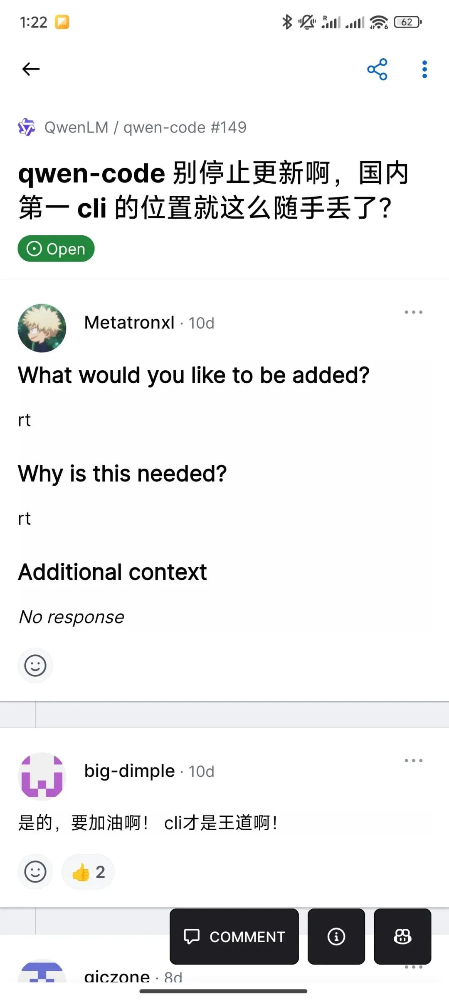
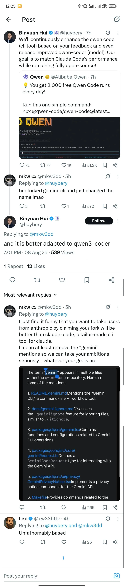

> 原作者：马驰

阿里的 qwen-code CLI 是基于谷歌的 Gemini CLI 分叉的。后者的开源协议是非常宽松的 Apache 2.0，所以阿里这样做，法律上完全没问题。

但是合规之外，还是有不少问题的。

用户体验上，就有用户反应工具的初始化命令生成的是谷歌 Gemini 模型需要的 GEMINI.md，而不是 qwen 需要的 QWEN.md。显然，这是 fork 的时候，检查不彻底导致的遗留。

> What happened?\
> \
> While exploring the CLI, I noticed that the /init command generates a GEMINI.md file.\
> \
> What did you expect to happen?\
> \
> The /init command should ideally generate a QWEN.md,\
> \
>
> <https://github.com/QwenLM/qwen-code/issues/231>

在这之外，产品管理也会有比较大的挑战。谷歌的这个项目虽然开源，但并不采用社区协作开发模式，基本不接受外部贡献。项目贡献榜前几名全都是谷歌员工。这就意味着，Gemini CLI 必然不会照顾非谷歌大模型的需求。

在此前提下，qwen 要么投入同等的资源维护一个完全不兼容的分叉，要么就忍声吞气跟着谷歌走。后者显然是不可接受的，而前者，就没达到节省成本的目的。

用户们也敏锐的发现阿里团队对 qwen code 不太积极维护了，他们甚至语带嘲讽的催促中国第一 CLI 别停止更新。

这就涉及到第三个问题，品牌形象问题。用户很自然的产生疑问，一个大公司把客户端软件建立于一个自己不可控的源头上，是不是意味着他们资源有限无法投入，或者不重视不愿意投入？

推特上这位老哥，就刻意翻出 qwen code 里提到 Gemini 的地方，用来怼 qwen 的宣传。可以看出，这位老哥并非 qwen 的竞争对手，他就是纯粹在较真抬杠。但是他有一点说得很到位

”如果你把 Gemini CLI 复制成 qwen code，却连 Gemini 都没清理干净，我不会把你的雄心当作一回事。”

其实，Gemini CLI 做的很烂，issue 里全是 bug report，都淹没了 feature request。谷歌的大模型在编码领域也没有竞争力，没办法把这个很挫的 CLI 带成事实标准。qwen code 分叉它，相当于投胎凤姐然后再去整容，刻意走了一道弯路。

总而言之，从产品管理的角度，qwen code 基于 Gemini CLI 分叉是一个很草率的决定。导致客户端的质量和 qwen 大模型的强劲竞争力不匹配。

如果阿里确实不想自己开发客户端（其实用上 AI 的话，也花不了多大的成本），干脆赞助一个社区主导的 CLI，Open Code 或者 Crush 都可以，选谁都比选 Gemini CLI 强。

---

发布版本：[微信公众号转载页](https://mp.weixin.qq.com/s/Dih-96p3_9y4hFwRTxrn6A)
