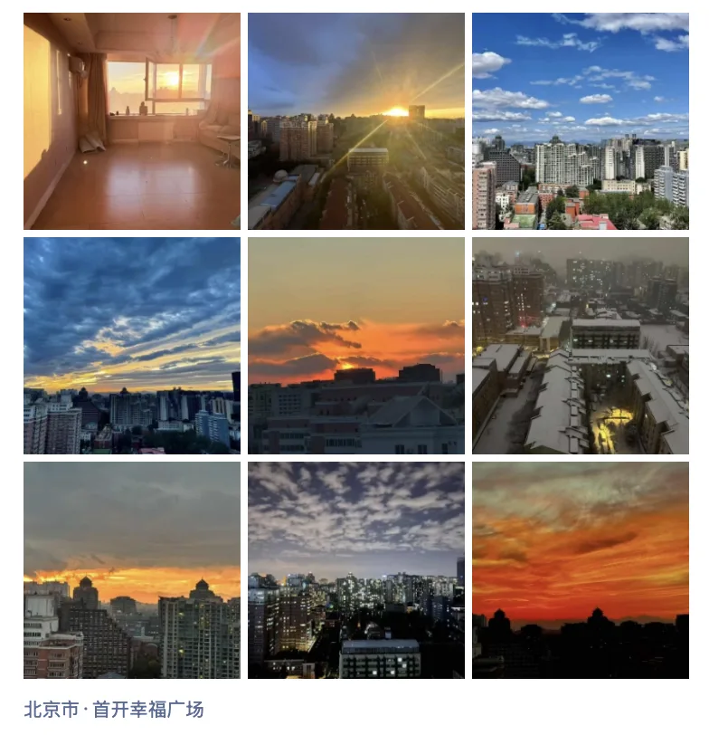
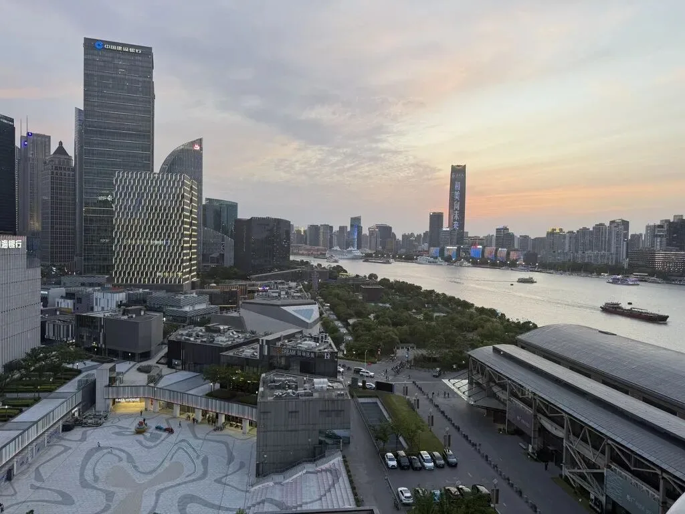
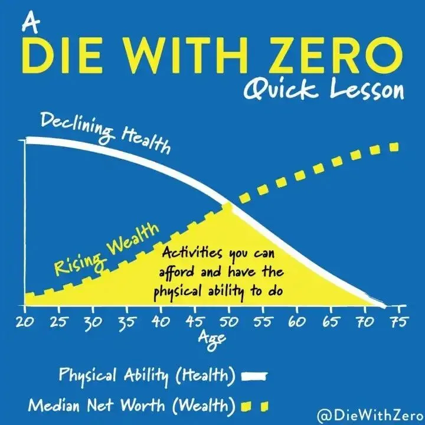

老冯搬家了，从北京搬到上海。其实五一的时候就在折腾搬家了，不过这次从蒙特利尔参会回来，在北京待了三天倒时差，顺便把北京房子清理干净挂牌卖了，善后干净。

老冯毕业之后就待在北京了，掐指一算也有十年了，中间虽然去杭州/上海短暂的待过，但大部分的时间都在北京度过。搬家少说也有十次了，不过最近几年倒是一直没动过，都在北京三里屯边上。在这里我认识了我的夫人，结婚，一眨眼这都快五年过去了，感觉像是弹指一瞬间。

老冯 17 年就开始看衰房子了，但是显然没有知行合一。在北京买房买在了高点 22 年，既然不住在这儿了，老冯也没有兴趣养房子了，-20% 割肉认赔离场，真是个悲伤的故事，应该是俺做过最错误的决定，但亡羊补牢也为时未晚。

到了上海，我也对买房彻底失去了兴趣，和老婆租了个媳妇单位边上的房子，上班很方便。陆家嘴，可以看到很美的江景，小区的环境也很不错，景色，服务，体验确实是前所未有的爽。

总价两千多万的房子，月租只要两万四。不算便宜，但干两单 Pigsty 专业版订阅其实也就出来了，也算是给老冯了一些出去赚钱的动力。

当然按照老冯以往的性格，最多找个万把块的房子住住。这次也是受到一个哥们的观念与行动影响：他在北京月租五万租了个三千多万的房子，住的舒舒服服美滋滋。用他的话来说就是：这个租售比，存银行利息每月都十几万，房主是大善(s)人(b)，倒贴钱给我住。好像也确实是这么个道理。

他推给我一本书：Die with Zero，对我触动很大 —— 你的人生就是你体验的总和，而当你年轻的时候如果赚钱不花，到了年老的时候花钱也没有那种 Experience 了。—— 欲买桂花同载酒，终不似少年游。幸福和对幸福的感知难以并存，有些体验，年轻的时候才能感受到，老的时候再去做就没有意义了。与其背着贷款苦哈哈的为金钱/房子奋斗，倒不如活在当下，享受生活。

总的来说，今天回到上海，在上海的新生活也算正式开始了。房子一卖，心情也舒畅了，自由自在的感觉真好。我也准备采用更积极健康的生活方式，不能再每天窝在家里写代码写文章了。还是要多出去运动运动，交游走一走。

如果有上海的朋友，欢迎约起来呀。北京的话我也经常会回去的，有机会也能继续聚一聚。

---

发布版本：[微信公众号](https://mp.weixin.qq.com/s/ZxLskYGmHCOWfG80uOoopQ)
