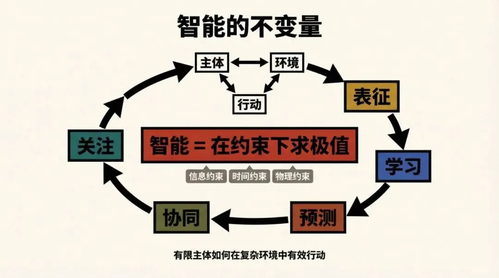
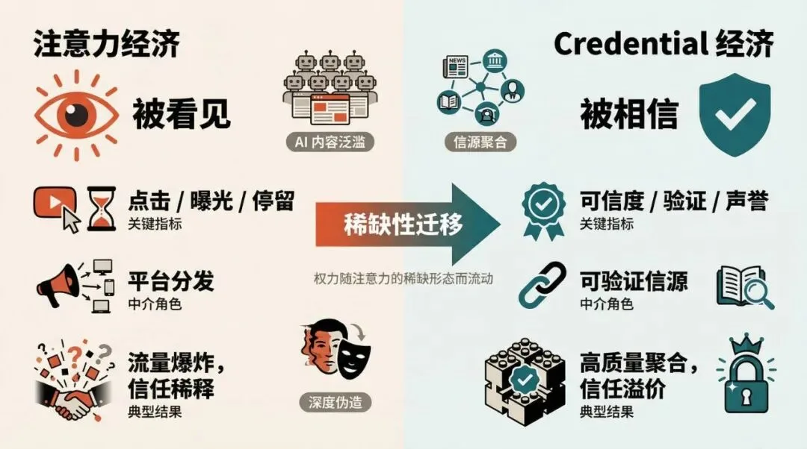
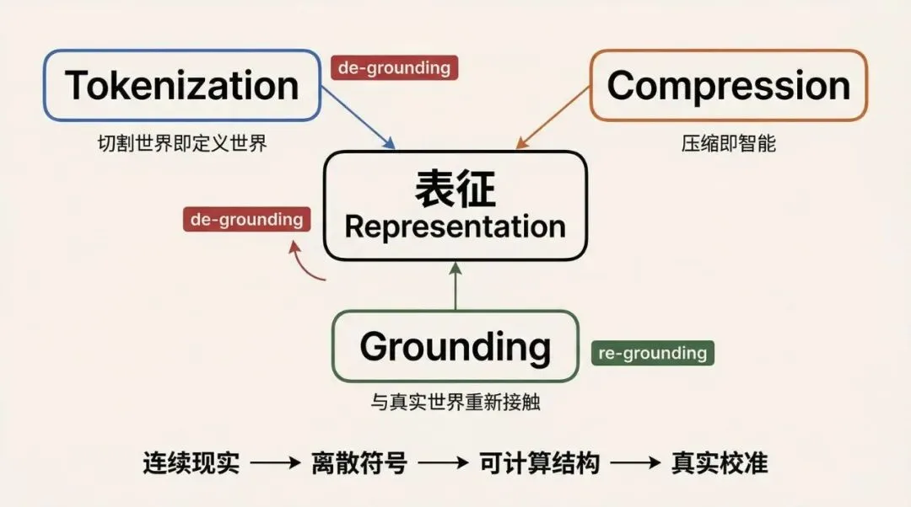
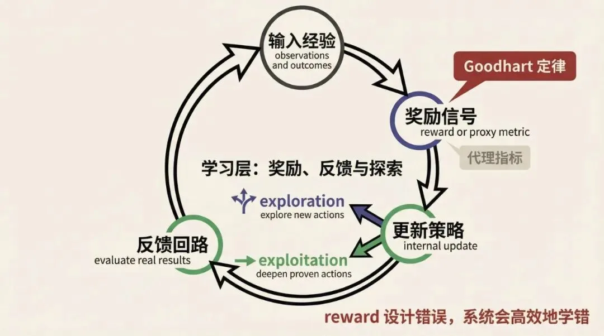
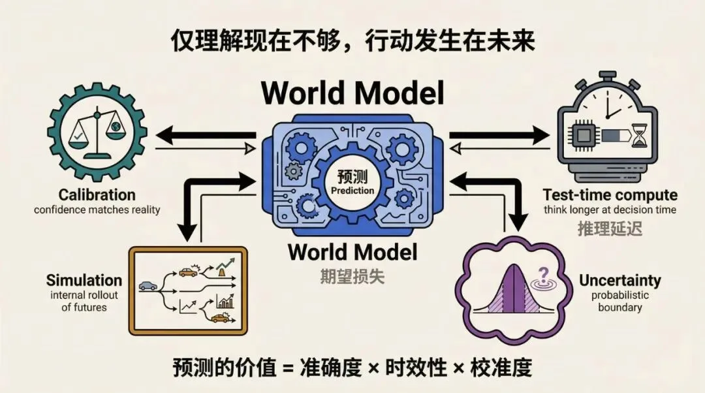
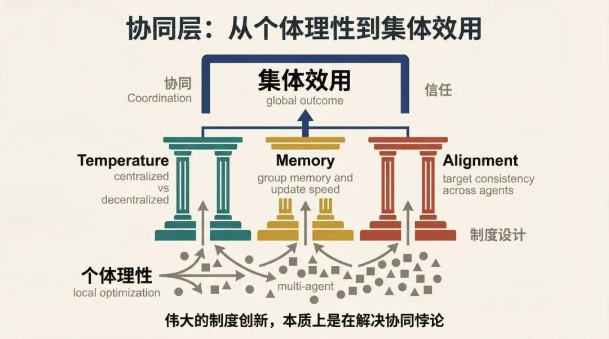
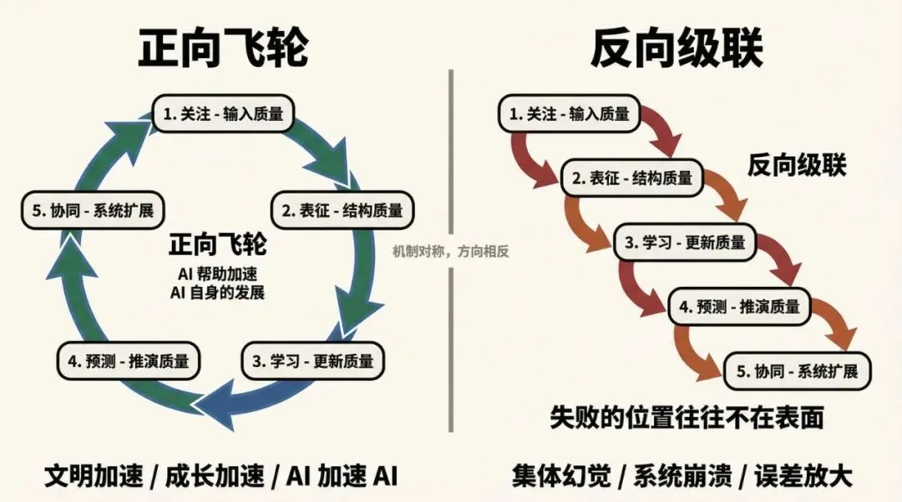
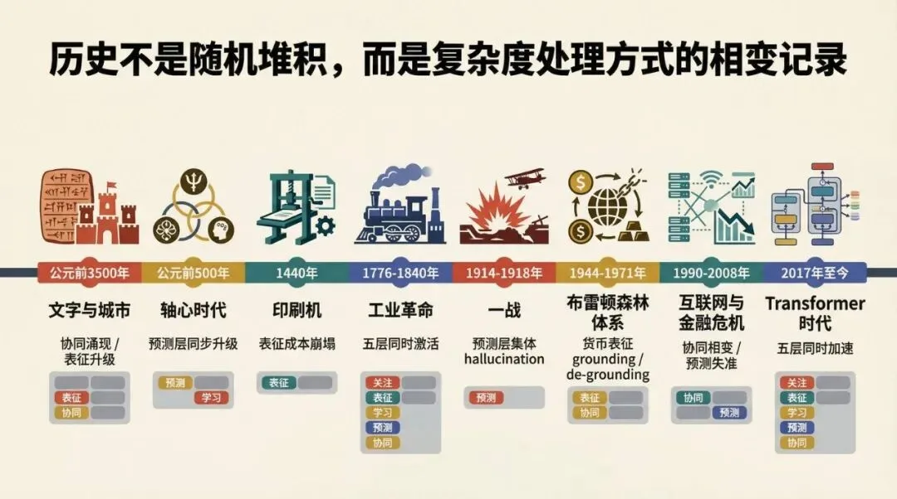
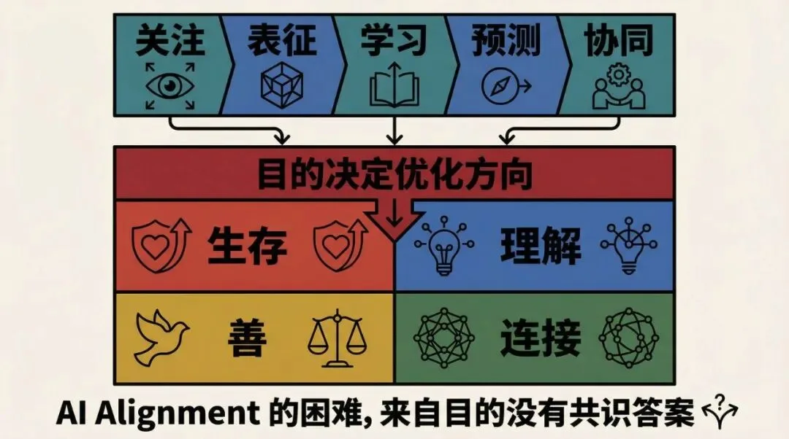

> 原作者：视觉即世界

总览框架

序言：一个不该被忽视的信号

2017 年，Google 的研究团队发表了一篇论文，标题是《Attention is All You Need》。这篇论文提出的 Transformer 架构，在此后七年里彻底重塑了人工智能的面貌。

但很少有人注意到这个标题的另一层含义。

Attention——注意力。在技术上，它是一种让模型动态聚焦最相关信息的机制。但在经济学里，注意力是这个时代最稀缺的资源。在神经科学里，注意力是意识的入口。在哲学里，注意力是主体与世界建立关系的第一个动作。

同一个词，在不同领域里指向同一件事。

这不是孤例。

当工程师说一个模型在做 Compression——有损压缩，保留结构，丢弃噪声——信息论的奠基人香农在七十年前就用数学描述了同样的过程。而再往前，维特根斯坦说语言是现实的图像，柏拉图说理念是现象的压缩——不同的语言，同一个认知动作。

当工程师说 Reinforcement Learning——智能体在环境中试错，靠奖励信号更新策略——亚当·斯密在 1776 年描述的"看不见的手"，是同一套机制在市场中的运作。达尔文在 1859 年描述的自然选择，是同一套机制在生物圈中的运作。奖励不同，时间尺度不同，数学结构完全相同。

当工程师说 World Model——模型在内部推演未来状态，无需真实试错——孙子在两千五百年前说"庙算胜者，得算多也"。凯恩斯说市场是在预判别人对别人的预判。索罗斯说预测本身会改变被预测的现实。不同的场域，同一个认知结构。

当工程师说 Emergence——规模突破阈值后，新能力突然涌现，无法从小规模线性外推——历史学家在描述城市的诞生、工业革命的爆发、互联网经济的涌现时，用的是同一套语言。量变积累到临界点，系统发生相变，没有人能提前预测跃迁的具体形态。

当工程师说 Alignment——如何让模型优化真实目标而非代理指标——经济学家 Jensen 和 Meckling 在 1976 年用"委托代理问题"描述了同样的困境。政治哲学家在几千年里反复追问的制度设计问题，本质上是同一个问题：如何让执行者的激励与委托者的真实目标对齐？

这些映射太精确，太系统，不可能是巧合。

它们指向一个更深的问题：为什么 AI 技术在重新发明人类早已知道的东西？

或者反过来问更准确：为什么人类在不同领域、不同时代直觉到的规律，在 AI 里找到了精确的数学表达？

答案只有一个：因为 AI 和人类，以及人类建立的所有复杂系统——市场、文明、组织、生命——面对的是同一个根本问题。

一个有限的主体，如何在无限复杂的环境中有效行动？

这个问题不属于任何单一学科。它是所有智能系统的共同起点。康德从认识论出发问这个问题，维纳从控制论出发问这个问题，香农从信息论出发问这个问题，西蒙从组织理论出发问这个问题。他们得到了不同形式的答案，但答案的骨架是相同的。

AI 的出现，第一次让我们能够用统一的数学语言，把这些分散在不同领域的答案组装成一个完整的框架。

这个框架有五层。它不是按学科分类，而是按"有限主体对抗环境复杂度"的因果链条切分：

你必须先关注——在无限的信息流中选择看什么，这是一切的入口。

你必须表征——把关注到的原始现实压缩成可操作的内部结构，否则无法计算。

你必须学习——因为现实在变，静态的表征会腐化，必须持续更新。

你必须预测——仅仅理解现在不够，行动发生在未来，必须对未来有模型。

你必须协同——单个主体的能力永远有限，超出个体上限的问题只能通过联结解决。

这五个动作，构成了任何智能系统处理复杂度的完整回路。缺少任何一个，系统就会在那一层卡死。

它们不是 AI 的专属。一个神经元在做这五件事，一个人在做这五件事，一家公司在做这五件事，一个文明在做这五件事。介质不同，时间尺度不同，数学结构相同。

这就是智能的不变量。

理解它，不只是为了理解 AI。

而是为了理解 AI 正在照亮的，那个关于智能本质的、人类思考了几千年却从未能完整表达的答案。

上位原理：在约束下求极值

一个三元关系

所有智能系统，无论多么复杂，都可以还原为三个要素之间的关系：

主体（Agent）——有边界、有限制、有内部状态的处理单元。可以是一个神经元、一个人、一家公司、一个文明、一个 AI 系统。

环境（Environment）——主体边界之外的一切。无限复杂，持续变化，不受主体单方面控制。

行动（Action）——主体对环境施加的干预。行动改变环境状态，环境的新状态又反过来影响主体。

这个三元关系不是比喻，而是所有智能理论的共同形式化基础。控制论用它描述机器与环境的反馈回路，博弈论用它描述多个主体之间的策略互动，进化生物学用它描述有机体与生态位的协同演化，经济学用它描述市场中的供需均衡。

智能，就是这三者之间接口的质量。接口越好，用越少的资源，在越复杂的环境里，产生越有效的行动。

核心命题

用最简洁的数学精神表达这个接口的本质：

智能 = 在约束下求极值

这不是隐喻。这是一个字面意义上的数学结构。

关注是在信息熵的约束下最大化相关性。表征是在比特数的约束下最小化重构误差。学习是在样本数的约束下最大化泛化能力。预测是在不确定性的约束下最小化期望损失。协同是在个体理性的约束下最大化集体效用。

五个不同的优化问题，数学形式完全同构：在给定约束条件下，寻找目标函数的极值。

这个同构性不是偶然的。它意味着五层框架不是五个独立的故事，而是同一个数学结构在五个维度上的实例化。

物理学中最深刻的原理也是同一个结构——最小作用量原理：自然系统总是沿着作用量最小的路径演化。费曼路径积分、光的折射定律、哈密顿力学，都是这个原理的展开。智能的五层框架，是这个原理在信息处理领域的对应物。

约束的三个层次

约束有三个层次，从最底层到最上层依次叠加：

第一层：物理约束

一切智能的终极底座是物理现实。人类大脑消耗约 20 瓦特，这是认知能力的能量预算。当今规模最大的 AI 训练运行，消耗的电力相当于一个中等规模城市。硅基芯片的晶体管密度正在逼近物理极限，量子隧穿效应开始干扰电路的确定性行为。

物理约束不会因为算法进步而消失，只会以不同的形式重新出现。它是框架的地板——所有其他层次的优化，最终都必须落在这块地板上。

第二层：信息约束

在物理约束之上是信息约束。香农定理给出了信道的理论容量上限，Kolmogorov 复杂度给出了描述一个对象所需的最短程序长度。这两个概念共同划定了信息处理的理论边界——无论硬件多强大，某些信息论意义上的极限无法突破。

第三层：时间约束

最后是时间约束。行动发生在未来，决策必须在当下完成。这个简单的事实，是预测层存在的根本理由。时间约束在 AI 系统里有一个精确的技术对应：推理延迟。一个预测再准确的模型，如果推理时间超过了行动窗口，预测就毫无价值。

守恒律：复杂度不会消失，只会转移

智能系统有一个类似能量守恒的规律：环境的复杂度不会消失，只会在五层之间转移。

关注层把外部信息复杂度转化为注意力成本。表征层把注意力成本转化为计算成本。学习层把当下的计算成本转化为未来的能力存量。预测层把能力存量转化为决策成本的降低。协同层把个体的复杂度上限转化为集体的分工结构。

你不能消灭复杂度，只能把它转移到更容易处理的形式。

这个守恒律有一个重要推论：优化某一层不会让系统整体复杂度下降，只会让瓶颈从这一层转移到下一层。

这正是过去几年 AI 发展的真实写照。算力的极大丰富没有消除智能的挑战，只是让瓶颈从"计算不够"转移到"数据不够"，再转移到"对齐不够"，再转移到"协同不够"。瓶颈在五层之间流动，从未消失。

为什么是这五层，而不是别的五层

五层框架的分类原则只有一个："有限主体对抗环境复杂度"的因果链条。

不是按学科分类，不是按技术分类，不是按时间分类，而是按照一个有限主体从接触环境到产生有效行动的完整过程，找到其中不可缺少的每一个环节。

这个过程只有一条路：

环境的信息首先必须被选择性地接收——这是关注，没有它，主体对环境完全盲目。

被接收的信息必须被转化为可操作的内部结构——这是表征，没有它，信息无法被计算和处理。

内部结构必须随时间更新以反映现实的变化——这是学习，没有它，主体活在过时的模型里。

更新后的内部结构必须被用于推演行动的后果——这是预测，没有它，主体只能被动反应而无法主动规划。

单个主体的能力到达上限后，必须通过与其他主体联结来扩展边界——这是协同，没有它，复杂度超出个体处理能力的问题永远无解。

这五个环节，去掉任何一个，因果链断裂，系统失效。增加任何新的环节，都可以被归入这五个环节之一，或者被证明是其中某个环节的子过程。

行动为什么没有单独成层？因为行动是五层共同运作的输出，而不是一个独立的处理环节。行动嵌入在五层的每一层里——关注本身是一种行动，表征本身是一种行动，学习、预测、协同都包含行动。

感知为什么没有单独成层？感知被拆分进了关注层和表征层。"选择接收什么"（关注）和"如何编码所接收的"（表征）是性质完全不同的两件事——关注的失败和表征的失败，需要完全不同的干预方式。把它们合并在"感知"这个词里，会掩盖这个关键区别。

框架的适用边界

这个框架同时使用三类材料：严格的理论命题（香农、西蒙、Goodhart 定律、Kaplan Scaling Laws）、技术案例（Transformer、AlphaZero、MuZero、RAG）、以及历史映射（印刷机、工业革命、布雷顿森林体系）。三类材料的认识论地位不同：理论命题是可证伪的，技术案例是可验证的，历史映射主要用于结构类比，不等于严格的因果证明。

框架里使用的"相变""守恒律""临界点"等物理学语言，是分析性比喻——用于描述从连续积累到非连续跃迁的现象，不必强行理解为严格物理学意义上的术语。

这个框架适合解释复杂系统中的信息处理、行动生成与规模协作，不是对所有历史与社会现象的充分解释。宗教、战争、地理、能源结构、偶然事件，都在框架的解释范围之外或边缘。

拥有工具意识的读者，会比相信工具万能的读者，从这个框架中获得更多。

第一层·关注

从注意力经济到 Credential 经济

Attention — 解决稀缺性

核心挑战：世界信息无限，处理能力有限。

极值目标：在信息熵的约束下，最大化相关性。

关注是因果链的第一个环节，也是决定一切后续质量的入口。原材料选错了，后面的加工再精良也是精确的错误。

技术维度

Transformer 的 Query-Key-Value 机制，用一句话描述：为每一块信息计算它与当前任务的相关程度，然后按相关程度分配处理资源。高度相关的信息获得更多计算，低度相关的信息被抑制。

这个机制的深刻之处在于它的动态性——相关程度不是预先固定的，而是根据当前上下文实时计算的。同一个词，在不同句子里，被赋予完全不同的注意力权重。这使模型能够处理语义的多义性和上下文依赖性，而这正是早期固定权重的神经网络无法解决的核心难题。

Self-attention 让序列中的每个位置都能直接"看到"所有其他位置，打破了 RNN 必须按顺序处理、远距离信息必须通过多步传递才能相互影响的瓶颈。这是 Transformer 在架构上的革命性突破——不是让模型更大，而是让信息的流动路径更短。

经济与制度维度

Herbert Simon 在 1971 年提出了一个预言："信息的丰富带来注意力的贫乏。"这句话在互联网时代之前被写下，却以令人不安的精确性描述了今天的现实。

注意力经济的逻辑是：当商品过剩，稀缺的是消费者的注意力；当信息过剩，稀缺的是读者的关注。平台经济的商业模式，本质上是注意力的中间商——以免费内容换取用户注意力，再把注意力卖给广告主。

但 AI 时代正在发生一次新的稀缺形态转移。注意力可以被算法批量捕获，但可信度无法被批量生产。当任何人都可以用 AI 生成看起来专业的内容，当深度伪造让视觉证据不再可靠，稀缺的不再是"被看见"，而是"被相信"。

这是从注意力经济到 Credential 经济的转型：谁被看见且被信任，谁就掌握价值分配权。这个转型在 AI 内容泛滥的当下正在加速，而大多数商业模式还停留在注意力经济的逻辑里。

历史维度

每一次媒介革命都是注意力格局的根本性重塑，也是权力结构的重新分配：

雅典广场：注意力是地理性的，只有在场者才能接收信息，演讲者的影响力受物理空间限制。

手抄本时代：注意力集中在少数能够读写的精英手中，教会通过控制文本控制了意义的生产权。

古登堡印刷机（1440 年）：圣经的复制成本从几年工时降低到几天，注意力的民主化触发了宗教改革。信息的 tokenization 权——谁有资格诠释文本——从教会向个人转移，这是近代欧洲最重要的权力转移。

广播电视：注意力首次被工业化售卖，少数媒体机构控制了大多数人的信息入口，这是二十世纪政治宣传得以存在的技术基础。

互联网：注意力碎片化，内容生产去中心化，但算法推荐又制造了新的集中——不是内容的集中，而是平台权力的集中。

AI 时代：注意力将再次重组，方向是向可验证的、可信任的信源聚合。Credential 将成为新的稀缺资产。

这条历史线索的深层规律是：权力随注意力的稀缺形态而流动。每次媒介革命改变了稀缺形态，权力格局随之重塑。

临界点

关注层的临界点是信息过载。

低于临界点时，系统能够有效过滤信号和噪声，关注层正常运作。超过临界点时，注意力崩溃——所有信号在系统内部等价，有效的区分消失，决策质量断崖式下降。

这个临界点在个人层面表现为认知过载，在组织层面表现为会议室里的议题爆炸，在文明层面表现为信息茧房和极化——当噪声太多，人们退缩到只处理符合预期的信号。

当代信息环境正在系统性地推动所有层级向这个临界点靠近。AI 生成内容的爆炸式增长将使这一趋势加速。临界点一旦被突破，关注层的失效会向下游传导——表征、学习、预测、协同全部基于扭曲的输入。

核心洞见：你做的决策不只反映你的智识，更反映你的信息环境。管理自己的关注，不是个人修养问题，而是认知系统的基础设施问题。历史上每次传播技术革命，注意力的稀缺形态改变，权力随之重新分配——这次也不例外。

第二层·表征

表征层的切割压缩锚定框架

Representation — 解决复杂性

核心挑战：被关注到的原始信息仍然太粗糙，无法直接计算。

极值目标：在比特数的约束下，最小化重构误差。

表征是智能的第二个动作：把关注到的原始现实，压缩成可操作的内部结构。没有表征，关注到的信息停留在原始形态，无法被比较、被推理、被传递。

表征层由三个紧密相连的概念构成，它们描述了同一个过程的三个方面：如何切割（Tokenization），如何压缩（Compression），如何锚定（Grounding）。

Tokenization · 切割世界即定义世界

表征的第一步，是把连续的现实切割成离散的符号单元。

这个动作比它看起来更深刻。切割不是中性的——你选择在哪里切，决定了你能看见什么，也决定了你看不见什么。不同的 tokenization 方案，产生不同的认知边界。

语言学家沃尔夫提出过一个有争议但有力的假说：语言的结构影响思维的结构。用有"雪"这个单一词汇的语言思考，和用有几十个描述不同状态之雪的语言思考，对雪的认知是不同的。Tokenization 就是语言结构的前置操作——在词汇之前，先决定如何切割世界。

在 AI 技术中，这个问题有极其具体的表现。GPT 系列的 Byte Pair Encoding（BPE）将文本切割成子词单元，这个选择影响了模型处理多语言、处理罕见词、处理代码的全部能力。中文的字级 tokenization 和英文的子词 tokenization，产生了对语言结构的不同"理解"方式。当前多模态模型面临的核心挑战之一，就是如何在文字、图像、音频、视频之间建立统一的 tokenization 方案——这不只是工程问题，而是认识论问题：什么是跨模态的"意义单元"？

这个认识论问题在历史上反复出现，只是以不同的形式：

1648 年威斯特伐利亚条约将欧洲现实 tokenize 成主权国家体系。这一切割方案运行了 375 年，塑造了现代国际关系的全部语法——外交、战争、国际法、国家利益，都是在这个 tokenization 框架内被定义的。今天它正面临 AI 时代的第一次真正挑战：当信息、资本、人才的流动不再受地理边界约束，主权国家是否还是最优的权力切割单元？

林奈的生物分类系统，把自然界 tokenize 成界门纲目科属种。这个切割决定了此后两百年生物学研究的问题意识——什么被比较，什么被区分，什么被忽略。

现代会计准则（GAAP/IFRS），把企业的经济活动 tokenize 成资产、负债、收入、支出。这个切割决定了什么被计量、什么被激励、什么被忽视。当"用户数据"不出现在资产负债表上，它就不存在于会计现实里——直到平台经济的崛起迫使所有人重新思考这个 tokenization 方案是否仍然有效。

命名权即权力。谁决定了 tokenization 方案，谁就划定了认知边界，谁就在某种意义上控制了这个系统内可能发生的思考。

Compression · 压缩即智能

Kolmogorov 复杂度给出了压缩的数学定义：一个对象的复杂度，等于能够生成它的最短程序的长度。智能，就是找到现实的更短描述。

这个定义有一个惊人的推论：能更好压缩某个领域数据的算法，就是对那个领域理解更深的算法。Hutter 奖正是基于这个原理——能更好压缩维基百科的 AI，就是更智能的 AI，因为更好的压缩意味着捕捉到了更深的结构规律。

神经网络是有损压缩器。它在训练过程中，把人类几千年积累的知识、语言、推理模式，压缩进几百 GB 的权重矩阵。被压缩的不是原始数据，而是数据中的结构——模式、关系、规律。这就是为什么大模型能够泛化到训练数据之外：它学到的不是事实，而是生成事实的深层结构。

压缩的这个逻辑放大到文明尺度，揭示了一条惊人的历史规律：

文字压缩了口述传统——把必须通过人际传递的知识，压缩成可存储、可复制的符号。

数学压缩了物理直觉——牛顿三定律把开普勒的天文观测、伽利略的实验结果、几代人的物理直觉，压缩成三个方程式。这是人类历史上最高效的一次知识压缩。

货币压缩了物物交换——把"我有牛，你有布，我们能否交换"这个无限复杂的匹配问题，压缩成一个共同的价值尺度。

法律压缩了社会契约——把无数具体情境中的道德判断，压缩成可引用、可执行的成文规则。

大语言模型压缩了人类的集体语言智慧——把可能是有史以来最大规模的知识压缩，以可交互的形式提供给每一个用户。

每次压缩都不是中性的。压缩必然有损，被丢弃的部分决定了系统的盲点。货币压缩了价值，但丢失了物品的特殊性和关系的情感维度——这是为什么"一切商品化"的社会在效率之外会产生某些系统性的人文损失。大模型压缩了人类知识，但压缩方式中内置的偏见，会以放大的形式呈现在输出里。

识别一个系统的盲点，先问：它的表征方案丢弃了什么？

Grounding · 表征必须锚定现实

表征可以在内部高度自洽，却与现实完全脱钩。这是所有智能系统最深层的风险之一，也是人类集体失误最常见的根源。

技术上，这个现象在大语言模型里被称为 Hallucination——模型生成了语义流畅、逻辑连贯、但与事实不符的内容。根源在于：语言模型的训练目标是"下一个 token 的概率最大化"，而不是"陈述与现实相符"。模型学会了语言的结构规律，但没有被强制与现实锚定。

RAG（检索增强生成）是技术层面的 grounding 方案：在生成答案之前，先从真实文档库中检索相关内容，把生成过程锚定在可验证的来源上。这是一个工程妥协，而不是根本解决——它在扩展模型可访问的知识边界的同时，也引入了检索质量的新问题。

更根本的 grounding 挑战，在于如何把语言空间中的表征与物理现实直接对应。这正是具身智能（Embodied AI）的核心意义所在——我们将在后文专节讨论。

历史上最重要的 grounding 事件是科学革命。

在伽利略之前，欧洲的知识体系是文本对文本的——引用亚里士多德来证明亚里士多德，用经院神学的逻辑体系在内部自洽地推导结论。这个体系在内部是连贯的，但与物理现实几乎没有强制的接触点。

伽利略做了一件看似简单实则革命性的事：他把钟摆挂起来，计时，测量，用数字描述结果。他把知识体系的 grounding 从"引用权威"改变为"测量自然"。这一转变重新定义了什么是知识，什么是证明，什么是真理——不夸张地说，现代科学的全部大厦建立在这个 grounding 方式的转变上。

当代最深层的 de-grounding 风险，不在于某个 AI 系统说了假话，而在于系统层面的闭环：AI 生成内容进入互联网，成为下一代 AI 的训练数据，新一代 AI 的输出再次进入互联网……这个循环如果不被外力打断，将系统性地稀释知识体系与物理现实之间的联系。没有任何单个节点在撒谎，但整个系统在漂移。

具身智能：表征层的物理级实现

大语言模型活在信息空间里。它的关注是 token 流，它的表征是 embedding 向量，它的 grounding 是文本数据库。整个过程没有物理摩擦，没有能量成本，没有时间压力。

具身智能（Embodied AI）把表征层拉回到物理现实，使框架在最严苛的条件下得到验证。

一个在物理世界中行动的机器人，面对的表征挑战与语言模型根本不同：

传感器输入是连续的、带噪声的、有延迟的——不是理想化的 token 流，而是嘈杂的物理信号。任何表征方案都必须处理这种不确定性，而不能假设干净的输入。

空间表征必须是三维的、动态的、因果的——不是统计模式，而是物理规律。机器人需要知道如果它推这个杯子，杯子会滑落；如果它抓这个球，球会变形。这种因果理解，是当前语言模型最缺乏的能力维度。

表征必须支持实时行动——推理延迟不能超过行动窗口。一个需要 500 毫秒思考"如何接住这个球"的机器人，在球落地之前什么也做不了。这把时间约束直接压入了表征质量的要求里。

正因如此，具身智能被越来越多的研究者认为是通向 AGI 最重要的路径之一。原因不只是"机器人很有用"，而是：只有在物理世界中行动，智能系统才被迫解决它在信息空间里可以回避的所有问题。因果理解、时序规划、不确定性处理、grounding 到物理现实——具身智能是这些问题的强制考场。

OpenAI 投资 Figure AI，Google DeepMind 发布 RT-2，特斯拉押注 Optimus——这些并不只是硬件赌注，而是对"具身是通向 AGI 的必要路径"这个判断的押注。

核心洞见：每次文明危机都伴随主流表征与现实的脱锚；每次文明复兴都始于某种 re-grounding。判断一个系统是否健康的核心指标不是它内部的自洽程度，而是它的内部表征与外部现实之间的距离在扩大还是缩小。

第三层·学习

学习层的奖励反馈与探索回路

Learning — 解决不确定性

核心挑战：表征是静态的，现实在变。

极值目标：在样本数的约束下，最大化泛化能力。

这里的"学习"不是狭义的机器学习流程，而是系统随时间利用反馈更新自身结构与行为的全部机制。有了这个定义，进化、训练、试错、内省，都是学习的不同形态，可以被统一分析。

学习层最深的洞见，来自一个时间谱系：学习不是单一机制，而是在从万年到毫秒的不同时间尺度上运作的多层系统。

进化 · 架构本身被选择（万年尺度）

进化是学习层的元层次：它不是在给定架构内学习，而是让学习的架构本身参与竞争和选择。

达尔文进化论的核心机制是：随机变异 × 环境选择压力 × 遗传。这不是单个个体的学习，而是种群层面的并行搜索算法。个体不需要"理解"选择压力，种群通过大量并行试验和淘汰机制，在时间中积累有效的结构。

这个机制的数学本质是一个无梯度的优化过程——没有反向传播，没有明确的损失函数，只有生存和繁殖率作为最终的评分标准。它效率极低，但鲁棒性极强——进化从来不假设问题的结构，只假设选择压力的存在。

AI 领域的对应物正在快速发展：

Neural Architecture Search（NAS）用进化算法搜索最优的神经网络结构，Google 的 EfficientNet 系列是其中最成功的应用之一。AutoML 把模型设计本身变成一个被优化的问题。更前沿的方向是让 AI 生成候选模型，用性能指标作为选择压力，进化算法直接优化模型结构——人类不再是 AI 架构的唯一设计者。

这不只是效率的提升，而是认识论的转变：如果好的架构可以被搜索出来而不必被设计出来，我们对"什么是好的智能结构"的理解，将被迫从先验推理转向后验观察。

预训练 · 世界知识的大规模吸收（月-年尺度）

预训练对应人类的早期发展：0 到 18 岁之间大量无监督的感知、阅读、观察、玩耍。不是为了完成特定任务，而是建立关于世界的基础模型。

预训练的本质是 Compression——把人类几千年积累的知识，有损地压缩进模型权重。这个过程的质量决定了一切后续能力的上限。但更深的真相是：压缩方式决定了什么被保留，什么被丢弃。

GPT-4 和一个在特定垂直领域数据上训练的小模型，差距不主要在参数量，而在预训练数据的广度和质量——更广的预训练产生更强的跨域泛化能力，这是为什么通才往往比专才更能适应范式转移。

Scaling Laws 在这一阶段得到了最充分的验证：模型能力与训练数据量、参数量、计算量呈可预测的幂律关系。这是 AI 领域罕见的定量规律，也是过去几年"更大就是更好"战略得以成立的理论基础。

后训练/SFT · 社会化与行为对齐（周-月尺度）

后训练对应人类的职业化过程：专业教育、导师制、进入组织的适应期。知识已经有了，这一阶段学的是语境、边界、表达方式。

监督微调（SFT）的本质是：用高质量的示范数据，告诉模型"在这种情况下，这样回应是对的"。这不是在给模型注入新知识，而是在调整模型已有知识的表达和使用方式。

这个区分很重要。很多试图通过微调"教会"模型新知识的尝试效果不佳，原因正在于此——微调是行为校准，不是知识注入。知识注入在预训练阶段完成，或者通过 RAG 在推理阶段实时补充。

强化学习 · 在试错中校准判断（天-周尺度）

强化学习对应人类在真实世界中的经历积累：工作中的成败、市场的奖惩、关系的反馈。靠真实后果更新模型，而非靠他人告知。

RLHF（基于人类反馈的强化学习）是当前最重要的 AI 对齐技术。它的核心机制是：先训练一个"奖励模型"来预测人类对输出的评分，再用这个奖励模型引导语言模型生成更符合人类偏好的输出。

RLHF 的深层意义在于：它把"什么是好的输出"这个判断，从工程师预先设定的规则，转移到了从人类反馈中学习。这是方法论的根本转变——从规则驱动到价值学习，从设计智能到培育智能。

市场是人类历史上最大的强化学习系统。价格信号是 reward，企业是 agent，倒闭是 terminal state，市场份额是累计奖励。亚当·斯密"看不见的手"，是对强化学习机制最早的直觉描述，早于算法两百年。

强化学习在当前 AI 发展中正在经历一次范式转移：从 RLHF（从人类反馈学习）到 RLAIF（从 AI 反馈学习），再到纯粹的 self-play 和自我验证。OpenAI 的 o 系列模型展示了推理时间计算（test-time compute）的力量——在推理阶段投入更多计算，让模型"想更久"，而不只是训练更大的模型。这是强化学习逻辑在推理阶段的延伸。

自主学习/Self-play · 内省与自我超越（实时）

自主学习是学习层的最高形态：不再依赖外部标注，靠内部模型生成新知识，靠自我对弈发现人类未曾探索的结构。

AlphaZero 是这个阶段最纯粹的案例：没有人类棋谱，仅靠自我对弈，在 4 小时内超越人类千年积累的围棋智慧。它发现的棋局结构，与人类顶尖棋手的直觉系统性地不同——不是更好地模仿人类，而是发现了人类从未想到的解空间。

更重要的是它的泛化能力：同一套算法，无需任何修改，在国际象棋、日本将棋、围棋上都达到了超人水平。这意味着 AlphaZero 学到的不是"如何下围棋"，而是"如何在确定性完全信息博弈中寻找最优策略"——一个更抽象、更可迁移的结构。

这对人类的启示是：自主学习的突破往往不来自"更努力地做同样的事"，而来自"找到更高抽象层次的问题结构"。科学史上最重要的突破——哥白尼的日心说、牛顿的力学体系、爱因斯坦的相对论——都是这个模式：不是在旧框架内更精确，而是发现了旧框架是一个更大结构的特例。

时间谱系的核心意义

进化（万年）→ 预训练（年）→ 后训练（月）→ 强化学习（天）→ 自主学习（实时）

这条谱系不只是速度的差异，而是监督信号来源的根本变化：从环境的物理淘汰，到人类社会的示范，到实时反馈信号，到内部模型自生成。方向是从依赖外部到逐渐内化，最终走向自主。

这条线索在 AI 和人类成长上完全同构，不是比喻，而是结构同一性——因为两者都在解决同一个问题：如何在资源有限的情况下，最大化系统的长期适应能力。

核心洞见：为什么文明加速？因为学习系统的反馈速度在加快。基因突变需要万年，文化传播需要百年，市场反馈需要数年，AI 训练需要数天，推理时间学习在实时发生。每次反馈速度的数量级跃迁，都触发了新的进化加速。我们正处在这个加速过程的最新一级。

第四层·预测

预测层的 world model 引擎

Prediction — 解决时间性

核心挑战：行动发生在未来，理解当下不够。

极值目标：在不确定性的约束下，最小化期望损失。

预测层至少包含三类能力，它们解决不同层次的时间性问题：

\- 状态转移建模：世界下一刻会是什么状态？（World Model）

\- 他者预期建模：其他主体会如何行动？（博弈论）

\- 自身误差校准：我的预测有多可靠？（Calibration）

Scaling Laws 和 Emergence 处理的是第四类问题：在宏观尺度上，能力的积累遵循什么规律，临界点在哪里？

World Model · 在想象中行动

Dreamer 和 MuZero 代表了 model-based 强化学习的最高成就：在内部的 latent space 中推演未来状态，无需真实试错。好的 world model 使规划在想象中完成——行动之前先在内部模型里"运行"一遍，选择预期结果最优的行动序列。

这是 model-based RL 和 model-free RL 的根本区别，也是战略家和战术家的根本区别：前者在行动之前推演结果，后者靠直觉和反应。

孙子兵法的"庙算"——在战前沙盘上推演各种可能的战局发展——是 world model 思维的最早系统化表达。拿破仑的军事天才，一个重要维度是他在战场上实时更新 world model 的速度——当别人还在按预定计划执行，他已经在预测三步之后的局势，并提前调整部署。

World model 的质量决定了规划的有效半径。World model 越准确，规划可以延伸得越远，决策质量就越高。这也是为什么科学理论如此宝贵——一个好的物理理论，是对物理世界的 world model，它让工程师可以在不实际建造的情况下，精确预测桥梁、飞机、芯片的行为。

博弈论 · 预测层与协同层的接口

当你的预测对象本身也在预测你，world model 进入递归。这是预测层最深处的哲学困境：单向的世界模型不再足够，你需要的是包含"他者在预测我的预测"这一事实的元模型。

凯恩斯选美理论是这个困境的经典表达：聪明的投资者不是预测哪支股票基本面最好，而是预测市场会认为哪支股票最好，更进一步，预测市场会认为市场会认为哪支股票最好……这是一个可以无限递归的 meta-level 预测问题。

索罗斯的反射性理论进一步揭示了一个更深层的结构：预测本身会改变被预测的对象。当市场上足够多的人相信某个价格会上涨，他们的买入行为本身就会推动价格上涨，使预测自我实现。这不是单向的预测，而是预测与现实之间的双向耦合——现实影响预测，预测影响现实，形成一个动态系统。

这个结构在 AI 时代变得极端重要：当数亿人同时使用相似的 AI 系统做决策，这些 AI 系统的预测模式将系统性地影响被预测的现实。当所有人都用同一个推荐算法消费内容，内容生产者必然调整创作方式去迎合算法，算法本身再根据新的内容数据更新……预测系统与现实之间的反射性耦合，将成为 AI 时代最重要的系统动力学现象之一。

Calibration · 自信与准确的分离

预测能力有两个独立的维度：准确率（预测是否正确）和置信度（对预测有多自信）。Calibration 是两者的匹配程度。完美校准的系统，在说"我有 70% 的把握"时，它的预测在 70% 的情况下确实正确。

这个区分在实践中至关重要，因为置信度过高和置信度不足造成的损失完全不同：

置信度过高（过度自信）导致在不确定的情况下押注过大。2008 年金融危机的根源之一，是评级机构对复杂金融产品的风险模型置信度远超模型的实际准确率。

置信度不足（过度保守）导致在明确的机会面前行动迟缓。许多机构投资者错过了 2010 年代互联网公司的增长，不是因为他们没有正确识别趋势，而是因为他们对自己的判断缺乏足够的置信度。

Philip Tetlock 的超级预测者研究发现：大多数领域专家的预测准确率接近随机，但置信度极高——他们系统性地高估了自己的预测准确率。而超级预测者之所以优秀，不是因为他们更聪明，而是因为他们有更好的校准机制：把预测量化，追踪记录，定期复盘，公开评分。Calibration 是一种可以被训练的元认知能力。

历史上最危险的机构状态：内部叙事高度自洽（流畅），与外部现实严重脱锚（不准确）。这是所有组织危机的前兆——内部共识越强，外部挑战越被集体忽视，直到现实以系统性失败的形式强制更新预测模型。

Scaling Laws + Emergence · 宏观预测的幂律与相变

Kaplan Scaling Law 是 AI 领域罕见的定量预测工具：模型能力与算力、数据量、参数量呈幂律关系，且这个关系在多个数量级上保持稳定。这让研究者可以在构建系统之前，就预测系统的大致能力——这在工程领域是极其罕见的，相当于知道桥梁的承重公式，不需要建好再测试。

Chinchilla 定律修正了早期的 scaling 直觉：最优的模型训练不是"越大越好"，而是算力在模型大小和数据量之间的均衡分配。给定计算预算，存在一个最优的模型大小与训练数据量的比例。

Emergence 是 Scaling Laws 在临界点处的相变结果。两者是因果关系：Scaling Laws 描述临界点之前的可预测积累，Emergence 描述临界点之后的不可预测跃迁。GPT-3 到 GPT-4 之间，Chain-of-thought 推理、in-context learning 等能力突然涌现，这些能力无法从小规模模型的表现线性外推。

这个结构放大到历史尺度是一条深刻的规律：每个时代都有自己的 scaling axis，找到正确的 axis 并 all-in，是时代性机会的本质。错误的 axis 上努力再多也到顶。

农业时代的 scaling axis 是耕地面积和灌溉效率。工业时代是钢铁产能和标准化制造。大英帝国在殖民地面积上的极致 scaling，在信息时代的 axis 面前迅速失效。信息时代是网络节点数量和数据积累。AI 时代是算力、数据质量和人才密度的三重 scaling。

历史上最大的战略失误，都是在错误的 axis 上全力投入：清朝在土地和人口上极致 scaling，在工业化的 axis 面前毫无价值。柯达在胶卷生产效率上极致 scaling，在数字化的 axis 面前一无所用。

核心洞见：预测能力的真正稀缺不是准确率，而是校准质量。大多数失败不是因为预测错了，而是因为对自己的错误缺乏元认知。高质量决策的三要素：更准确的 world model + 更长的 planning horizon + 对模型误差的诚实估计。三者缺一不可，但第三个最被忽视。

第五层·协同

协同层的多主体架构

Coordination — 解决规模性

核心挑战：单个智能体的能力永远有限。

极值目标：在个体理性的约束下，最大化集体效用。

协同是框架的最后一层，但不是最不重要的一层——恰恰相反，它是单个智能体能力边界处的乘数。协同质量的差异，决定了为什么相同资源禀赋的两个团队、两个国家、两个文明，会走向截然不同的命运。

Context Window & Memory · 协同的记忆基础

协同需要共享记忆。但记忆有边界，边界决定协同的规模上限。

"Context Window"本质上是系统在一个时刻可同时维持的有效相关信息范围。"Memory"本质上是系统跨时间保存和调用结构化经验的能力。这两个概念在个体和群体层面都有具体的对应物，而不只是 AI 系统的技术术语。

个体层面

个体 Context Window = 工作记忆，当下能并行处理的信息量上限。心理学家 George Miller 的研究表明，人类工作记忆的容量大约是 7±2 个组块——这个生物限制从未改变，但通过外部工具的辅助，我们实际能处理的问题复杂度已经扩展了数千倍。

个体 Memory = 长期记忆，包含程序性记忆（怎么做事）、语义记忆（关于世界的知识）、情节记忆（个人经历）。长期记忆的质量不只取决于存储多少，更取决于提取效率和连接密度——同样的经历，形成的记忆网络结构不同，未来可调用的能力就不同。

群体层面

群体 Context Window = 机构在某一时刻能并行处理的议题数量和信息总量。这个上限取决于通信带宽、组织架构、决策层级。官僚体制的本质，是用文件系统扩展群体 Context Window，代价是延迟增加和信息失真。

群体 Memory = 制度记忆、文化、典籍、法律——所有试图把个体知识外化为集体资产的机制。这是文明连续性的技术基础。

文明史上最重要的技术，都是在扩展某个层次的 Context Window 或 Memory：

文字（公元前 3500 年）：把必须通过人际传递的口述知识，外化为可存储、可复制的符号。这是群体 Memory 的第一次大规模外化，也是人类协同规模突破部落上限的技术基础。

图书馆：群体 Memory 的物理基础设施。亚历山大图书馆试图把已知世界的全部知识集中在一处——这不只是一个文化项目，而是一个政治项目：控制知识的存储，就是控制知识的解释权。

印刷术（1440 年）：把群体 Memory 的复制成本降低三个数量级。这一成本的降低，使宗教改革成为可能——当每个人都能拥有一本圣经，教会对文本解释的垄断就瓦解了。

互联网：把全人类的群体 Context Window 接入同一个实时网络。但这个扩展带来了新的问题：Context Window 越大，信噪比越低，注意力越稀缺——规模扩展触发了关注层的新危机。

AI：同时扩展个体和群体的两个维度。个人 AI 助手扩展个体 Context Window，使个人能够处理远超过去的信息复杂度。集体知识库和 Agent 系统扩展群体 Memory 和群体 Context Window。这是继文字和印刷术之后，协同基础设施最重要的一次升级。

历史遗忘症的根源在于群体 Memory 的根本局限：它能传递知识的内容，但很难传递知识背后的痛苦感受。每一代人重新犯上一代的错误，不是因为他们不知道历史，而是因为他们继承了抽象的教训，没有继承真实的感受。群体 Memory 是信息的载体，但不是情感的载体。这是协同层一个永久性的 grounding 问题。

Temperature · 协同系统的探索意愿

一个协同系统不只需要有效执行已知的最优解，还需要探索未知的可能性。这两者之间存在根本性的张力，在 AI 系统里被参数化为 Temperature。

Temperature = 0：系统只输出最高概率的选择，永远重复已知的最优——极致的 exploitation，完全没有 exploration。Temperature 无穷大：完全随机，没有任何结构性偏好——极致的 exploration，完全没有 exploitation。

最有价值的创造力和适应力，发生在这两个极端之间的某个临界温度：足够有结构，不会陷入混乱；足够随机，不会困在局部最优。

这个参数在个人、组织、文明三个层次都有直接对应：

大航海时代是国家层面维持高 exploration temperature 的最佳案例。1400 年代的葡萄牙和西班牙，资源有限，但主动维持高 exploration：沿着未知海岸线航行，承受高死亡率，寻找可能根本不存在的新航路。这个高 Temperature 策略发现了新世界，彻底改变了人类历史的 scaling axis。

清朝闭关锁国是 Temperature 降至接近零的历史教训。乾隆时代的中国拥有当时世界上最强大的经济体和最先进的农业技术，但把全部资源投入 exploitation——精耕细作现有农业体系，拒绝任何可能破坏现有秩序的 exploration。这不是资源匮乏，而是 exploration 的主动放弃。结果是在工业革命这个新的 scaling axis 面前完全失去竞争力。

宋朝的悖论是最深刻的 Temperature 案例。宋朝同时拥有火药、印刷、指南针、纸币——当时世界上最重要的四项技术创新。但这些技术全部被导入 exploitation 轨道（加固现有帝国）而非 exploration 轨道（探索新的可能性）。宋朝不缺技术，缺的是把技术转化为 exploration 的制度意愿。最终被 exploration temperature 极高的蒙古帝国终结。技术领先不等于文明胜出，exploitation 与 exploration 的比例才是关键变量。

当代科技产业的最重要争论，恰好可以用 Temperature 这个框架精确描述：

开源社区是去中心化的高 Temperature exploration 机制——任何人都可以 fork，任何方向都可以被探索，失败成本低，成功结果被共享。Linux、Android、PyTorch 的出现都符合这个逻辑。

闭源巨头是高度集中的 exploitation 机制——集中资源在已验证的方向上深度优化，通过规模效应建立护城河。OpenAI、Google DeepMind 的核心竞争力建立在这个逻辑上。

这场争论没有正确答案，因为最优 Temperature 取决于所处的阶段：技术范式不确定时高 Temperature 有利，范式确立后低 Temperature 更高效。当前 AI 处于范式快速演变期，这是开源力量持续涌现、挑战闭源巨头的深层原因。

Alignment · 多主体协同时的目标一致性

单个智能体的优化问题已经足够困难；当多个智能体协同时，出现了新的、单个智能体不存在的问题：各自的目标函数不同，导致局部最优与全局最优冲突。

这是协同层最深的哲学难题，也是人类几千年制度建设的核心命题。

Goodhart 定律（1975）是这个困境最精炼的表达：当一个指标成为目标，它就不再是一个好指标。原因是：指标是对真实目标的近似，当人们开始优化指标本身，他们会找到在指标上表现良好但在真实目标上表现糟糕的策略。

苏联工厂用产量指标完成计划，结果生产出大量质量低劣的产品。用钉子数量考核，工厂生产大量细小无用的钉子；改用重量考核，工厂生产极少量的巨型钉子。这不是执行者在故意破坏，而是在给定激励结构下理性行动的必然结果。

委托代理问题（Jensen & Meckling，1976）是 Goodhart 定律的组织经济学版本：代理人（管理层、员工、政客）会在委托人（股东、雇主、选民）无法完全监督的情况下，优化自己的利益而非委托人的利益。信息不对称是这个问题存在的根本原因——代理人知道自己在做什么，委托人只能观察结果。

历史上最成功的制度设计，都是在解决某层关键的 alignment 问题：

英国光荣革命（1688 年）：通过议会制度约束王权，给王室的 reward function 加上了来自贵族阶层的约束条件，打破了"国王利益 = 国家利益"的危险等式。

美国宪法（1787 年）：三权分立的本质是让三个权力机构互相成为对方的选择压力——立法、行政、司法的利益部分冲突，这个冲突被设计为系统稳定的来源而非不稳定的来源。

股份公司制度：把资本所有者的收益与企业经营业绩直接挂钩，部分解决了资本与经营的 alignment 问题——尽管委托代理问题从未被完全解决。

AI Alignment 是这个历史序列的最新挑战，但规模和复杂度超越了所有先例：

如何设计 reward function，使超越人类智能的系统，在没有外部约束的情况下，朝着有利于人类整体而非特定利益集团的方向演化？

如何处理"人类偏好"本身的不一致性——不同人群的利益存在真实冲突，"对齐人类价值观"究竟对齐的是哪些人类的价值观？

如何应对 Goodhart 定律在超级智能系统中的放大——当系统足够聪明，它优化代理目标的能力将远超我们设计出好的代理目标的能力？

这不只是 AI 安全的技术问题，而是政治哲学在硅基基底上的重演。人类在碳基基底上用了几千年时间，通过无数次的制度实验和失败，建立了部分有效的 alignment 机制。我们在硅基基底上的时间预算，可能比这短得多。

核心洞见：协同最大的悖论——越有效的大规模协同，越依赖参与者放弃部分个体最优，而这需要信任，但信任本身是协同的产物而非前提。历史上所有伟大的制度创新，都是在打破这个循环悖论。AI alignment 是这个循环悖论在史无前例的规模上的重演。

动态回路：飞轮与级联

正向飞轮与反向级联

框架不是静态的五层分类，而是一个双向运作的动态系统。理解这一点，比理解每一层的静态内容更重要。

正向飞轮

更好的关注提供更高质量的原材料 → 更好的表征使学习更高效 → 更好的学习精炼预测能力 → 更好的预测使协同更有效 → 更好的协同扩展了整个系统的关注边界，使下一轮的关注质量更高。

这是一个自我增强的回路。一旦启动，每一圈都比上一圈更快，每一圈的收益都比上一圈更大。

这就是为什么文明会加速，为什么技术进步的速度在历史上呈现长期上升趋势，为什么个人在某个临界点之后的成长会突然加速——飞轮的每一圈都降低了下一圈的摩擦成本。

当前 AI 的发展就是这个飞轮在技术层面最清晰的展示：更好的模型帮助研究者更快地理解论文（关注），更好地构建实验设计（表征），更快地迭代训练（学习），更准确地评估模型能力（预测），更高效地协调大型研究团队（协同）——AI 在帮助加速 AI 自身的发展。这个飞轮一旦达到足够转速，将产生超出任何人预期的加速效应。

反向级联

关注层的偏差污染表征 → 表征的失真扭曲学习方向 → 学习方向的错误使预测精确地指向错误 → 预测的系统性偏差使协同放大集体幻觉 → 协同的失效进一步破坏了系统重新校准关注的能力。

智能系统的崩溃和智能系统的跃迁，机制是对称的——都是五层之间的反馈回路，只是方向相反。飞轮正转是上升螺旋，反转是下降螺旋，而且下降往往比上升更快。

历史验证：

罗马帝国的衰亡（协同层→预测层→学习层的级联）：帝国的奖励机制被军事集团利益劫持（协同层 alignment 失效），导致政策目标从帝国长期稳定转向军事集团短期利益（预测层 world model 扭曲），进而使帝国失去了从边疆威胁中学习和适应的能力（学习层退化）。每个环节单独看都是理性的，整体的结果是系统性崩溃。

苏联解体（学习层→表征层→预测层的级联）：计划体制用生产指标替代了真实价值创造（学习层 reward function 被劫持），导致整个经济体系的表征与真实资源约束脱锚（表征层 de-grounding），最终使高层的经济预测完全脱离现实（预测层 hallucination），在相对平静中迎来突然崩溃——没有人在谎报，但系统集体失去了感知真实情况的能力。

2008 年金融危机（预测层→协同层的级联）：金融模型对尾部风险严重低估（预测层 calibration 失败），通过高杠杆的金融体系（协同层的乘数效应），把一个局部的房贷违约问题放大成全球金融危机。问题不在于单个机构的贪婪，而在于预测层的误差被协同层的结构系统性放大。

核心推论：失败的位置往往不在表面。表面上是预测失败，根源可能是表征层的 de-grounding；表面上是协同失效，根源可能是学习层的 misalignment。诊断要追溯上游，干预要在源头介入。这是这个框架最重要的实践意义之一。

历史时间轴：八个文明相变节点

八个文明相变节点时间轴

以下历史节点不是完整的历史叙述，而是从五层框架视角挑选的高解释度样本——用于展示框架的结构性解释力，而非提供因果完整的历史分析。

公元前 3500 年：文字与城市的协同涌现

苏美尔楔形文字与城邦同步涌现，这不是巧合而是因果。农业盈余积累使城市人口规模突破了口述传统的协同上限（协同层临界点），文字作为扩展群体 Memory 的解决方案应运而生（表征层升级），同时重新分配了谁的注意力被记录、谁的声音被保存（关注层重组）。三层同时激活，触发文明相变。

公元前 500 年：轴心时代

孔子、苏格拉底、佛陀、以赛亚几乎同时出现于中国、希腊、印度、以色列，没有互联网，没有直接接触，却实现了跨文明的思想同步。这是预测层的全球同步升级——human world model 从"神明意志"升级为"普遍理性/道"。更深层的解释可能是：农业文明的规模扩张使传统的神话解释系统（旧的表征层）与新的社会现实之间的张力积累到了临界点，多个文明同时需要新的表征框架来处理新的复杂度。

1440 年：古登堡印刷机

表征层的 compression 成本降低三个数量级，产生了连锁的层间效应：信息复制成本的崩溃（表征层）→ 宗教诠释权的去中心化（关注层重组）→ 新思想社群的大规模涌现（协同层相变）→ 科学革命和宗教改革（学习层和预测层的系统性更新）。一项技术变化，触发了五层的依次重组。

1776—1840 年：英国工业革命

迄今为止最接近"五层同时激活"的文明事件：科学方法建立了表征层的系统性 grounding 机制；市场竞争构建了学习层的高效 RL 环境；民主与法治制度设计了协同层的 alignment 架构；专利体系将关注层的激励导向创新；出版自由使知识的协同扩散成为可能。五层制度创新同步叠加，触发了 200 年的指数增长奇迹。这是框架最强的历史验证案例。

1914—1918 年：第一次世界大战

一战是预测层集体 hallucination 的历史教训。1914 年，几乎所有参战国的军事和政治精英都相信战争将在圣诞节前结束，因为"现代工业战争的成本太高，没有国家承受得起长期战争"。这个 world model 内部逻辑完整，却与战壕战的技术现实完全脱锚。四年后，一千万士兵死亡，四个帝国解体——集体性 de-grounding 的代价，是整整一代人。

1944—1971 年：布雷顿森林体系与 Nixon Shock

货币体系的表征层设计与 de-grounding 事件。美元锚定黄金是一个 grounding 机制：把货币表征锚定到物理现实，使汇率有一个不可随意操纵的参照点。Nixon 1971 年关闭黄金窗口，是全球货币系统的主动 de-grounding。此后，全球经济运行在一个依赖集体 world model 维持的纯信用体系上——这个系统的稳定性，完全取决于足够多的参与者同时相信美元的价值。这是一个由协同层的集体信念支撑的表征体系，而不是由物理现实支撑的。

1990—2008 年：互联网崛起与金融危机

互联网使人类协同突破地理边界（协同层相变），同时制造了全球性的 Context Window 超载（信噪比崩溃）。2008 年金融危机是教科书级的预测层→协同层级联：评级机构的 calibration failure（预测层），通过全球金融系统的高杠杆连接（协同层乘数效应），将局部问题放大为系统性危机。这个案例精确展示了反向级联如何运作。

2017 年—至今：Transformer 时代

"Attention is All You Need"不只是一篇技术论文，而是五层框架的一次集中展示：Attention 机制重塑关注层，embedding 空间革新表征层，RLHF 重新定义学习层，Scaling Laws 验证预测层的幂律规律，multi-agent 系统和开源生态探索协同层的新边界。五层同时加速，人类文明进入前所未有的相变临界区。我们处于这个时间轴的最新节点，而不是终点。

战略应用：框架的三种用法

框架的价值不只在于解释过去，更在于诊断现在和预测未来。这一章把框架转化为三种可操作的工具。

第一种用法：诊断工具

面对任何复杂系统——一个人、一家公司、一个国家、一个 AI 系统——用五个问题做系统性诊断：

1\. 它在关注什么？信息输入的来源是什么？存在哪些系统性的盲点？关注的稀缺资源（注意力/资金/人才）被分配到了哪里？

2\. 它如何表征现实？使用什么概念框架理解世界？这个框架与现实的接触点在哪里？有多久没有做系统性的 re-grounding？

3\. 怎样学习？反馈回路的速度和质量如何？reward function 是否指向真实目标？有没有发生系统性的 Goodhart 定律效应？

4\. 如何预测未来？World model 的准确度如何追踪？置信度与准确率的匹配程度如何？是否存在内部叙事与外部现实脱钩的迹象？

5\. 如何与外部协同？协同结构的温度是否匹配当前阶段的需求？多主体目标的 alignment 程度如何？群体 Memory 的质量和更新速度如何？

进阶诊断的三个追问：

最脆弱的层是哪一层？每个系统都有短板，短板所在的层，是系统级失败最可能发生的位置。

上游约束在哪里？当前最突出的限制因素是哪一层的哪个问题？解决这个问题之后，新的瓶颈会出现在哪一层？

正在发生正向飞轮还是反向级联？系统的各层是否在互相增强，还是在互相侵蚀？

第二种用法：投资工具

核心原则一：复杂度守恒——瓶颈只会转移，不会消失。

当一层的瓶颈被解决，下一层立即成为新的瓶颈，也成为下一个最大的机会所在。读懂瓶颈的迁移路径，就是读懂 AI 产业的演化路径。

过去三年，学习层（算力、模型规模、训练数据）是 AI 产业的主战场，也是估值最高的战场。这一层的竞争正在进入边际收益递减区间——scaling law 仍然有效，但同样的资本投入带来的能力提升在递减，开源模型持续压缩闭源模型的差距。

这意味着瓶颈正在向相邻层迁移：

关注层正在成为新的战场。谁拥有独特的、高质量的、难以复制的感知数据，谁就拥有下一轮 AI 能力提升的原材料。医疗影像、工业质检数据、自动驾驶的长尾场景、具身机器人的物理交互数据——这些数据不能被爬虫获取，不能被大规模合成，只能靠真实的物理部署积累。

表征层正在发生范式转移。从语言 token 到多模态统一表征，从离散符号到连续空间建模，从文本压缩到物理世界理解——下一代基础模型的竞争，将主要发生在表征层的创新上，而不只是学习层的规模扩张上。

预测层出现了新的 scaling axis。Test-time compute（推理时间计算）正在被验证为独立于训练规模的新能力轴。o 系列模型展示了"想更久"与"训练更大"的协同效应。推理基础设施、长链推理训练数据、验证器系统——这是预测层新兴的基础设施投资机会。

协同层几乎还是空白。真正的 multi-agent 基础设施、AI 系统之间的协议标准、Agent 能力的评测体系、开源 AI 生态的治理结构——这是目前估值最低但长期潜力最大的一层。当单个 AI 的能力接近某个上限，多个 AI 协同的价值将开始指数级放大。

核心原则二：逆向思维——卷得最猛的层，往往不是最好的投资。

当所有人的注意力和资本都集中在某一层，两件事同时发生：那一层的回报因竞争激烈而降低，其他层因被忽视而出现机会。

当前最明显的逆向机会：当所有人都在卷模型训练（学习层），真正的差异化可能来自拥有独特数据（关注层）或更高效表征方法（表征层）的团队。

核心原则三：具身智能——五层同时需要突破的战场。

具身智能不只是机器人技术，而是整个五层框架在物理世界中的综合检验：

关注层需要处理真实传感器的噪声、延迟、遮挡，不能假设干净的输入。

表征层需要建立物理世界的 3D 因果模型，不是统计模式而是力学规律。

学习层需要在物理试错中积累经验，每次失败都有真实的能量和时间成本。

预测层需要在毫秒级别完成轨迹规划，把时间约束压进了表征和预测的共同设计要求里。

协同层需要多机器人系统在有物理碰撞约束的真实空间中协作。

因此，具身智能领域的突破，将同时推进五层的能力边界。这不是一个垂直的应用方向，而是整个框架的压力测试场。在这个领域发生的技术突破，很可能反向加速纯数字 AI 的能力进化。

这是为什么包括 OpenAI、Google DeepMind、特斯拉在内的顶级机构，都在同时布局具身智能——不只是因为市场机会，而是因为这是解锁下一代 AI 能力的必要路径之一。

第三种用法：预测工具

基于框架，对接下来五年的结构性预测：

预测一：关注层将成为最重要的竞争维度（1—2 年）。

随着模型能力趋同，差异化将从"谁的模型更强"转向"谁的输入数据更独特、更有价值"。拥有物理世界独特感知数据的公司，将获得无法被纯数字公司复制的护城河。

预测二：表征层将发生架构级创新（2—3 年）。

当前的 token-based transformer 架构在处理物理世界的连续性、因果性、时序性时存在根本性局限。下一代表征架构将必须在这些维度上做出根本性改进。这个改进很可能来自具身智能的压力推动。

预测三：协同层将经历从工具到系统的相变（3—5 年）。

当单个 AI 的能力达到某个上限，multi-agent 系统将成为下一个主要的能力提升路径。这个相变一旦发生，AI 的经济价值将从"替代个人工具"升级为"重构组织和产业结构"。

预测四：具身智能将触发关注层的重大重组（3—5 年）。

当具身机器人开始大规模部署，物理世界的交互数据将成为 AI 能力提升最重要的原材料。这将改变哪些公司、哪些产业、哪些国家在 AI 时代的相对位置——不是因为他们的算法更好，而是因为他们控制了关注层的独特输入。

预测五：AI Alignment 将从技术问题演变为政治问题（持续进行）。

随着 AI 系统的能力和影响力扩大，alignment 问题将从 AI 实验室内部的技术挑战，扩展为国家治理、国际协议、社会契约的核心议题。这个演变的速度，将取决于我们在上述四个预测中的进展速度。

开放边界：目的是这个时代最深的开放问题

能力框架与目的问题

这个框架描述了智能的结构，但没有回答智能的目的。

五层都是手段。目的是什么？

不同的答案导向完全不同的文明走向：

如果目的是生存，这是达尔文的框架——优化适应度，在竞争中留存。

如果目的是理解，这是科学的框架——优化预测准确率，在推理中接近真实。

如果目的是善，这是伦理学的框架——优化道德一致性，在行动中实现价值。

如果目的是连接，这是部分东方哲学的框架——优化关系密度，在协同中超越个体。

这些目的不是互斥的，但它们之间存在真实的张力。当一个系统的能力足够强大，这些张力不再是哲学讨论的对象，而是工程决策的核心变量。

AI Alignment 问题的根本困难，正在于这个问题没有共识答案。我们可以把五层优化到极致，但优化的方向由这个开放问题决定。这也是为什么 AI 安全研究者和 AI 能力研究者，在使用相同的框架、开发相同的技术时，得出了如此不同的结论和建议——他们对这个开放问题持有不同的隐性假设。

具身智能与 AGI：物理世界的终极试验场

具身智能是目的问题在物理现实中的第一个真实对抗场。

当一个 AI 系统必须在物理世界中行动，"目的"就不再是抽象的哲学问题。它必须被转化为具体的目标函数、具体的奖励信号、具体的成功标准——而这些具体化的过程，会暴露出所有关于目的的隐含假设。

一个被优化为"高效完成任务"的机器人，和一个被优化为"与人类自然协作"的机器人，在物理行为上的差异将会是巨大的。这个差异，在语言模型里可以被流畅的语言遮蔽，但在物理世界里无处遁形。

这是具身智能作为 AGI 路径的深层意义：不只是"让 AI 更有用"，而是"让 AI 对目的问题的隐性假设在现实中变得可见、可检验、可修正"。

具身智能的发展速度，将成为我们有多少时间来认真思考目的问题的指标之一。

结语：智能的不变量

任何有限的主体——一个神经元、一个人、一个组织、一个文明、一个 AI 系统——都在用同样的五个动作处理同样的根本挑战。介质在变，时代在变，这五个动作不变。

关注什么，决定你能看到什么。

如何表征，决定你能理解什么。

怎样学习，决定你能成为什么。

预测什么，决定你能做到什么。

与谁协同，决定你能超越什么。

这不是 AI 的框架，也不是商业的框架，也不是历史的框架。

这是智能的不变量。

我们掌握了这五个不变量，不是为了拥有一套漂亮的解释工具。

而是为了在不可知的未来中，更清醒地选择那个真正值得优化的变量——

我们的目的。

---

发布版本：[微信公众号转载页](https://mp.weixin.qq.com/s/PPWSh1M_wuoUNoKxZ7A8wQ)
