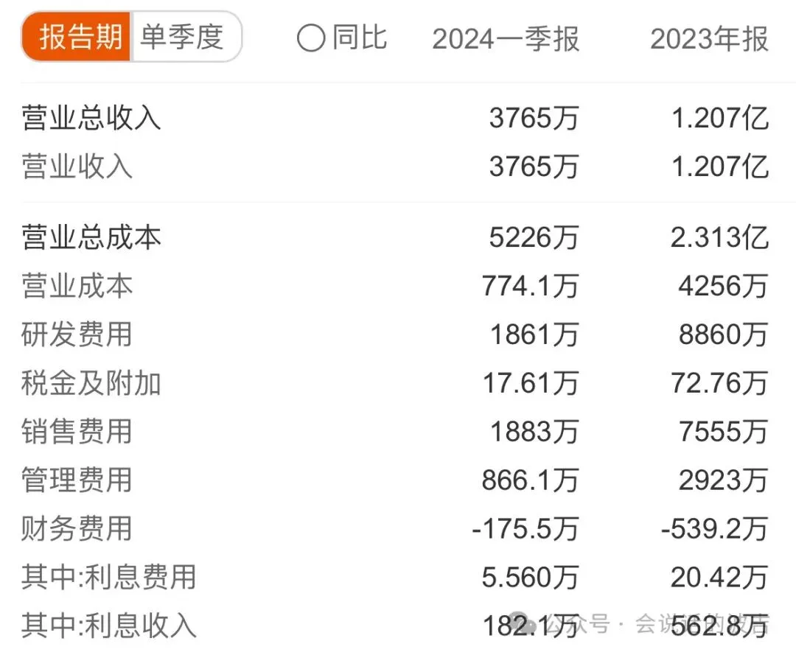
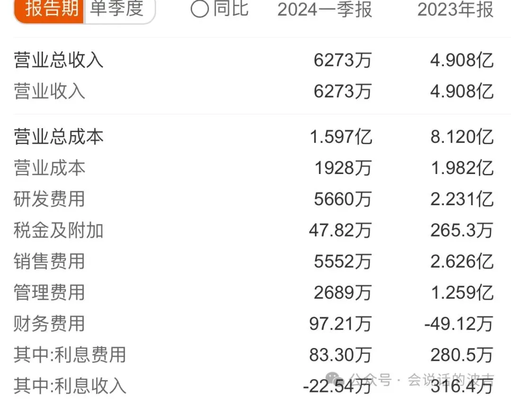

> 原作者：会说话的波吉

众所周知，自从 2023 年下半年开始，持续到 2024 年的现在，虽然整体的经济环境不是很好，但是相比较下，软件这个赛道正在遭受到的寒流可能比其他行业更加寒冷，大家可以从各种探讨 SaaS 不行了，中国市场不适合 SaaS 等等之类的文章或者言论中看得出这种现象。**事实上如果我们把大模型 AI 相关的部分剔除掉，目前中国整个软件行业的其他部分给人的感觉似乎就是死水一摊毫无生气。**

为什么在 2021 年时候风风火火的软件，SaaS 赛道突然间遭遇到了这样一个巨大的寒流？突然一下子不行了？这中间自然有很多市场因素，经济的因素，但是我们也不能忽视一个重要的因素，中国的投资人在其不专业加不负责任的投资策略下才造成了现在的局面。想到了最近看到的一个段子。

**“一般有能力的人是不埋怨大环境的，因为大环境就是他们造就的”**‍‍**用简单 2C 的思维驱动的投资人**

中国近 20 年互联网创业的巨大成功，其实背后有很多的因素，即有中国本身人口红利结合城市化进程带来的人口聚集效应，有互联网基础设施包括移动互联网的蓬勃发展，有中国开始出现 VC 这种资本方式带动新兴企业发展的趋势因素。在这种巨大的势能下，很多投资人在一些 2C 的项目中获得了巨大成功，包括那些从互联网成长起来的互联网公司，这种成功变成了一种固定的思维惯式，把这种思维方式也带入到了面向企业的软件类的投资上面，然而这种互联网思维的投资造成了巨大的恶果。其中恶果之一，就是产能严重过剩，中国 2B 软件本身有一个巨大的问题和很多行业遇到的情况类似，就是产能过剩导致的巨大的价格让利，很多软件价格远比其产生的价值和投入低，导致软件这样一个原本应该是高毛利的产品，反而是低毛利，巨大亏损的形态。为什么会发生这种情况？就是太多公司在 VC 的驱动下，不是想办法把产品做好，反而是以是否有能力拿下客户为第一要务，那自然价格是第一大杀器。中国的甲方们也非常熟悉配合 VC 帮他们支付相应的溢价的模式。然后这种不健康的模式是无法持续的，最终导致中国软件想要走向高端变得异常困难。另有一些相对面向 SMB 的企业软件，则完全不考虑中国市场中小 B 的生命周期，用巨大的销售投入去补贴，最终也是一滩烂泥。所以很多所谓的高阶投资人们，事实上是把大量的钱给了这些企业，让这样一个比烂的游戏可以持续玩下去，导致了劣币驱逐良币，都卷起来了，最关键的问题是如果能在卷得过程中卷出价值，卷出市场地位那肯定是好事。但是，由于企业软件的特殊性，导致很多卷都卷到了补贴甲方做二次开发，甚至基于一些开源软件做二次开发上，或者卷到了销售费用上，最终绝大多数公司没有形成产品竞争力和影响力，才产生了当前的一个窘迫的局面。**有时候开玩笑说，是不是美国人的这些热钱加开源就是用来摧毁中国软件企业和软件生态最好的方式。****只会复刻美国市场的投资人**

与此同时，对于面向企业软件投资的中国投资人来说，他们唯一能够学习匹配的就是美国市场的表现，因为这么多年，其实帮助美国人投资中国的 VC 们，永远给华尔街讲得是一个中国版的美国梦，美国成功的商业模式如何在具有 10 几亿人的中国取得成功的。自然而然，企业软件必然成为一个巨大的商业机会，也容易卖给华尔街。**在这个大前提下，大量的这方面的中国公司获得了投资，虽然他们从本身的本质上跟美国的那个被复制对象根本不是一回事情，无论是市场，产品，逻辑都不一样。**比如在 21 年那一段时间，大量的数据库公司获得了投资，中国有海量的公司号称自己要做中国的 snowflake，然而事实上无论是产品形态和商业模式都和美国的 snowflake 完全不一样。甚至背后大市场环境都完全不同。snowflake 的成功是源于美国整个市场全面的公有云化，且有大量的 middle-size 的公司基于互联网从事他的业务，这些公司有强烈的数据分析的需求，而传统的开源方案根本无法在满足业务的速度上与 snowflake 这样的公司对比。而中国市场则完全不同，因为早年 snowflake 没有出现前，中国这些投资人显然不会去投什么云数仓这种在美国没有成功过的东西，于是乎等他们发现 snowflake 获得巨大成功后，再去找中国的 snowflake，缺完全忽视了市场环境完全不同。snowflake 的势能是伴随着美国互联网企业的发展和云计算高速发展而快速成长的，并且补齐了 AWS 的短板。而在中国，互联网发展过程中，由于缺少这个生态位，在中国互联网公司高速发展的时候，要么选择了基于开源方案搭建了相关的大数据能力，要么就是直接使用云厂商如阿里云提供的大数据能力。在 21 年后的这些才开始研发的数仓公司们，几乎没有任何机会取得足够的生态势能，也只能各自去比拼传统的销售能力，久而久之也只能逐渐变成了传统软件公司。然后更要命的是在如今这种市场环境下，整个蛋糕在变小，然后中国获得投资的数仓公司却超过了 至少 30 家，在这种情况下，又凭什么取得成功呢？把一个本来就很 niche 的市场变得更加拥挤，最终基本上就只能是一地鸡毛。**追求资本回报推动业绩不正常成长的投资人**

恒大已经倒下了，但是许家印给大家留下一个很有趣的演讲就是那个“大大大，好好好”，其实这个背后也反映了一个过去很长一段时间大家对于企业发展的一个很奇怪的看法，就是规模要足够大，加上投资人们希望自己投资的企业能够快速成长，如果市场环境不允许怎么办，没关系，中国有一句话叫做拔苗助长。收入规模是一个财务上的概念，那自然想象空间就很大了，很多公司就是在概念的加持下，在投资人心照不宣的胁迫下，开始了业绩高速发展的道路。于是就造就出了一大批很奇怪的企业，看着收入规模都非常惊人，但是实际上市场上却很难看到他们的客户，这种情况非常多见。当然他们还是需要一些所谓真实的客户去装点门面，遇上就愿意不计代价的情况下拿下所谓的大客户 Logo，只要有合同，用不用也无所谓，比如波吉就听到一个软件创业者亲口说过，最好的软件交付形态是不需要交付。当然这句话懂得都懂，就不展开了。当然发生这种情况从某种程度上投资人也是受害者，他们被骗了，但真相是这样吗？**事实上有些确实被骗了，但有一些就是都已经上船了，沆瀣一气，心照不宣了，反正大部分投资人的钱也不是他们自己的钱，这就是不是蠢，就是坏。**\

我曾经跟一个投资人交流，他明确知道所投企业的问题，但是如果能够在包装下去美国或者香港完成上市，他的任务就完成了，当然出了问题他们自然也是“受害者”，也是需要追究企业的责任的。

某上市软件企业 A：2023 年收入 1.2 亿，成本 2.3 亿‍‍‍‍‍

某上市软件企业 B：收入 4.9 亿，成本 8.1 亿‍

上面是两个个上市软件公司的收入和成本的财务报表，到底是什么高科技可以在具有高毛利的情况下仍然亏这么多钱，是不是很奇怪？当然他们都从市场上融了非常多的现金，可以在市场上“更好”的亏损。

## 时代呼吁真正的投资人

前一阵子我听说中国著名的企业软件投资人已经离开了他的机构，去了一家他曾经投过的企业去当销售了。据说他投资的无数企业，现在大部分也都状况不佳。在时代没有红利的时候，才知道潮水退了，到底是谁在裸泳。然后真的中国的企业软件就没有任何机会了吗？就没有发展空间了吗？有投资人告诉他的被投企业，此时此刻不要下牌桌，那么真正让一个企业不下牌桌的核心因素是什么？不是今天大部分陷入恐慌症，正在为自己历史付出巨大代价的投资人的那些慌不择路的奇奇怪怪的要求，而是**更应该让一个企业回到初衷回到原点，做好产品，做好服务，思考自己的市场定位和产业上的生态位，扎扎实实，熬死那些被投资人们吹起来的泡泡们**。当然企业发展肯定也是需要进一步的资金支持，如果能在这个混乱的时代，找到对的标的的投资人，现在才是展现真正实力的时候。

---

发布版本：[微信公众号转载页](https://mp.weixin.qq.com/s/-OiyWHMZCq572-vBHky22A)
