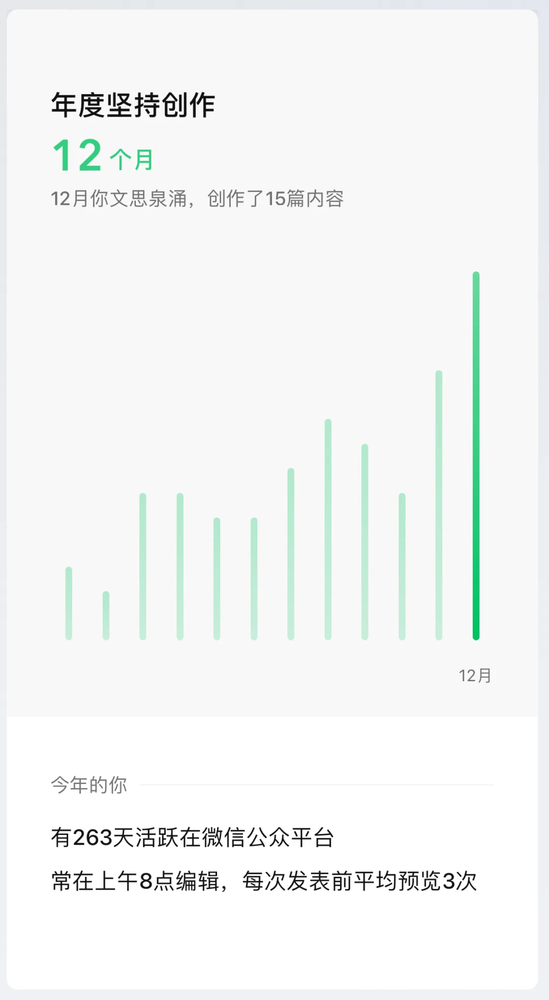
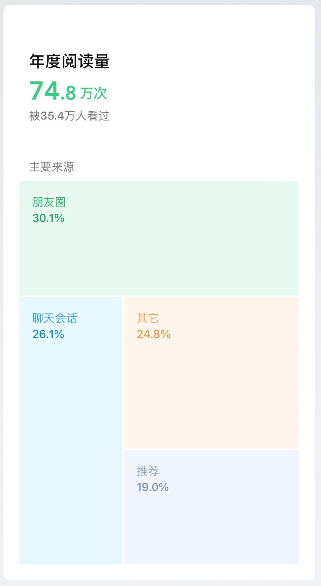
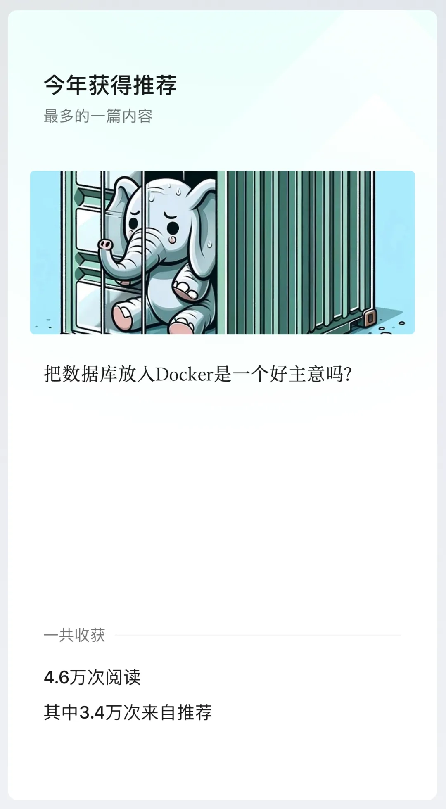
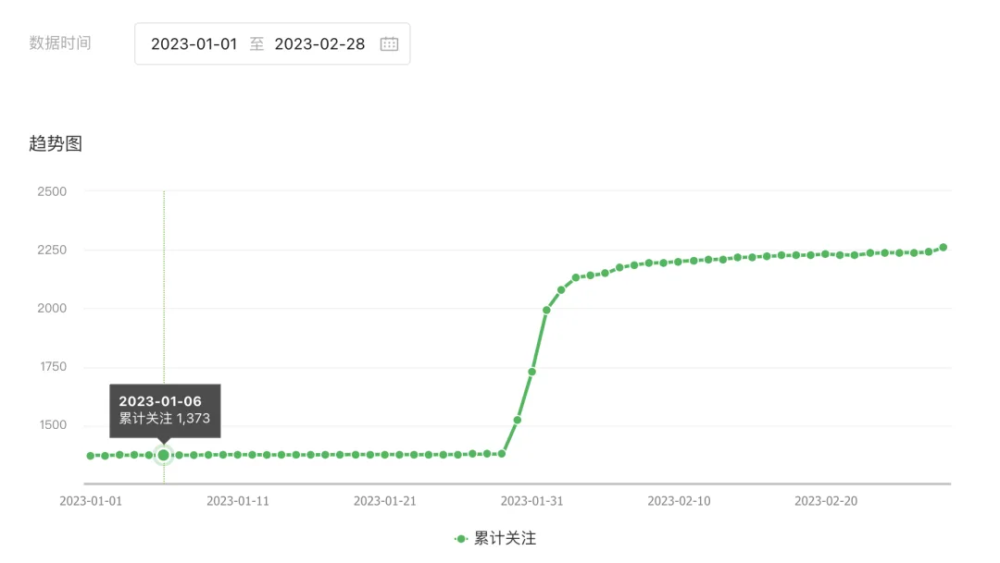
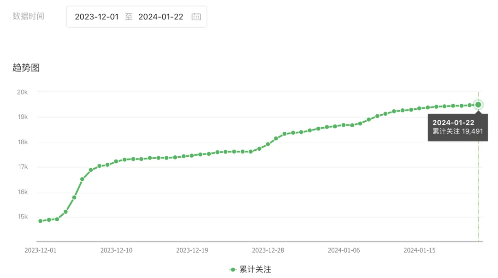

最近收到了微信公众号的《2023 年公众号创作回顾》，挺有意思。我打算把这份数据公开分享出来，也算是本号的年度总结，也顺便分享一些公众号运营心得。

关键数据：原创文章 69 篇，32 万字，总阅读量 75 万，读者 35 万，4 万次分享，关注数 1.8 万，常读用户 6064，留言数量 1538，赞赏人数 132。2023 用户增长 12 倍，总赞赏收入 2428¥。

关注并星标⭐️《[非法加冯](http://mp.weixin.qq.com/s?__biz=MzU5ODAyNTM5Ng==&mid=2247486611&idx=1&sn=658ded908f5e8a24d01a7ccc87df5bbc&chksm=fe4b3948c93cb05ee0023eba7687ce91018a3971304229c983eeb22bc52e13128ebce73421a9&scene=21#wechat_redirect)》，老司机带逛[云计算](/cloud/debris/)与数据库。

---

过去一年里写了 83 篇文章，其中原创 69 篇，约 32 万字。

在数量上，32 万字基本上够出两本书了，内容基本都是关于云计算、数据库、以及 PostgreSQL 与 Pigsty 的文章。其中，《[云计算泥石流](/cloud/debris/)》与《[数据库老司机](http://mp.weixin.qq.com/s?__biz=MzU5ODAyNTM5Ng==&mid=2247486611&idx=1&sn=658ded908f5e8a24d01a7ccc87df5bbc&chksm=fe4b3948c93cb05ee0023eba7687ce91018a3971304229c983eeb22bc52e13128ebce73421a9&scene=21#wechat_redirect)》是今年新开的两个系列，重点关注“下云”，以及自建 PG RDS 这两个主题。

在数量上，32 万字基本上够出两本书了，内容基本都是关于云计算、数据库、以及 PostgreSQL 与 Pigsty 的文章。其中，《[云计算泥石流](/cloud/debris/)》与《[数据库老司机](http://mp.weixin.qq.com/s?__biz=MzU5ODAyNTM5Ng==&mid=2247486611&idx=1&sn=658ded908f5e8a24d01a7ccc87df5bbc&chksm=fe4b3948c93cb05ee0023eba7687ce91018a3971304229c983eeb22bc52e13128ebce73421a9&scene=21#wechat_redirect)》是今年新开的两个系列，重点关注“下云”，以及自建 PG RDS 这两个主题。

今年全部 12 个月都有文章产出，其中 11 月和 12 月最为高产，有本号第一篇 10w+ 的[阿里云故障复盘](/cloud/aliyun/)。以及几篇几万阅读的。

我一般选择提前一天写好，预约在早上 8:20 分发布。因为这个时间点很多读者都在上班/地铁路上，正好没事可以刷刷公众号文章。另外还有个原因是有个著名的梗 —— “大概 8 点 20 分发”。

年阅读量约 75 万，读者 35 万今年全部 12 个月都有文章产出，其中 11 月和 12 月最为高产，有本号第一篇 10w+ 的[阿里云故障复盘](/cloud/aliyun/)。以及几篇几万阅读的。

从阅读来源看，大部分是来自阅读后转发到朋友圈/微信群里的。直接从订阅号进来的读者并不多，落在“其他”里面。因为公众号改版之后，变成 Feed 流推荐的方式，所以推荐的权重变高了。

写了不少文章之后，我发现一个有趣的规律。纯技术类，特别是有关 PostgreSQL 的文章，阅读量一般在 1000～3000 左右。我问过几个也在公众号里写 PostgreSQL 技术文章的朋友，基本上这类技术干货的阅读量上限也都在 1000 ～ 3000 左右。因此我们推测国内和 PostgreSQL 有关的技术人员差不多就是这个数量级。

更为宽泛的技术讨论文章，阅读量一般在 1～3 万左右。能超过这个量级的，基本上都是技术圈的时事热点。但我也不是专门写公众号的，所以很多热点，我也有些想法，不过没时间去蹭，还是有点可惜哈哈。

关于粉丝的数量，从年初的 1373 增长到年末的 18359，翻了十倍，增长了 **1237%**。其中有 1/3 是常读用户，还有 76 人是铁粉和亲友。69 篇原创文章，平均每篇涨粉 250 个左右。

现在（2024-01-23）的关注数量是 19503，估计过年前涨到两万不成问题，总体来说还是很让人开心的。

今年有过打赏的朋友有 132 人，全歼总计 2428.88 ¥，人均 18 块钱。虽然不多，但读者的心意是沉甸甸的～。

最后是互动与评论，四万次分享，与 1538 条留言，还是很活跃的。俺这个号注册的比较早，有个评论区功能，有时候一些评论里也会有很有意思的内容。

---

## 写公众号的动机

经常有朋友问我说写公众号能赚钱吗 —— 哈哈，根据去年的打赏数据 ¥2428.88，广告收入累计也是 2443.85¥，加起来总共 5000 块钱不到。公众号平均每天十几块钱，在北京够买油条、馒头和榨菜了。虽然有一些找我写软文发广告的，不过我现在基本懒得接。—— **写公众号主要还是为了输出自己的**愿景**、**理念**与**观点**。**

以前，我是一个喜欢踏实搞技术的工程师；今年，我又多了一个写文章的新爱好。因为我觉得技术即使做的再好再牛逼，如果讲不出来推不出去，那也是白瞎。所以我也开始写一些文章，一年来反响还不错：主要是两个新的系列 《**数据库老司机**》与《**云计算泥石流**》。

《[数据库老司机](/db/rethink/)》系列聚焦在我自己的首要专业领域上，并尝试为 DB 技术圈设置**议程**：[云是在白嫖开源吗](/cloud/paradigm/)？[RDS 能让 DBA 失业吗](/cloud/no-dba-bullshit/)？[分布式数据库是不是伪需求](/db/distributive-bullshit/)？[PG vs MySQL 哪家强](/db/bad-mysql/)？[国产数据库真卡脖子吗](/db/db-choke/)？[向量数据库能不能打](/db/svdb-is-dead/)？[数据库该不该放入容器](/db/pg-in-docker/)？[数据库该不该上 K8S](/db/db-in-k8s/)？有几个主题还搞了直播**辩经**，效果相当炸裂。数据库领域其实有许多陈词滥调、刻板印象、过时教条、皇帝的新衣。自己创业的一个好处就是，有着充分的自由进行表达。不讲假话，不讲废话，相信常识的力量，讲出自己的故事，你会发现许许多多的用户都有着一样的共鸣，这是很有乐趣的一件事。

《[云计算泥石流](/cloud/debris/)》则是用数据剖析解构了公有云的方方面面：各项基础云服务的[成本与价值](/cloud/odyssey/)，[SLA 承诺](/cloud/sla/)，[商业模式](/cloud/ebs/)，[利润率](/cloud/profit/)，[大故障复盘](/cloud/aliyun/)，[未来的发展](/cloud/finops/)。有不少用户受此鼓舞，迈出了独立自主运营的第一步，并向我分享他们的激动与喜悦。比起数据库主业而言，倡导下云/自建的理念更像是一种**娱乐**与**冒险** —— 而我很高兴能看到理念的力量转变为一些现实的影响：

 *“不要弄些小打小闹的计划，它没有激发人们热血的魔力，本身也可能无法实现。要绘制宏伟蓝图，志存高远，并竭尽所能”。*

以上就是我分享的内容。2023 年的具体文章内容，请参阅《[非法加冯文章导航](http://mp.weixin.qq.com/s?__biz=MzU5ODAyNTM5Ng==&mid=2247486611&idx=1&sn=658ded908f5e8a24d01a7ccc87df5bbc&chksm=fe4b3948c93cb05ee0023eba7687ce91018a3971304229c983eeb22bc52e13128ebce73421a9&scene=21#wechat_redirect)》与《[云计算泥石流](/cloud/debris/)》。\

---

发布版本：[微信公众号](https://mp.weixin.qq.com/s/HPJ4eLZLYkDvga2LN6ZiKQ)
