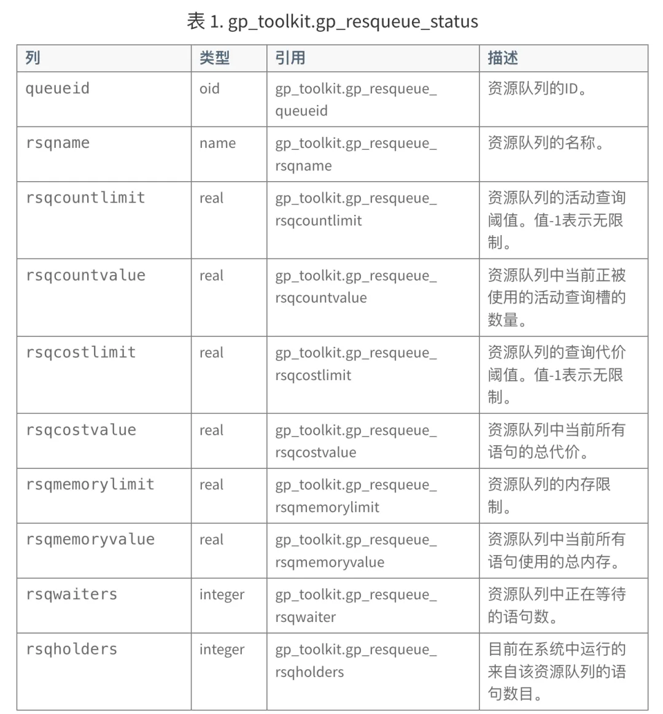

> 原作者：熊灿灿

## 前言

这两天，被一个和技术完全搭不上边的事情给整得直抠脑壳，最后发现，居然是 License 在作祟！实在忍不住，必须吐槽一番，且听笔者慢慢道来。

## 来龙去脉

这两天，笔者一直在折腾一个 GP 数据库。起初是客户找到我说，将数据库节点所在服务器内存缩容了之后，提示数据库连接过多。报错其实很简单：

> psql：error：FATAL：too many connections for database xxx.

**即使是一名外行，我想光看这个报错也都知道是连接数太多了，问问度娘，很不难解决，更不用说老油条了，那么杀一下连接或者调整一下 max_connections 就成。**于是，哐哐一阵操作，结果客户反馈还是一直有连接数过多的问题。

这下，我意识到可能问题并不简单，于是按照 PostgreSQL 的老套路：

1. 排查是否有数据库层面的连接限制：pg_database.datconnlimit
2. 排查用户层面是否有连接限制：pg_user/pg_role.rolconnlimit
3. 排查最大连接数：max_connections
4. 排查超级用户保留连接数：superuser_reserved_connections
5. 检查当前数据库中有多少连接数：select count(\*),datname from pg_stat_activity group by 2；
6. ...

一阵排查，发现要么没有进行限制，要么连接数很大 (max_connections = 500)，通过排查 Master 的连接数情况，**寥寥几个**，当然也特意去 Segment 上看了一下，也没有，到这就给我整懵逼了。回想用户昨天貌似还新建了两个资源队列，库内当前也使用的资源对列，于是乎，又去排查资源队列是不是哪里给限制了？

显然，也没有针对连接数的限制，仅有活跃会话的。在历经 N 次重启之后，依旧不得解，重启大法也不好使了，然后我又去搜 Greenplum 的 BUG list，寄希望于是已知 BUG，当然也无功而返，难道又莫非是内存缩容操作导致 GP 出幺蛾子了？当然也都无从得知。最后无奈只能找到研发进行求助，研发同事上来一阵 Debug，print、continue、step (没有 set 变量啥的操作)，也分析不出个所以然来

       * checking for other PGPROCs.  If two backends did this at about the
       * same time, they might both think they were over the limit, while
       * ideally one should succeed and one fail.  Getting that to work
       * exactly seems more trouble than it is worth, however; instead we
       * just document that the connection limit is approximate.
       *
       * We do not want to do this for QEs since a single QD might initialise
       * many connections to each segment to execute a non-trivial plan and
       * the db connection limit does not map, semantically, to that idea.
       */
      if (Gp_role == GP_ROLE_DISPATCH && dbform->datconnlimit >= 0 &&
       !am_superuser &&
       CountDBConnections(MyDatabaseId) > dbform->datconnlimit)
       ereport(FATAL,
         (errcode(ERRCODE_TOO_MANY_CONNECTIONS),
          errmsg("too many connections for database \"%s\"",
           name)));
     }

各位也可以看到，其实代码逻辑很简单：

- `Gp_role == GP_ROLE_DISPATCH`：检查当前角色是否为 QD
- `dbform->datconnlimit >= 0`：确认数据库的连接限制是一个非负值，表示连接限制有效。
- `!am_superuser`：检查当前用户是否不是超级用户。超级用户不受连接限制的约束。
- `CountDBConnections(MyDatabaseId) > dbform->datconnlimit`：计算当前数据库的连接数，如果超过了预设的连接限制，则条件为真。

**前面也都排查过了。**就在我们一筹莫展的时候，这个时候，**突然莫名其妙又好了！**真是离谱他妈给离谱开门，于是问了一下有做什么操作吗？客户说：

> 我刚才看，替换了他们的 License。

至此，真相大白，是的，又被 License 给"卡脖子"了，这个数据库其实也就是开源的 GP，select version() 网上一搜还能看到是 21 年 release 的。**我很确认，数据库日志里是没有任何提示的，因为为了排查问题，我把日志前前后后翻了好几遍，只有清一色的 too many connections 报错，操作过程中也没有任何提示。并且更为离谱的是，这个 License 距离到期还有十多天，还没到期便给你上强度了，零零散散撑死十多个连接，那真到期了会如何？嗯，宕机可能是基操。**

## 后话

商业数据库使用 License 去限制功能项，这是很正常的事情，无可厚非，但是至少要给出一个明确的提示，比如快到期了，快到期了又会有什么限制等等，像笔者碰到的这一奇葩经历，搞得这一天半我都在怀疑是不是我的技术功力不到家？一个连接数问题都搞不定。关于 License 的各种奇葩问题，和朋友私下里讨论了下，五花八门，比如通过 License 让你用不了特定功能，比如 FDW (开源 PG 那自然是允许你用的)，还有下面这种：

行吧，我用开源的 PG 和 GP 应该是没有这种问题的，洗洗睡吧。另外，肯定很多读者关心这是哪一家国产数据库，各位就不用多问了，写出来也只是有感而发，不吐不快，就称作为 A 国产数据库吧。

---

## 数据库老司机

---

发布版本：[微信公众号转载页](https://mp.weixin.qq.com/s/YPPocoSXhcz1DvtknCKdXA)
