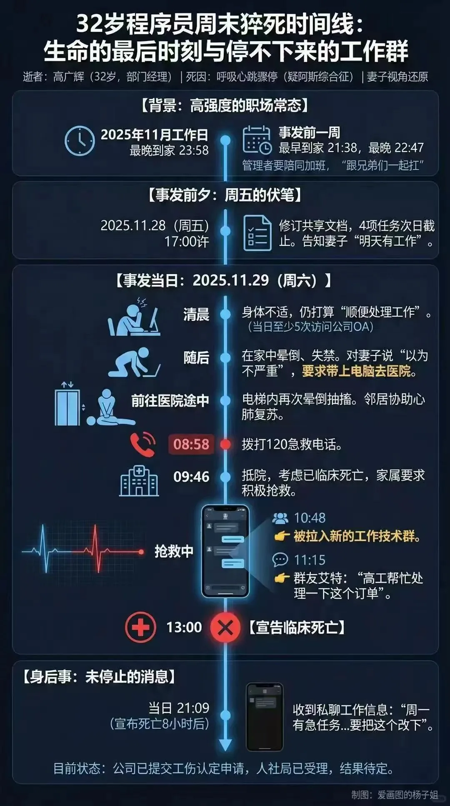
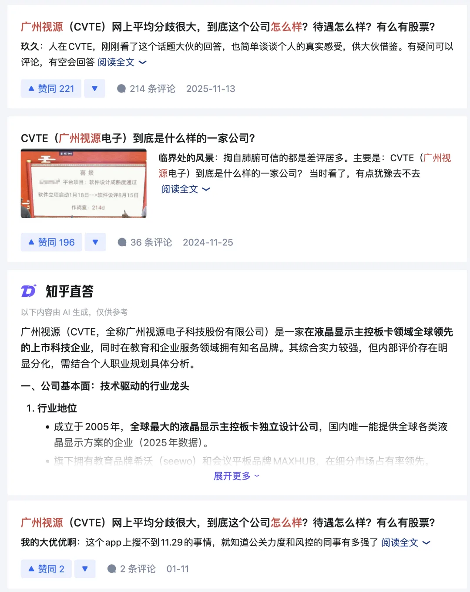

2025 年 11 月 29 日，周六早晨，广州。

8:58，120 接到电话。9:14，急救到场。9:46，转送医院，记录写“考虑已临床死亡，家属要求积极抢救”。13:00，宣告临床死亡。

网络公开流传时间线图\

他 32 岁。2024 年 6 月体检心电图“正常”。

但真正把人捅穿的，不是“猝死”，是**猝死也无法让工作停一下**。

10:48，还在抢救中，他被拉进技术群。11:15，有人 @他：“高工帮忙处理一下这个订单。” 21:09，又一条：“周一一早有急任务……要把这个改下。”

流程像一台机器：一个人停机，传送带不停。

病历“既往史”里写的不是高血压，不是心脏病，而是：程序员，工作强度大，经常熬夜。

他妻子说，她习惯晚上九点多看定位，发现还在公司就微信“唤他回家”；后来他躺在太平间，“无论我怎么唤你，你都不会回应我了”。

很多人喜欢把怒火砸向某个同事：“你怎么还 @他？”

问题不是某个坏人，是一套逻辑：软件开发不是堆人头能提速的。

《人月神话》四十年前就讲过：关键模块、关键客户、关键交付，总会落在“那几个懂的人”身上。一个母亲生孩子要十个月，你不能找十个母亲在一个月里生出来十个孩子 —— 新人来了上手要时间，沟通要成本，反而更慢。于是公司最省钱的提速方式就是四个字：**压榨现有团队**。

压到什么时候？压到你不响为止。他不响了，群还响。

---

这不是个案。这是一种文化的标准配置：**不把人当人**。

老冯在阿里见过“卷”的样子：凌晨灯火通明的大楼，那还算“体面”——至少钱给够。更离谱的是中小厂：工资更低，加班更狠，连“体面”都省了，只剩消耗。

我也在苹果见过“把人当人”的样子：提早下班是常态，周末不回消息太正常了；你下班还坐在电脑前，领导同事给你的不是表扬，是白眼——“你怎么还不走，别在这儿瞎卷”。

被当过人之后，就再也回不去了。

---

有人说：那 AI 呢？AI 会不会让程序员轻松点？

逻辑上应该会。工具更强，效率更高。但现实更冷：效率红利不归个人。

你用 AI 把三一周的活一天干完，老板不会说“辛苦了回家”，老板会说“不错啊，明天再接三个”。今天最好的表现，是明天最低的要求。所谓“提效”，在很多公司只是更快地把你填满。

所以推 AI 推不动，不是技术问题，是激励问题：你用 AI 提效——好处是公司的；你显得不忙——坏处是自己的。那员工最理性的选择是什么？不是拥抱 AI，而是**假装很忙**。这不是道德问题，这是求生。

这就是大公司病，大家坐在列车上一起摇晃身体，假装在前进。

---

老冯最满意的一段工作经历在探探，瑞典创始团队，北欧工作风格：轻流程、重生活、把人当人。在那段期间，我做了一个开源的 PostgreSQL 发行版 Pigsty —— 把日常运维的工作自动化了 90% 以上，让我每天可以有大把时间喝茶看报。但我敢这么做，是因为我知道老板不会因为看我闲着，就把我开掉。

要是换成在阿里，我敢吗？我是绝对不敢干这种给自己挖坟的事的。

你想想，你把自己的活自动化了，第一个反应是什么？是兴高采烈地告诉老板"我效率提高了十倍"吗？不是。因为你知道，一旦让老板发现你"闲"了，要么给你加活，要么觉得你这个岗位不需要这么多人了。

这就是为什么很多公司推 AI 推不动的原因 —— 在这个分配结构下，员工没有动力。你用 AI 提高效率，好处是公司的，坏处是自己的，那我为什么要用？

这样的分配结构不改变，随着 AI 替代席卷行业，这样的事情会越来越多。

---

未来科技会让人更长寿，健康会成为真正的复利资产。

你活的越久，你活的就更久。

但前提是——你得活着。32 岁把命透支没了，什么 AI、什么医学进步、什么长寿红利，都跟你没关系。

网上那句话说得狠：**“项目上线了，人没了，赢的是谁？”**

项目会继续上线，产品会继续迭代，群会继续 @人。只是世界少了一个 32 岁的年轻人，他的妻子再也等不到那个回家的定位。

如果你正在加班读到这里，关掉手机回家吧。

工作永远做不完。命只有一条。

---

发布版本：[微信公众号](https://mp.weixin.qq.com/s/Q4ukcSaiIzvGLIw1mbz2kg)
