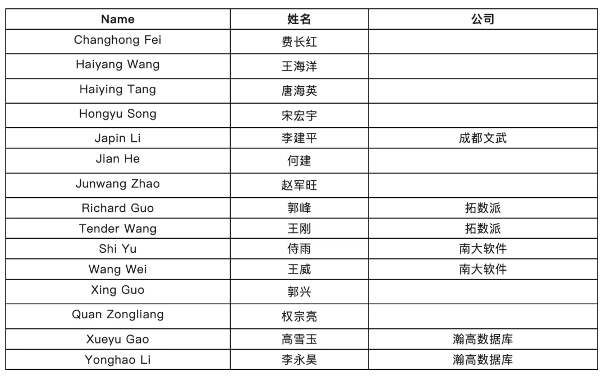
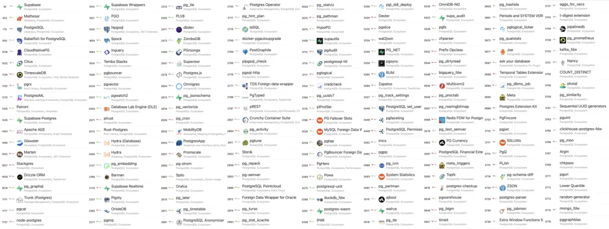
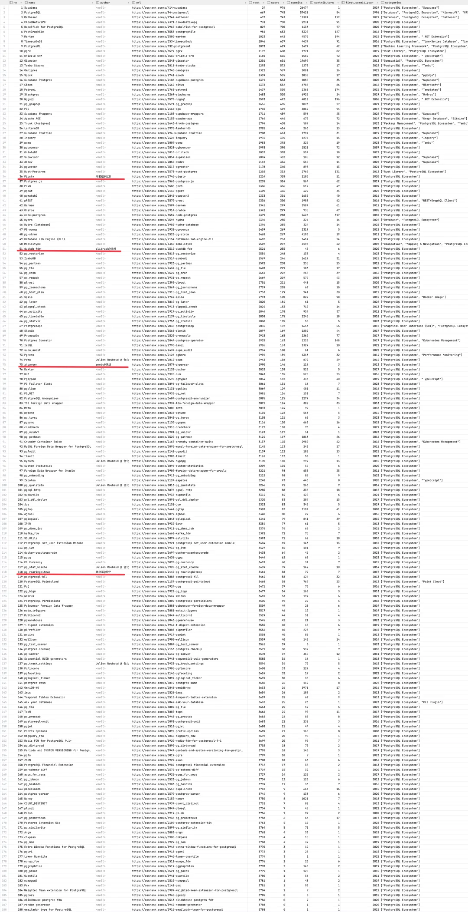
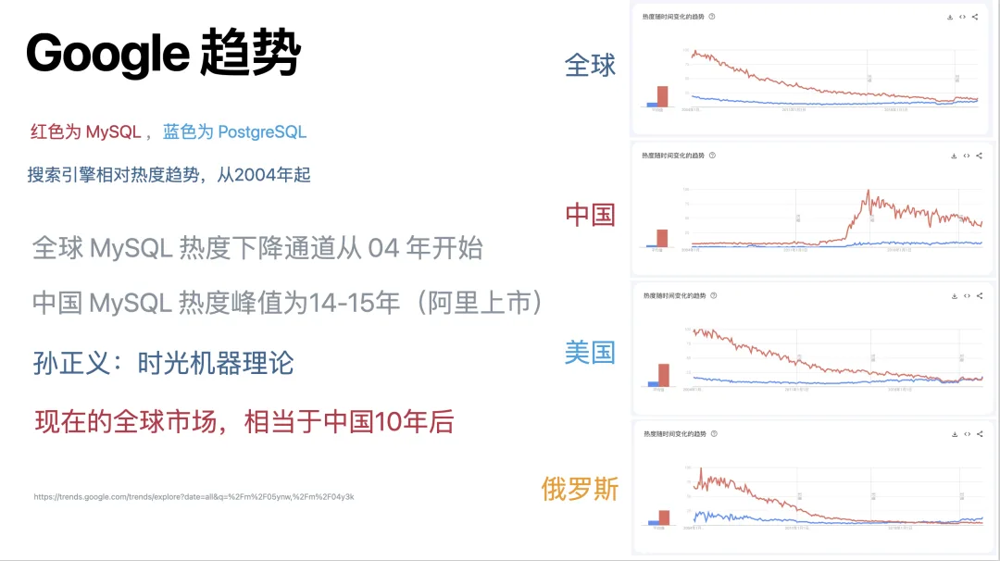
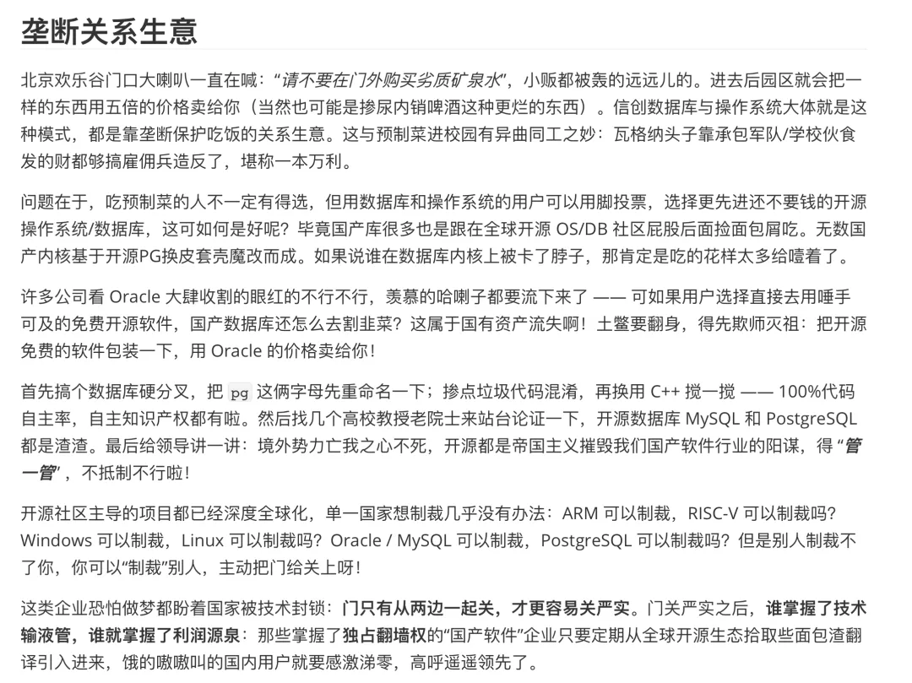

## 飞总今天发了一篇《[**2023 年，中国对 PostgreSQL 的贡献≈0！！！**](https://mp.weixin.qq.com/s?__biz=MzI5OTM3MjMyNA==&mid=2247497341&idx=1&sn=7df1e74b9bba5af00577c422f8a411c5&scene=21#wechat_redirect "2023年，中国对PostgreSQL的贡献≈0！！！")》，振聋发聩。所以我特意去扫了一遍 PostgreSQL 生态的开源项目，看一看这里中国人或者中国公司作为主导者，或主要贡献者的到底有多少。\

## 内核贡献者

不幸地是，在内核贡献上也许让飞总言中了 —— 对于 PostgreSQL 这样堪称[**全世界最成功**](/pg/pg-is-no1/)的开源项目之一：*“**没有什么中国的公司，中国人，在里面扮演了重要的角色**“* —— 别说 PostgreSQL **核心组**（Core Team）了，就连一个**主要贡献者**（Major Contributor）都没有。当然可以出于政治正确的原因，把来自中国台湾的主要贡献者 **Julien Rouhaud** 算进去 —— 但这就有点自欺欺人了。

## [**PostgreSQL 全球贡献者名单**](https://mp.weixin.qq.com/s?__biz=Mzg4ODU2OTgxMQ==&mid=2247492354&idx=1&sn=49180e31e80f80092c6dd940fc318828&scene=21#wechat_redirect)

次要贡献者中，并非没有来自中国的身影。比如《[**PostgreSQL 国际社区授予 PG 16 版本贡献者荣誉奖章**](https://mp.weixin.qq.com/s?__biz=MzkwOTE3MjE3NA==&mid=2247511779&idx=1&sn=63effe370cf16893b1bbb6f02bef9dd3&scene=21#wechat_redirect "PostgreSQL国际社区授予PG 16版本贡献者荣誉奖章")》里就有 15 位中国人的身影。我们也经常能看到 Pivotal 系，阿里，瀚高，成都文武等几个公司的人出现在其中作出自己的贡献。

从 PostgreSQL 社区的观点来看  —— 如核心组成员 Jonathan Katz 的《[**展望 PostgreSQL 的 2024**](/pg/pg-in-2024/)》，PostgreSQL 社区不仅仅关乎数据库内核代码仓库，而关乎整个社区的方方面面 —— 包括**相关的开源项目**、**活动和社区发展**。那么在这方面中国又做的怎么样呢？

## 生态开源项目

OSSRank 是一个收录开源项目的网站，其中收录了 188 个 PostgreSQL 生态开源项目。我依次扫过了这 188 个项目的贡献者名单，看看有没有中国公司/中国人主导的。标准很简单：贡献者前五名，或者只要至少有十几条贡献的，名字疑似中文或难以确定的贡献者，我就点进去看。

### <https://web.archive.org/web/2/https://ossrank.com/cat/368-postgresql-extension>

可惜的是，在这个榜单上的 PG 生态开源项目中，只有四个项目满足这一标准，分别是：

36 名 **Pigsty**：冯若航 @北京

51 名 **duckdb_fdw**：alitrack@杭州

75 名 **zhparser**：amutu@深圳

118 名 **pg_roaringbitmap**：陈华军 @苏宁

这几个项目我都很熟悉，[**Pigsty**](/pigsty/better-rds-alternative/) 就是我自己写的，提供开源 PG 发行版与本地 RDS。`duckdb_fdw` 提供对 duckdb 的外部数据源包装器。`zhparser` 提供中文分词能力，`pg_roaringbitmap` 提供 RoaringBitmap 压缩位图数据类型，这俩扩展还是我自己编译打包发行，[**收录在 Pigsty 扩展包**](/pigsty/db-allrounder/)里的。

当然，你还是可以把台北的 PG 主要贡献者 Julien Rouhaud 算进来。那么又多了五个项目：Powa，HypoPG，pg_qualstats，pg_stat_kcache，pg_track_settings，只不过还是那句话：自欺欺人罢了。

## 活动与社区发展

那么 PostgreSQL 的社区建设与活动又如何呢？相比国际同行，PostgreSQL 在中国的使用率是严重偏低的。例如在 2023 年全球开发者调研中，PostgreSQL 已经超越 MySQL 成为[**最流行的数据库**](/pg/pg-is-no1/)了（ 45.6% vs 41.1%，专业开发者中更是达到 **49.1%**）。但是在中国，MySQL 的用户群/实例数/流行度约是 PostgreSQL 的五倍，与全球水平严重脱节，说一句社区失职并不为过。

中国确实有不少关于 PostgreSQL 的活动，比如每年的 PostgreSQL 中国技术大会，各种沙龙与城市巡讲。不过很多活动都沦为厂商推销产品的展销会，纯技术或者管理最佳实践越来越少，这一点也是很让人扼腕。

当然，这些现象也可能跟中国搞**信创安可自主可控**有关。近三百多款“国产数据库”，有百分之三四十是基于 PostgreSQL 换皮、套壳、魔改的。中国基于开源产品 “研发” 了那么多的数据库，而绝大多数却没有对开源社区有任何方式上的回馈 —— 反而经常出现分裂社区，劣币驱逐良币的情况。

如果这些是[**真的自主可控**](/db/sovereign-dbos/)，[**解决卡脖子问题**](/db/db-choke/)也就算了。然而问题在于，和真正吃了制裁的俄罗斯一比 —— 人家就是开源的 PostgreSQL 自主替代吃遍天，哪有这种乱象呢？

再这么大炼数据库搞下去，恐怕美国不制裁，中国自己就脱离开源社区球籍 —— 断了技术输液管，开心的只能是垄断关系户，而受损的是用户和国家了。

---

发布版本：[微信公众号](https://mp.weixin.qq.com/s/79_PnX-a5iSfDMgz_VUx5A)
