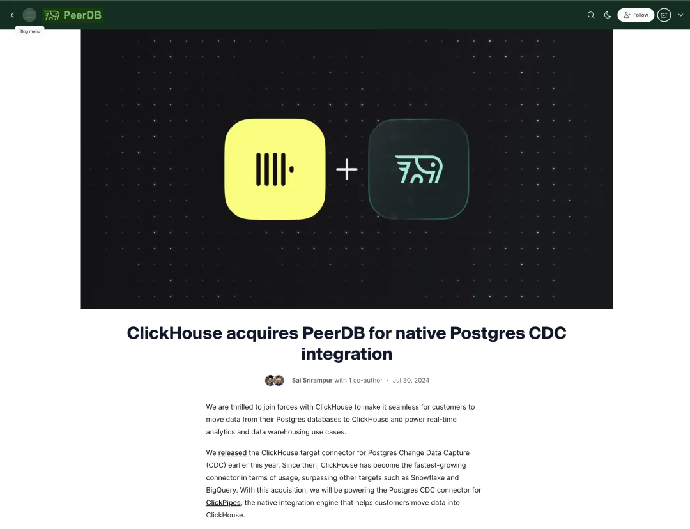
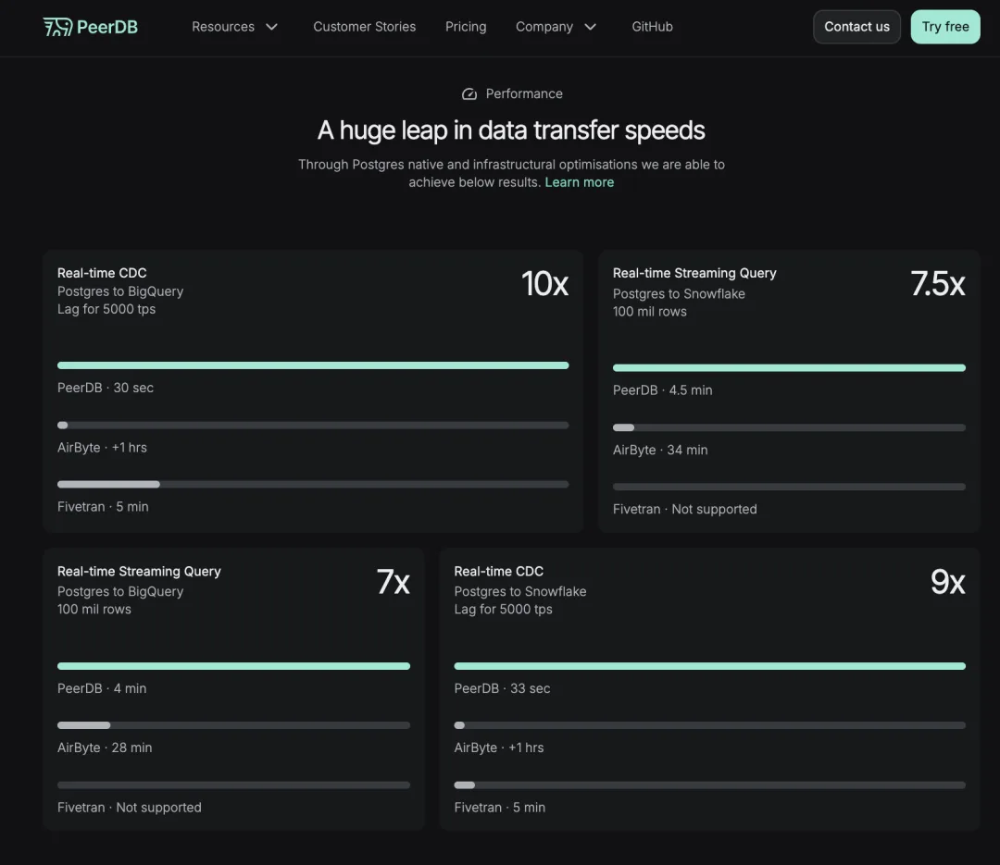
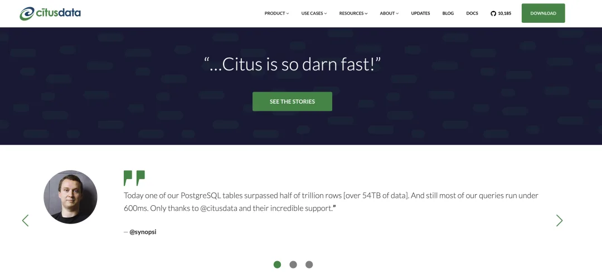

ClickHouse[1] 是一家开源实时分析数据库初创公司，2021 年从 Yandex 分拆出来。周二，该公司宣布收购 PeerDB，这是一家专注于高性价比 Postgres 复制和变更数据捕获的公司。

自成立以来，甚至在作为 Yandex 支持的开源项目期间，ClickHouse 就已经凭借其大型企业实时数据仓库的优势建立了良好声誉。其客户包括德意志银行、eBay、Fastly、GitLab、HubSpot、微软、ServiceNow 和 Spotify。虽然 ClickHouse 早已提供了一个 Postgres 连接器，帮助企业将数据从流行的关系数据库迁移到其分析数据库，但 PeerDB 提供了高达 10 倍的速度提升，并且拥有 ClickHouse 之前未具备的一些专业功能。

“我们最初通过构建一个专注于 Postgres 的数据传输 ETL 工具[2]开启了旅程。我们从这一小众市场起步，提供世界上最好的方式将数据从 Postgres 复制到数据仓库。……大约六个月前，我们发布了 ClickHouse 连接器，自那以后，它一直在快速增长，现在已经成为增长最快的连接器，超越了 Snowflake 和 BigQuery 等其他数据仓库。”PeerDB 联合创始人兼 CEO Sai Srirampur[3] 说道。在创立 PeerDB 之前，Srirampur 曾在微软收购 Citus Data[4] 后，参与 Azure 的 PostgreSQL 服务工作。

Srirampur 表示，他一直希望 PeerDB 专注于“**质量胜于数量**”，因此团队专注于为 Postgres 构建一个专业的 ETL 工具。这不仅包括从 Postgres 数据库到 ClickHouse 等数据仓库的初始数据加载（可能达到数 TB），更重要的是变更数据捕获系统，确保原始数据库和数据仓库保持同步。

事实证明，对于大多数 PeerDB 的客户来说，Postgres 是其数据仓库的主要数据源。虽然这不令人意外，但显然 ClickHouse 也看到了这个工具的巨大市场潜力。

“***我们常常看到客户使用 Postgres 作为面向客户应用程序的事务性后端，然后将数据移至 ClickHouse 进行分析***——这是一个非常普遍的模式，很多客户都在使用，”ClickHouse 联合创始人 Yury Izrailevsky[5] 说道。“当然，Postgres 是一项非常复杂的技术。它功能强大，但对于变更数据捕获等用例，确实需要深厚的知识。”

未来，PeerDB 团队将致力于为更多数据源实现变更数据捕获。现有的商业客户将能够使用 PeerDB Cloud 服务至 2025 年 7 月 24 日。

PeerDB 现有的开源组件将继续保持开源，许可证不会发生任何变化。ClickHouse 还将开源 PeerDB 企业版的生产级 Helm chart。

两家公司没有披露收购价格，但值得注意的是，PeerDB 在 2023 年底完成了 360 万美元的种子轮融资，由 8VC 领投。

“我认为我们达成了一个公平的价格，适当奖励并认可了 PeerDB 团队所做的工作，对团队和投资者都很公平，”Izrailevsky 表示。“同时，考虑到其潜力，我认为这对我们来说仍是一个非常好的机会。”

原文地址：Real-time database startup ClickHouse acquires PeerDB to expand its Postgres support[6]，Frederic Lardinois，2024-07-30

## References

- `[1]` ClickHouse: <https://clickhouse.com/>
- `[2]` ETL 工具： <https://en.wikipedia.org/wiki/Extract,_transform,_load#:~:text=In%20computing%2C%20extract%2C%20transform%2C,to%20one%20or%20more%20destinations>
- `[3]` Sai Srirampur: <https://www.linkedin.com/in/sai-krishna-srirampur-1741b019/>
- `[4]` Citus Data: <https://techcrunch.com/2019/01/24/microsoft-acquires-citus-data/#:~:text=Unsurprisingly%2C%20Microsoft%20plans%20to%20work,as%20part%20of%20Microsoft%2C%20we>
- `[5]` Yury Izrailevsky: <https://www.linkedin.com/in/yuryizrailevsky/>
- `[6]` Real-time database startup ClickHouse acquires PeerDB to expand its Postgres support: <https://techcrunch.com/2024/07/30/real-time-database-startup-clickhouse-acquires-peerdb-to-expand-its-postgres-support/>

## 数据库老司机

### 欢迎微信搜索 pigsty-cc 加入 PGSQL 交流群

---

发布版本：[微信公众号](https://mp.weixin.qq.com/s/3RuZ7ite_exxh2XOPB3HCA)
