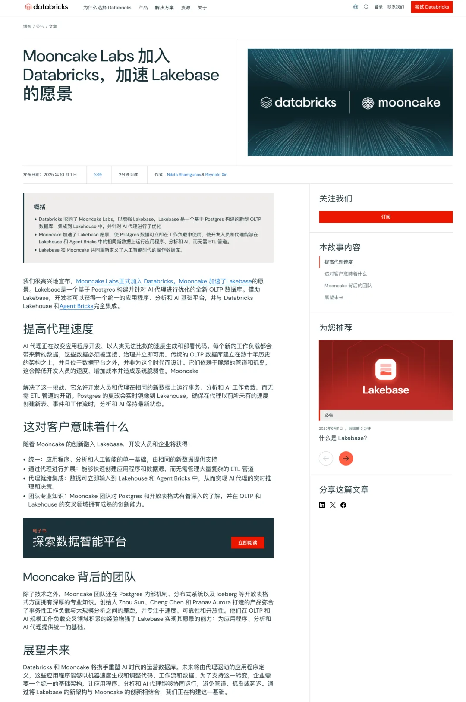
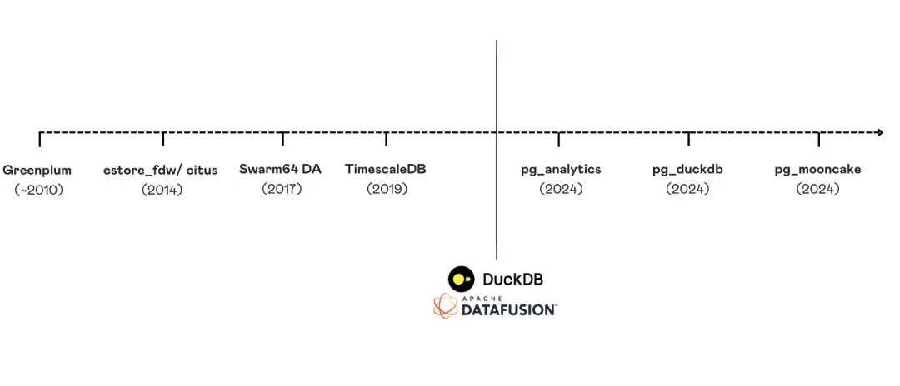
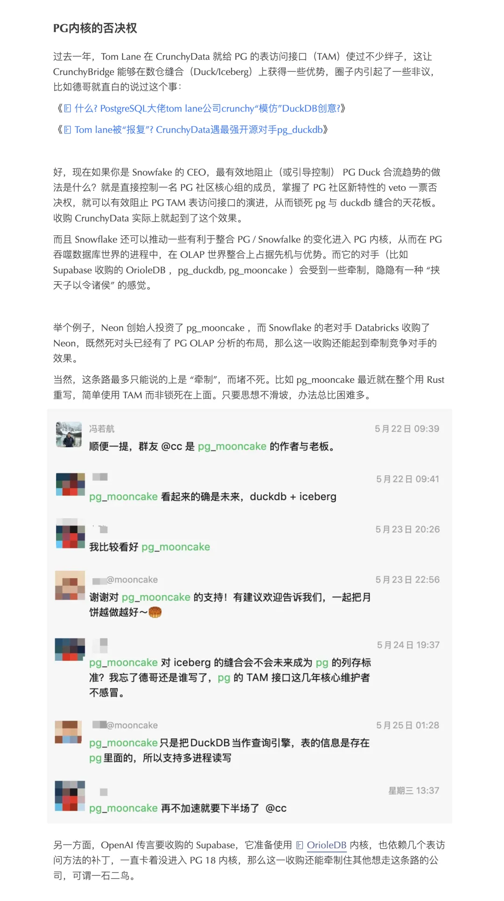
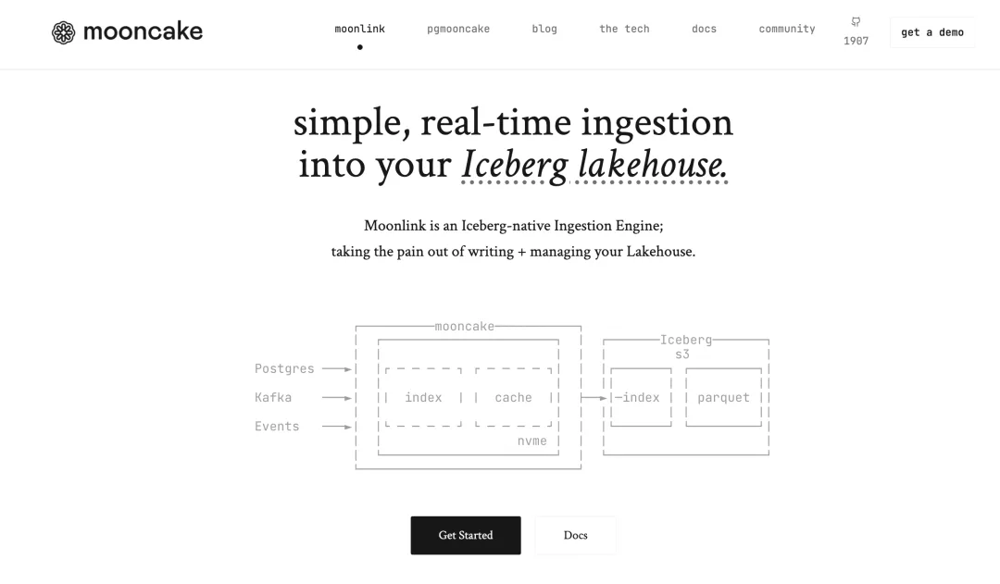
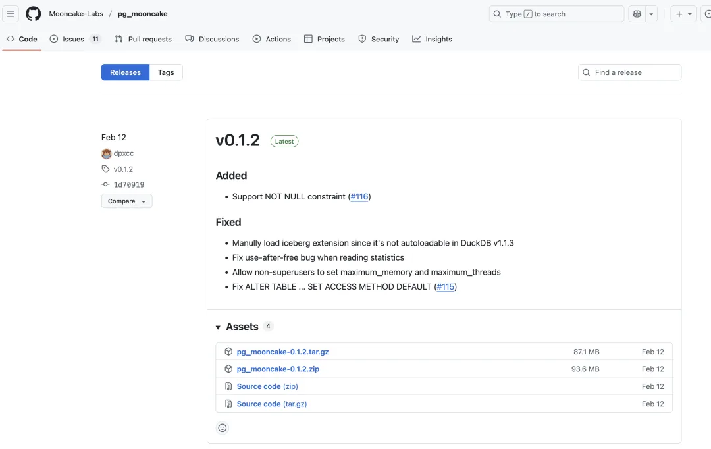
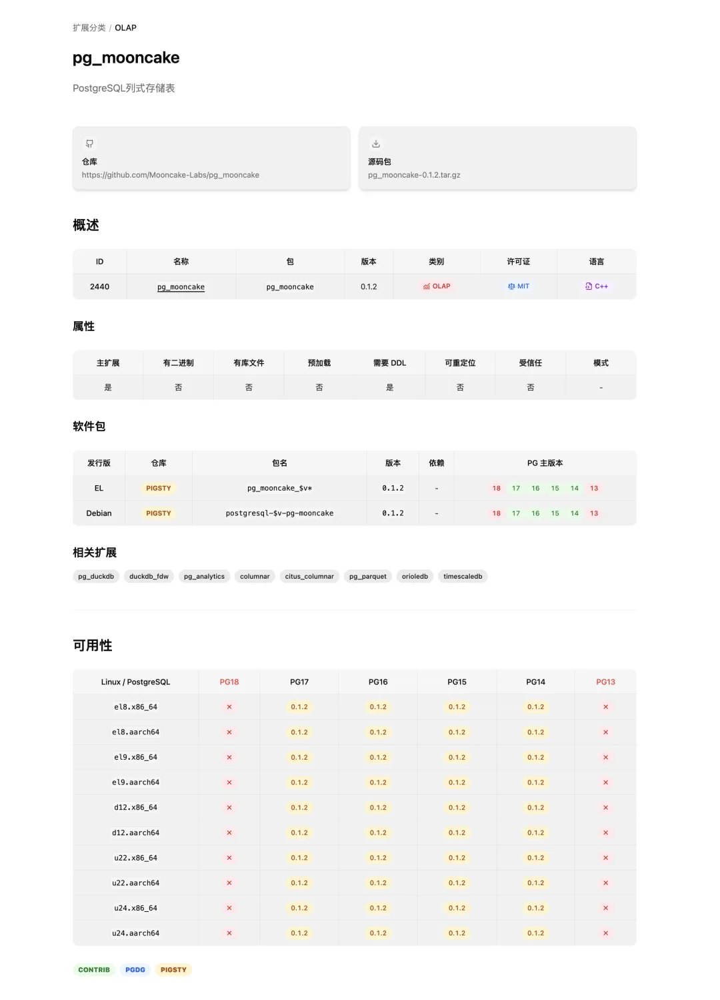

昨天在群里看到一则喜讯，Mooncake Lab 被 Databricks 收购了。

今年数据库世界几起大的收购都与 PostgreSQL 有关，Databricks 在六月份的时候 [以十亿美元的价格收购了 Neon](/db/db-for-ai/)，[它的老对手 Snowflake 则反手买下了 CrunchyData](/db/db-for-ai/)。更有传言说 [OpenAI 拟以 20 亿的价格收购 Supabase](/db/openai-supabase-rumor/)。这次，做 PG 上 OLAP 扩展的 mooncake 成为新的收购标的。

pg_mooncake 是一个很不错的 PG 扩展插件，旨在 [融合 PostgreSQL 与 DuckDB](/db/pg-kiss-duckdb/)，将 DuckDB 的顶级分析能力嵌入到 PostgreSQL 中。而且更棒的是他们采取的双重便车帕累托改进策略，基于 pg_duckdb 的基础做增量开发，同时吃到 PostgreSQL 和 pg_duckdb 团队的开发红利。

老冯由衷地为陈老板感到高兴，赶在 Databricks 上市前夕被收购，估计一波财富自由了。但老冯也不会对这个结果有多么惊讶。在五月蒙特利尔的 PG Conf. Dev 上，老冯与 OpenAI，VectorChord，Mooncake Lab 的几位朋友 [畅聊到深夜](/trip/20250514-montreal-notes/)。在老冯看来，Neon 创始人投资了 Mooncake Lab，[Neon 被 Databricks 收购了](/pg/pg-capital-market/)，那么 Mooncake 被 Databricks 收购也是水到渠成的事情。

老冯对于这一类收购的看法是，[Databricks 和 Snowflake 为了阻止（或引导控制） PG Duck 合流趋势](/db/db-for-ai/)，买下了开发 pg_parquet / crunchy_bridge 的 CrunchyData，这次又买下了 pg_mooncake 的开发团队 Mooncake Lab，那么依此类推，最后一个硬骨头就是开发 pg_duckdb 的 DuckDB 团队了。

从 Mooncake Lab 官网更新来看，月饼实验室的工作中心方向已经从融合 PG / DuckDB，变为用 PG 来管理 Iceberg / 访问湖仓（Moonlink）。发展方向确实出现了转变，而且原本号称用 Rust 重写的 pg_mooncake 0.2 版本目前过去了八个月也没有更新了。

当然，DataBricks 的收购对 Mooncake Lab 来说肯定是一件天大的好事，但老冯有点儿担心，月饼被招安以后，pg_mooncake 这个扩展开源项目会不会烂尾 —— 或者它再次出现时，会不会就成为 Databricks 中的某个商业套件了。

不过至少现有的 pg_mooncake，老冯都已经为主流 Linux 系统与 PG 大版本做好了二进制扩展包，还是能继续用的。不过未来开源 PG HTAP 的希望，PG DuckDB 缝合大赛最终花落谁家，目前可能就要更多看 DuckDB 团队的 pg_duckdb 了。

<https://ext.pgsty.com/e/pg_mooncake/>

总的来说，老冯认为 PostgreSQL 在资本市场的浪潮还远远没有结束 —— 数据库在 AI 时代依然是坚挺的核心部门，而[PostgreSQL 正在统一与征服 整个数据库世界](/pg/pg-eat-db-world/)。其他数据库崩解/迁移释放出来的市场还能持续给 PostgreSQL 带来巨大的高速增量，并为 PostgreSQL 相关的公司带来大量的时代红利，而 Databricks 本身上市则可能将数据库这个沉寂了几年的领域重新推上舞台的中心。

---

发布版本：[微信公众号](https://mp.weixin.qq.com/s/fTygs1w9zrbQkvjsxjGOcg)
