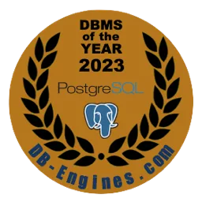
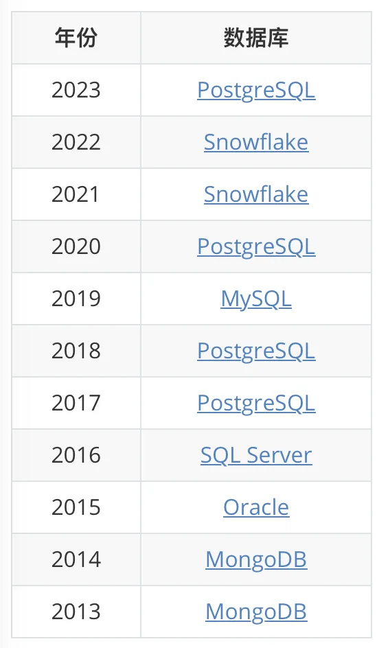
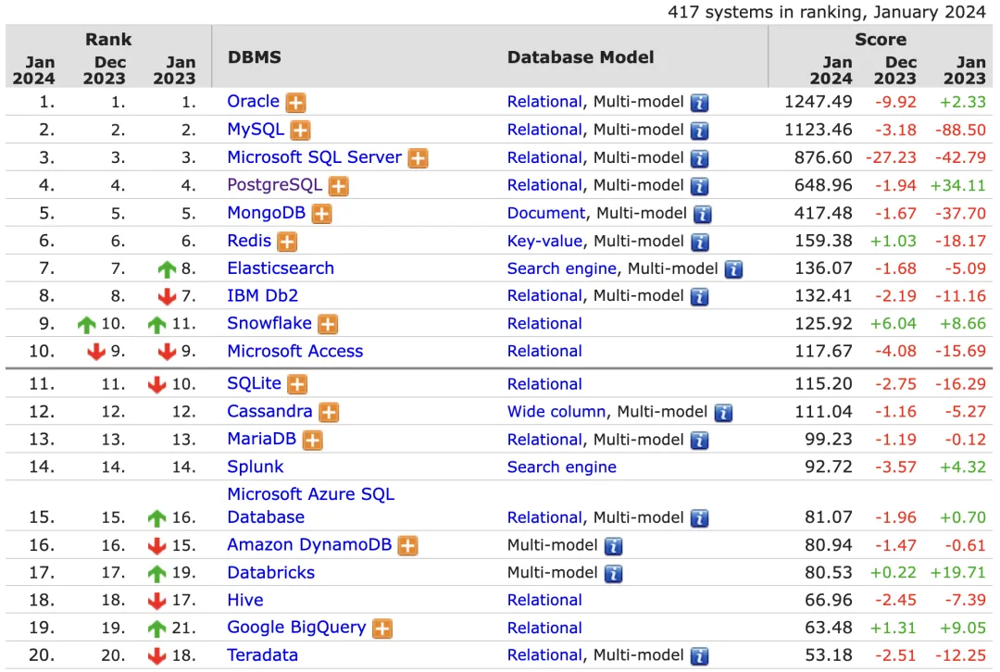
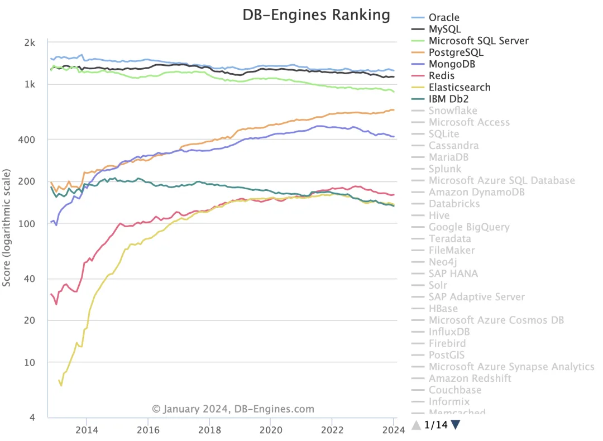

> [**PostgreSQL**](/pg/pg-is-no1/) 从我们的**DB-Engines 排名**监测的 417 个系统中脱颖而出，是过去一年里流行度增长最快的数据库系统，因此我们宣布 **2023 年度数据库**为 ——  PostgreSQL！

为了选出年度数据库，我们用 2024 年 1 月的最新的流行度分数减去 2023 年 1 月的分数。我们使用差值而非增长百分比 —— 因为用百分比会更偏向于年初流行度很低的系统。结果是一个数据库/DBMS 列表，按照 2023 年流行度分数增量排序。流行度的意思是，有多少新来的人开始以某种方式参与这种数据库的讨论，衡量的方法包括：工作机会，专业文档条目，Web 引用等等。

## 年度数据库：PostgreSQL

**PostgreSQL** 已经第四次成为我们的年度数据库了，前三次是在 **2017，2018，2020**。Postgres 大约在 35 年前首次发布，从那时起已经发生了翻天覆地的变化，这也是 PostgreSQL 的成功原因 —— **高速进行的稳定改进**，让这种数据库既能站在数据库技术最前沿，同时又能提供一个可靠而稳定的平台。在 2023 年 9 月发布的 PostgreSQL 16 带来了更进一步的性能提升，提供了相比其他数据库更丰富的复制选项。所有这些都使得 **PostgreSQL 成为有史以来最成功的开源项目之一**。

## 亚军：Databricks

Databricks 是一个云上大数据分析/机器学习平台，由 Apache Spark 的创始人们所创立。Databricks 运营着一个围绕着开源工具的生态系统：包括由其所创建或支持的 Apache Spark，以及 Delta Lake（一个开源存储框架）、Delta Sharing（一种用于安全共享数据的开放协议）和 MLflow（一个开源的机器学习平台）。

Databricks 在我们的排名中保持在第**17**位，比一年前的第 **19** 位有所上升。

## 季军：Google BigQuery

BigQuery 是谷歌的全托管云数仓/分析平台，可以使用 SQL 查询处理和分析大型数据集。除了 Serverless 计算的常见优点外，它还内置了机器学习与 BI 功能。BigQuery 是谷歌云平台（GCP）云计算服务套件的一部分。

BigQuery 在我们的排名中保持在第 19 位，比一年前的第 21 位有所上升。

让我们祝贺 **PostgreSQL**、**Databricks** 和谷歌 **BigQuery** 在 2023 年取得的成功。

年度数据库奖项的历年赢家

点击 “阅读原文” 查阅 DB-Engine 官方博客

<https://db-engines.com/en/blog_post/106>

参考阅读

《[PostgreSQL：世界上最成功的数据库](/pg/pg-is-no1/)》一文基于 StackOverflow 2017 - 2023 全球开发者年度问卷调查报告的数据，分析了开发者中 DBMS 德流行度/喜爱度/需求度变化与排名结果。作为第一手的调查数据，可与 DB-Engine 参照印证。

《[开箱即用的数据库发行版 —— Pigsty](/pigsty/better-rds-alternative/)》旨在为 PostgreSQL 打造一个开箱即用的数据库发行版，提供开源免费的 RDS 替代，让所有人都有能力真正用好这个世界上最先进、最流行的开源数据库。

---

发布版本：[微信公众号](https://mp.weixin.qq.com/s/8FJfdxiqiWBOgpjCbk6i6A)
