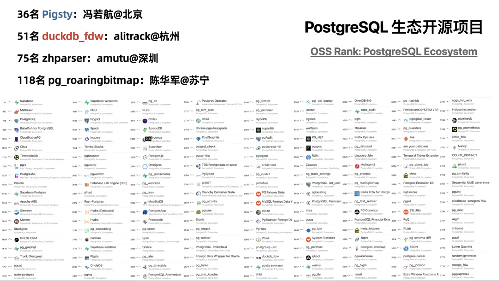

> 原作者：alitrack

也许是因为我一直在小公司工作，公司资源相对有限，我总是习惯寻找那些资源占用少但功能强大的项目。最早进入我视野的是 MonetDB[1]，可惜后来停止开发了。2020 年，我发现了 DuckDB，感觉这正是我需要的。

在 2020 年，我同时在学习 PostgreSQL，了解到了它的强大之处，也发现了它的短板，尤其在 OLAP 方面。因此，我萌生了一个想法：如果能够借助 DuckDB 提升 PostgreSQL 的 OLAP 分析能力，那就太好了。虽然我是 FDW 开发的外行，也不太熟悉 C/C++，但我有一个专长，就是复制和粘贴。

DuckDB 自称是 OLAP 版本的 SQLite，并且封装了 sqlite3_api_wrapper，因此我选择了复制和粘贴 sqlite_fdw[2]。经过简单的修改，第一个版本的 duckdb_fdw[3] 诞生了。后来由于工作原因，我暂时搁置了这个项目。

某天，不知什么原因，德哥意外发现了 duckdb_fdw，并进行了尝试，还写了试用文章。于是，duckdb_fdw 迎来了第一波小高潮。

在用户的推动下，我断断续续地对 duckdb_fdw 进行了系列更新，但受限于 DuckDB 并发处理的问题：

- 一个进程可以同时读写。

- 多个进程可以从数据库读取，但没有任何进程可以写入 (`access_mode = 'READ_ONLY'`)。

经过一番努力，我找到了解决方案，给 duckdb_fdw 添加了 duckdb_execute 命令，其功能是在 PostgreSQL 中远程执行 DuckDB 的命令。该功能借鉴了 oracle_fdw[4] 的 oracle_execute。

后来，DuckDB 推出了 postgres_scanner[5] 时，还把 duckdb_fdw 当作反面教材提到：

> 另一个架构选项是为 PostgreSQL 实现一个类似于 `duckdb_fdw` 的 DuckDB 外部数据包装器（FDW）。虽然这种方式可能改善协议问题，但在生产服务器上部署 PostgreSQL 扩展是比较风险的，因此我们预计只有少数人能够做到这一点。

虽然一开始有些失望，但转念一想，这反而让 duckdb_fdw 更加独特和强大。在 PostgreSQL 使用 duckdb_fdw 访问自己的表，还能更快，简直是神奇的操作。

今年，Pigsty 的冯若航冯总在年初的一篇文章 [中国对 PostgreSQL 的贡献约等于零吗？](/pg/china-pg-contribution/) 中提到国内对 PG 生态的贡献，竟然有我的名字，这让我很惊讶。

后来，他决定把我的 duckdb_fdw 收录进 Pigsty 生态，并在接下来的一篇文章 [PostgreSQL 正在吞噬数据库世界](/pg/pg-eat-db-world/) 中推广了我的 duckdb_fdw，使得更多人开始关注它。也因此，开始有了代码贡献者，其中一位是 CMU 的教授。

DuckDB 推出了 v1.0.0 版本，推动我更新了 duckdb_fdw，并在冯总的建议下，确定 duckdb_fdw 跟随 DuckDB 的版本。于是，第一个正式版本面世了。

下面是 macOS 下编译 duckdb_fdw 的例子，

    DUCKDB_VERSION=1.0.0
    PG_VERSION=16
    git clone https://github.com/alitrack/duckdb_fdw
    cd duckdb_fdw
    wget -c https://github.com/duckdb/duckdb/releases/download/v${DUCKDB_VERSION}/libduckdb-osx-universal.zip
    unzip -d . libduckdb-osx-universal.zip
    cp libduckdb.* $(pg_config --libdir)

    # compile
    make clean USE_PGXS=1
    make USE_PGXS=1
    # no  LC_RPATH's found, 仅限于 macOS
    install_name_tool -change @rpath/libduckdb.dylib $(pg_config --libdir)/libduckdb.dylib duckdb_fdw.dylib

    sudo make install USE_PGXS=1

同时也提出了两种编译思路：一种是继续依赖 DuckDB 官方编译好的 libduckdb，这样编译时间更短，资源消耗更小，但会有一个隐患，因为该项目是在较高版本的 Ubuntu 上编译的，在 RedHat 上会出现 glibc 版本不兼容的问题。最早发现这个问题的是德哥。群里有人对此问题做了解释：

> 2.17 是 RedHat、CentOS 系，2.31 是 Ubuntu 系。DuckDB 官网下载的用的是 2.17，应该是在 RedHat 或者 CentOS 上编译的，在 Ubuntu 下是能用的。Ubuntu 下编译的 .so 用的是 2.31，CentOS、RedHat 上执行不了。DuckDB glibc 版片兼容没做，这点体验不太好。

于是，延伸出了另外一种做法，就是把 libduckdb_src 加进来，这样 libduckdb.so 都可以省了，减少动态库依赖导致的问题。你觉得哪种方法更好？

时间过得很快，duckdb_fdw 从诞生到现在已经快 4 年了。恰逢第 13 届 PostgreSQL 中国技术大会即将召开，在德哥和冯总的鼓励下，我决定参与其中，让更多人了解 duckdb_fdw。希望在大会现场能遇到你。

## 引用链接

- `[1]` MonetDB: <https://github.com/MonetDB/MonetDB>
- `[2]` sqlite_fdw: <https://github.com/pgspider/sqlite_fdw>
- `[3]` duckdb_fdw: <https://github.com/alitrack/duckdb_fdw>
- `[4]` oracle_fdw: <https://github.com/laurenz/oracle_fdw>
- `[5]` postgres_scanner: <https://github.com/duckdb/postgres_scanner>

---

发布版本：[微信公众号转载页](https://mp.weixin.qq.com/s/oVh5QPrZWkTTe5HvrLcvIQ)
