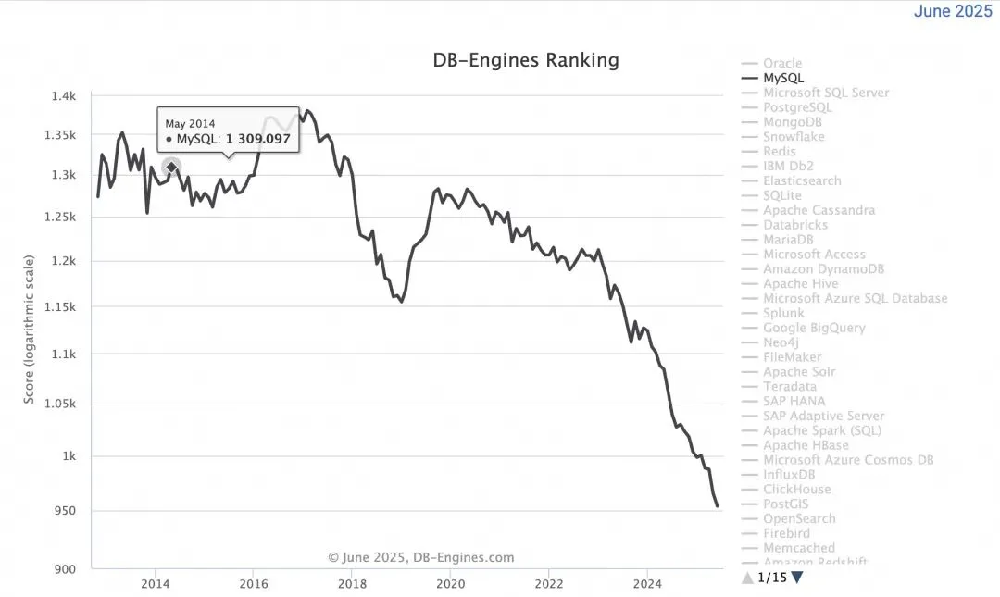
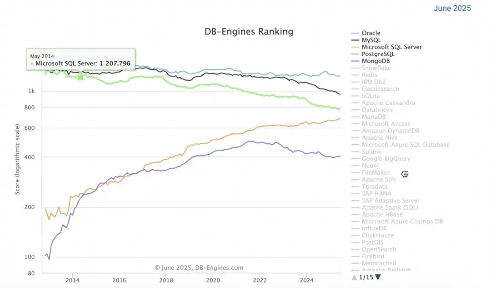
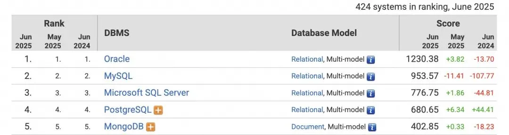
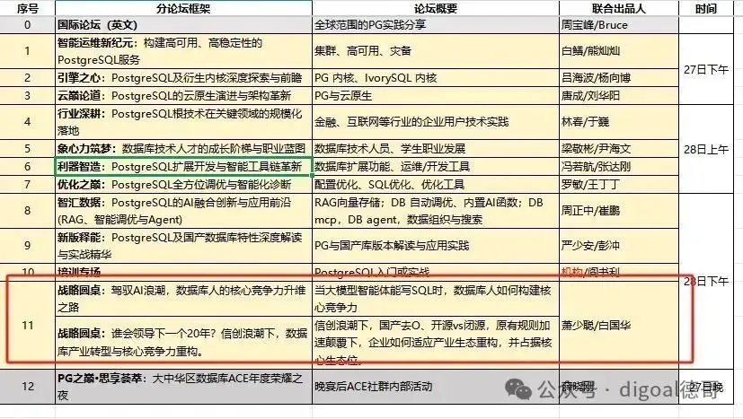

> 原作者：digoal

真相永远是残酷的，今天这一期恐怕要令很多 MySQL 从业者、甚至是打着平替/兼容 MySQL 的国产数据库厂商不爽了！

世人都喜欢听好听的、缕顺毛，可好听的大多数是唯心的谎言。不是有句话“撒但是谎言之父”么，如果公司里老板周围挤满了“撒旦”那这家公司十有八九要玩蛋！

但我是个钢铁直男，我就喜欢说真话。

MySQL 在互联网时代风光无限，可惜被 Oracle 收购后，内部的虹吸效应注定了它的结局，MySQL 必将被 Oracle 玩死最终走向平庸与没落。

参考这篇详细分析：[MySQL 将保持平庸](https://mp.weixin.qq.com/s?__biz=MzA5MTM4MzY1Mw==&mid=2247494477&idx=1&sn=493449ddc1b43ccb697dcc8cb3bb6c83&scene=21#wechat_redirect)

MySQL 可太惨了，被后爹玩残，看看 DB Engine 分值，一路下跌，都快跌没了。

进入 AI 时代，前五的数据库，只有 PG 在持续强势上涨。

虽然很多铁粉也想 Make MySQL Great Again，但是后爹不让啊，他们最终把劲使到了“去 MySQL”的产品上就像“去 Oracle”一样。而 MySQL 始终毫无建树，还是那么弱。时不时还会刷一下存在感，让人措不及防，看这一篇：[MySQL 出息了！大败 PG 用的这个 case](https://mp.weixin.qq.com/s?__biz=MzA5MTM4MzY1Mw==&mid=2247494457&idx=1&sn=f8c125a86740616fda97a249fafb87c9&scene=21#wechat_redirect)\
而 PG 这边社区极其活跃包容开放，架构也是非常的灵活，通过插件扩展使得 PG 可以让全球开发者共建 PG 生态。在 AI 领域，PG 有全球最流行的向量插件 pgvector(还有扩展的量化类型、多种索引类型 hsnw、ivfflat、DiskANN、RabitQ 增强等、多种向量距离算法等，很多增强插件也是对准了 pgvector 来提高例如：[为什么 VectorChord 比 pgvector 更好?](https://mp.weixin.qq.com/s?__biz=MzA5MTM4MzY1Mw==&mid=2247495260&idx=1&sn=8450d418e2b25ebec265ee64161ff1a6&scene=21#wechat_redirect)、[性能提升 100 倍，向量数据库风云再起](https://mp.weixin.qq.com/s?__biz=MzA5MTM4MzY1Mw==&mid=2247495354&idx=1&sn=17834efb2d06311b7b110601cc5b317f&scene=21#wechat_redirect).)、图搜语法和插件、模糊搜索插件、全文检索插件、bm25 插件、数据湖能力、并行计算、DuckDB 算力集成、内置 plxxlanguage 几乎可以对接任意编程语言、调用本地或远程模型、甚至你喜欢的话还可以在数据库内置大模型。

你肯定会说，这么复杂普通企业可怎么能维护好 PG 哦，这可不就利好云厂商么，云厂商最喜欢说的就是“把复杂留给自己、把简单交给用户”，所以你不用管里面有多复杂。

另外还利好 PG 的数据库管控系统、自动化运维监控诊断系统、同步产品等等，例如 apecloud 云猿生、pigsty、乘数 clup、成都文武鸿鹄、DBdoctor、NineData 等国货之光产品。也是降低数据库规模化使用门槛的利器。\
PG 既能 DB4AI，也能 AI4DB，PG 和 AI 可以完全融合。

PG 已成为事实的 AI 数据库底座，这也是为什么各大厂商纷纷大手笔收购 PG 商业发行版公司？看这两笔收购的分析，你就会豁然开日：

[赚大了！Databricks 10 亿美元买下开源数据库 Neon Database](https://mp.weixin.qq.com/s?__biz=MzA5MTM4MzY1Mw==&mid=2247495175&idx=1&sn=c265743f6b7cc4392206755000f59d47&scene=21#wechat_redirect)\

[Snowflake 收购 PostgreSQL 商业发型版 Crunchy Data 扩大 AI Data Cloud 版图](https://mp.weixin.qq.com/s?__biz=MzA5MTM4MzY1Mw==&mid=2247495793&idx=1&sn=67a0954f48dbcda313f8772b37e99db6&scene=21#wechat_redirect)\

只有 PG 这种架构能满足 AI 智能体对数据库的需求，单纯的关系、搜索、向量、图数据库统统靠边站。

看这 2 篇分析：

[DuckDB 出手，图数据库赛道将不复存在](https://mp.weixin.qq.com/s?__biz=MzA5MTM4MzY1Mw==&mid=2247495543&idx=1&sn=a97019c3221cafb50730027832df91df&scene=21#wechat_redirect)

[为什么我的 AI 笨得跟猪一样?](https://mp.weixin.qq.com/s?__biz=MzA5MTM4MzY1Mw==&mid=2247494470&idx=1&sn=2bef0d1887901cf6fc2c0486ba2888c1&scene=21#wechat_redirect)\

抓紧时间心疼 MySQL 一秒钟，更心疼 MariaDB，这样下去想卖也卖不掉了。

不要以为我是在幸灾乐祸，造成这个悲剧的其实是用户，是用户宠坏了 MySQL，导致 MySQL 不思进取。

MySQL 里很多“bug"甚至被一些脑残粉用户当成特性，就应该这样。还有 MySQL binlog 就是牛，MySQL 复制工具就是多，MySQL 搞不定就复制到其他产品去。最后 MySQL 就变成了今天这样，只能最简单的增删改查，别的一概不行。

你也别以为 MySQL 有铁粉，那些曾经和你好得穿一条裤子的铁粉在发现 MySQL 没有前途之后，会毫不犹豫的抛弃你，第一时间掉转枪头去搞别的。

特别是在大公司，这种人随处可见，说他们是铁粉我觉得是在褒奖他们，他们就是玩弄权术的政治家，哪里有好处就会去哪里占地盘。

今天可能是 MySQL 的坚定铁粉，明天可能转头就说 PG 才是未来，丝滑无耻的去占 PG 的坑。他们根本上不会敬畏技术也不会为用户长远利益考虑更不会考虑产品的持续发展和连续性。做好向上管理、招人壮大自己的队伍巩固自己在公司的地位才是他们的目的。

真正的 MySQL 铁粉一定要看清这种人的真实面孔，别被忽悠了。

不过我还是劝你赶紧拥抱 PG 吧，这里可真好玩。如果你还是对 MySQL 念念不忘，大可去使用兼容 MySQL 的国产品牌例如 PolarDB-X，甚至可以试试 PG 版的 MySQL（openHalo），详见这一篇：[特大新闻，Oracle 强劲对手宣布开源！](/db/oracle-competitor-open-source/)

MySQLer，628 活动现场见，PG 欢迎您，一起聊聊未来吧。

6.27,28 PG 数据库高峰论坛

我与崔博士是 28 号下午 AI

- DB 融合分论坛出品人，欢迎大家到场与各位专家交流。

大会于 2025 年 6 月 27 日在济南隆重举行。本届大会以开源链接世界为核心主题，预计吸引全球 1500+开发者、500+企业决策者及 50+国际开源组织代表齐聚，共同绘制开源数据库的未来图景，探索开源技术与产业融合的新范式。

详细会议介绍见： <https://howconf.cn>

---

发布版本：[微信公众号转载页](https://mp.weixin.qq.com/s/J_7tA1IZgfHpYCEz9-5KZw)
