> 原作者：熊灿灿

## 前言

昨日，终于见到了数据库圈的前辈梁大师，梁大师的名号用文字描述略显苍白，懂得都懂。茶余饭后，绕湖一圈，好不快哉。

(原谅我油光满面，属实是加班够呛) 虽然我与梁大师结识时间并不久，并且一直是"网友"，但正如文章标题，一见如故，仿佛相识多年的老友一样，交谈甚欢，也没有感受到任何隔阂。梁大师是位和蔼幽默的人，每每交流到尽兴之时，便会开怀大笑。梁大师也赠予了我他编著的知名书籍——《收获，不止 SQL 优化》，亲笔签名😎 (请容笔者小小炫个富)

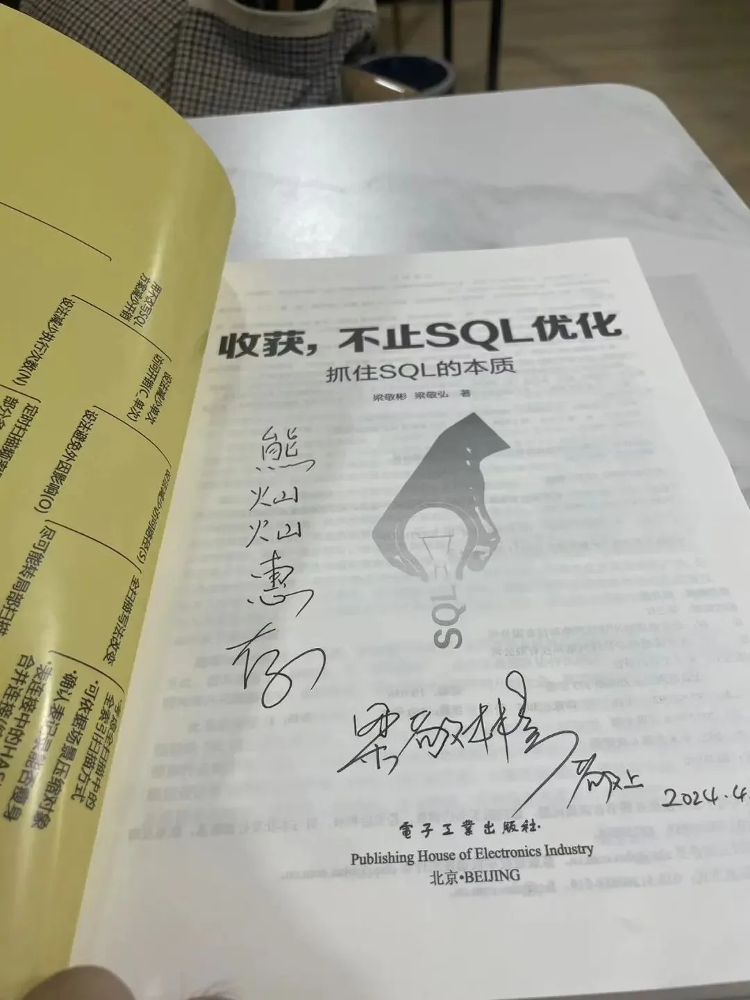

聊起 SQL 优化，自然少不了这本书籍的身影，所以当我收到这本书时，如获至宝一样，打算一周时间将其啃完。赶巧，今日大早飞机就晚点了，于是乎，在机场和飞机上，我花了四五个小时将这本书基本全部翻了一遍，正如书名一样，收获，远不止 SQL 优化。赶着这股劲，必须立马写出来，趁热打铁，也理一下自己的思绪。

虽然这本书是基于 Oracle 所写，并且笔者也一直从事的是与 PostgreSQL 相关工作，Oracle 可以说是知之甚少，只会简单的 CRUD，但是毕竟 PostgreSQL 和 Oracle 十分相像，因此阅读起来也还算流畅。那站在 PostgreSQL 的视角上，能够学习到什么呢？又收获了什么？请听笔者细细道来。

## 心得

翻开目录，就有一张十分惹眼的 SQL 优化脑图

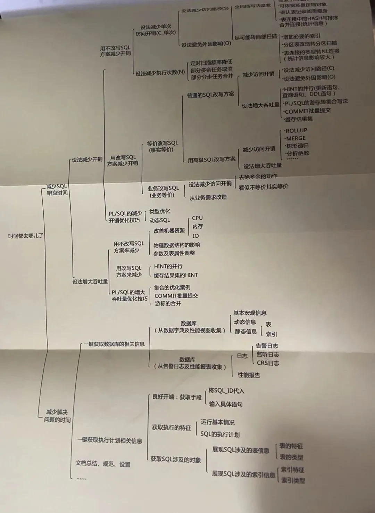

将这个思路应用到 PostgreSQL 中完全可行。从局部到整体，**从单一到全局，方方面面**。SQL 是一种傻瓜式语言，声明式语言，比如 select id from test where id = 1，我们当然知道这个查询用于取出 test 表中 id 为 1 的数据，但是 SQL 并非过程式语言，正如书中序所说

> 任何 IT 系统，数据都是核心，同时也是访问和展现的热点，脱离数据库的 IT 项目几乎不存在，甚至可以说几乎没有不需要进行数据库操作的编程人员，而能与数据库进行无缝交互的就只有 SQL 了。此外，SQL 是一种学起来非常容易的"傻瓜"语言，随便一个 where 条件就是一个需求实现，基本上新手级别的开发人员坐下来看看简单语法即可编写 SQL，如果有 3 天时间边做边学，基本上所有 SQL 都会编写了。

诚然，SQL 上手容易，要精通难，有时候，开发为了实现业务逻辑，可不会去管你这个表扫描了多少次，能不能走索引等等，所以笔者特别佩服梁老师这样的大师，能二十年如一日，将 SQL 优化玩得出神入化。

第一章主要介绍了 Oracle 中的性能工具，用通俗易懂的例子介绍了各个工具，AWR/ASH/ADDM/AWRDD，阅读过程中，也再次感叹 Oracle 的强大，**可观测性这方面无出其右**，AWR 报告就类似于体检报告，AWRDD 用于分析趋势，ASH 则告诉你具体问题出在了哪里，而 AWRSQRPT 好比活检，在 PostgreSQL 中，一直苦于没有成熟好用的 AWR，亦或是第三方扩展，亦或是自己实现的丐版，和 Oracle 的 AWR 相比就要逊色太多太多，不过，此处也还是要推荐一下相关扩展

1. AWR：pg_awr/pg_profile/pgpro-pwr/pgpro-stats/pgstatpack/pg_statsinfo
2. ASH：pgsentinel
3. 单条 SQL 使用多少资源：pg_stat_kcache
4. 等待事件采样：pg_wait_sampling
5. 存储历史执行计划：auto_explain/pg_store_plans

工欲善其事，必先利其器，有了工具的加持，可以让我们事半功倍。

第二章有一点我印象颇深，十分受益。SQL 调优时间都去哪里了？其一，无法抓住主要矛盾进行分析，也就是瞎折腾，看似一阵捣鼓，十分繁忙的样子，其实全做的无用功罢了，就好比系统慢了，你 iostat 看一下，top 看一下，pidstat 看一下，你又不懂其中指标含义如何，这不是瞎折腾是什么。其一又可以细分为局部问题和整体问题，局部问题自然聚焦于特定问题，是某个 SQL 慢了？还是某个模块慢了？其二是整体，就好比人在长期高压高负载的情况下，哪怕再谨慎仔细的人，也会犯错，类似，如果客观资源出了问题，比如 CPU/内存/网络/IO 出了问题，那么你不慢谁慢？

其次，书中还提到了一个十分关键的点，有的 SQL 执行的虽然慢，但是客户并不 care，因此

1. 虽慢，用户很满意就是快
2. 虽慢，用户不愿改即作罢
3. 虽快，用户不满意即是慢

客户至上，业务至上。你可能看到一条 SQL 跑了 2 ms (不算慢了)，但是这条 SQL 会运行成千上万次，假如我们能够优化至 1ms，**那么可以减少多少逻辑读？多少物理读？1000 次不就将性能提升了 1 秒？**而全局性的问题有所不同，用户觉得快也要解决，用户觉得慢更要解决，因为全局性的问题，一旦出了问题，其范围更广，后果更严重。还是那个例子，如果你生病了，只是胃疼，那么吃点止疼药，还能熬一熬，但是假如你长期高压，浑身不得劲，腰酸背痛，头晕眼花，任何一点风吹草动，可能就会将你击垮，因此整体问题更需要重视。

最后，分析 SQL 的时候，要"张弛有度"，这个比喻可能不太恰当，"度"是什么？不妨理解为我们当前硬件资源的算力，举个栗子，假如你就 2C4GB 的服务器，你说我要承载 1W 并发，10 表关联，还要将延迟控制在 10ms！这不是扯淡是什么？因此基准测试和压力测试就显得尤为重要，其次，按照安德比尔定律，硬件也在快速迭代中，对于各个硬件的性能指标 (这里强烈推荐阅读一下冯董的那篇[重新拿回计算机硬件的红利](/cloud/bonus/))，心中也要有个尺，才能侃侃而谈，面对业务的刁难——我就要这样，我就要那样，也能得心应手。

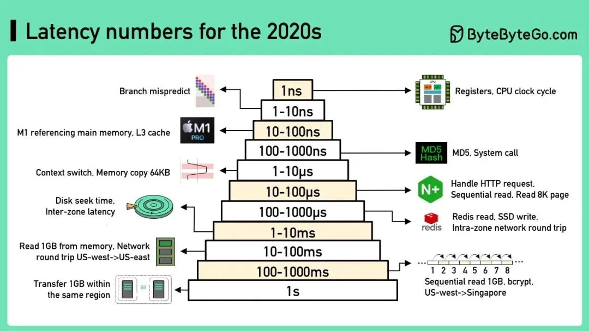

第三章讲解了执行计划和统计信息，统计信息的重要性不言而喻，之前我也分享过一篇很全面的内容，这一块就不过多描述。

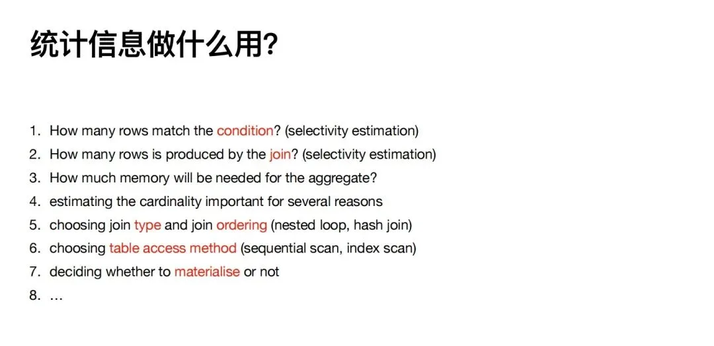

第四章描述了如何左右 SQL 执行计划，Oracle 中有强大的 HINT 功能，也有 shared pool 执行计划缓存，也有执行计划固化，这样一比，PostgreSQL 就显得**相形见绌，逊色太多**。优化案例大致介绍了

1. 物化视图 (空间换时间，不知 Oracle 是否支持增量物化视图？)
2. 禁止 select \*，只取需要的列，和 PostgreSQL 类似，可以走 index only scan
3. 分区裁剪
4. cluster，尽可能消除离散 IO
5. ...

这些优化方法论套到其他数据库中，也同样适用。在 PostgreSQL 中，如果我们需要使用类似的功能，HINT 可以使用 pg_hint_plan，全局执行计划缓存可以用 pg_shared_plans (吕大也实现了一版，目前还未开源，拭目以待)、执行计划固化可以使用 sr_plan 或 pg_plan_guarentee。

第五张介绍了体系架构，Oracle 和 PostgreSQL 的体系架构十分相似，PGA/SGA，不难理解，work_mem 越大，SQL 自然跑得就越快，不过要小心 OOM。

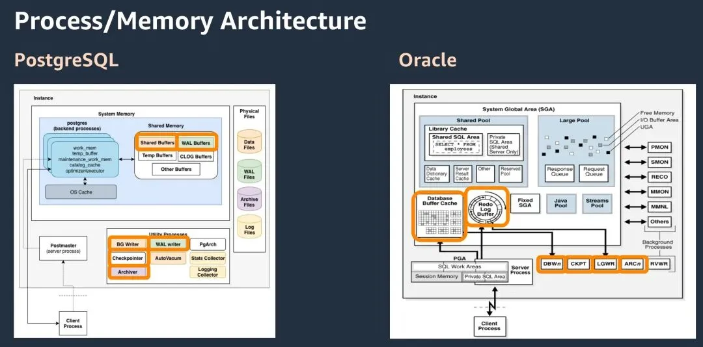

与 PostgreSQL 的 5 次绑定变量有所不同，Oracle 第二次执行时就可以省去语法、语义解析这些步骤，为了让系统的性能不至于大起大落，在很多用户那里会关闭绑定变量窥视的功能。个人认为在这一点上，PostgreSQL 的实现更为严谨。

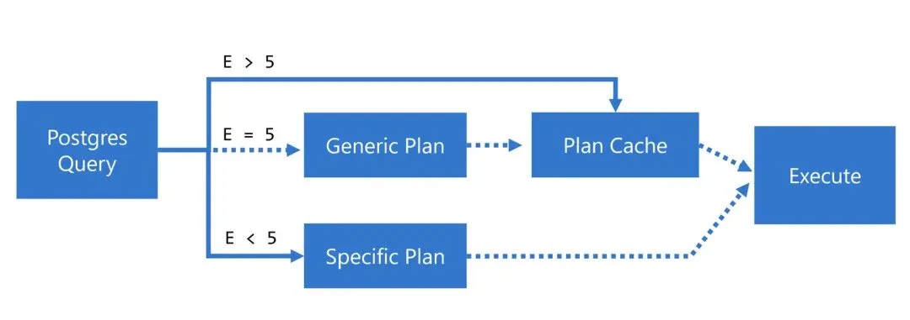

其次 Oracle **还支持直接路径读**，绕过操作系统缓存，对于纯写入这种场景，优势就十分明显了，另外 Oracle 还支持固定缓存，这一点功能，在 PostgreSQL 中并没有对标的，这在某些场景下，可能会十分有用，pgpool 倒是支持 (也许笔者理解有出入，欢迎读者指教)。

第六章介绍的是逻辑结构，其中描述了热块这个场景，顾名思义，就是某个数据块频繁访问，导致都在竞争这个数据块的访问权限，对应到 PostgreSQL 中，就是 buffer_content 等待事件，如果数据块越大，能装的数据就越多，产生的逻辑读/物理读就越少；但是由于装的数据越多，也就导致竞争同一个数据块的概率也增加了，因此，并不是一刀切，数据块越大越好，我们可以使用 fillfactor 合理将数据打散，减少热块冲突。之前也曾写过一篇数据块大小对应数据块性能的影响，👉🏻 [改变数据页大小能带来多少收益？](https://mp.weixin.qq.com/s?__biz=MzUyOTAyMzMyNg==&mid=2247490838&idx=1&sn=0f1d2ba1ca842a1244771d73b1005ac8&chksm=fa663527cd11bc3156fff19d86a648faa31a5d7463d43ff586923f5ade8e5be99871fceca49a&token=85308315&lang=zh_CN&scene=21#wechat_redirect)，其次 Oracle 的高水位问题和 PostgreSQL 中的表膨胀现象十分类似，也需要去维护，去收缩。

第七章介绍的是表结构设计，换个高大上的词就是建模，合理的建模可以避免很多性能问题，我经常提到的 padding 对齐问题，数据量大了之后，也会产生可观的代价

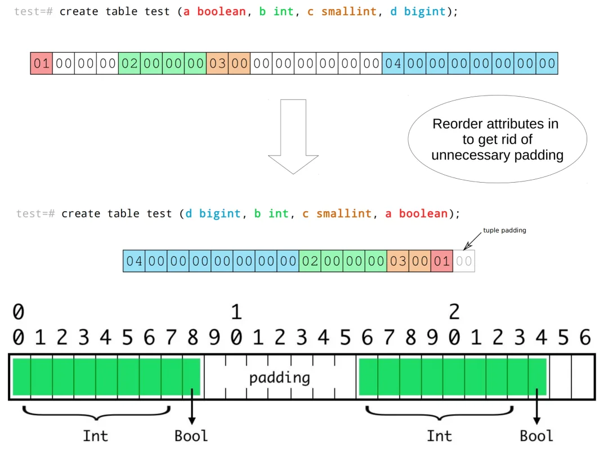

在 Oracle 中，还支持全局临时表，这个功能羡煞我也，虽然 pgtt 插件也可以实现类似效果，但是效果就要差之甚远。借助临时表的特性，比如不写 WAL，在某些场景中，可能会有意想不到的性能表现，不过书中也介绍了收集全局临时表导致系统雪崩的案例，当然还介绍了分区表这一常见的优化手段，Oracle 中的分区表要更为强大，支持交换分区/拆分分区，不过好消息是，在 17 中，也支持了这个功能。

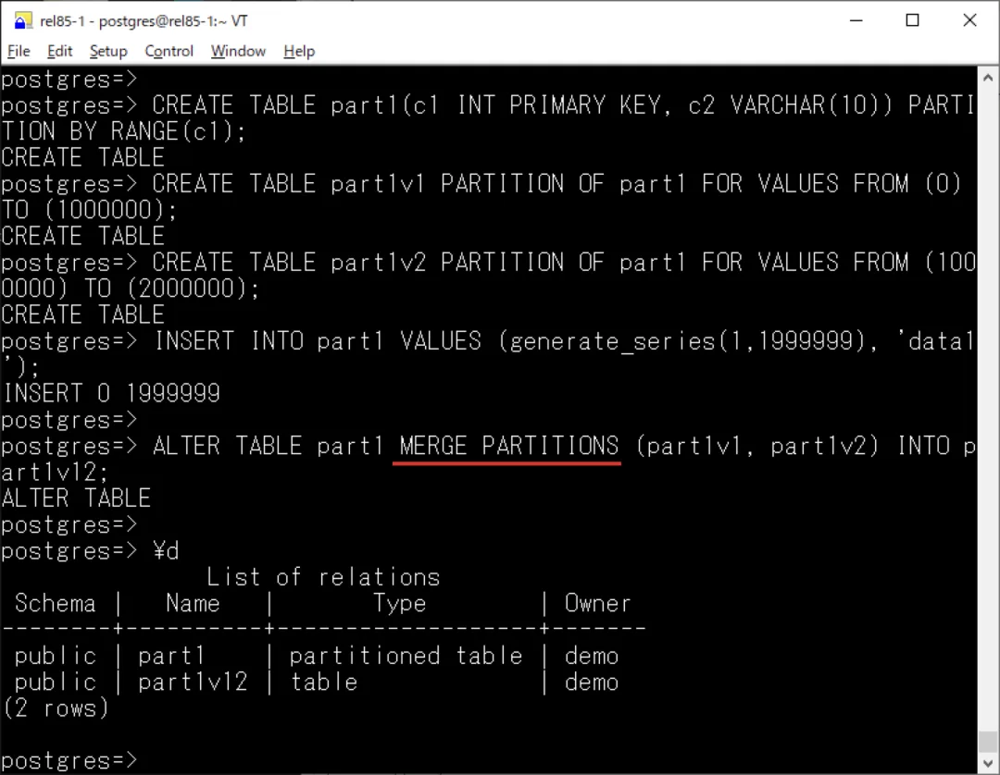

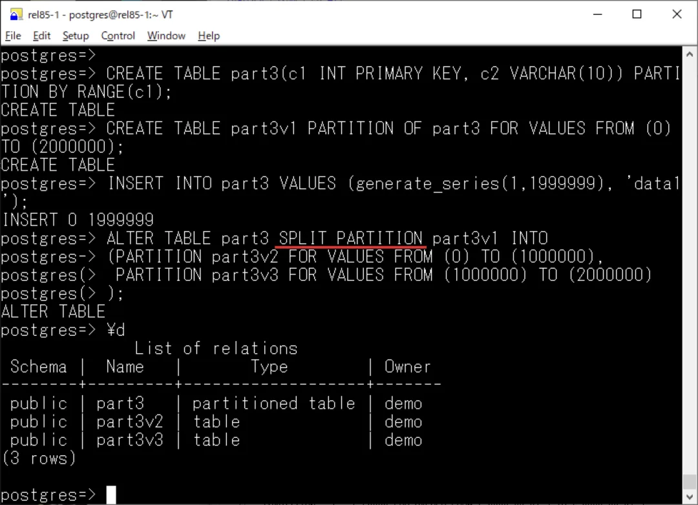

另外，该什么类型，就什么类型！在 PostgreSQL 中，虽然改类型大多数都是秒级完成的，但是统计信息呢？索引呢？约束呢？这些都是坑。

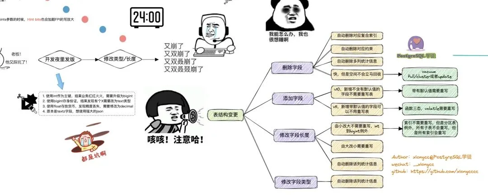

第八九十章介绍的都是索引相关，以及索引设计，索引原理等，这一块是类似的，比如

1. 复合索引，针对业务特点，统一考虑索引设计，尽可能设计可以在多场景使用的复合索引，建立复合索引时，应当将区分度，选择率高的列放在前面。
2. 定期消除冗余索引，索引不仅会减慢清理速度，还会影响写入性能
3. 定期分析低效索引，不过要注意索引是否具有功能性，比如唯一索引

PostgreSQL 中的索引种类是最为全面的，合理使用好索引，可以大幅提升我们的效率。此处引用一下陈华军老师的图，在 Oracle 中也支持表达式索引，即函数索引，不过文中特别提到，如果修改了函数代码，对应的函数索引也需要重建！这一点我还未在 PostgreSQL 验证，晚点验证一下

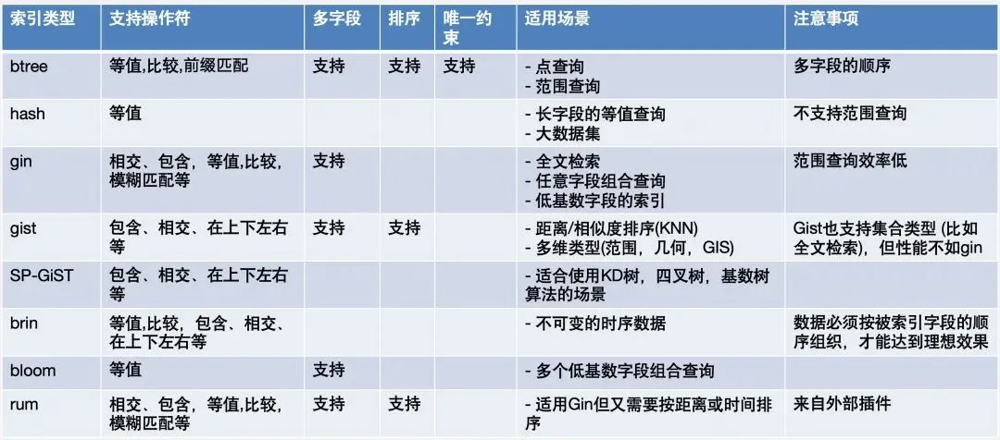

其次，Oracle 还支持强大的虚拟索引，PostgreSQL 也可以借助插件来实现，比如 hypopg。

第十一章介绍了表的连接方式，这一点和 PostgreSQL 如出一辙，不过值得一提的是，在 PostgreSQL 中，**Merge join 仅支持等值连接！**注意这个差异。三种连接方式各有所长，梁大师举了三个十分贴切的例子来对比，

> 方法 1：选出男孩，比如小明去女孩房间寻找高度匹配的女孩，然后接着选小军去女孩房间选择匹配的女孩跳舞
>
> 方法 2：男生排队，从高到矮。同时女生房间也排队，从高到矮。然后高对高矮对矮进行男女匹配，一起跳舞
>
> 方法 3：女孩按班级在房间里面排成一列，从高到矮，不同班级排到不同的队伍。这时再让男孩根据他们所属的班级到各个队伍去找跟自己匹配的女孩

方法 1 就是 NestLoop，方法 2 则是 MergeJoin，方法 3 则是 HashJoin，真是十分贴切，能将晦涩的原理用大白话描述出来，让 outlier 也能看懂。

用图来表示的话，NestLoop：

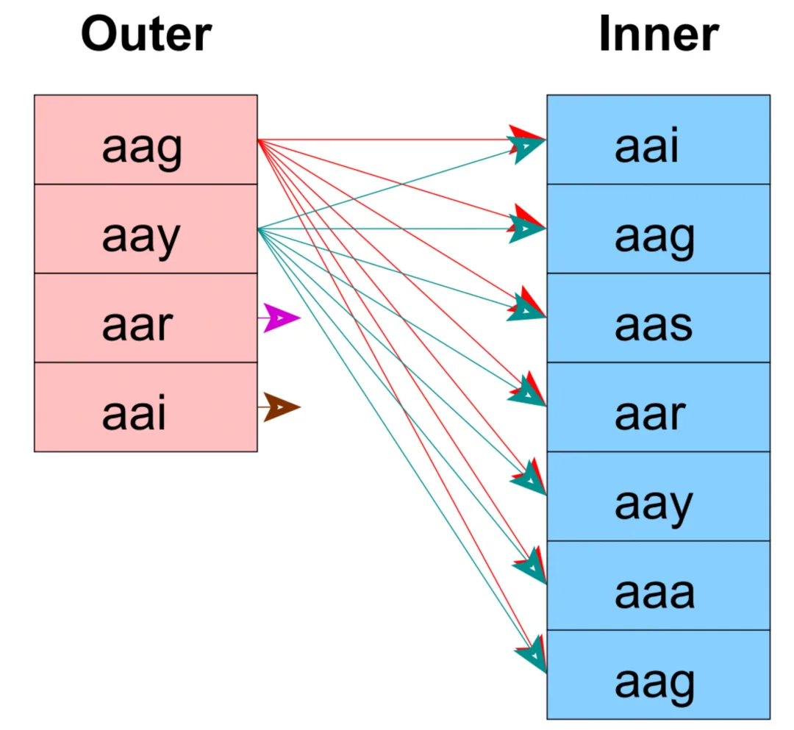

Merge Join：

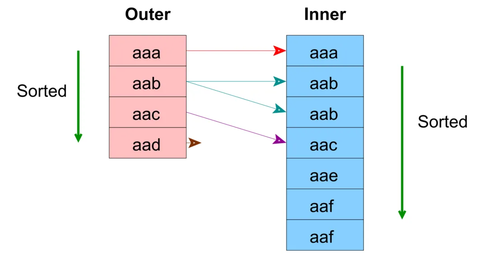

Hash Join：

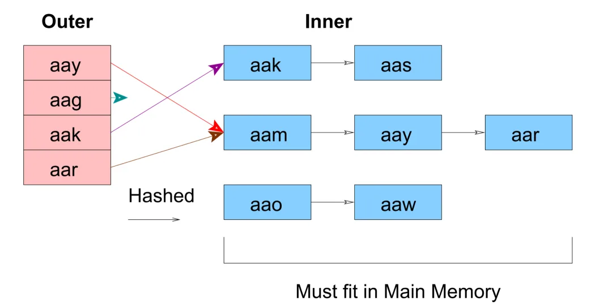

对于 NLJ，驱动表的选择以及对于被驱动表的高效访问就尤为重要，HASHJOIN 也是类似，work_mem 决定了 batchs 的数量 (始终是 2 的幂)，而 MergeJoin 则要求数据是有序的 (有索引的场景下更为高效)，MergeJoin 的算法决定了两个表就扫描一次即可，因此驱动表的选择相较于前两者就并不是太重要 (在 PostgreSQL 中，可以在编译的时候指定额外参数，观察 MergeJoin 驱动表)。

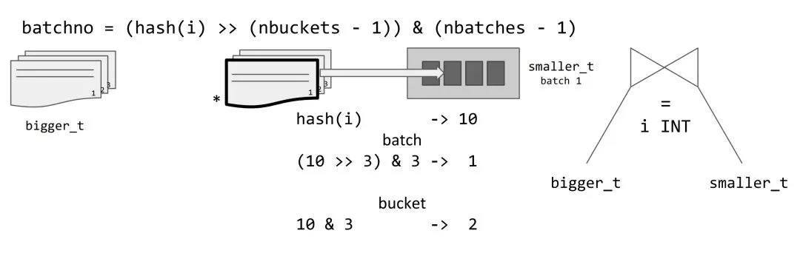

第十二章介绍了等价改写的案例，这一块文字描述太过浅显，需要细细品味。

第十三章描述了 PLSQL，其中表类型优化案例让我们眼前一亮，在 PostgreSQL 中，**也会自动为每个表创建一个同名的数据类型**，借助这个思想，也可以像书中一样，照猫画虎进行优化！至于 %TYPE，%ROWTYPE，这些都是有的。

第十四章介绍了一些高级 SQL 语法，Merge 在 15 版本中也正式支持了，其次 WITH/ ROLLUP 这类，也有类似功能。

十五章和十六章介绍了一些等价改写思想，如何从业务出发，将一些看似不等价实则等价的 SQL 进行改写，摒弃一些业务逻辑消除冗余 SQL 等，因此，SQL 优化要做好，**了解业务也是不可或缺的关键一环！**从业务出发，有时可以起到十分明显的效果，书中举了三个十分浅显易懂的例子。

关于后面几章，笔者没有花太多文字去进行描述，因为这些都需要沉淀，去积累，用文字描述过于苍白，感兴趣的读者请自行阅读这块内容，加强理解。

## 小结

很庆幸，在劳累的出差路上，还能与梁大师一聚，梁大师亦师亦友的角色，聊生活，聊技术，无所不谈，感染力极强，虽然昨天是我们的第一次见面，但是就像多年未见的老友一样，完全没有任何不自在，交流过程中也十分轻松。我一直很认同一句话

> 赚第一桶金，靠的是信息差；赚 N 桶金，靠的是资源差；持续不断地赚金，靠的是认知差。

与梁大师的交流也让我对自己有了更深的认知。笔者也建议各位没事多出去走走，参加一些大会，多多与圈子里的前辈们交流，能让我们的视野更为开阔，睡也是一天，玩也是一天不是。

最后，就用一张合照结尾吧 ~

---

发布版本：[微信公众号转载页](https://mp.weixin.qq.com/s/oLVTENYU_H01Z4F5DDNqtQ)
