老冯最近多次被人问到一个问题：“如何上手学习 PostgreSQL”？已经不是一次两次了，所以感觉有必要写个教程集体回答一下。

 老冯认为，学习 PostgreSQL 的最好方式就是 Learn by doing —— 通过实践来学习，而不是通过死看书，报什么培训班之类的东西。

现在的学习条件要比以前好太多了，因为每个人都可以有一个非常耐心的高水平老师在身边随时指导 —— 有什么问题直接问 AI 就是了。

 不过俗话说：“师傅领进门，修行在个人”。即使有 AI 助力，起步的那个入门过程依然是最难的，很多人就直接卡在第一步，环境搭建上。所以，老冯决定写这个快速上手教程，帮助你完成快速上手的第一步。

当然，公众号干这个不太合适，这个教程的在线版本地址是：<https://pg36g.vonng.com/> 阅读还是复制命令都更方便一些。（点击阅读原文前往）

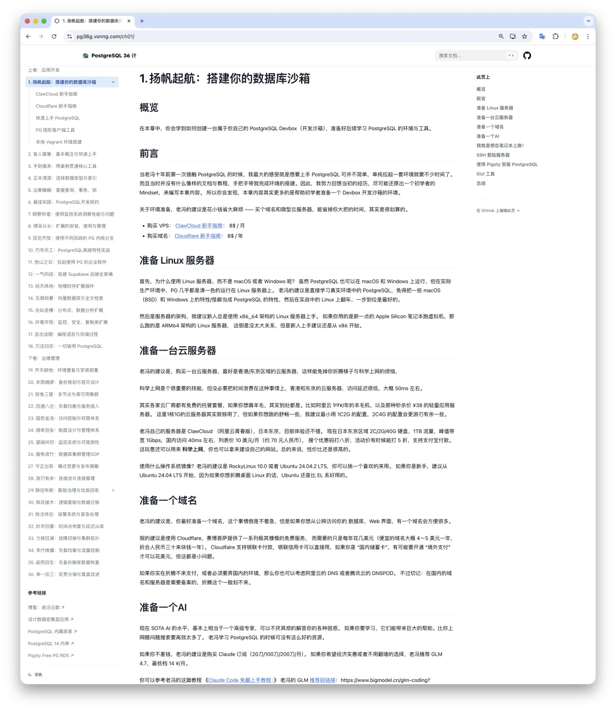

---

## 如何入门 PG？

入门 PG 的第一步，是有一个 PG 实例，而不是有一本什么书。老冯的建议是，你先不要去急着看什么 PG 文档和书，先拉起真实一套生产环境中的单机 PostgreSQL，观察它，使用它，在 AI 的帮助下解决一个又一个的具体实战问题。

老冯的建议是 —— 你不要去折腾什么 Docker 容器镜像，Postgres.App，或者直接去买什么云数据库来用。而是直接学习在真实生产环境中的 PostgreSQL —— 原生运行在裸 Linux 上的 PG，没有各种花里胡哨的东西与中间层。切莫花费大把时间浪费在 “环境配置” 上，这件事，花个 10 分钟，都嫌多。

这就是老冯的 Pigsty 能起到作用的地方 —— 为你提供一个学习 PostgreSQL 的最佳环境！你可以参考 [ClawCloud 新手指南](/cloud/cheap-vps/)[1] 搞一台高性价比的 Linux VPS 作为你的学习环境，然后参考 **Pigsty 快速上手**[2] 教程，用一行命令，十分钟，完成安装过程。

是的，就是这么简单。您完全可以在不了解任何细节的情况下，使用 **预制配置模板**[3] 一键拉起一套企业级质量的 PostgreSQL。接下来，您可以探索 **图形用户界面**[4]，访问 **PostgreSQL 数据库服务**[5]。

---

## Pigsty 是干什么的？

Pigsty 是老冯编写的一套开源 PostgreSQL RDS 方案，目前是开源 PG RDS 中顶尖水准，Star 数也是全球 PG 开源生态里来自中国的 No.1。简单来说，就是自建生产级 PG 数据库服务的套件。让普通研发运维也有能力在没有专业 DBA/数据库专家的情况下，构建起企业级的 PostgreSQL 数据库服务。

“企业级” 一般和 “复杂” 划等号，但 Pigsty 的设计理念是让复杂的东西变得简单易用。所以我们把它设计成了一个开箱即用的方案。而且最妙的是它可以运行在一台 1C/1G 的 Linux VPS 上，完全开源免费。

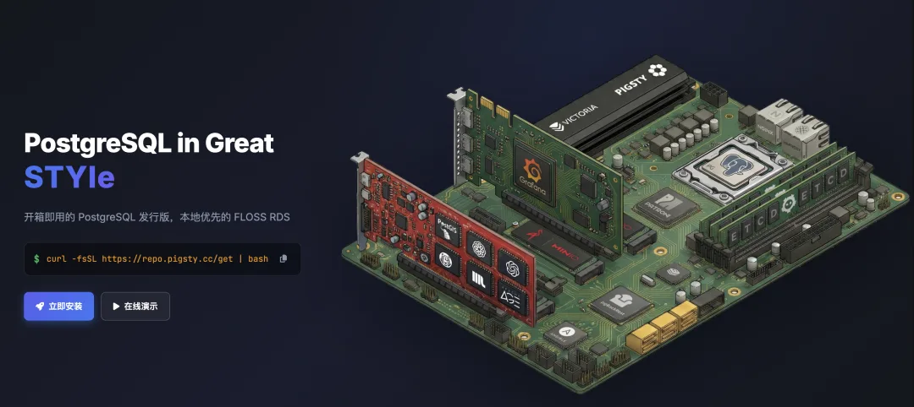

Pigsty 在北欧风格的创业公司 —— 探探中管理了 25000 核 vCPU 的数据库。但它竟然也能完整运行在一台 1C1G 的虚拟机上！所以，我们有许多的研发同事也使用它作为自己的开发沙箱 —— 开发环境，测试环境，生产环境全部统一使用一套方案。这意味着你学到的所有东西可以无缝衔接直接上生产实战。

更好玩的是，他还带有 Nginx，自动替你配置域名，签发 HTTPS 证书，轻松完成网站搭建与交付。它还带有可观测性基础设施，能够让你清楚的知道整个环境中正在发生什么，而不是两眼一抹黑看着黑箱子盲人摸象。

最妙的是，它还带有开箱即用的 Claude Code 和 Opencode —— AI Agent，你甚至可以不用花钱就有一位老师随时指导你！

好的，那说了这么多，让我们来看一看，到底应该如何学习？

## 快速上手

聊了这么多前戏，现在你的手头应该有一个 Linux VPS 了吧？如果没有，可以参考 [这个教程](/cloud/cheap-vps/)\

SSH 登录你的服务器，然后执行以下命令（参见[完整安装教程](https://pigsty.cc/docs/setup/install/)）。

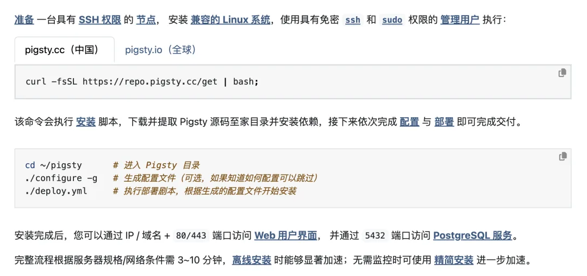

嘿，大概几分钟后，你就有了一个开箱即用的 PostgreSQL 开发沙箱了！让我们来看看这个箱子里到底有什么？

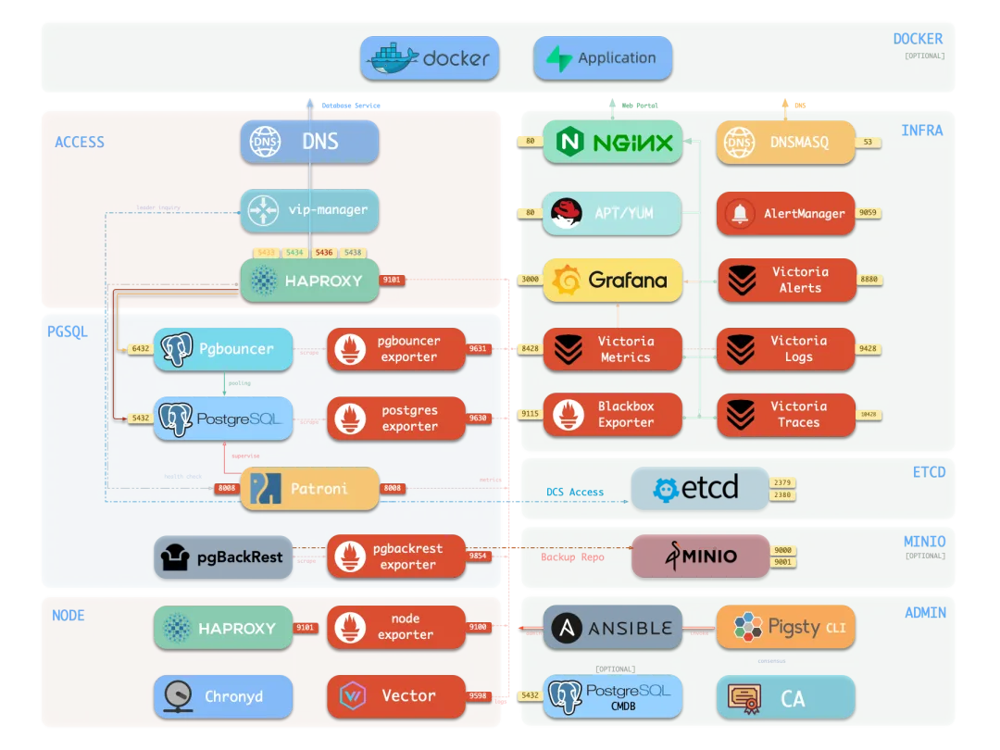

真的有好多东西啊！但别的先丢到一边不管，最核心的东西就是这个 PostgreSQL 数据库了！它默认监听本地的 `5432` 端口。

## 访问数据库

现在，让我们来试一下，退出你的 ssh 连接重新登陆上来，敲一个 `p`，神奇的事情就发生了！你通过 PostgreSQL 自带的命令行工具 `psql` 连接上了数据库！

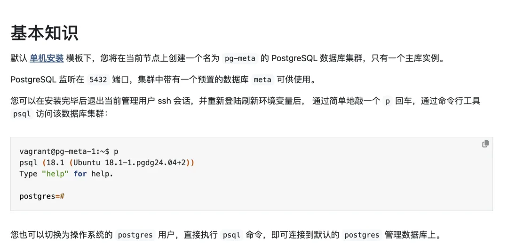

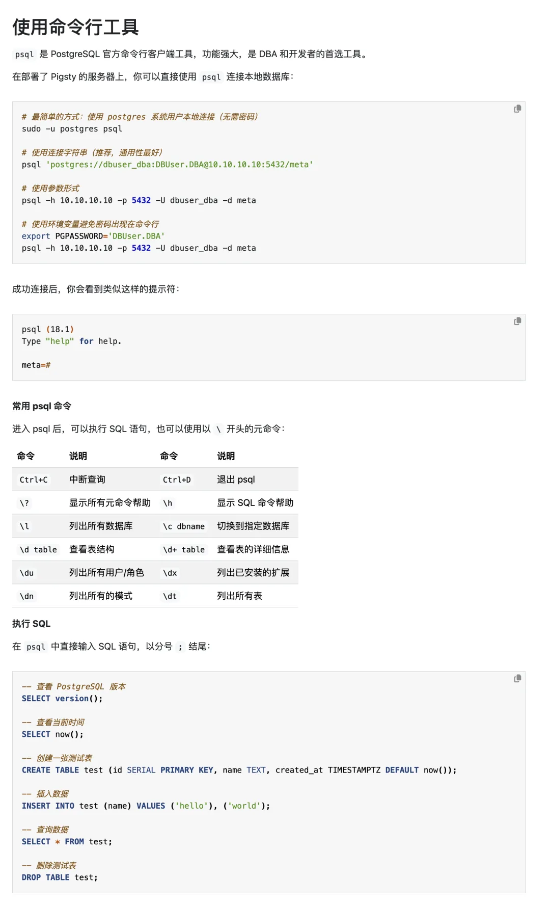

---

## 数据库连接串

你是如何连接上数据库的呢？其实不论是 PG 自带的 `psql`，还是图形客户端工具，想要访问数据库，都需要一些连接参数 通常需要你输入 Host，Port，User，Password，Database 这五个关键信息！

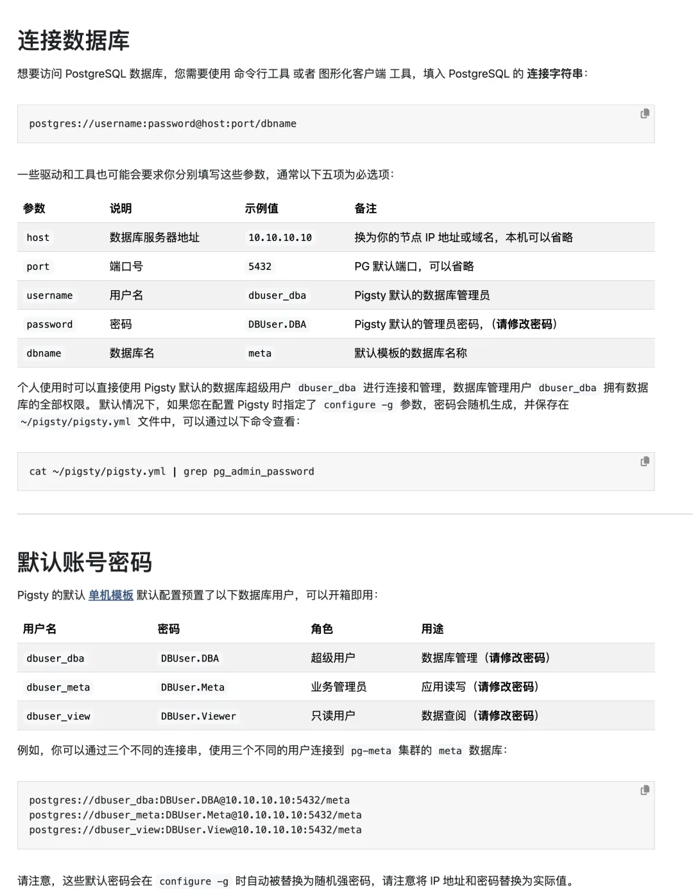

---

## 请老师登场

现在你有一个数据库了！接下来，我建议你找一位 “AI 老师”。如果你不差钱，去买一个 Claude Code 订阅，每月 20 美刀就已经强大。如果你不想花钱，Pigsty 自带的 opencode 带来一些免费的模型，比如 GLM 4.7，你也可以参考老冯的这篇教程 《[Claude Code 免翻上手教程](/ai/claude-code-intro/)：[9]》 买一个订阅计划。

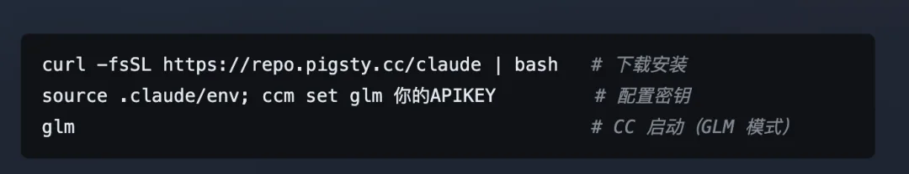

当然，Pigsty 也自带了另外一个 AI Agent —— OpenCode，里面带有一些免费的 Key。我们这里就以 opencode 为例，来看看如何让 AI 老师帮助你学习 PostgreSQL。进入 `~/pigsty` 目录，键入 `opencode`，就会自动启动一个 TUI （终端图形界面） 的程序，你可以在对话框里聊天。

<!-- -->

    cd ~/pigsty; opencode

按下 Ctrl+P 可以切换模型，你可以选择 GLM 4.7 免费模型

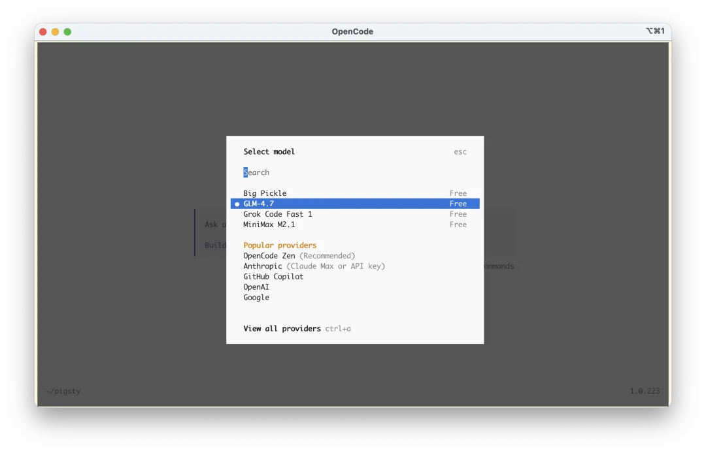

如果你想要登陆付费订阅计划，执行：`opencode auth login` 选择 Zhipu AI Coding Plan 输入密钥即可。

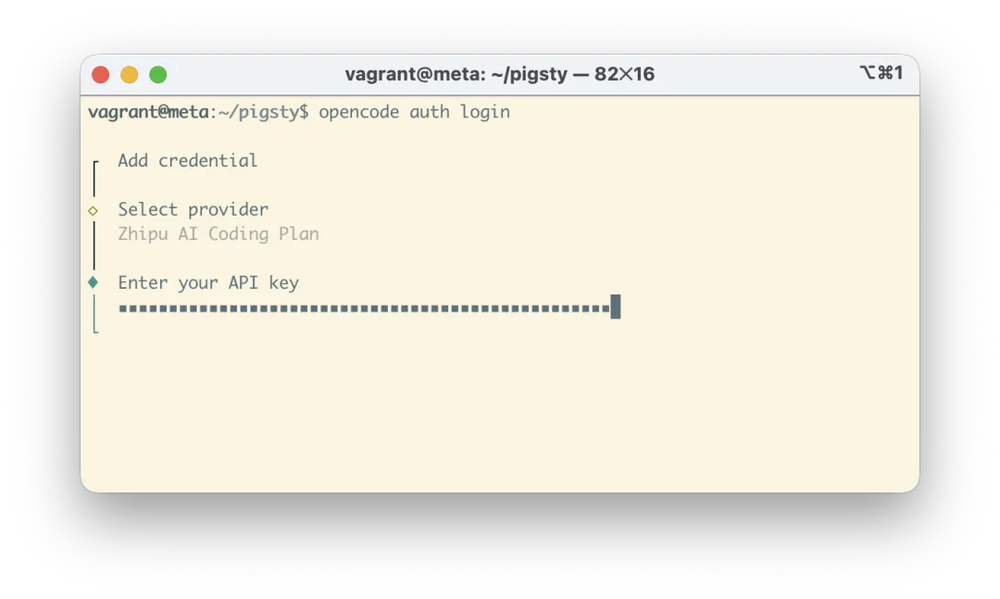

然后，你就可以开始提问了，老冯会在教程里面列举一些常见的问题，供你参考。然后你就可以开始和 AI 老师聊天学习了！

好了！现在你：1 有了一个生产级的标准环境，什么扩展都有。2. 有了一个无微不至的老师给你答疑解惑，现在就可以开始 “修行在个人” 了。

这就叫：授人以鱼不如渔，授人以渔不如授人以全自动捕鱼机。\

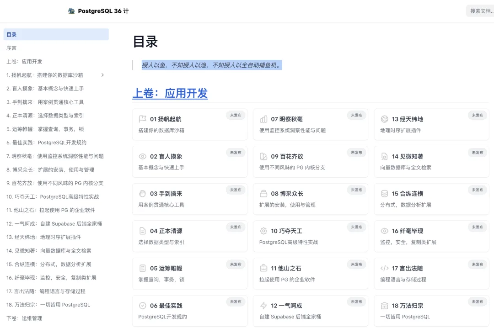

---

## 现在做点什么

现在，你只要开始问问题就好了，这些 AI Agent 干这种事还是很靠谱的。所以关键就是你能清晰的用语言表达出你感兴趣的问题。你可以让 AI 告诉你，如何系统的学习与入门 PostgreSQL。\

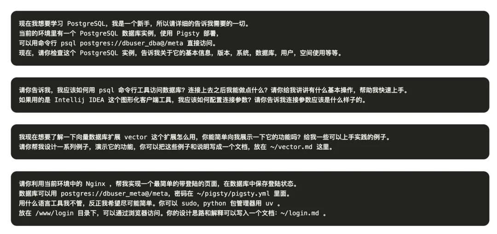

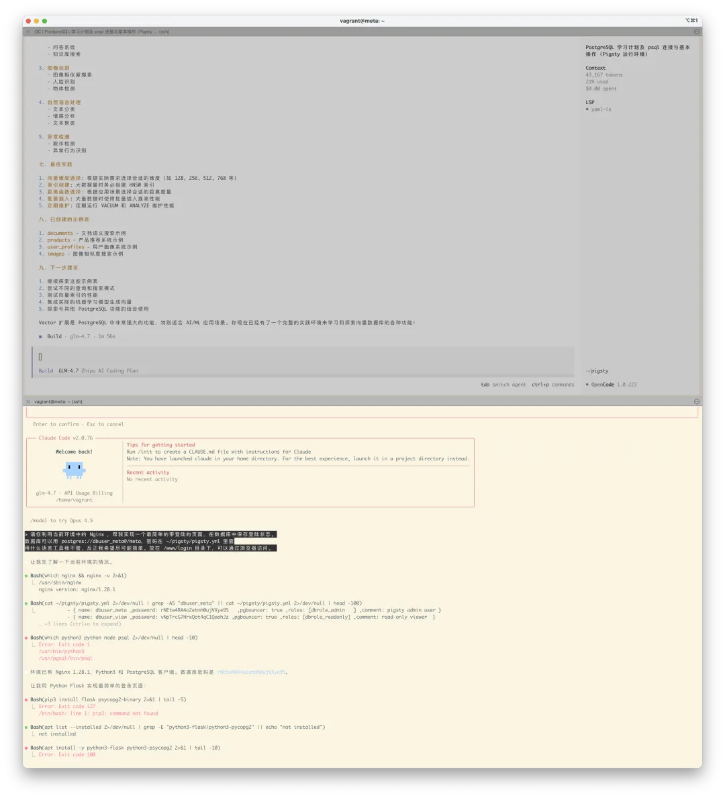

你可以尽情的开 YOLO 模式折腾，反正搞砸了，你可以直接销毁重建，两分钟的事：

<!-- -->

    ./pgsql-rm.yml  # 抹掉当前数据库集群./pgsql.yml     # 重新当前数据库集群

如果你有一些重要的数据已经放进数据库里了，也可以利用 **即时克隆**[10] 功能，瞬间克隆出一个一样的数据库/实例，而且不占用额外的存储 —— 用来随便折腾。

当然，更重要的是找一些有趣的 “项目” 来做。老冯会在后面的教程里准备一系列有趣的问题，以及项目式的教程。比如下面这种：[ISD 数据集：分析全球 120 年气候变化](/misc/isd/)。这种小项目让 AI 带着完整过一遍，关键的东西就都记住知道了。

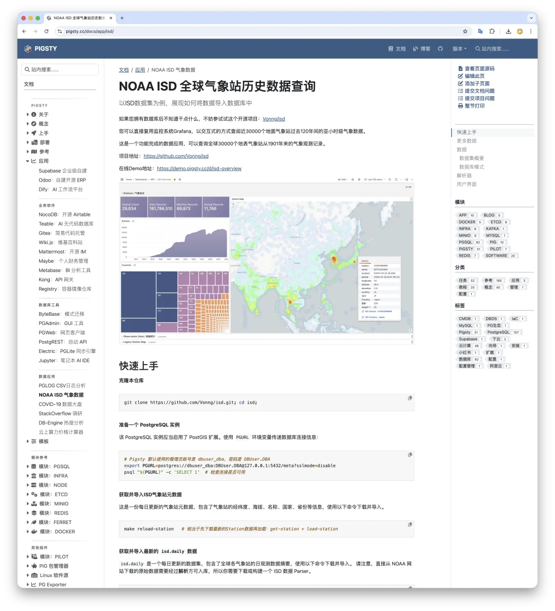

---

## 当然，如果你确实想 “系统学习”

如果你确实想要 “系统性” 的学习 PostgreSQL，那么阅读一遍 PostgreSQL 官方文档是必不可少的。这是一份极好的文档，内容详实，覆盖面广，值得反复阅读。国内唐成老师的《PostgreSQL 修炼之道，从小工到专家》围绕文档进行解读，也是一本不错的入门书籍。

但还是那句话，光看书是没用的，你必须要有一个真实的数据库环境，用真实（或者拍脑袋）的应用与实践场景来动手，才是王道。后面老冯会介绍一些有趣的实战用例，用 PostgreSQL 解决一些具体的问题。

老冯最近也在写一个 PostgreSQL 教程系列，初学者提供一个符合直觉，符合认知习惯的上手学习教程。这篇文章就是其中的一节，欢迎大家关注，后面会持续更新。

### References

`[1]` ClawCloud 新手指南:*/ch01/clawcloud*\

- `[2]` **Pigsty 快速上手**: <https://pigsty.cc/docs/setup/>
- `[3]` **预制配置模板**: <https://pigsty.cc/docs/concept/iac/template>
- `[4]` **图形用户界面**: <https://pigsty.cc/docs/setup/webui/>
- `[5]` **PostgreSQL 数据库服务**: <https://pigsty.cc/docs/setup/pgsql/>
`[6]`这个教程:*/ch01/clawcloud*\
- `[7]` 完整安装教程： <https://pigsty.cc/docs/setup/install/>
`[8]`图形化的客户端工具:*/ch01/gui*\
- `[9]` Claude Code 免翻上手教程：: </ai/claude-code-intro/>
- `[10]` **即时克隆**: <https://pigsty.cc/docs/pgsql/admin/db>

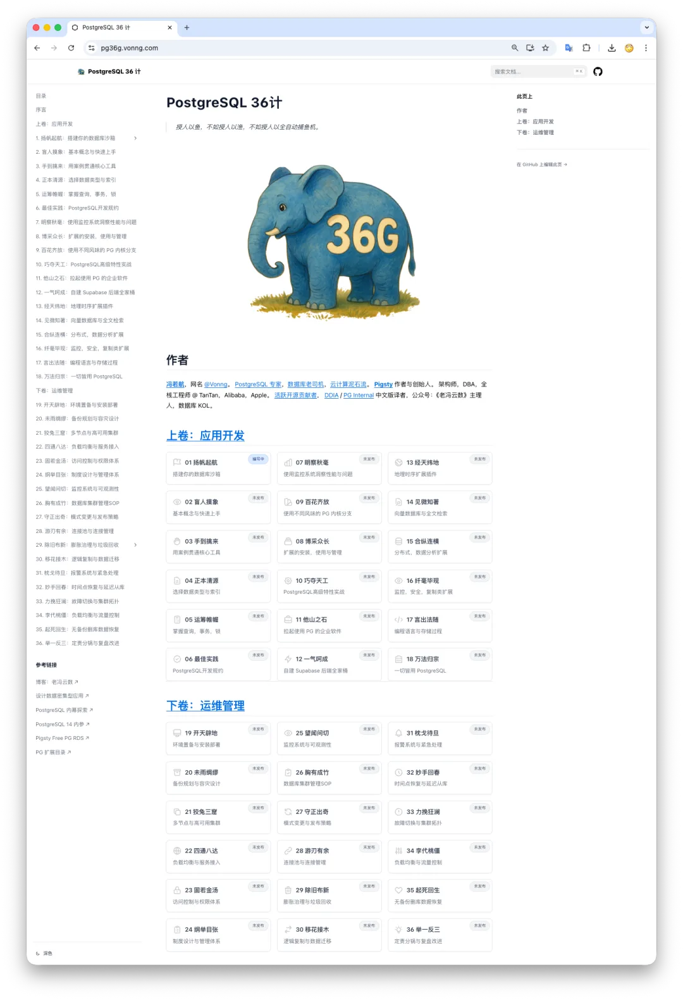

---

发布版本：[微信公众号](https://mp.weixin.qq.com/s/RFb8qcS22EM85hO5-tUNcQ)
