## PostgreSQL 驾驶技巧

PostgreSQL 是一个很棒的数据库，但也相当复杂。上手虽简单，但想要用好不容易，想要管理好就更麻烦了。监控系统是几乎所有运维工作的基础，更亦是驾驭数据库的必备工具。用好一个监控系统，理解各种指标背后的意义并不是一件简单的事情，因此本司机决定写一系列文章，来介绍了 PostgreSQL 监控系统的设计，实施与使用。

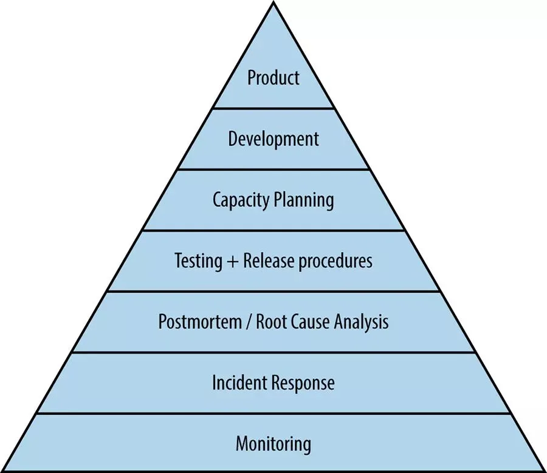

## 0x01 PostgreSQL 监控面板

为了帮助读者形成一种直觉，这里展示了在实际环境中，我所使用的监控面板。最为常用的监控面板为“单数据库实例”监控，并分为 7 个主要的子区域：概览，操作系统，数据库活动与会话，复制，检查点与 WAL，数据库冲突，以及数据库对象统计，如下所示。

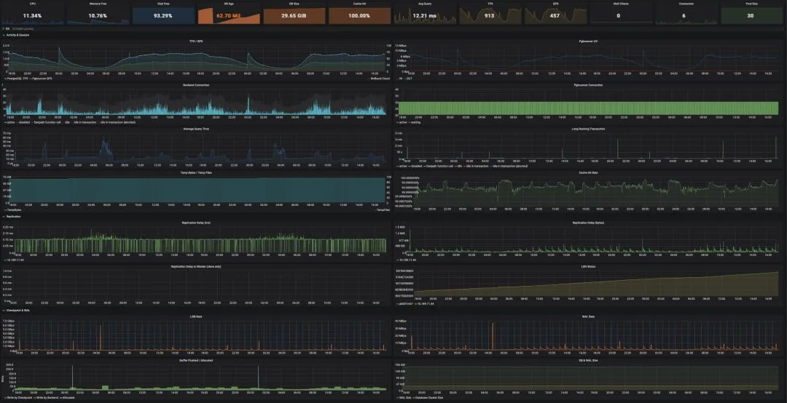

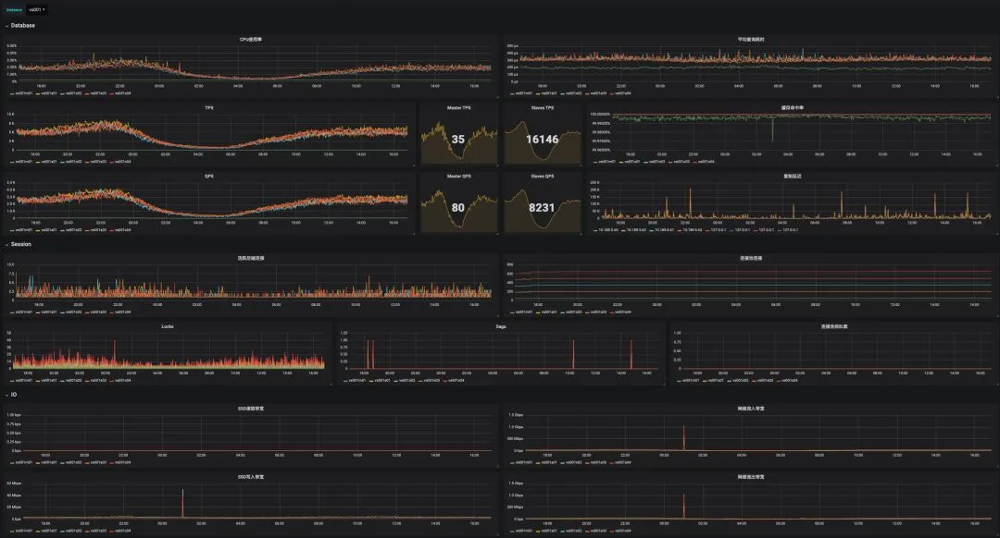

## 监控系统的架构\

程序员的一个基本原则就是：“不要造轮子”。所以如果有现成的开源组件能用，那是最好不过。一个比较简单的实用监控系统架构如下图所示。主要组件包括：Prometheus，Grafana，Consul，以及各个 Exporter。各类 Exporter 从数据库，连接池，以及机器上获取指标数据库，Prometheus 从 Consul 中发现这些 Exporter，并向其拉取数据，Grafana 负责展示 Prometheus 中的数据，而 AlertManager 负责报警相关的任务。

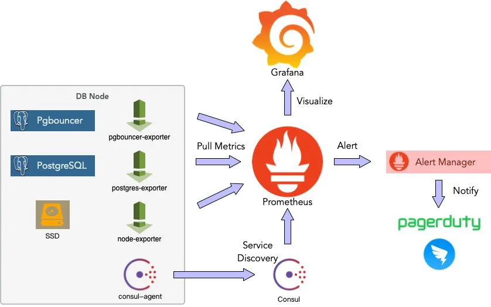

## 监控系统的指标

监控面板与系统架构，不过是监控系统的面子，真正的里子在于监控指标。哪些指标需要监控，每种指标如何解读，这才是真正重要的东西。毕竟知道了这些知识，即使没有监控系统，通过命令行手工检查也可以发现问题，但不了解指标背后的涵义，即使再傻瓜再漂亮的监控面板也于事无补。

下面会简单介绍单实例监控面板中涉及到的指标。

### 概览

概览是一些重要的核心指标，一眼扫过去就应当能大致定位数据库的主要问题。这里主要包括：

- CPU 使用率、平均查询时间、TPS、QPS，连接池排队数，活跃连接数：判断数据库负载水平

- 内存空闲率：判断是否出现进程异常（例如突然被杀）

- 磁盘空闲率：判断磁盘是否被写满

- 数据库年龄：数据库是否快出现事务标识回卷故障。

- 数据库大小，缓存命中率：判断异常活动

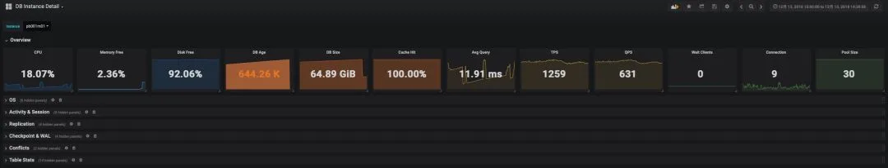

### 操作系统指标\

操作系统指标主要包括：

- CPU 与负载水平

- 内存使用，特别需要关注操作系统`cache`部分的变化。

- 网络与磁盘的 IO 吞吐量，磁盘的 IOPS。

操作系统的指标能直观地反映大部分数据库活动异常，对于硬件类故障的排查尤有帮助。

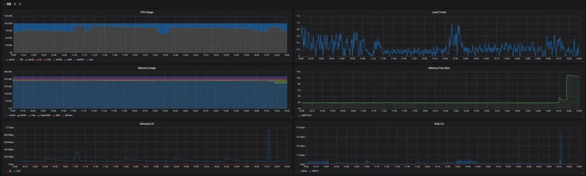

### 数据库活动与会话

Activity 与 Session 是数据库当前状态的直观反映，指标包括：

- TPS/QPS，平均响应时间都是最直接的负载指标。

- 缓存命中率对数据库性能有直接的影响，注意这里只是 PostgreSQL 本身 BufferPool 的命中率，并没有计算操作系统的文件缓存。

- 后端连接按状态的分布，`active`状态的连接是很重要的负载指标，而`idle in transaction`的连接数则需要特别关注。

- 临时文件通常是由一些复杂查询，长查询，过多的临时文件容易导致性能恶化。

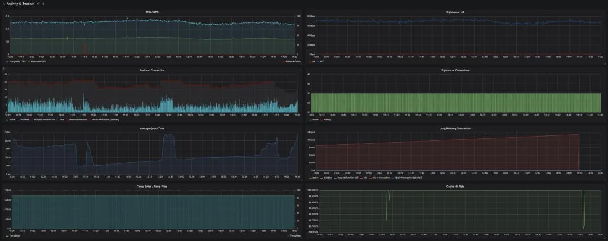

### 复制指标

很多类型的故障与主从复制滞后有关，因此，ReplicationDelay 是一个重要的监控指标。

在主库上可以获取从库的复制延迟，包括 LSN 落后的字节数，以及滞后的时长（v10 以后）。在从库上也可以获得距离主库的滞后时长，但这种方法通常不如前一种准确。

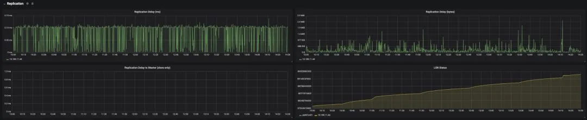

### 检查点与 WAL

检查点会吃 IO，一方面它会引发大量页面落盘，另一方面在默认`full_page_write`打开的情况下，每一次检查点都会导致其后的 WAL 量升高，吃磁盘与网络的带宽。在一些情况下可能会成为故障的原因。因此有必要监控检查点与 WAL，相关指标包括：

- WAL 日志的生成速率

- LSN 增长的速度

- 缓冲区刷回的数目，通常缓冲区刷回主要由 Checkpoint 负责，如果有大量缓冲区由后端进程负责刷盘，就需要检查并调整相关参数的配置了。

- 数据库与 WAL 日志的大小。

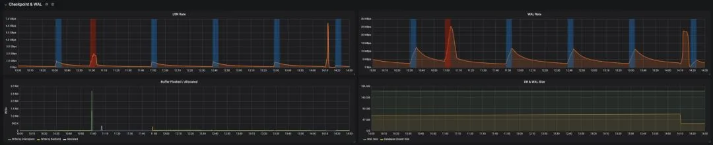

### 锁与数据库冲突

锁按类型分布的数据对于判断数据库活动的类型很有帮助。

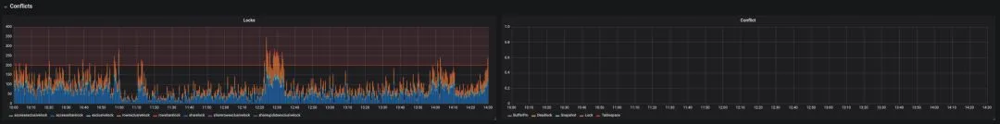

### 对象级统计

对象级统计能够帮助 DBA 快速定位故障的根源。包括：

- 每个表的访问次数：索引扫描/顺序扫描。频繁出现的顺序扫描往往意味着索引出现了问题。

- 表中元组的拉取，修改，增删改查数目，表的大小，年龄，都有助于精确定位问题的来源。

- 死元组的比例：死元组的比例可用于估算表的膨胀程度，对于维持性能很有帮助。（还有另外一种通过统计数据估算表膨胀率的方法）

- 函数的调用次数与执行时间。

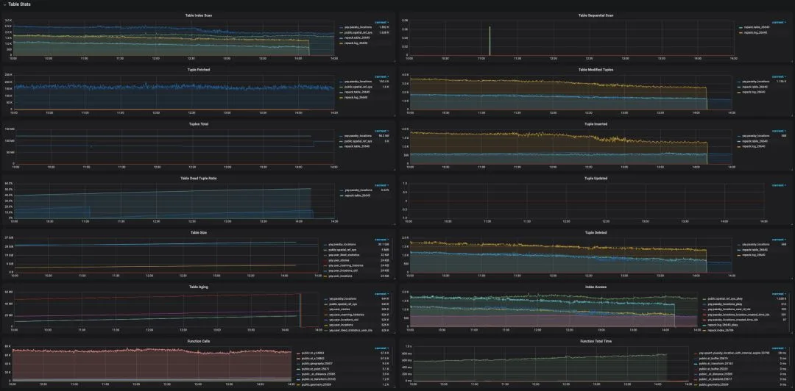

## 监控指标的来源\

### 统计收集器

对于 PostgreSQL 而言，其监控指标主要源于自带的统计收集器。PostgreSQL 提供了很多系统视图，因此能很简单地以 SQL 语句的形式拉取统计数据。系统视图的具体定义可以参考文档，后续文章也会依此详细介绍。其中，比较重要的视图包括：

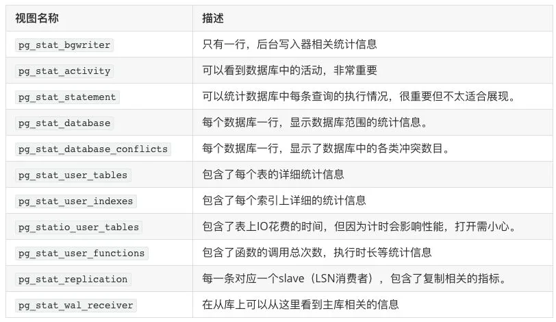

从统计视图中收集数据有一些注意事项：

- 统计数据并非实时更新的，每个服务进程只有在闲置前会更新统计计数。所以正在执行的查询和事务不影响计数。

- 收集器本身每隔（`PGSTAT_STAT_INTERVAL=500ms`）才发送一次新的报告。所以除了 当前进程活动`track_activity`之外的统计指标都不是最新的。

- 在事务中执行的统计查询，统计数据不会发生变化。使用`pg_stat_clear_snapshot()`来获取最新的快照。

<!-- -->

- 要让数据库收集这些统计数据，需要在`postgresql.conf`中打开各种`track_*`选项。

### 系统视图

除了统计视图外，还有一些系统视图也能提供很多有价值的指标信息，例如`pg_database`与`pg_locks`，分别提供了数据库年龄尺寸，以及数据库内的锁等待信息。此外，还有很多系统指标是通过内建的函数提供的。

## 结语

监控是一个很大的话题，够写半本书了，因此这篇文章能做的也就是给读者留下一点直觉：监控系统应该是啥样子的。其实有了以上的信息，一个合格的架构师与 PostgreSQL DBA 应该能很轻松的复现该监控系统了。具体的实现细节，将在后续文章中继续介绍。

---

发布版本：[微信公众号](https://mp.weixin.qq.com/s/97Jmj6oAK0_tG15t3INCPg)
