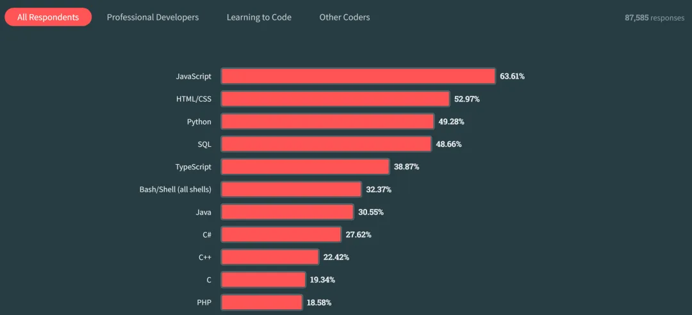
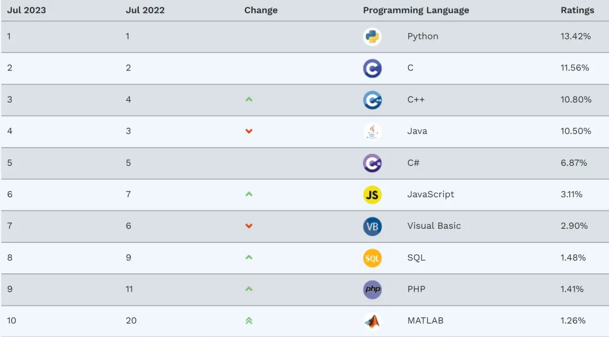
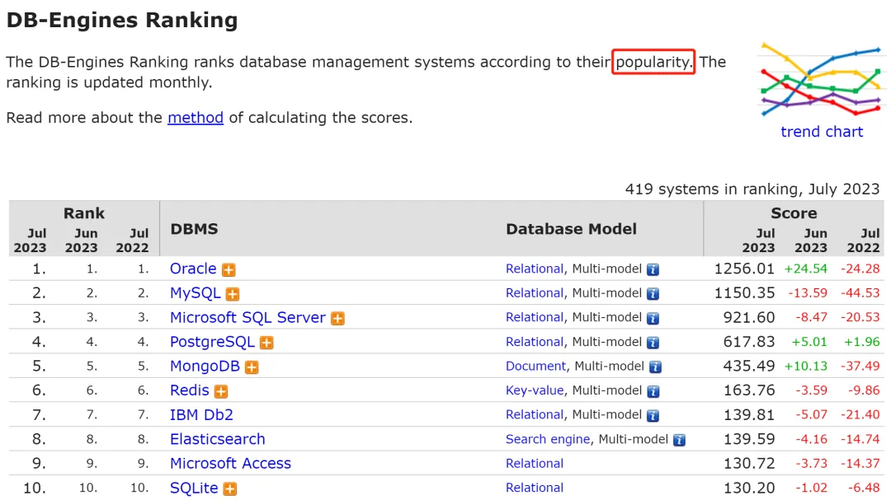

> 原作者：姜承尧

最近有篇公众号文章大火，说 PostgreSQL 是世界上最成功的数据库。姜老师双手插兜，仰望海底星空，心想这篇文章的标题取得真好，妥妥的 1W+的阅读量。为什么自己做不到如此厚颜无耻呢？\

其实，姜老师没这么玻璃心，也没怎么把这篇文章放心上。\
一个卖 PostgreSQL 数据库服务的人，自卖自夸，好为后续自己的生意做铺垫。这就是**那篇文章的底层逻辑**。问题不少 IMG 同学让姜老师出来发言，更有素未谋面的专业数据库内核从业同学在 Twitter 上留言希望姜老师能出来客观地说两句：\

今天，姜老师决定站出来戳破谎言，告诉各位同学真相：*MySQL 才是这个星球最成功的数据库*。首先，让姜老师来戳破文章中关于 PostgreSQL 的谎言。\

谎言\
那篇鼓吹 PG 是最成功的数据库文章中，所有的数据出处是哪？\
是 Stackoverflow 的调查问卷，《Stack Overflow Developer Survey 2023》请问中国的小伙伴们，你们会用 stackoverflow 么？90% 的小伙伴不会使用。\
应该说亚洲的码农，90% 不会使用。\
请牢记这个数字，超过 90% 的中国程序员，不会使用 stackoverflow。相信，即便使用 stackoverflow，但去参与问卷调查的也不会超过 5%。所以，这个调查问卷几乎没有涉及中国市场，凭什么说 PG 是地球最成功的数据库呢？欧美就代表世界么？\
**请问作者，凭什么忽视中国市场？你不是中国人么？**其次，如果在 stackoverflow 注册并寻找答案的码农，大概率是一个刚入门的初级码农。用户画像大概率是不满 2 年的码农，甚至是学生。这是因为，stackoverflow 里面的问题相对简单和初级。这就好比现在，你还会在 ChinaUnix 提问找答案么？\
所以，**一个刚入门的码农，让他来谈哪个语言好，哪个数据库流行，不具有权威性，且很容易被带节奏**。此外，既然是调查问卷，我们要分析看看问卷的结果是否可信。\
不能这个问卷的答案是 A，我们就认为 A 是对的。我们先不谈数据库，先看编程语言：

Stackoverflow 问卷的结果是 Javascript、HTML/CSS、Python 是最流行的编程语言。\
这个结果与大多数人的认知很不一样。因为从这个结果分析，看似问卷的目标群体是初学编程语言方向的程序员。当然，这也与上面我们前面的推测基本一致。\
对比另一个更为权威的编程语言排行榜 TIOBE，其结果如下所示：

可以看到，JavaScript 仅排在第 6 位，而且离 C、C++、Java 都有着 3-4 倍的显著的差距，为什么会在 Stackoverflow 的排行榜中排第一呢？\
回到数据库的领域，专业人士都知道，更为权威的排行榜是 DB-Engines：

PG 仅排第 4，而且离 Top 2 的两强数据库 Oracle、MySQL 有着显著的差距。\
如果说 PG 超越 MySQL、Oracle 数据库，那是不是 MongoDB 会更快超越 PG？因为两者的差距更小，且 MongoDB 的增速也更快。请问作者，为什么不引用最权威的排行榜，而去引用一个小众的不能再小众的问卷调查呢？\
总结：

1、Stackoverflow 没有包含中国的用户，说世界最成功，这个结论肯定是错的。

2、Stackoverflow 主要是初级用户，调研问卷有参考意义，但不具有权威性；

3、在更权威的排行榜中，PG 离 MySQL 的差距还很遥远，而且极有可能会被 MongoDB 超越；

4、原文作者的工作是提供 PG 服务，所以他推崇 PG 是为了招揽自己的生意。

总之，用一堆数字粉饰自己真正目的，而不是说出市场真正的情况，人品如何，交由大家自己判断了。\
最流行的 MySQL

不少 PGer 说 MySQL 流行度在下降，PG 终于超越了 MySQL 数据库。的确，即便从 DB-Engines 上看，MySQL 的流行度也是在下降。\
其实，不仅仅是 MySQL 数据库，Oracle、Microsoft SQL Server 的趋势都在下降。但是趋势下降，是都转去 PG 了么？没有，否则网上为什么没有任何消息呢？一篇 Uber 使用 PG 数据库就让他们自嗨了好久，天天在社区逼逼叨。但最终却又被打了脸：

然而，**MySQL 看似流行度在下降，但其主要原因是：百花齐放**。MySQL 分支版本很多，除了社区版 MySQL，还有 MariaDB、Percona、AliSQL、TDSQL 等。\
同时，云服务普及后，数据库服务并不直接称为 MySQL 数据库服务，而是称为 RDS、Aurora、CDB、PolarDB 云数据库服务等。\
所以，类似 DB-Engines 的统计，不可能完全覆盖所有这些分支版本和云数据库的统计。如果把这些分支版本算上，PG 根本连还手的能力都没有。但 PGer 喜欢拿静态数据看待问题，这就是他们对待事物的认知问题。否则，也不会在如此大环境下，依然继续唱多 PG。那么，PG 真正的流行度如何呢？在之前的文中《[别吹牛了，PostgreSQL 国外也没人用!](http://mp.weixin.qq.com/s?__biz=MjM5MjIxNDA4NA==&mid=2649745252&idx=1&sn=d9687e8c0e973a5d683d5c5792ea5b38&chksm=beb2fa4f89c573595b6869721b3b205cb262eaa07f37cf1d8413401f984b02d1128c523cbd01&scene=21#wechat_redirect)》，已经用更为专业的数据证明：1、在全球：MySQL 是 PG 的 3 倍；2、在中国：MySQL 是 PG 的 6-7 倍；3、PG 最为流行的前五个国家分别是中国、韩国、俄罗斯、亚美尼亚、爱沙尼亚。美国仅排第 67 位；

上述统计，仅按 MySQL vs PG 计算，没有算上 MySQL 的其他分支版本。而在韩国市场，仅 MariaDB 就可以和 PG 扳一扳手腕了。请问原文作者，凭什么说，MySQL 流行度已被超越？为了你的生意，为了公众号吸粉，就能睁眼说瞎话么？你的良心不会痛么？\
最成功的 MySQL

如果说 Linux 是目前为止，世界最成功的操作系统，相信大部分同学会认同这个观点。因为 Linux 通过开放源码的方式，依靠 GPL 协同共建的模式，让一个仅凭个人开发、默默无闻的一款操作系统，成功替代了昂贵的商用 Unix 操作系统。并在互联网的各种应用，牢牢占据了市场份额，成功击退 Windows 操作系统一次又一次的威胁。MySQL 数据库又何尝不是。\
从 2001 年 MySQL 3.23 版本的发布，到现在的 22 年时间，MySQL 数据库取得了下面这些令人瞩目的成绩：1、MySQL 已然成为全球互联网公司核心业务的必选数据库，无论是中国的互联网巨头们，还是海外的科技公司；\
2、MySQL 是公有云数据库市场中，市场占有率最高的数据库，没有之一；3、MySQL 是公有云数据库市场中，营收最高的数据库，没有之一；4、新生代的数据库，大多选择兼容 MySQL 协议为用户提供服务，如 TDSQL、GordonDB、Oceanbase、TiDB、ClickHouse 等；\
古往今来，取得如此成就的数据库，可以说 MySQL 已震烁古今。对比之下，PG 呢？大型互联网/科技公司核心业务几乎没有使用 PG 数据库。即便有，相信占比也不会超过 1%。**中国的公有云数据库市场中，PG 的营收仅有 MySQL 的 0.1-0.3%**。即便 PG 党们天天吹嘘的大数据领域，GreenPlum 也就 1 亿左右的营收规模，且下行趋势显著。为什么在谈论最成功的数据库时，姜老师特别谈及互联网公司的应用和公有云市场的营收呢？因为互联网公司和公有云市场用户的选择是最为公平的赛道。谁是真正好用的产品，用户就会选择哪个产品。没有任何的人情世故。请问原文作者，公有云数据库营收，PG 仅有 MySQL 千分之一的营收，这个数据为什么你不披露？作为专业从业人员，相信你不可能不知道。我知道又有 PG 党们会说 MySQL 是 GPL 协议，不是 BSD 协议，MySQL 归属 Oracle 公司类似这样的问题。那么姜老师可以明确地告诉你，BSD 是彻头彻尾的流氓协议。**在 BSD 协议下，任何一个人都可以剽窃他人代码，然后宣称是自己研发的产品**。如果 Linux 是 BSD 协议，就不可能取得现在这样的成就。可以对比 Linux 和 FreeBSD 的市场份额。同样的，MySQL 的确属于 Oracle 公司，但由于遵循 GPL 协议，Oracle 不可能垄断/停止 MySQL 的研发。最最重要的是，为 PG 背后提供资金的核心公司也全部是美国公司，EDB、Microsoft、Amazon 等。换句话说，**本质上 PG 也是由美国公司控制的开源数据库**。但其实开源数据库背后的公司是谁并不重要。软件与硬件不同的是，只要代码开源，开发人员能做到自主可控，那么就不会出现类似芯片被卡脖子的情形。更别提类似腾讯、阿里这样的公司，已经可以随意对 MySQL 源码进行修改，功能和性能甚至都比原版 MySQL 还要优秀。\
最成功的无实物表演家

真要说 PG 哪个领域最成功，毫无疑问，那就是无实物表演这方面了。\

其实这么多年，PG 一直假装自己很行，很忙，但它从来没有真正成功过。TP 数据库领域，他说 MySQL 不是对手。\
AP 大数据领域，他说 Java 写的 Hadoop 算什么。\
流数据处理领域，他说 Flink 也配谈是自己的对手。\
但请问 PG 在哪个细分领域真正成功过？\
PG DBA/开发们是无实物表演的影帝们。没啥核心业务在使用，也没对公司贡献多少营收，却在老板面前一次又一次的表演未来将会有多美好。\
而真正做决策的老板们，他们不是傻子。相反，他们是最最聪明的一群人。骗得了一时，骗不了一世。\
因此，PG 真正要做的是先选择一个赛道，在这里获得最大的收益。然后，你不会谈自己是不是世界上最成功的数据库。因为你的客户会倒逼着你不断砥砺前行，还哪有时间整天吹牛逼呢？\
To MySQLer

最后的最后，我想和 MySQLer 们好好谈谈。正如前文所讲的那样，姜老师明白 MySQLer 大多忙于工作，养家带娃，对于业界这样胡说八道的文章也不放在心上。过去 10 几年间，相信 MySQL 都是 Stackoverflow 问卷调查中 No.1 的数据库，MySQLer 没有吹嘘自己的数据库有多牛。MySQL 是云数据库市场占有率最高，营收最高的数据库，MySQLer 也习以为常。\
自己开发/运维的 MySQL 内核/平台运行在互联网最为核心的业务上，MySQLer 也都保持平常心，想着如何让 MySQL 变得更快、更好。\
但是，当抹黑 MySQL 的文章出现时，除了姜老师外，你们也应该站出来，大声地说出实情。当劣币驱逐良币时，这才是数据库这个领域最大的悲哀。这么多年，姜老师始终相信，一个人的光芒虽然很微弱，但正义的光芒不会消失。每个 MySQLer 都可以有一些自己小小的贡献，例如点赞并转发这篇文章到朋友圈，到自己所在微信群/工作群。这样能让一些不明就里的年轻码农们少走弯路，让不少被无良商家忽悠的企业们及时止损。以上。\
*BTW：本文已开白名单，任何个人和社区都可以转载，无需通知作者。*\

往期推荐

MySQL 数据库性能提升竟达 30%~50%？！原来这个优化这么厉害！

MySQL 9.0 要来了，这些新特性，你期待么？

2023 年了，还有人在谈分布式数据库是不是伪需求

预告，MySQL 数据库即将登顶世界之巅！

程序员，按 45% 交税，算什么水平？

没错，我们不再需要 DBA 了！

特斯拉刹不住车？MySQL 性能差？你们的良心不会痛吗？

扯下最后一块遮羞布，国外大厂们都在感谢马斯克

Oracle 数据库是真的没落了！

别吹牛了，PostgreSQL 国外也没人用！

---

发布版本：[微信公众号转载页](https://mp.weixin.qq.com/s/rqziG1oP87REwhe33OAmlw)
