8 月 9 号晚，开源中国举办了一场 《MySQL 和 PostgreSQL，谁是世界第一？》的主题辩论活动。我作为 PostgreSQL 方的代表参与。本来我准备了一些数据与资料，想着来一场建设性的交流，擦出点思想火花。却不想这场直播在姜某人的胡搅蛮缠下，变成了一场闹剧与笑话，我感到遗憾 —— 对不起观众们的时间。

回放地址：<https://www.modb.pro/video/8261?slink>

这场辩论的缘由要追溯到上个月我写的这篇文章：《[PostgreSQL：世界上最成功的数据库](/pg/pg-is-no1/)》。姜某人立即针锋相对的回应了一篇《[MySQL：这个星球最成功的数据库](/pg/mysql-most-successful-db/)》。可惜文中充斥着大量事实性错误，谎言与诡辩，扣大帽子和人身攻讦。

其人在直播中更是变本加厉：在事实数据和技术理论都辩不过的情况下，使出了无赖一般的撒泼手段。在技术讨论中，对于数据上的挑战视而不见，把我的个人简历搜出来诘问，诉诸人身，口吐芬芳，扣大帽子，实在难绷。侮辱了活动嘉宾，浪费了观众时间，更是中国互联网行业与 MySQL 社区的耻辱。

与这样的人对垒，即使赢下了辩论，也让人有吃苍蝇的感觉。但我秉持这样一种理念：你不能把世界让给那些你所厌恶的人。所以即使恶臭难当，我也要捏着鼻子上来干，为 PostgreSQL 正名。他选择了不体面，那我就用数据与事实来帮他体面。

带有完整数据引用链接的版本，请点击查看原文

---

## 最近更新：

昨天辩论完后，姜的公众号还特意发了篇文章：《这个前阿里 P5 架构师，竟然说 OceanBase 打榜 TPC-C 是傻 X 行为》，继续人身攻击，因此在这里更新一些回应：

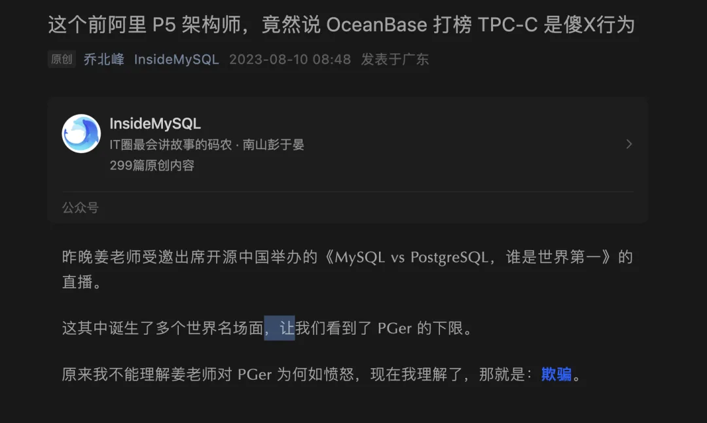

直播喷人没够，还想继续呢？

这个标题虽想嘲讽我，但我确实曾经是 P5 架构师，以及，我确实认为 TPC-C 打榜是 SB 行为。

关于后者，直播中我针对的是姜拿出来吹的 TDSQL 打榜，但明人不说暗话，我确实也认为 OB 打榜 TPC-C 是 SB 行为。更有甚者，我甚至认为在当下，这些分布式数据库本身已经成为伪需求了：《[分布式数据库是伪需求吗？](/db/distributive-bullshit/)》

---

## 更新：关于个人履历

姜在直播中浪费大量时间质疑我代表 PostgreSQL 社区的资格，可惜是踢到了铁板上。

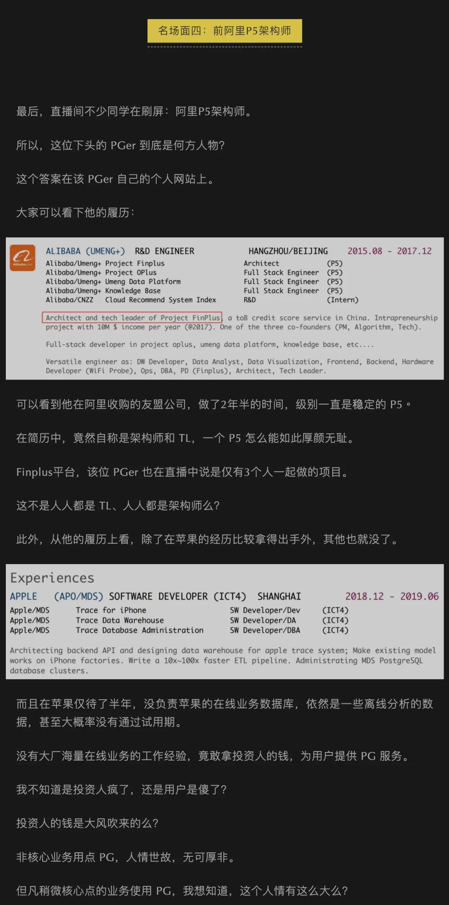

我对自己的履历非常自豪，也不怕任何质疑；直播中，姜还给我扣上“不是中国人不爱国”这种大帽子，我乃中国护照无境外永居，说起来，一个拿绿卡的人给别人扣这种帽子真的很搞笑。

在阿里期间，我曾在友盟 FinPlus 担任 Tech Leader，和另外一位产品经理与算法工程师一起搞起了这个内部创业项目，从 16 年到现在每年 1 个亿营收，是友盟营收的扛把子。就是在这个项目里，我选型了 PostgreSQL + Go，从阿里这个 Java 与 MySQL 的大本营中独自杀出了一条血路。我本科毕业 3 年时间拿下苹果 ICT4 = P8+，7 年时间拿投资自己出来创业当 CEO。姜想用 P5 架构师这个来羞辱我，我就当它在给我打广告了。

实际上我最有代表性的工作经历既不是在阿里也不是在苹果，是在探探 —— 这个北欧风、小而美的创业公司，与一票瑞典 Old School 工程师，各领域顶尖人才共事的几年。这里在技术水平与品味上吊打一系列所谓的“互联网大厂”。450 万数据库 QPS，一两万核的 PostgreSQL 数据库集群，几百 TB 不重复的 OLTP 数据，这样的 PostgreSQL 部署规模与负载水平，在当时放在全中国排进前三不成问题。

无论是在阿里，探探，还是苹果，我的工作始终紧密围绕着 PostgreSQL。而现在，我更是选择成为 PostgreSQL 方向的创业者，为全球 PostgreSQL 用户与中国的数据库事业做出自己的贡献。我为 PostgreSQL 生态贡献了一个最强开源监控系统 Pigsty，在 OSSRank 中 PostgreSQL 生态项目中排名第 39；我为社区维护打造了一个开源免费，开箱即用的 PostgreSQL 数据库发行版，一次性用户在解决使用 PostgreSQL 会遇到的各种问题。我们的商业模式就是帮助用户用好 PostgreSQL，提供专业的支持、咨询与服务。并不是姜所说：因为我卖 PostgreSQL 服务，所以我说 PostgreSQL 好，恰恰相反，是因为 PostgreSQL 好，所以我才会全身心投入到这个领域中。

除此之外，我还是一名独立开源贡献者，在 Github Star Ranking 上，以 21951 总 Star 在全球开发者中排名 526。我翻译过 《设计数据密集型应用》 与 《PostgreSQL 指南：内幕探索》 两本书，前者是互联网应用开发的经典名著，后着是数据库内核原理剖析，我也在各种大会与论坛上分享了大量原创新颖的 PostgreSQL 相关案例。

我本人是 PostgreSQL 中文社区的开源技术委员，经过社区主席与委员们的支持与同意，代表 PostgreSQL 中文社区参加本次活动。反观姜，直播一上来就自己不代表公司与 MySQL 社区只代表个人。既然它不能代表 MySQL 社区，又来参加这个活动作甚，反而还倒打一耙质疑我能不能代表 PostgreSQL 社区？这就是以己度人了。

所谓一粉顶十黑，我不知道姜为 MySQL 生态做了什么贡献，但它四处恶意攻击诋毁其他数据库引战的行为早就引发了不只是 PostgreSQL 社区的强烈反感，毫无疑问是 MySQL 社区乃至整个中国互联网技术界的声誉负资产。可惜它这次恐怕踢到铁板上了：德哥这样的翩翩君子难防它这样的龌龊小人，但我们这一代就是要敢同恶鬼争高下，不向霸王让寸分，舍得一身臊，也要把姜这种技术界的害群之马给揪出来。

---

## 更新：关于打榜 SB 行为

我确实认为打榜是一种 SB （sysbench）行为。TPC-C 已经是 30 年前的老东西了，没有办法有效反映当下数据库性能，技术参考价值还不如 sysbench：这是一个可以靠堆机器来近乎无限刷高数字的评测，在 OB 打榜前已经有快 10 年没人来玩了。OB 和 TDSQL 这两个数据库花了几个亿放了个大炮仗，给国外评测委员会滋滋送钱，放卫星吹亩产万斤的牛逼，请问这不是 SB 行为是什么？

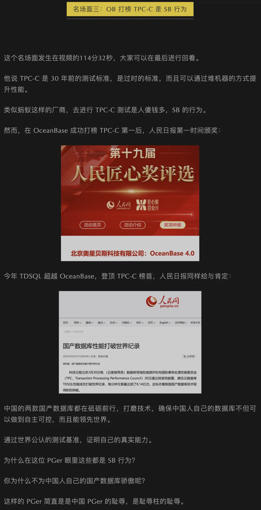

这样的傻子与骗子，才是真正让“国产数据库”蒙羞的罪魁祸首。而且，我不仅认为这种行打榜行为本身是 SB 行为，我认为这类分布式数据库本身就是伪需求！参见拙作：《[分布式数据库是伪需求吗？](/db/distributive-bullshit/)》关于 TPC-C 打榜，请期待我后面会写一篇专门的文章，来揭开这里的画皮。

关于 TPC-C 打榜的有趣评论

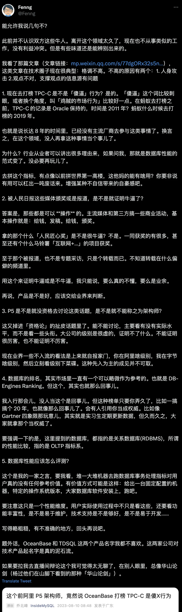

---

## 更新：MySQL 事务机制缺陷

姜的驳文中，唯一与技术搭边的，就是这个 MySQL 事务原子性缺陷问题了。

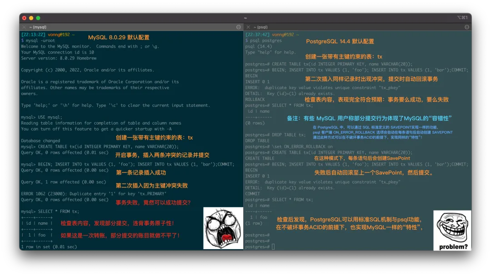

MySQL 事务原子性缺陷

在这个例子中，我们使用 MySQL/InnoDB 最新版本，默认配置，开启一个事务执行两条 DML 语句。第一条成功，第二条失败，最终执行 COMMIT，结果竟然是部分成功的中间状态。

这个问题，至少在 2 年前《[为什么说 PostgreSQL 前途无量？](/pg/pg-is-great/)》中，我就抛出来了。当时引发了 PostgreSQL 与 MySQL 社区的震惊与讨论，最后 MySQL 社区嘴硬认为这是一个 Feature 不是缺陷。

ACID 原子性的定义特征是：能够在错误时中止事务，丢弃该事务进行的所有写入变更的能力。简而言之：All or Nothing。在这个例子中，第二条语句失败后执行 COMMIT 后最终的结果是“中间状态”。不管 MySQL 方如何辩解都无法改变这一事实：MySQL 在默认情况下允许用户做出这种违背原子性的蠢事。

要求用户自己显式决定处理 COMMIT/ROLLBACK，等于把这一责任推卸到了开发者身上。如果这是一个 Bug 那还好，修复了就行；如果这是一个 Feature，那就是 Stupid by Design：默认允许用户做蠢事，除非显式配置。PostgreSQL 的哲学恰好相反，或者说，一个头脑正常的软件，它的设计原则都应当是：默认不允许用户做这种会导致数据错漏丢的蠢事，除非用户显式声明。考虑到 MySQL 的用户小白比例更高，这种原子性上的设计缺陷，以及隔离等级上的实现缺陷（参见：《[并发异常那些事](/db/concurrent-control/)》），就更说不过去了。

---

## StackOverflow 问卷说了什么？

2023 年 StackOverflow 调研结果新鲜出炉，来自 185 个国家与地区的 9 万名开发者给出了高质量的反馈。在今年的调研中，PostgreSQL 在数据库全部三项调研指标（流行度，喜爱度，需求度）上获得无可争议的全能冠军，成为真正意义上“最成功”的数据库 —— "*PostgreSQL is the Linux of Database!*"

当我们说一个数据库“成功”时，究竟在说什么？评价一个数据库有许多标准：功能、质量、安全、性能、成本，但没有哪种可以普世泛用。不过 Succeed 既代表成功，又代表继承，所以成功与“后继有人”相通。对一项技术而言，用户的规模、喜好、需求决定了生态的繁荣程度，唯有这种最终存在意义上的神意裁决 —— 才能让所有人心服口服。而连续进行 7 年的 StackOverflow 年度开发者调研为我们窥见技术发展流行趋势打开了一扇窗户。

PostgreSQL 现在是全世界最流行的数据库

PostgreSQL 是开发者最喜爱欣赏的数据库！

PostgreSQL 是用户需求最为强烈的数据库！

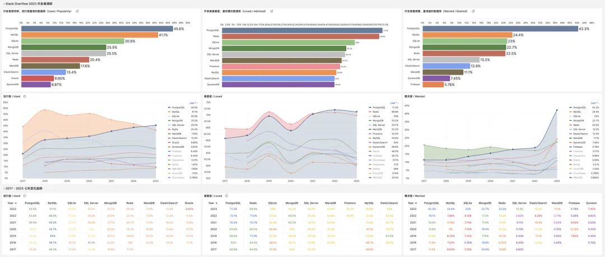

StackOverflow 2017 - 2023 调研数据整理

过去 7 年 SO 调研数据展示地址：Public Demo \| Github Repo：dbrank

流行度代表过去，喜爱度代表现在，需求度代表将来，这三个指标很好地反映了一项技术的生命力。存量与增量，时与势都站在 PostgreSQL 一侧，恐怕在几年内恐怕都不会有任何能挑战 PostgreSQL 地位的竞争对手。

关于 StackOverflow 问卷数据的解析，还请参考拙作：《PostgreSQL：世界上最成功的数据库》

分析这份问卷调查结果，特别是关于 PostgreSQL 与 MySQL 的数据，我们不难得出以下结论：

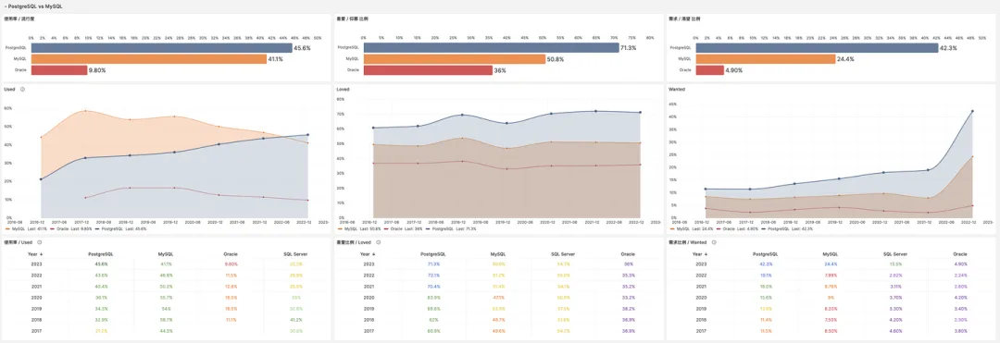

SO 问卷调查：PostgreSQL vs MySQL

1. PostgreSQL 流行度持续上升，正在崛起，势不可挡。

2. MySQL 流行度持续下降，正在过气，持续衰落。

3. 从全球来看，MySQL 的流行度已经被 PostgreSQL 超越了。

---

## StackOverflow 问卷能否代表全球？

开门见山，一顶大帽子先上来。作者认为这个调查问卷没有涉及中国市场，所以不足以称 “全球”。

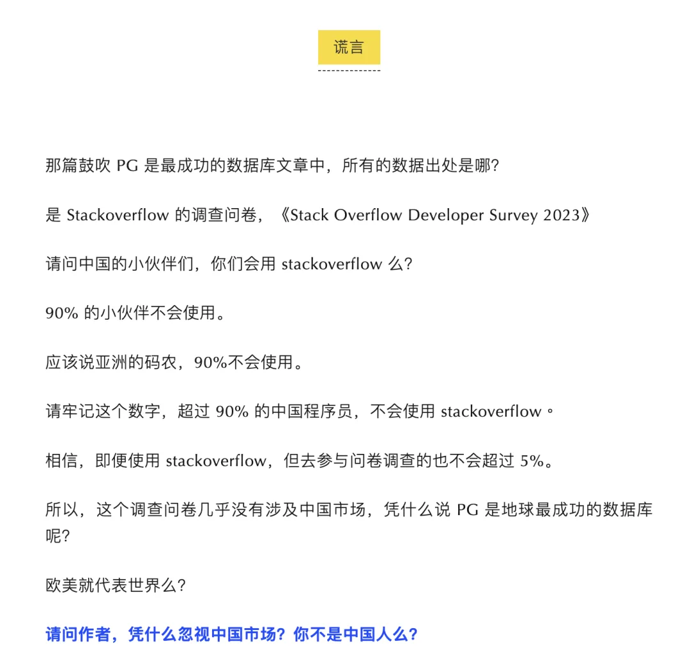

“你不是中国人么？”

诚然，中国用户由于众所周知的原因，在国际社区参与度偏低。例如，StackOverflow 2023 调研的用户画像中，中国开发者仅占总数的 0.75%，排名第 28，显然与一个“开发者大国”的身份不相符。

<https://survey.stackoverflow.co/2023/?utm_source=so-owned&utm_medium=blog&utm_campaign=dev-survey-results-2023&utm_content=survey-results#key-territories-all-countries>

不过在全球范围内的流行度，PostgreSQL 升 MySQL 降的结论，并不会因为中国开发者参与度偏低而有改变：而只要这个趋势是确定的，那么结论 3，这个交叉点的发生就是必然的：Soon or Later。根据现有数据，这个流行度的交叉已经在今年发生了。但是我们可以深入探索一下这个问题：如果中国开发者按照应有的比例参与了这一次全球问卷调查，结果又会有什么不一样呢？

要用中国开发者校正全球调研数据，我们要确定两件事：未参与调研的中国开发者应当占多大的权重比例，以及这些未参与调研的中国开发者中，MySQL 与 PostgreSQL 的使用率各自是多少。

根据 Github 用户统计，中国开发者约全球开发者总数 10% (1 千万 of 1 亿)，根据 新华网 报道，2022 年中国数据库市场占全球 7.2%。考虑到 StackOverflow 2023 调研已包括 0.75% 的中国开发者，综合以上三方面考虑，可初步将未纳入统计的中国开发者比例定为 8%。

因为没有其他权威数据可供参考，我们合理假设中国市场开发者中，使用 MySQL or PG 任一数据库的开发者比例与全球相同 ( (41.1 + 45.6) / 2 = 43.35)，而两者的比例分布与 百度热搜 给出的半年指数（pgsql:mysql = 1260:5283）成正比，则根据假设可估算得：

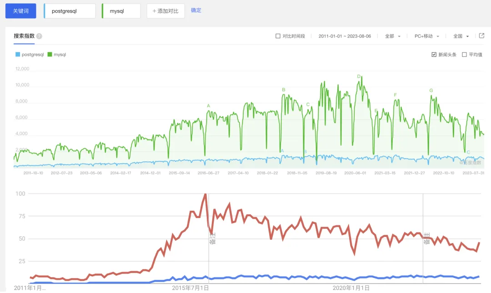

百度指数：PostgreSQL vs MySQL

中国 PostgreSQL 使用率约为：2 \* 43.35 \* 1260 / (1260 + 5283) = 16.7%，中国 MySQL 使用率约为：2 \* 43.35 \* 5283 / (1260 + 5283) = 70%。

按照加权算法，今年中国修正后的全球数据库流行度，仍然是 PostgreSQL 高于 MySQL：

PostgreSQL: 16.7 \* 0.074 + 45.6 \* 0.926 = 43.46%

MySQL: 70 \* 0.074 + 41.1 \* 0.926 = 43.24%

<http://demo.pigsty.cc/ui/d/sf-survey/stackoverflow-survey?orgId=1&viewPanel=57>

可以看出，即使经过“未参与的中国开发者”的估算校正，全球开发者中 PostgreSQL 与 MySQL 的流行度关系依然没有发生质变。我们即使退一万步说，所有参数都使用最利于 MySQL 的估算，最多也就是将这个转折点推迟几个月的时间。

至于算上未纳入调研的中国开发者后，PostgreSQL 到底什么时候超越 MySQL 成为全球最流行的数据库，今年年初或是明年年中那已经不重要了。

---

## 菜鸟都在哪儿呢？

作者又提出，StackOverflow 答问卷的大概率都是菜鸟。我相信他一定没有完整阅读 StackOverflow 2023 开发者调研的完整报告，否则不会出现这种基础的事实性错误。

StackOverflow 在 Developer Profile 中完整给出了参与调查人口的画像。其中概率最大的用户群体是具有 5-9 年（专业）编程经验的开发者，国内大致属 P7 层次，怎么也称不上是刚入门的初级码农与学生。事实上本次调研中无论是学生，还是初学码农的比例都是清楚给出的：学生的比例只有 2.6%，而初学者的比例为 5.6%，无论如何也称不上是 “大概率”。

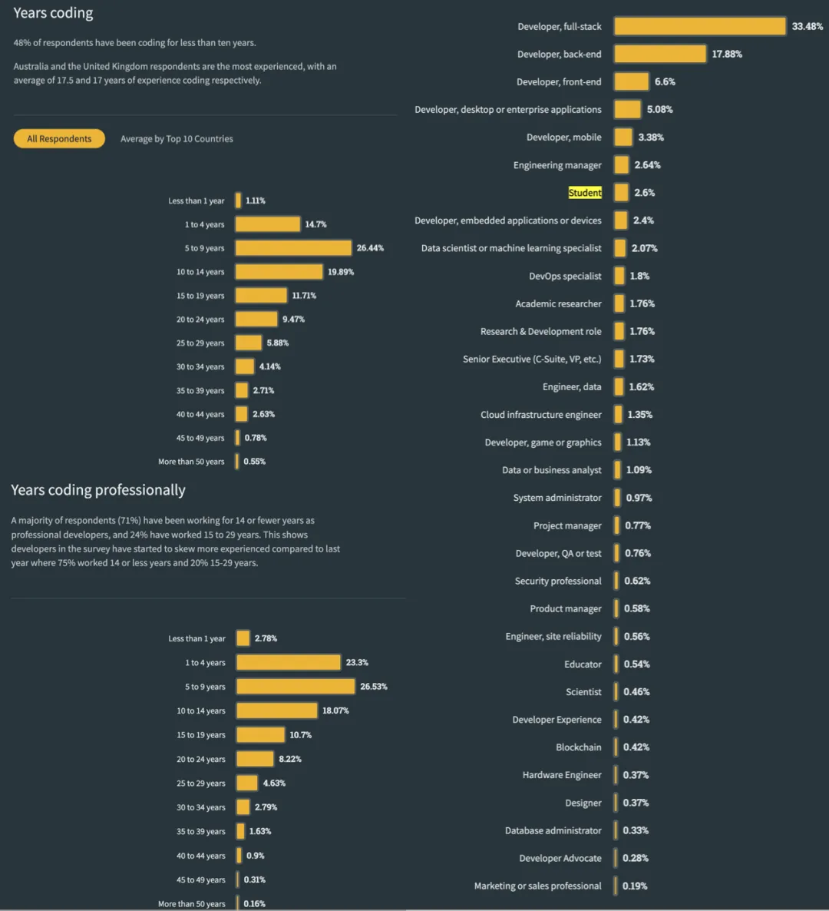

SO Survey Developer Profile

对于数据库调研，Stacok Overflow 还给出了一个有趣维度：专家与初学者。总体中，专业开发者占 94.4%，菜鸟占 5.6%。我们可以清楚看出 PostgreSQL 更受专家欢迎（使用率：49.1% vs 40.6%），而菜鸟会更偏爱 MySQL （使用率：58.4% vs 25.5%）。

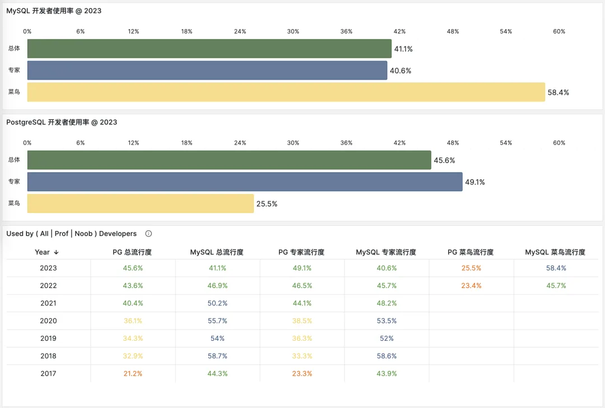

PostgreSQL vs MySQL：专家与初学者使用率

在 “Worked with & want to work” 一节中，我们还可以看出：对于菜鸟来说，唯一显著的数据库间流动正是从 MySQL 流向 PostgreSQL 的。这意味着很多菜鸟开发者在成长为专业开发者的过程中，从 MySQL 迁移到了 PostgreSQL。

初学者数据库转移和弦图

综上所述，StackOverflow 调研的主体是专业的开发者，而且在专业开发者中，PostgreSQL 要比 MySQL 更受欢迎的多 —— **在专业开发者中，PostgreSQL 的流行度在去年就已经超越 MySQL 了。**

---

## 搜索引擎指数更权威？

在文章的第一部分，作者又对 StackOverflow 问卷调研的可信度提出质疑，理由是有一个 “更为权威” 的数据库排行榜：DB-Engine。而在 DB-Engine 排行榜上，MySQL （2nd）比 PostgreSQL（4th） 更高。

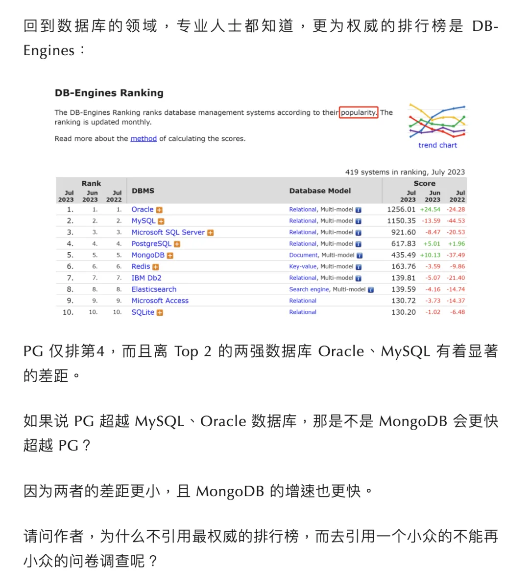

所谓 “最权威” 的数据库排行榜 DB-Engine 属于综合性热搜指数，将 Google，Bing，Google Trends，StackOverflow，DBA Stack Exchange，Indeed，Simply Hired，LinkdedIn，Twitter 上的间接数据合成了一个热搜指数。

在统计分析中有许多种数据收集方法，不同的方法有不同的可信度与说服力。当你没有其他数据可以参考时，DB-Engine 可以作为一个参考。但想要推翻问卷调查的结论，必须使用具有更高可信度/说服力的数据，而不是一种可信度/说服力更低的数据。

StackOverflow 年度调查属于对全世界开发者的一次抽样调查，使用问卷调研的形式，具有中～高程度的可信度与说服力。对于数据库流行度、喜爱度、需求度这样的问题，普查、实验、大数据这些方法成本过于高昂（无限趋近于不可能），可行的数据收集方式也就是 问卷调研，案例研究，搜索引擎 这几种。

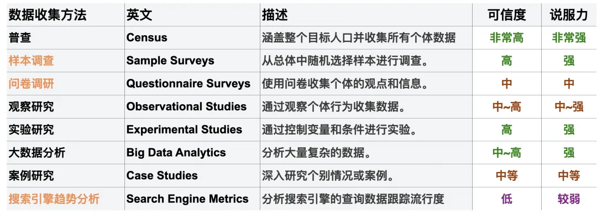

StackOverflow 作为全球开发者密集的大本营，已经连续进行了 7 年的开发者年度调研。2023 年参与者更是达到了 9 万，是一个非常惊人，也足够具有代表性的样本数量。（作为参照，Github 的 Octoverse 年度调研也只有 1 万出头的样本）。称其为最为权威的全球开发者问卷调研恐怕也没有问题。Stack Overflow 作为一种问卷调研/样本调研的第一手数据收集方式，在可信度与说服力上是显著强于任何搜索引擎趋势分析的。

根据最近三年的热搜分数进行线性回归

搜索引擎热搜数据具有一些局限性：首先：指数可以比较准确地揭示一个关键词本身的流行度趋势变化，但横向可比较性没有那么强。其次：你无法区分用户搜索的目的，究竟是因为喜爱支持，还是遇到了糟心的问题需要解决，最后：PostgreSQL 至少具有 5 种变体名称：pg，psql，pgsql，postgres，postgresql，在 SEO 上相比 MySQL 天生处于劣势。

尽管如此，我们依然能够从 DB-Engine 中看出 PostgreSQL 流行度持续上升，MySQL 流行度持续下降的趋势。实际上，排行榜 Top10 的数据库除了 PostgreSQL，热度全都在下降。而 Top20 的数据库热度再抛除两个大数据分析产品 Snowflake 与 Databricks 也全都在下降。可以说 PostgreSQL 是数据库领域一枝独秀的存在！

尽管从 DB-Engine 热度榜上来看，PostgreSQL 的热度仍然不及 MySQL，按过去三年的趋势回归的交叉点大约在 2031-05，没有支持我们的结论 3（已经发生）；但好在这个问题本身已经被说服力更强的问卷调查回答过了，那么说服力更弱的热度榜也无法推翻这一点。

综上所述：DB-Engine 同样证明了 PG 升 MySQL 降的趋势，但无法推翻问卷调查得到的精准的流行度对比结论。

---

## 搜索引擎趋势上的洞察

作者接着根据“搜索引擎数据”提出：全球 MySQL 流行度是 PostgreSQL 的 3 倍，在中国 MySQL 流行度是 PG 的 6 ~ 7 倍。我们上面已经说过了，搜索引擎热搜的数据无法推翻具有更强效力的问卷调研，但这不妨碍我们来看一看这些搜索引擎数据又能为我们带来什么新的洞察？

韩国是 MySQL 热度最高的一批国家中唯一的一个发达国家

首先来看 Google Trends，搜索 PostgreSQL 与 MySQL 两个关键词，可惜 MySQL 没有“主题”类目，PostgreSQL 没有 “软件” 类目。我们按照下面的配置拉取最近 30 天的热搜数据。

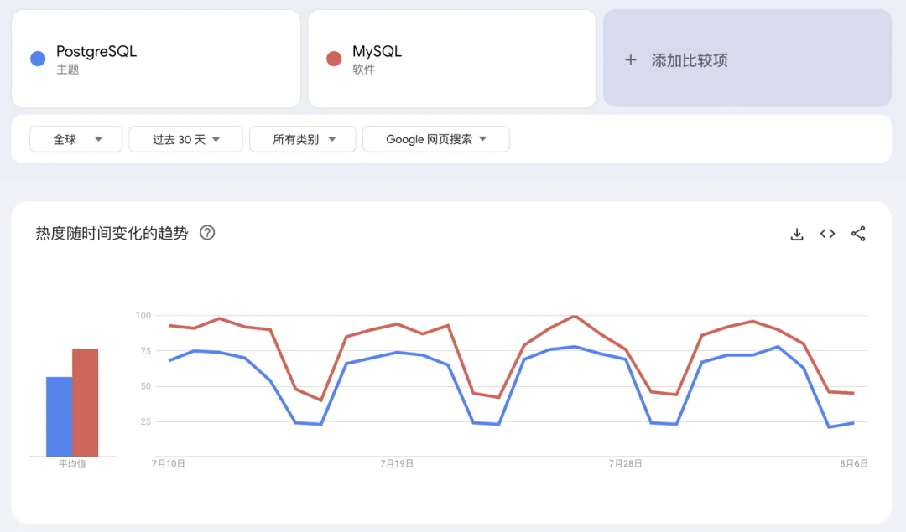

没有选择字词搜索的原因是：PostgreSQL 有至少 5 种拼写变体

可以看到，全球 MySQL:PgSQL 热度 = 57:77，约 1.35 倍，多 1/3 是有多，多 3 倍，这就属于夸张了一个数量级了。

让我们把时间拉长到最大的 2004 年至今来看一看，可以看出 MySQL 从 2004 年迄今，有着非常明显的一个热度衰减。而 PostgreSQL 从大约从 2014 年，开始有了一个蓬勃的增长。（当然和 MySQL 都在疫情三年被砸掉一个坑）。

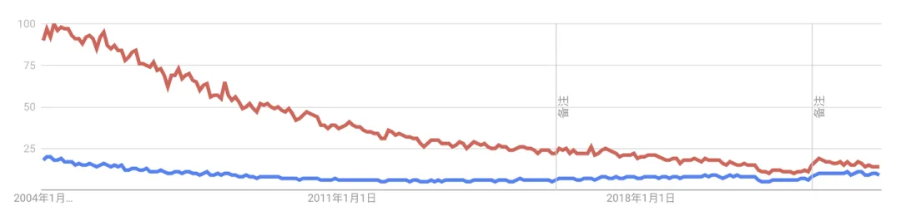

MySQL vs PostgreSQL 全球热搜指数

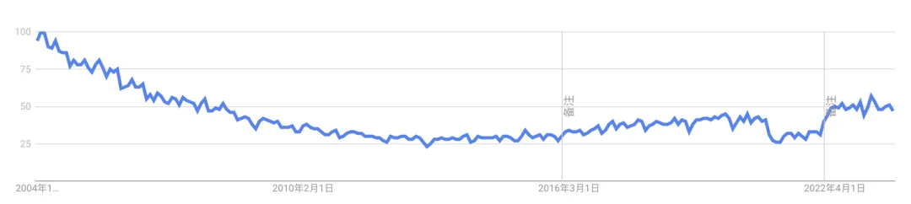

PostgreSQL 全球热搜指数

接下来让我们看一看按照国家区分的 PostgreSQL vs MySQL 搜索引擎指数相对比例，这里我们拉取最近一个月的数据 看看当下最新的情况：可以看到，并不像原作者说的：“PostgreSQL 相对流行度最高的国家是中国，美国仅排名第 67“，事实是，PostgreSQL 相对流行度最高的国家是 哈萨克斯坦与俄罗斯，美国排名第 18（PostgreSQL:MySQL = 53:47，PG 更高），而中国，则是 PostgreSQL 相对流行度最低的国家！二不像是作者所说：中国是 PG 最流行的国家，这种事情用直觉都可以轻松得出结论。

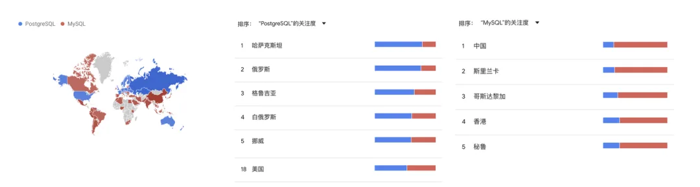

默认未包括搜索量较低的地区，分别按照 PG / MySQL 的关注度排序

全球搜索引擎数据，依然支撑我们 PostgreSQL 流行度不断增长，MySQL 流行度不断衰减的判断。当然，与 DB-Engine 一样，全球的热搜指数目前仍然是 MySQL 略高一筹，但依然无法推翻问卷调查得到的精准的流行度对比结论。当然，这也不妨碍我们继续看一看，有哪些国家，PostgreSQL 直接连热搜指数都干翻 MySQL 了。

---

## 哪些国家 PostgreSQL 更流行？

首先，让我们来看看旧世界霸主两极 —— 美国与俄罗斯的情况。有趣的是，拉取这两个国家的热搜指数，PostgreSQL 都已经超过了 MySQL。

在美国的数据中，PostgreSQL:MySQL = 69:61，PG 热度约是 MySQL 的 1.13 倍，在俄罗斯的数据中则更为离谱，PostgreSQL:MySQL 达到了 70:22，也就是 3.18 倍！而中国的数据相反：过去 30 天，MySQL 热度是 PostgreSQL 的 4.8 倍。

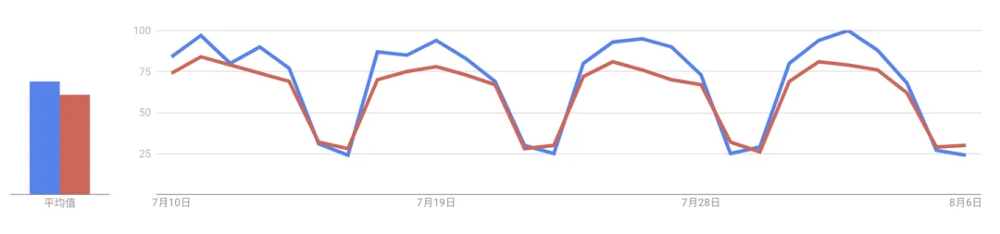

美国 30 天热搜：蓝色 PostgreSQL，红色 MySQL，69:61

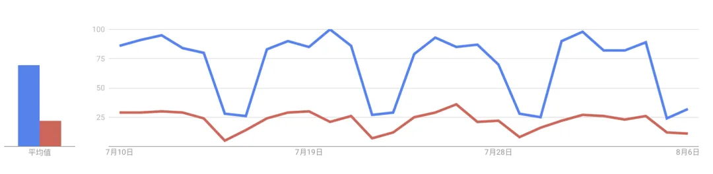

俄罗斯 30 天热搜：蓝色 PostgreSQL，红色 MySQL，70:22

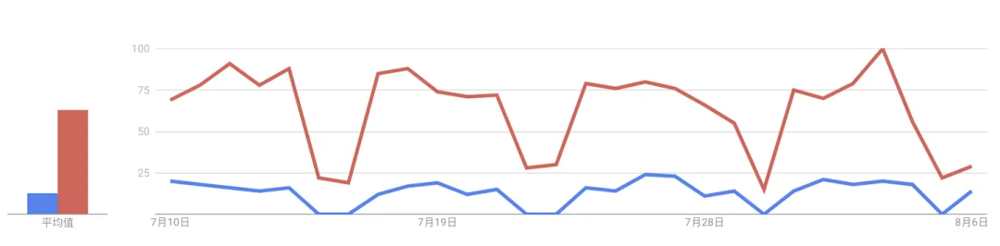

中国 30 天热搜：蓝色 PostgreSQL，红色 MySQL，13:63

作为一个参考对照，我还特意检查了俄罗斯国民搜索引擎 Yandex，与中国国民搜索引擎百度指数的数据，结果基本上与 Google Trends 对应地区的指数吻合。

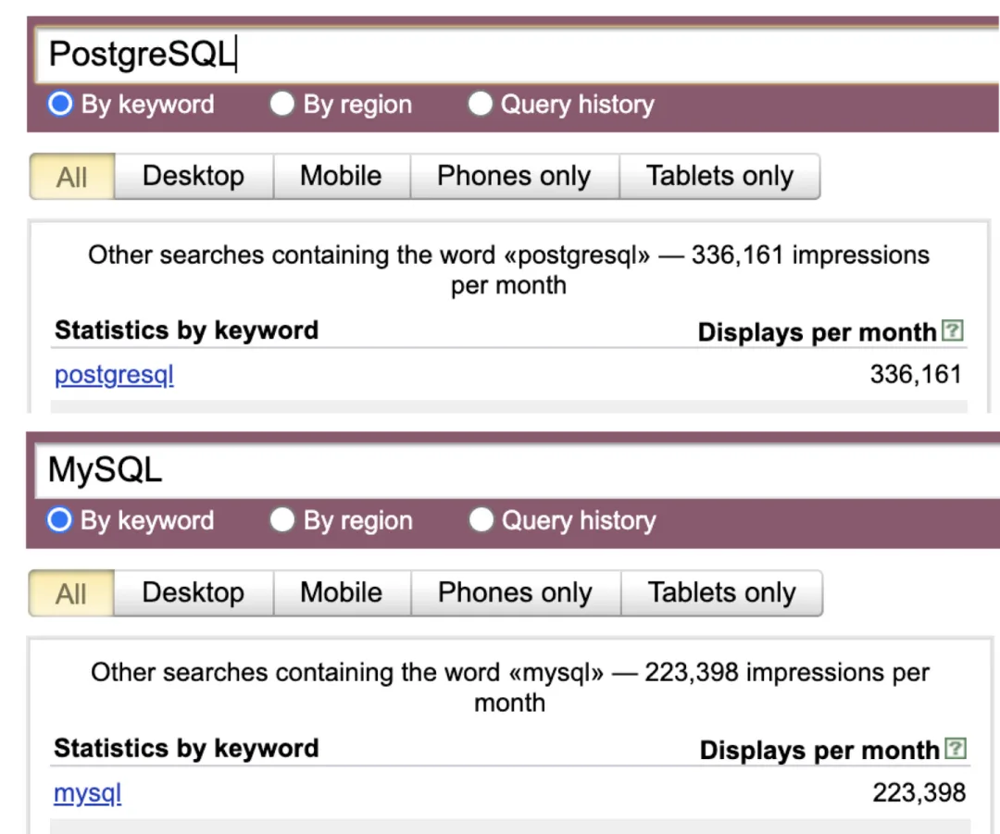

Yandex 最近 30 天关键词统计：PostgreSQL 是 MySQL 热度的 1.5 倍

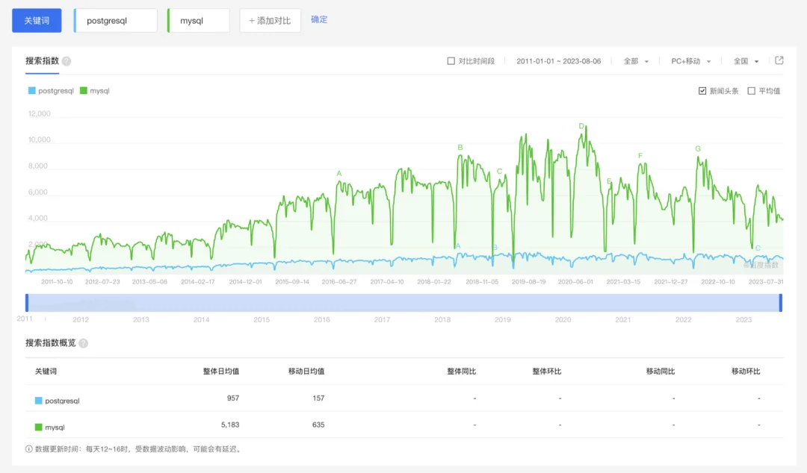

百度指数最近 30 天：PgSQL:MySQL = 1228 : 4360，MySQL 热度约为 PG 3.5 倍

当我们下载 Google Trends 按地区划分的 30 天相对热度数据，并绘制在柱状图上，不难发现，越是发达国家，PostgreSQL 相对 MySQL 的使用率越高！例如，左侧是 PostgreSQL 相对热度最高的国家，右侧是 MySQL 相对热度最高的国家，发达国家用绿色标出，发展中/不发达国家用红色标出。这里可以看到，原作者特意强调的“韩国”，恰好是 MySQL 使用率 Top 国家中最显眼的，唯一一个发达国家特例。

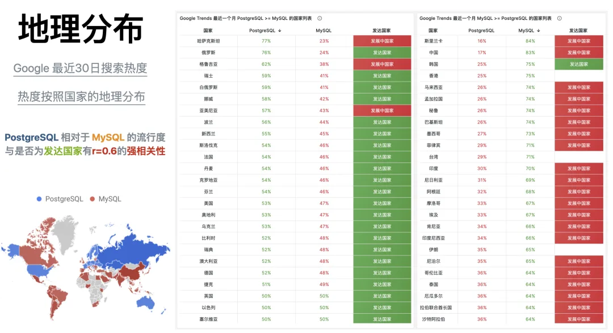

如果我们定量分析，PG - MySQL 热度差值与发达国家这个变量之间的相关性，会发现两者的相关系数高达 r = 0.6，踩在了强相关的门槛上。

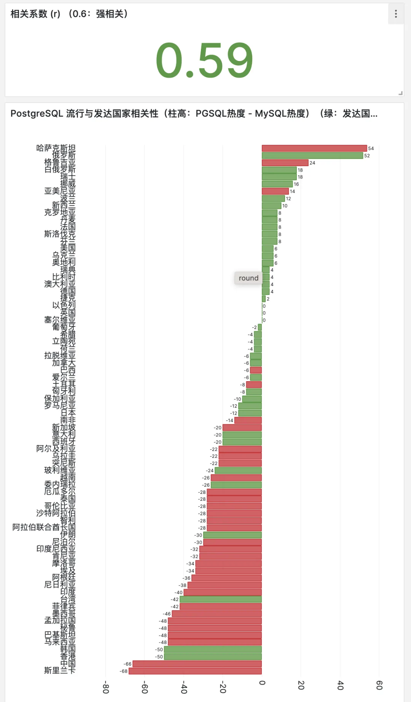

越是发达国家，PostgreSQL 的搜索热度就越高；虽然相关未必因果，但不禁让人对着里面的原因感兴趣。这可倒真是应了 PostgreSQL Slogan 那句：世界上最先进的开源关系型数据库。

---

## 中国特色

在 Google Trends 上，中国则有些特殊：像是热度图向右偏移了 10 年左右的样子。MySQL 在中国的热度在 2014 - 2015 年达峰 （也许与阿里上市有关），随即进入衰退通道。与全球走势保持 10 年左右的滞后关系。

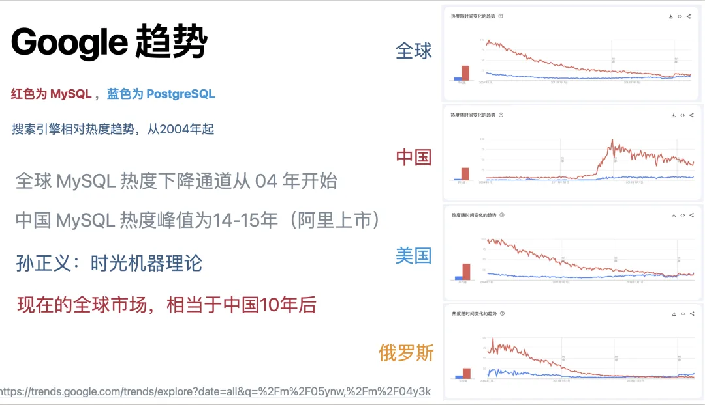

在百度指数上，也能观察到类似的起伏，此外，相比 Google 中国地区热搜趋势，还有额外 5 年的滞后性。

当年苏联点错了科技树，走了真空管计算机而不是晶体管集成电路的路线，错过了信息时代浪潮，当引以为戒。押宝过时的数据库技术虽然不至于像点错芯片科技树那样伤筋动骨，但也是巨大的人力物力财力智力浪费，不可不察也。

华为作为民族企业标杆，战略眼光是没得说的。在 10 年前就很明智的选择基于 PostgreSQL 9.2 进行分叉，打造自己“自主可控” 的 openGauss 数据库，不带正眼瞧 MySQL 一眼，就已经很能说明许多问题了。

---

## MySQL 的用户都流失到哪儿去了？

作者能够承认 MySQL 的流行度是在下降，这是不错的，但究竟是转去 PG，还是其他数据库了呢？

毕竟，MySQL 树大招风：前有狼后有虎，上有野爹下有逆子：在严谨的事务处理和数据分析上，MySQL 被同为开源关系型数据库的 PgSQL 甩开几条街；而在糙猛快的敏捷方法论上，MySQL 又不如新兴 NoSQL。同时，MySQL 上有养父 Oracle 的压制，中有 MariaDB 分家，下有诸如 TiDB，OB 之类的兼容性新数据库分羹。那么，到底是谁起了主要作用呢？

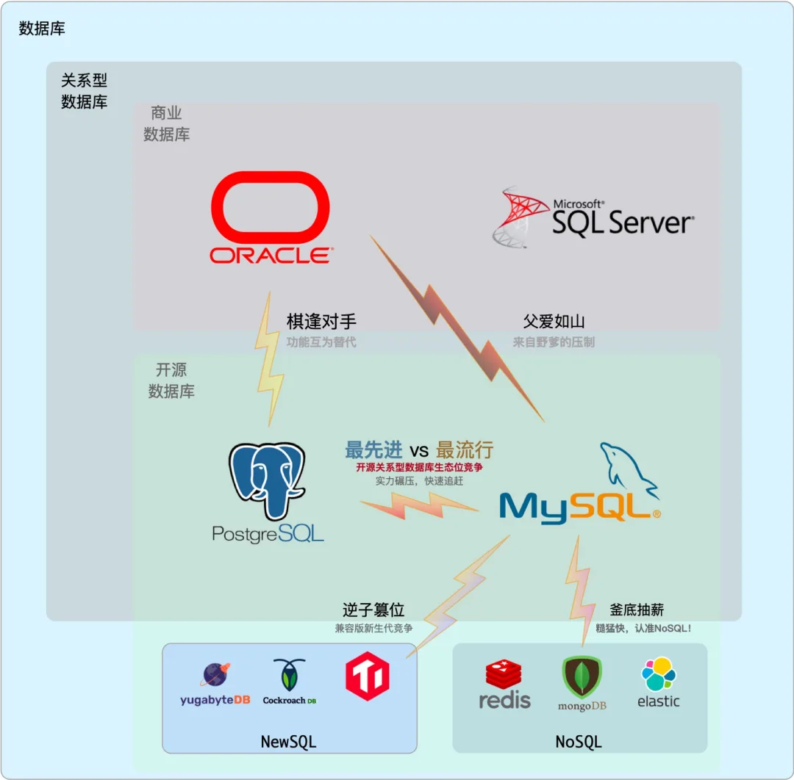

数据库生态位竞争关系图

从定性分析的角度，PostgreSQL 是 MySQL 最大的竞争对手，在 DB-Engine 上排名前 20 的数据库中，唯有 PostgreSQL 保持正增长 （刨除两个大数据的），有能力吃下这块蛋糕。但具体 MySQL 用户流失到哪儿，还是要靠定量分析才有说服力：

如果我们将 StackOverflow 过去 6 年间，MySQL 流行度的下降值与 PostgreSQL 流行度的上升值画到一张 XY 散点图上，会发现两者具有极强的负相关性，相关系数 r = -0.96。特别是，如果我们将 MySQL 和 PgSQL 的流行度相加，几乎可以看到一条水平线，我们可以合理推断，这是由于**此消彼长，MySQL 用户大量转移至 PostgreSQL 导致的。**

---

## MySQL 百花齐放？

作者认为 MySQL 流行度下降是因为百花齐放导致的。

MySQL 跟其他数据库比较的时候，也许可以提一提这个事，唯独和 PostgreSQL 不行。在百花齐放，生态繁荣这一项上，没有数据库可以比得过 PostgreSQL。在 Database of Database 排行榜中，PostgreSQL 有着最多的协议兼容数据库，最多的衍生数据库产品，甚至在“嵌入”使用中也能排名第四。

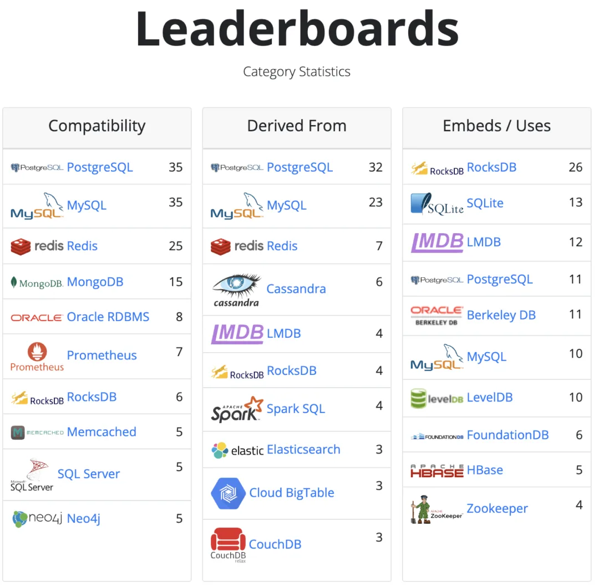

无论是全球的数据库谱系图，还是中国国产数据库谱系图，PostgreSQL 的生态都要比 MySQL 繁荣的太多太多。

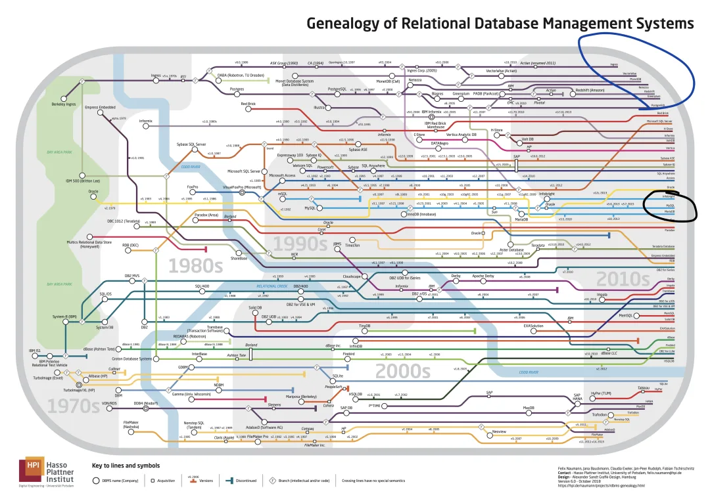

全球 RDBMS 谱系图

全球 RDBMS 谱系图 + 国产数据库 （by 云和恩墨）

国产数据库生态谱系 by 白鳝

在中国市场，如果把基于 PostgreSQL 的 “国产数据库” 算上，恐怕 MySQL 更是要吃不了兜着走。

---

## PostgreSQL 营收是 MySQL 0.1%？

作者认为，在中国公有云数据库市场中 PG 的营收仅有 MySQL 的 0.1% ~ 0.3%，我对这个数据提出质疑。

根据 AWS RDS 团队给出的数据，他们全球 PostgreSQL 与 MySQL 的实例数量目前是 1:1，考虑到 MySQL 小型实例偏多，PostgreSQL 在营收上还占优势。中国公有云行业可以参考标杆阿里云 RDS 的数据：PostgreSQL 与 MySQL 的营收比例约为 1:5，基本与 Google 中国地区指数与百度指数相吻合。关于公有云 RDS PostgreSQL vs MySQL 的份额并没有公开披露，都属于内部数据，但欢迎大家向相关团队求证。

原作者在腾讯数据库团队任过职，可能会有关于腾讯云数据库的内部信息。因此，如果他给出一个 10:1 ~ 3:1 之的数据，我可能会采信。但 1000:1 和 1000:3 的营收比例数字显然是荒谬的。当然我们并不排除这种可能性：这家云厂商实在是不懂 PostgreSQL，以至于做的 RDS 太烂根本卖不动。

大型互联网/科技公司使用 PostgreSQL 或衍生发行版承载核心业务实在是太多了。例如我所任职的阿里，探探，苹果。其他知名企业包括：去哪儿网，平安银行，邮储银行，12306，Momenta，高德，菜鸟，丰田，NEC…… 等等等等，航天/部队/警务/水利/国土等与地理信息密切相关的组织更是 PostgreSQL 的基本盘。

---

## BSD 是流氓协议？？

作者最后对 BSD 协议开炮，认为 BSD 协议是流氓协议，而且 “本质上 PG 也 是由美国公司控制的开源数据库”。

这里存在一些基本的事实错误，例如，PostgreSQL 使用的并非是 BSD 协议，而是专门的 PostgreSQL 协议，只是 BSD-like，这是其一。第二，作者恐怕是对开源协议有什么误解：BSD 协议仍需要尊重代码作者的著作权，需要包含版权声明。

不同于 MySQL，Owned by Oracle；PostgreSQL 是社区驱动的开源项目，并没有一个商业公司控制，也并没有哪一个国家可以控制它；而且，它的全球总部在加拿大不在美国。即使是来自被制裁的俄罗斯公司 Postgres Pro，也依然活跃在 PG 社区中。“由美国公司控制的开源数据库” 属于无稽之谈。

例如，在国内就有许多基于 PostgreSQL 的“国产数据库”发行版，一些公司比如瀚高，阿里，文武，以及无数开发者也会给社区提 Bug 回馈代码，华为也是基于 PostgreSQL 9.2 与 PostgreSQL XL/XC 打造 openGauss 与 GaussDB，用于满足一些自主可控特定需求。

作者的 这个 “也” 字以己度人，倒是非常好地指出了 **MySQL 其实是一家由美国公司所控制的开源数据库**。**对于中国市场来说，在信创国产化的时代恐怕没有 MySQL 什么事儿了。**

---

## Fin

原作者的这篇情绪文本不值一驳，充满着事实错误，诡辩话术，情绪输出与人身攻击，作为 MySQL 社区的头脸人物代表，可谓是体面尽失，与之对擂实属掉份。

但正如人们说的：“你不应该把世界让给那些你讨厌的人”。所以我还是选择撰此文回应，用实打实的事实与数据说话来正本清源，匡扶正义，为 PostgreSQL 正名。

至于孰对孰错，那就交由读者评说。

## 参考阅读

《[驳《MySQL：这个星球最成功的数据库》](/pg/rebut-mysql-best/)》

《[直播预告：MySQL vs PostgreSQL](http://mp.weixin.qq.com/s?__biz=MzU5ODAyNTM5Ng==&mid=2247485873&idx=1&sn=731322e649c212eefc3e382efb31ae99&chksm=fe4b3c6ac93cb57c712471ed8cd54c3603937d0793bfd2518221749861a40140b64edb17550d&scene=21#wechat_redirect)》\

《[向量是 PG 中新的 JSON](/pg/vector-json-pg/)》\

《[PostgreSQL：世界上最成功的数据库](/pg/pg-is-no1/)》\

《[PostgreSQL 到底有多强？](/pg/pg-performence/)》

《[为什么 PostgreSQL 是最成功的数据库？](/pg/pg-is-best/)》

《[StackOverflow 2022 数据库年度调查](/db/so2022-db/)》

《[Why PostgreSQL Rocks!](/pg/pg-is-great/)》

《[为什么说 PostgreSQL 前途无量？](/pg/pg-is-great/)》

《[PostgreSQL 好处都有啥？](/pg/pg-is-good/)》

《更好的开源 RDS 替代：Pigsty》

《StackOverflow 7 年调研数据跟踪》

<http://demo.pigsty.cc/ui/d/sf-survey/stackoverflow-survey>

### References

- `[1]` MySQL 和 PostgreSQL，谁是世界第一？: <https://www.modb.pro/video/8261?slink>
- `[2]` [PostgreSQL：世界上最成功的数据库](/pg/pg-is-no1/)
- `[3]` 分布式数据库是伪需求： <https://zhuanlan.zhihu.com/p/622866832>
- `[4]` 拿绿卡： <https://www.zhihu.com/question/339863115/answer/1278663114>
- `[5]` Pigsty: <https://pigsty.cc/>
- `[6]` PostgreSQL 生态项目： <https://web.archive.org/web/2/https://ossrank.com/cat/368-postgresql-extension?page=2>
- `[7]` PostgreSQL 数据库发行版
- `[8]` 设计数据密集型应用： <http://ddia.vonng.com/>
- `[9]` Github Star Ranking: <https://gitstar-ranking.com/Vonng>
- `[10]` 分布式数据库是伪需求吗？: <https://zhuanlan.zhihu.com/p/622866832>
- `[11]` [为什么说 PostgreSQL 前途无量？](/pg/pg-is-great/)
- `[12]` 并发异常那些事： <https://zhuanlan.zhihu.com/p/38217080>
- `[13]` Public Demo: <http://demo.pigsty.cc/ui/d/sf-survey/stackoverflow-survey?orgId=1>
- `[14]` Github Repo: dbrank: <https://github.com/Vonng/dbrank>
- `[15]` [PostgreSQL：世界上最成功的数据库](/pg/pg-is-no1/)
- `[16]` 百度热搜： <https://index.baidu.com/v2/main/index.html#/trend/postgresql?words=postgresql,MySQL>
- `[17]` Developer Profile: <https://survey.stackoverflow.co/2023/?utm_source=so-owned&utm_medium=blog&utm_campaign=dev-survey-results-2023&utm_content=survey-results#years-coding>
- `[18]` 学生的比例： <https://survey.stackoverflow.co/2023/?utm_source=so-owned&utm_medium=blog&utm_campaign=dev-survey-results-2023&utm_content=survey-results#years-of-professional-coding-experience-by-developer-type>
- `[19]` 初学者： <https://survey.stackoverflow.co/2023/?utm_source=so-owned&utm_medium=blog&utm_campaign=dev-survey-results-2023&utm_content=survey-results#learning-how-to-code>
- `[20]` Worked with & want to work: <https://survey.stackoverflow.co/2023/?utm_source=so-owned&utm_medium=blog&utm_campaign=dev-survey-results-2023&utm_content=survey-results#worked-with-vs-want-to-work-with-database-worked-want-learn>
- `[21]` DB-Engine: <https://db-engines.com/en/ranking>
- `[22]` 时间拉长到最大的 2004 年至今来看一看： <https://trends.google.com/trends/explore?date=all&q=%2Fm%2F05ynw,MySQL&hl=zh-CN>
- `[23]` Yandex: <https://wordstat.yandex.com/>
- `[24]` 百度指数： <https://index.baidu.com/v2/main/index.html#/trend/postgresql?words=postgresql,mysql>
- `[25]` 柱状图： <http://demo.pigsty.cc/ui/d/sf-survey/stackoverflow-survey?orgId=1&viewPanel=81>
- `[26]` Database of Database 排行榜： <https://dbdb.io/stats>
- `[27]` 全球的数据库谱系图： <https://hpi.de/fileadmin/user_upload/fachgebiete/naumann/projekte/RDBMSGenealogy/RDBMS_Genealogy_V6.pdf>
- `[28]` 直播预告：MySQL vs PostgreSQL： <http://mp.weixin.qq.com/s?__biz=MzU5ODAyNTM5Ng==&mid=2247485873&idx=1&sn=731322e649c212eefc3e382efb31ae99&chksm=fe4b3c6ac93cb57c712471ed8cd54c3603937d0793bfd2518221749861a40140b64edb17550d&scene=21#wechat_redirect>
- `[29]` [向量是 PG 中新的 JSON](/pg/vector-json-pg/)
- `[30]` [PostgreSQL：世界上最成功的数据库](/pg/pg-is-no1/)
- `[31]` [PostgreSQL 到底有多强？](/pg/pg-performence/)
- `[32]` [为什么 PostgreSQL 是最成功的数据库？](/pg/pg-is-best/)
- `[33]` [StackOverflow 2022 数据库年度调查](/db/so2022-db/)
- `[34]` [Why PostgreSQL Rocks!](/pg/pg-is-great/)
- `[35]` [为什么说 PostgreSQL 前途无量？](/pg/pg-is-great/)
- `[36]` [PostgreSQL 好处都有啥？](/pg/pg-is-good/)
- `[37]` 更好的开源 RDS 替代：Pigsty
- `[38]` StackOverflow 7 年调研数据跟踪： <http://demo.pigsty.cc/ui/d/sf-survey/stackoverflow-survey>
- `[39]` PostgreSQL 社区状态调查报告 2022: <https://www.timescale.com/state-of-postgres/2022>

---

发布版本：[微信公众号](https://mp.weixin.qq.com/s/tRNedHlXmp7YfCqd21e5PA)
