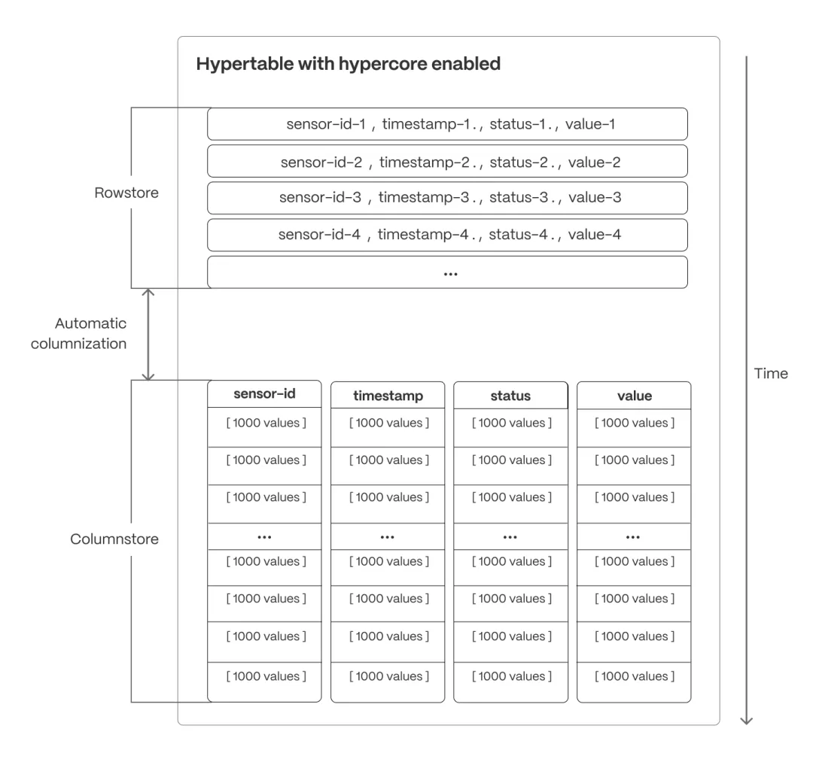
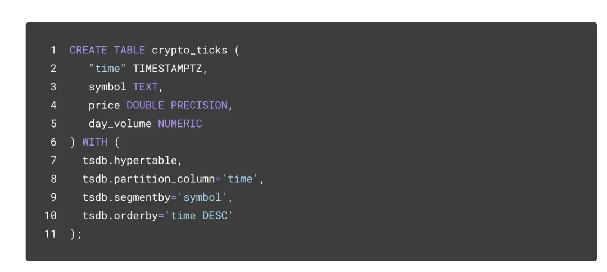
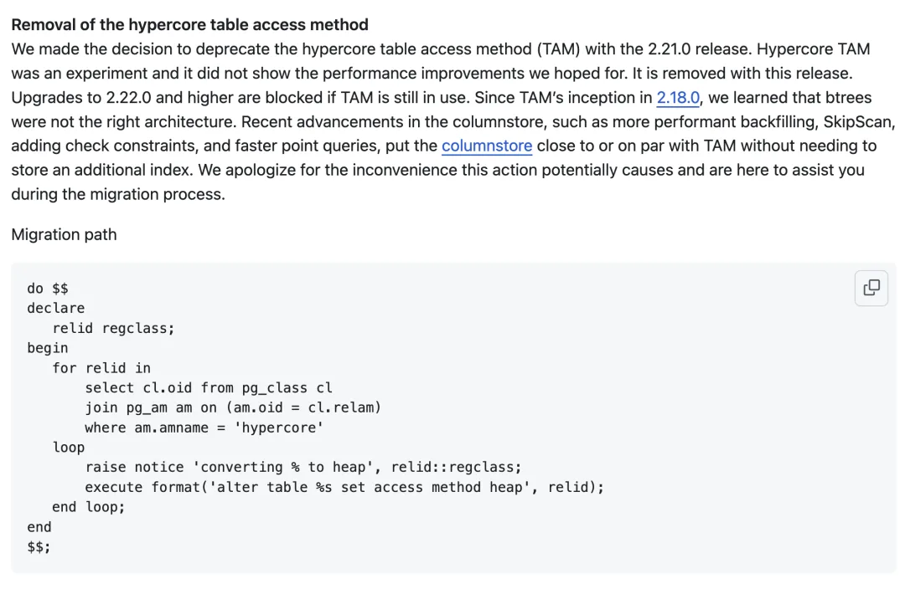
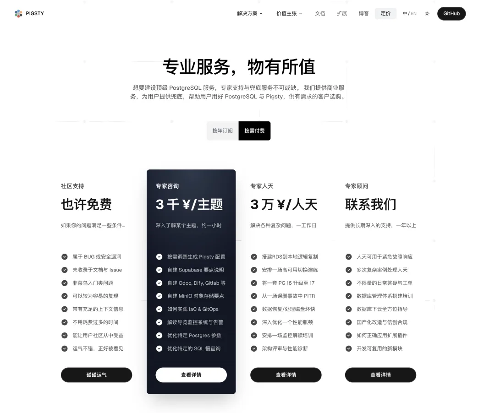
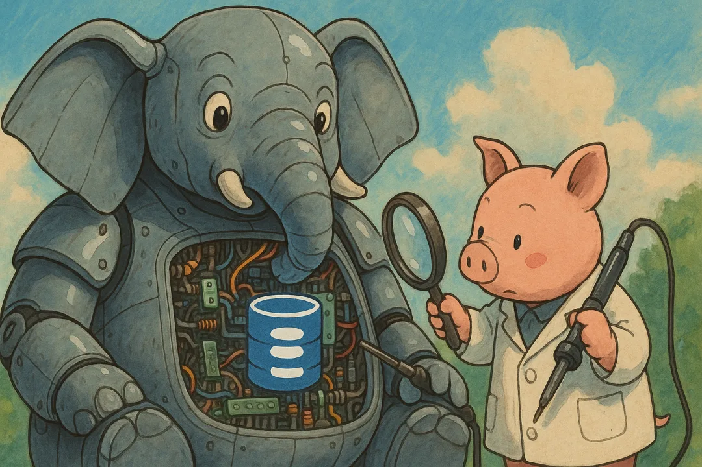

昨天接到一个咨询的活儿，有位 Pigsty 的用户反馈数据库故障，出现 XID Wraparound 了。这个 PG 中最臭名昭著的故障在近些年已经比较少见了，不过这次的故障原因确实比较有趣，是因为使用了 TimescaleDB Hypercore 导致的 —— 这是一个实验性的新存储引擎，并且已经在最近的版本中弃用与移除。

如果你正在使用这个新的存储引擎，最好立刻检查并退回经典的 TimescaleDB 引擎与 PostgreSQL 原生表，以免数据库爆炸。

## Hypercore 是什么

TimescaleDB 是一个老牌 PostgreSQL 扩展插件，是 PG 生态复杂度最大的几个扩展之一（约 20 万行代码）。提供了时序数据处理分析，列式存储，流式聚集，归档压缩，定时任务等实用特性。

在今年年初，TimescaleDB 推出了一个新的**混合行列式存储引擎 Hypercore**。它的设计目标是服务实时分析场景，能够在**行存**和**列存**两种存储格式之间自动切换，以同时满足高吞吐写入和快速分析查询的需求。具体来说，Hypercore 以行存形式接收最新数据，保证写入和更新的低延迟；随着数据“冷却”不再频繁更新，系统会自动将其转换为列存进行压缩存储，以加速聚合查询并节省存储空间。

TimescaleDB 的经典引擎提出了 Hypertable 和 Chunk 的概念，这些表看上去都是 PostgreSQL 原生堆表，需要通过一系列函数 API 进行管理。而 Hypercore 则利用了 PostgreSQL 12 新引入的 TAM （表访问方法）接口，将其实现为一种新的存储引擎，而且支持为压缩数据使用 Btree 二级索引加速访问。整体在使用上更加丝滑便利，省掉了行/列存转化，压缩/解压缩的管理负担。

## 然而……

当然，并不是所有的事情都像文档上描述的那么美好。Hypercore 在 2025-01-23 的 2.18.0 被第一次提出，然而仅仅在 2.21.0 就被标记为弃用，随即在 2.22.0 版本中被直接移除，整个生命周期也就半年多。

> 超核访问方法的弃用[1]
>
> 我们决定在 2.21.0 版本中弃用超核访问方法 (TAM)。这是一个实验特性，它没有显示出我们希望的信号，并将在计划于 2025 年 9 月发布的 TimescaleDB 2.22.0 中弃用。如果您仍在使用 TAM，则无法升级到 2.22.0 及更高版本。自从 2.18.0[2]推出 TAM 以来，我们了解到 btree 并不是合适的架构。列存储的最新进展 - 例如性能更高的回填、SkipScan、添加检查约束和更快的点查询 - 使列存储[3]接近或与 TAM 相当，而无需来自附加索引的存储。对于此操作可能造成的不便，我们深表歉意，并在此为您提供迁移过程中的帮助。

当然，弃用公告里并没有详细解释废弃移除这个存储引擎的具体原因，不过真实用户踩雷倒是让我知道了 WHY。这个存储引擎没有处理好垃圾回收，会导致 PostgreSQL 数据库因为 XID Wraparound 直接宕掉。

## 具体案例

大体过程是这样的，用户遇到了 XID 回卷故障，PostgreSQL 提示还有 300 万个 XID 就回卷了，进入保护模式拒绝写入。只读负载还可以工作，业务降级为只读模式。

这个案例运气比较好，数据库还活着，可以执行只读 SQL，所以先赶紧抽取了一个逻辑备份。然后一看，年龄花了几个月增长到 20 亿（不看告警…），再看是几个 TimescaleDB Chunk 表年龄把整个集群的年龄撑高的。再一看，这几张表竟然用的是 hypercore 存储引擎，Vacuum 直接报错。

当然要解决这个问题，其实把这个表 DROP 了，或者硬改系统元数据其实就好了。但尴尬的是 PostgreSQL 进入保护模式，不允许写入操作，最多允许你跑 VACUUM FREEZE，这就死循环了。比起魔改系统表，最可靠最快恢复的办法就直接用 Pigsty 拉起一个新集群，把 hypercore 表 DDL 修改成 timescale 的经典表，然后 pg_dump \| psql 数据拉过去。业务切换到新集群，解决了这个问题。

顺带一提，如果你的 PG 要炸了，老冯可以提供远程咨询问诊哦。比如上面这种案例。

## 经验与教训

总的来说，老冯觉得这个案例再次告诉我们新特性上生产要谨慎。hypercore 这种实验性的存储引擎虽然在性能和易用性上带来一些亮眼的改进，但是在质量/安全性上的关键缺陷让前者失去意义。

对于存储引擎这种关键，核心，高复杂度的组件模块，老冯认为再小心也不为过，因为它们还没有长时间，大规模运行的社区可靠性认证记录，很多问题可能只有在复杂的真实场景中才会出现。更重要的是，存储引擎缺陷通常更有可能伤害到数据完整性，杀伤力与风险通常比普通特性的缺陷要大的多。（类似需要注意的扩展包括：[OrioleDB 内核](/pg/orioledb-is-coming/)，PG TDE 扩展）。

## 上新的节奏

因此，很多人问我，应该用什么 PostgreSQL 大版本合适，因为 PG 每年都会发布一个新的大版本嘛。老冯的建议是，如果你是在生产环境使用，普通的用户可以使用上一个大版本：比如 PG18 刚发布，那么当下最合适的 PG 大版本会是 PG 17。有实力/愿意尝鲜的客户，老冯的建议是在 第二，第三个小版本（18.1，18.2）开始使用会比较合适，因为这个时候主要的扩展支持都已经到位，三到六个月的使用也基本能让 BUG 充分暴露 —— 但是也有例外（比如 PG 14.3 才发现的索引损坏显著 BUG ）。

当然，如果你很有实力，有信心应对各种问题，也可以始终使用最新版本与各种新特性。比如去哪儿网的李海龙帅龙同志，就会在 PG 每个大小版本刚出，就立刻把生产 PG 全部升级到最新。老冯会稍微保守（懒）一些，基本上会等一两个小版本出来，再升级大版本。目前 Pigsty 的策略也基本上是等到出来半年，等 TimescaleDB，Citus 这些重磅三方扩展都适配了，再提升默认的大版本

所以，不少朋友都问我现在 PG 18 出来了你的 Pigsty 啥时候支持，其实半年前 beta 出来的时候就支持了，如果你没有用到那些还没适配 18 的扩展插件，现在就可以用了。但真的要上生产，老冯觉得还是最好再等半年，毕竟，有时候吃螃蟹真的会拉肚子。

### References

- `[1]` 超核访问方法的弃用： <https://github.com/timescale/timescaledb/releases?page=1>
- `[2]` 2.18.0: <https://github.com/timescale/timescaledb/releases/tag/2.18.0>
- `[3]` 列存储： <https://www.timescale.com/blog/hypercore-a-hybrid-row-storage-engine-for-real-time-analytics>

---

发布版本：[微信公众号](https://mp.weixin.qq.com/s/LdZVVyOj4BA9C892I25lQw)
