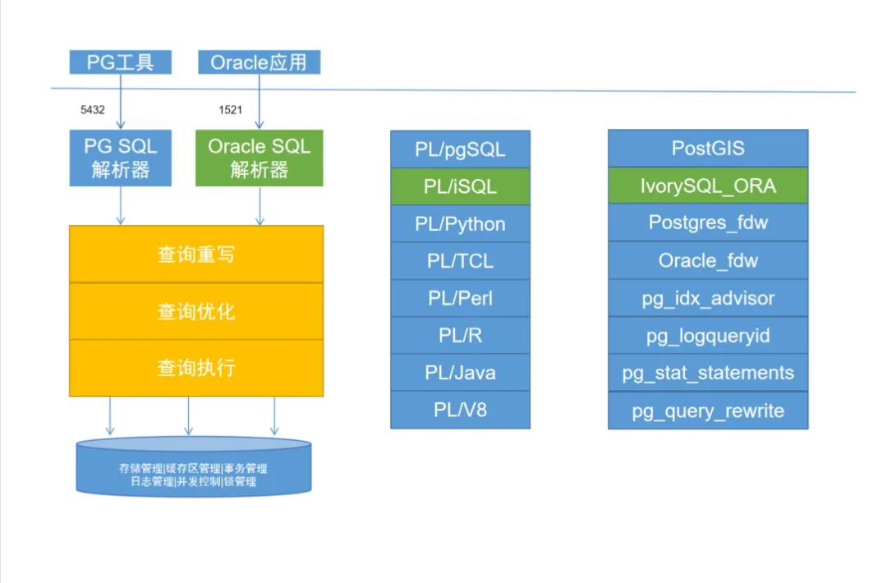
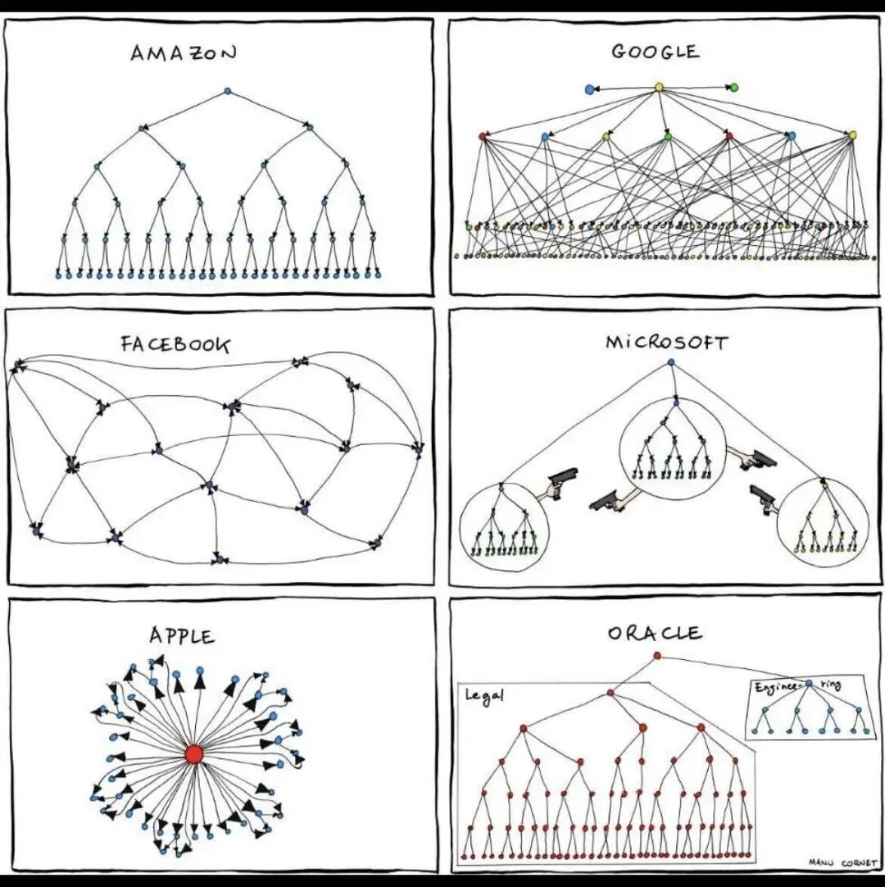
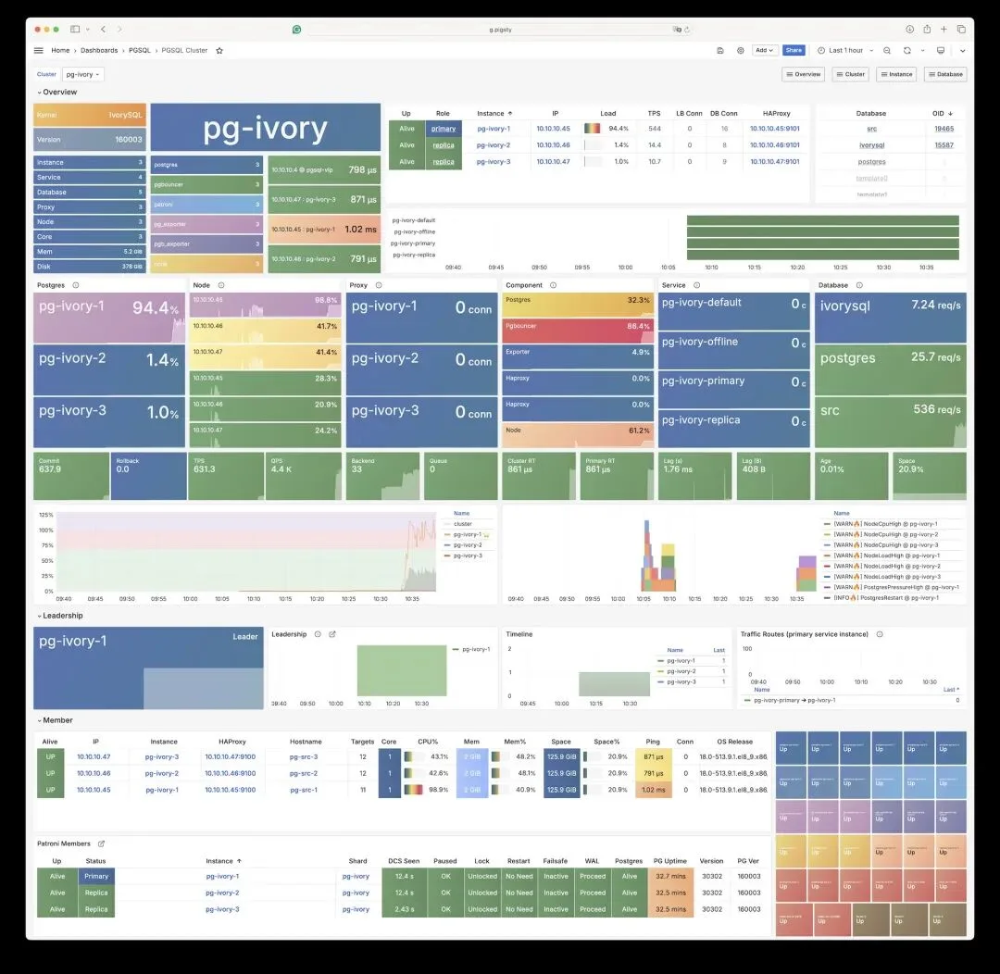
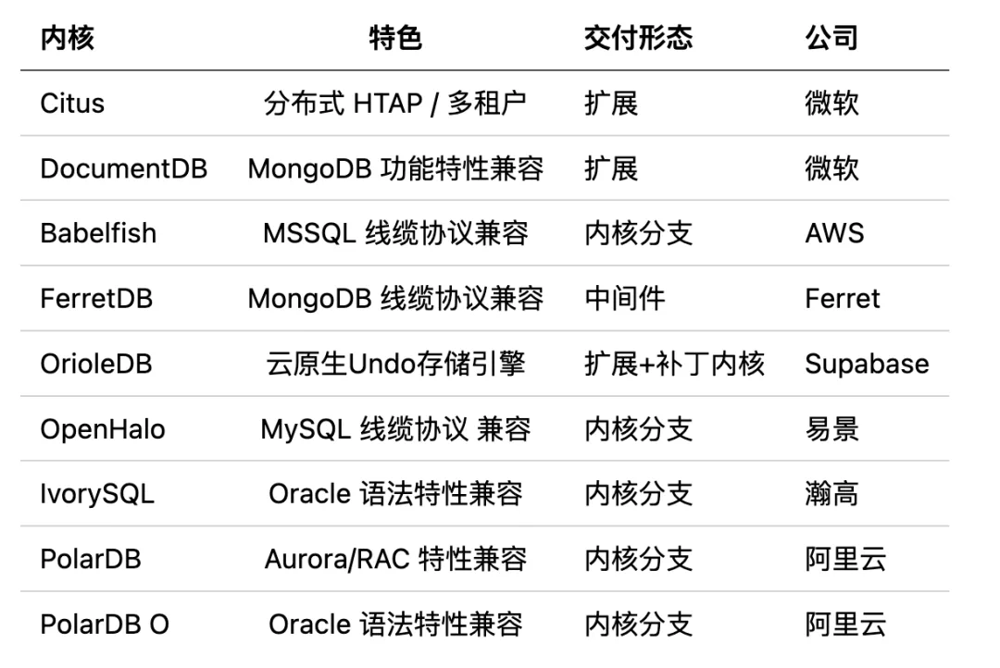

今天在 PostgreSQL 技术峰会上有人问，什么数据库可以替代 Oracle？当然有很多数据库都号称自己可以 “替代” Oracle，商业产品这里就不说了，但开源的目前我了解到的只有 IvorySQL。

IvorySQL 是一个开源的“Oracle 兼容” PostgreSQL 内核，由**瀚高**出品，使用 Apache 2.0 许可证。目前 Pigsty 支持在自建本地 RDS 时使用 IvorySQL 内核替代原生的 PostgreSQL 内核，提供和原版一样的监控，备份，高可用，IaC 等能力，并运行 “Oracle 兼容模式”

当然这里的 Oracle 兼容是 Pl/SQL，语法，内置函数、数据类型、系统视图、MERGE 以及 GUC 参数层面上的兼容，不是**Babelfish**，**openHalo**，**FerretDB**那种可以不改客户端驱动的缆协议兼容。

所以用户还是要使用 PostgreSQL 的客户端工具来访问 IvorySQL，但是可以使用 Oracle 兼容的语法。当然我也能理解这里的考虑，毕竟 Oracle 的法务可是业界知名，臭名昭著。要是搞了客户端协议兼容，估计要被搞了。目前据说只有达梦脑壳铁干了这个。

目前 IvorySQL 最新版本**4.4**与 PostgreSQL 最新小版本 17.4 保持兼容，并且提供了主流 Linux 上的二进制 RPM/DEB 包。而 Pigsty 提供了在 PG RDS 中将原生 PostgreSQL 替换为 IvorySQL 内核的选项。

---

## 快速上手

使用标准流程**安装**Pigsty，并使用`ivory`配置模板：

    curl -fsSL https://repo.pigsty.cc/get | bash; cd ~/pigsty ./bootstrap              # 安装 Pigsty 依赖 ./configure -c ivory     # 使用 IvorySQL 配置模板 ./install.yml            # 使用剧本执行部署

啊是的，就是这么简单，只要使用 IvorySQL 配置模板替代默认的配置模板，你就可以拉起 “Oracle” 兼容的 PG RDS 了。

对于生产环境部署，您应当在执行`./install.yml`进行部署前，编辑自动生成的`pigsty.yml`配置文件，修改密码等参数。

当前最新的 IvorySQL 4.4 等效于 PostgreSQL 17，任何兼容 PostgreSQL 线缆协议的客户端工具都可以访问 IvorySQL 集群。

不过，默认情况下，你可以使用 PostgreSQL 客户端从另一个`1521`端口访问，这种情况下默认使用 Oracle 兼容模式。

---

## 配置说明

在 Pigsty 中要使用 IvorySQL 内核，需要修改以下四个配置参数：

- `pg_mode：使用``ivory``兼容模式`
- `repo_extra_packages：下载``ivroysql``软件包`
- `pg_packages： 安装``ivorysql``软件包`
- `pg_libs：加载 Oracle 语法兼容扩展`

是的就是这么简单，你只需要在配置文件的全局变量中加上这四行，Pigsty 就会使用 IvorySQL 替换原生的 PostgreSQL 内核了

    pg_mode: ivory                           # IvorySQL 兼容模式，使用 IvorySQL 的二进制 pg_packages: [ ivorysql, pgsql-common ]  # 安装 ivorysql，替换 pgsql-main 主内核 pg_libs: 'liboracle_parser, pg_stat_statements, auto_explain'  # 加载 Oracle 兼容扩展 repo_extra_packages: [ ivorysql ]        # 下载 ivorysql 软件包

IvorySQL 还提供了一系列新增 GUC 参数变量，可以在`pg_parameters`中指定。

---

## 扩展

绝大多数**PGSQL**模块的**扩展插件**（非纯 SQL 类）都无法直接在 IvorySQL 内核上使用，如果需要使用，需要针对新内核从源码重新编译安装。

## 备注说明

- 目前 IvorySQL 的软件包位于`pigsty-infra`仓库，而非`pigsty-pgsql`或`pigsty-ivory`仓库。

- IvorySQL 4.4 的默认 FHS 发生改变，请从老版本升级上来的用户留意。

- IvorySQL 4.4 需要 gibc 版本 \>= 2.17 即可，目前 Pigsty 支持的系统版本都满足这个条件

- 最后一个支持 EL7 的 IvorySQL 版本为 3.3，对应 PostgreSQL 16.3，目前 IvorySQL 4.x 已经不再提供对 EL7 的支持了。

- Pigsty 不对使用 IvorySQL 内核承担任何质保责任，使用此内核遇到的任何问题与需求请联系原厂解决。

---

当然，PostgreSQL 能 “兼容” 的可不仅仅是 Oracle 一个。实际上头部的数据库 PostgreSQL 已经兼容了个遍，而且除了 Oracle 之外都是不用改客户端的 “线缆协议” 级别兼容。[兼容 MS SQL Server 的 Bablefish](/pg/pg-replace-mssql/) · [OrioleDB 奥利奥数据库来了！](/pg/orioledb-is-coming/) · [带有 MySQL 兼容的 PG 内核现已加入 Pigsty](/pg/openhalo-mysql/) · [FerretDB：假扮成 MongoDB 的 PostgreSQL](/pg/ferretdb/) · [国产数据库，](/db/domestic-db-any-good/) · [PolarDB-O](/db/domestic-db-any-good/)\

---

发布版本：[微信公众号](https://mp.weixin.qq.com/s/5sE4pAJYZaHh3Hl0jrsHdw)
