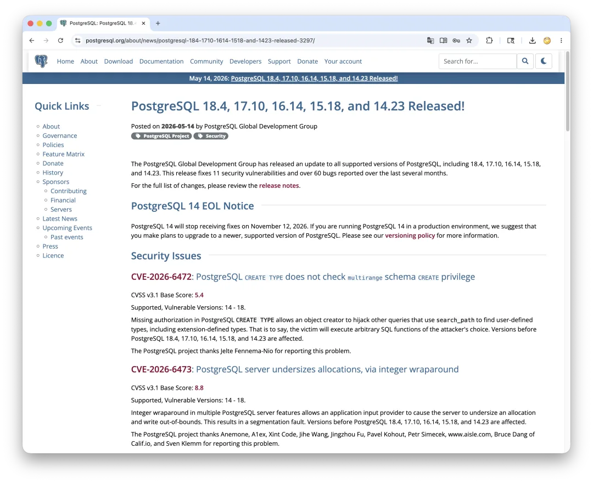
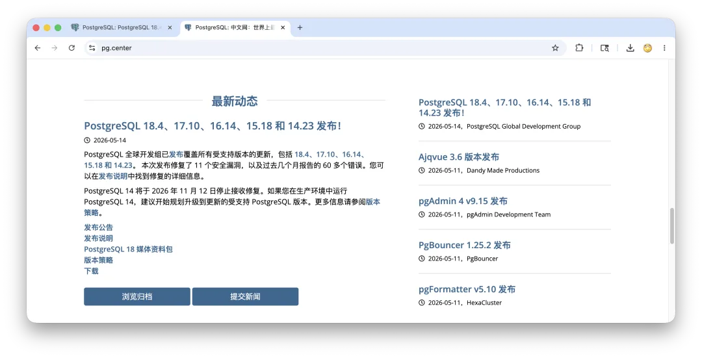

发布者：PostgreSQL Global Development Group 分类：PostgreSQL 项目安全

PostgreSQL 全球开发组发布了所有受支持 PostgreSQL 版本的更新，包括 18.4、17.10、16.14、15.18 和 14.23。本次发布修复了 11 个安全漏洞，以及过去几个月中报告的 60 多个 bug。

完整变更列表请参阅发行说明。

## PostgreSQL 14 生命周期结束提醒

PostgreSQL 14 将于 2026 年 11 月 12 日停止接收修复。如果你正在生产环境中运行 PostgreSQL 14，建议尽快制定升级到更新的受支持版本的计划。更多信息请参阅版本政策。

## 安全问题

### CVE-2026-6472：PostgreSQL `CREATE TYPE` 未检查 `multirange` schema 的 `CREATE` 权限

CVSS v3.1 基础分：5.4

受影响的受支持版本：14 到 18。

PostgreSQL `CREATE TYPE` 存在授权检查缺失问题，使对象创建者可以劫持依赖 `search_path` 查找用户自定义类型的其他查询，包括扩展定义的类型。换句话说，受害者可能会执行攻击者指定的任意 SQL 函数。PostgreSQL 18.4、17.10、16.14、15.18 和 14.23 之前的版本均受影响。

PostgreSQL 项目感谢 Jelte Fennema-Nio 报告此问题。

### CVE-2026-6473：PostgreSQL 服务器因整数回绕导致内存分配偏小

CVSS v3.1 基础分：8.8

受影响的受支持版本：14 到 18。

PostgreSQL 服务器的多项功能中存在整数回绕问题，允许应用输入提供者诱使服务器分配过小的内存空间，并发生越界写入。这会导致段错误。PostgreSQL 18.4、17.10、16.14、15.18 和 14.23 之前的版本均受影响。

PostgreSQL 项目感谢 Anemone、A1ex、Xint Code、Jihe Wang、Jingzhou Fu、Pavel Kohout、Petr Simecek、www.aisle.com、Calif.io[1] 的 Bruce Dang，以及 Sven Klemm 报告此问题。

### CVE-2026-6474：PostgreSQL `timeofday()` 可能泄露部分服务器内存

CVSS v3.1 基础分：4.3

受影响的受支持版本：14 到 18。

PostgreSQL `timeofday()` 函数中存在外部可控的格式字符串问题，攻击者可通过精心构造的时区设置读取部分服务器内存。PostgreSQL 18.4、17.10、16.14、15.18 和 14.23 之前的版本均受影响。

PostgreSQL 项目感谢 Xint Code 报告此问题。

### CVE-2026-6475：PostgreSQL `pg_basebackup` 和 `pg_rewind` 可覆盖由源端超级用户指定的无关文件

CVSS v3.1 基础分：8.8

受影响的受支持版本：14 到 18。

PostgreSQL `pg_basebackup` 的 plain 格式以及 `pg_rewind` 中存在跟随符号链接的问题，使源端超级用户可以覆盖本地文件，例如 `/var/lib/postgres/.bashrc`，从而劫持操作系统账户。由于 `shared_preload_libraries` 等机制，在这些命令执行后启动服务器，仍然意味着隐式信任源端超级用户。

因此，只有当用户在这些命令执行后、服务器启动前采取了相关操作时，例如将文件移动到另一台虚拟机，或对虚拟机进行快照，该攻击才具有实际影响。PostgreSQL 18.4、17.10、16.14、15.18 和 14.23 之前的版本均受影响。

PostgreSQL 项目感谢 Valery Gubanov、腾讯玄武实验室 XlabAI Team、Atuin Automated Vulnerability Discovery Engine、Zhanpeng Liu、Guannan Wang 和 Guancheng Li 报告此问题。

### CVE-2026-6476：PostgreSQL `pg_createsubscriber` 可通过订阅名触发 SQL 注入

CVSS v3.1 基础分：7.2

受影响的受支持版本：17 到 18。

PostgreSQL `pg_createsubscriber` 中存在 SQL 注入漏洞。拥有 `pg_create_subscription` 权限的攻击者可以借此以超级用户身份执行任意 SQL。攻击会在下一次运行 `pg_createsubscriber` 时生效。在 17 和 18 两个大版本中，PostgreSQL 18.4 和 17.10 之前的小版本受影响。PostgreSQL 17 之前的版本不受影响。

PostgreSQL 项目感谢 Yu Kunpeng 报告此问题。

### CVE-2026-6477：PostgreSQL `libpq` 的 `lo_*` 函数允许服务器超级用户覆盖客户端栈内存

CVSS v3.1 基础分：8.8

受影响的受支持版本：14 到 18。

PostgreSQL `libpq` 的 `lo_export()`、`lo_read()`、`lo_lseek64()` 和 `lo_tell64()` 函数使用了本质上危险的 `PQfn(..., result_is_int=0, ...)` 调用，使服务器超级用户可以用任意长度的响应覆盖客户端栈缓冲区。与 `gets()` 类似，`PQfn(..., result_is_int=0, ...)` 会把由服务器决定的任意长度数据写入一个大小未明确指定的缓冲区。

由于 `psql` 中的 `\lo_export` 命令以及 `pg_dump` 都会调用 `lo_read()`，服务器超级用户可以覆盖 `pg_dump` 或 `psql` 的栈内存。PostgreSQL 18.4、17.10、16.14、15.18 和 14.23 之前的版本均受影响。

PostgreSQL 项目感谢 Yu Kunpeng 和 Martin Heistermann 报告此问题。

### CVE-2026-6478：PostgreSQL 可通过隐蔽计时信道泄露 MD5 哈希密码

CVSS v3.1 基础分：6.5

受影响的受支持版本：14 到 18。

PostgreSQL 认证过程中，在比较 MD5 哈希密码时存在隐蔽计时信道，攻击者可利用该问题恢复足以完成认证的用户凭据。该问题不影响 `scram-sha-256` 密码；`scram-sha-256` 是所有受支持版本中的默认方式。不过，从 PostgreSQL 13 或更早版本升级而来的现有数据库中，仍可能保留 MD5 哈希密码。PostgreSQL 18.4、17.10、16.14、15.18 和 14.23 之前的版本均受影响。

PostgreSQL 项目感谢 Joe Conway 报告此问题。

### CVE-2026-6479：PostgreSQL SSL/GSS 初始化因不受控递归导致拒绝服务

CVSS v3.1 基础分：7.5

受影响的受支持版本：14 到 18。

PostgreSQL 的 SSL 和 GSS 协商过程中存在不受控递归问题。能够连接 PostgreSQL `AF_UNIX` socket 的攻击者，可借此造成持续性的拒绝服务。如果 SSL 和 GSS 都被禁用，能够访问 PostgreSQL TCP socket 的攻击者也可以造成同样结果。PostgreSQL 18.4、17.10、16.14、15.18 和 14.23 之前的版本均受影响。

PostgreSQL 项目感谢 Calif.io 与 Claude 和 Anthropic Research 协作报告此问题。

### CVE-2026-6575：PostgreSQL `pg_restore_attribute_stats` 接受会导致查询规划读取越过统计数组末尾的值

CVSS v3.1 基础分：4.3

受影响的受支持版本：18。

PostgreSQL 函数 `pg_restore_attribute_stats()` 存在缓冲区越界读取问题。该函数接受长度不匹配的数组值，进而导致查询规划阶段读取某个数组末尾之后的内存。表维护者可以据此推断数组末尾之后的内存值。在 PostgreSQL 18 大版本中，PostgreSQL 18.4 之前的小版本受影响。PostgreSQL 18 之前的版本不受影响。

PostgreSQL 项目感谢 Jeroen Gui 报告此问题。

### CVE-2026-6637：PostgreSQL `refint` 允许栈缓冲区溢出和 SQL 注入

CVSS v3.1 基础分：8.8

受影响的受支持版本：14 到 18。

PostgreSQL `refint` 模块中存在栈缓冲区溢出问题，允许无特权数据库用户以运行数据库的操作系统用户身份执行任意代码。另一个独立攻击场景是：如果应用将用户可控列声明为 `refint` 级联主键，并允许用户控制对该列的更新，则主键更新值的提供者可通过 SQL 注入，以执行该主键更新的数据库用户身份执行任意 SQL。

PostgreSQL 18.4、17.10、16.14、15.18 和 14.23 之前的版本均受影响。

PostgreSQL 项目感谢 Nikolay Samokhvalov 报告此问题。

### CVE-2026-6638：PostgreSQL `REFRESH PUBLICATION` 可通过表名触发 SQL 注入

CVSS v3.1 基础分：3.7

受影响的受支持版本：16 到 18。

PostgreSQL 逻辑复制的 `ALTER SUBSCRIPTION ... REFRESH PUBLICATION` 存在 SQL 注入漏洞。订阅端表的创建者可以利用该漏洞，使用订阅在发布端的凭据执行任意 SQL。攻击会在下一次执行 `REFRESH PUBLICATION` 时生效。在 16、17 和 18 三个大版本中，PostgreSQL 18.4、17.10 和 16.14 之前的小版本受影响。PostgreSQL 16 之前的版本不受影响。

PostgreSQL 项目感谢 Pavel Kohout 和 Aisle Research 报告此问题。

## Bug 修复与改进

本次更新修复了过去几个月中报告的 60 多个 bug。以下列出的问题影响 PostgreSQL 18，其中一部分也可能影响其他受支持的 PostgreSQL 版本。

修复在唯一索引上使用非确定性排序规则时，查询可能返回错误结果的问题。

修复外键触发器可延迟性丢失的问题。此前，如果某个外键定义为 `DEFERRABLE INITIALLY DEFERRED`，在先被设置为 `NOT ENFORCED`，再切回 `ENFORCED` 后，会表现得像 `NOT DEFERRABLE`。如果你有受此问题影响的外键，安装本次更新后，可通过先将其设为 `NOT ENFORCED`，再切回 `ENFORCED` 来修复。

提升规划器在更多场景中应用分区裁剪的能力。

修复自连接消除逻辑，使其能够处理仅由布尔列构成的连接条件，例如 `ON t1.boolcol`。

围绕虚拟生成列进行多项修复，包括确保当 `EXCLUDED` 引用了虚拟生成列时，`INSERT ... ON CONFLICT` 能够正常工作。

当 `MERGE` 在 `repeatable read` 或 `serializable` 隔离级别下遇到被并发更新的元组时，报告序列化失败。

修复 `CREATE TABLE ... LIKE ... INCLUDING STATISTICS` 在源表包含一个或多个已删除列时的问题。

修复 `WITHOUT OVERLAPS`，使其允许使用 domain。

禁止通过 `multirange` 让复合类型成为自身的成员。

修复 `array_agg(anyarray)` 并行执行时有时会返回错误结果的问题。

防止恢复增量备份时产生膨胀。

防止卡住的逻辑复制槽同步工作进程阻塞备用服务器提升为主库。

让 `pg_aios` 系统视图的 `pid` 列在条目没有所属进程时显示 `NULL`，而不是 `0`。

修复复制仍在活跃时，`pg_stat_replication` 仍显示 `NULL` 延迟的情况。

正确显示 `GROUP BY` 中使用的 JOIN 别名变量。

如果启动进程失败，postmaster 退出前会正确关闭其他子进程。

修复一个竞态条件：备用服务器在跟随较旧小版本主库的 WAL 时，可能因此陷入崩溃并重启的循环。

防止逻辑复制正在发布数据时，walsender 进程关闭过程中出现无限等待。

确保恢复过程中持久化空闲空间映射的变更。这可能会影响备用服务器提升后的性能。

修复 `pg_basebackup` 和 `pg_verifybackup` 使用的备份解压和 tar 解析代码中的若干 bug。

确保 `pg_dumpall` 不会跳过 grantor OID 已悬空的角色授权，恢复 PostgreSQL 16 之前的行为。如果源服务器为 PostgreSQL 16 或更高版本，则会对缺失的 grantor 发出警告。

修复 `pg_upgrade`，使其在连接较旧的源服务器时使用正确的协议版本。

修复使用 `RANGE_TABLE` 选项时 `pg_overexplain` 的输出。

修复 `postgres_fdw` 因过早清理失败连接而导致崩溃的问题。

本次发布还将时区数据文件更新到 tzdata 2026b。该版本中，加拿大不列颠哥伦比亚省，即 `America/Vancouver`，将从 2026 年 11 月起全年采用 UTC-07，实际效果相当于永久夏令时。本次发布假定该地区从那时起的时区缩写为 MST，不过这一点仍可能变化。此外，本次更新还包含摩尔多瓦的历史修正：摩尔多瓦自 2022 年以来采用欧盟夏令时切换时间。

## 更新方式

所有 PostgreSQL 更新版本都是累积的。与其他小版本发布一样，用户应用本次更新时不需要转储并重新加载数据库，也不需要使用 `pg_upgrade`；只需停止 PostgreSQL 并更新其二进制文件即可。

如果用户跳过了一个或多个更新版本，可能需要执行额外的更新后步骤；详情请参阅早期版本的发行说明。

更多细节请参阅发行说明。

如果你对这篇发布公告有修正或建议，请发送到公开邮件列表 `pgsql-www@lists.postgresql.org`。

## 老冯评论

11 个 CVE，60+ 个 Bug，数字看着挺吓人。但这次真正的故事不在 patch 里，在署名栏里。

把这次的报告人扫一遍：Calif.io、Xint Code、Aisle Research、Atuin Automated Vulnerability Discovery Engine、玄武 XlabAI —— 压轴的最骚气："Calif.io in collaboration with **Claude and Anthropic Research**"。

Anthropic Claude 自己上桌挖洞了。模型公司的名字第一次写进 PG 的 CVE 公告。而 CVE-2026-6473 一个整数回绕挂了十个报告人。十拨人同时撞上同一个洞，这是大撞车 —— 大家的挖洞工具链同质化。

所以这一波是 AI 写出来的 Bug 吗？

PG 核心代码到今天仍然是这个星球上 review 最严苛的 C 项目之一，AI 想写进去比骆驼穿针眼还难。真正发生的事，是漏洞挖掘的边际成本塌方。

整数回绕、格式化串、栈溢出、时序侧信道——这些教科书级的 C 病灶以前没人挖，不是技术不行，是 token 太贵。一个安全工程师啃半年的活，现在跑一晚上 fuzzer + LLM 符号推理就批量出货。过去三十年所有人类 reviewer 大脑自动跳过的边界条件，被 AI 回炉重扫了一遍。

接下来会发生什么？

Linux、SQLite、Mongo、Redis、MySQL、MariaDB ——2026 整年所有主流开源项目 CVE 公告都会变厚。就好比另一篇 MinIO 里，四月份集中曝光出一批 CVE 漏洞，甚至还有 10 分的。这不是开源项目代码质量因为 Vibe Coding 突然变烂，是「成熟开源系统被 AI 系统性拷打」的开篇。

---

发布版本：[微信公众号](https://mp.weixin.qq.com/s/NIyIvS9shAFBrU5m1NlWSA)
