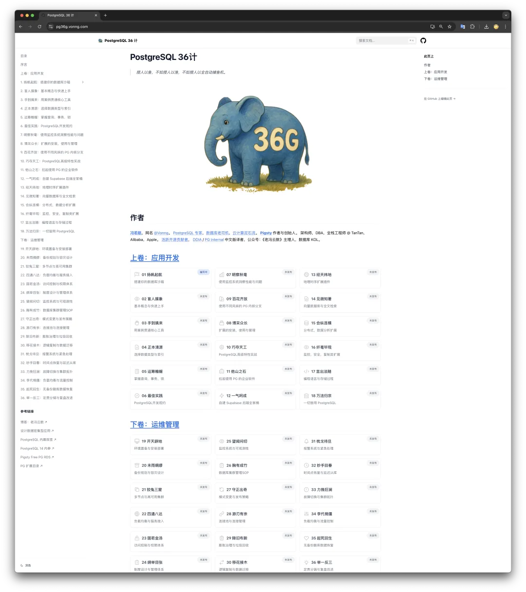
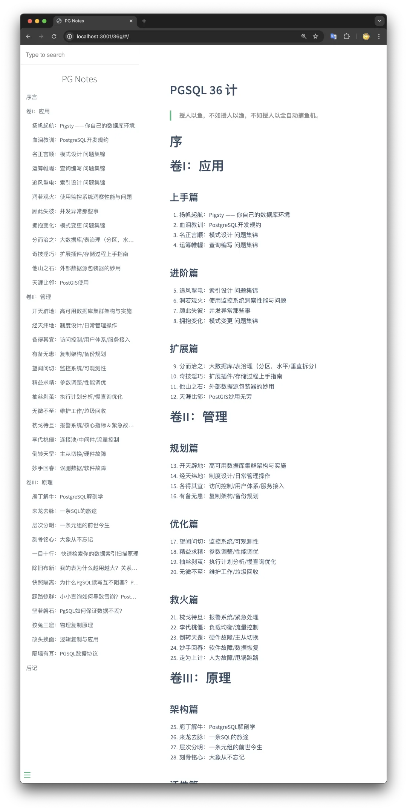
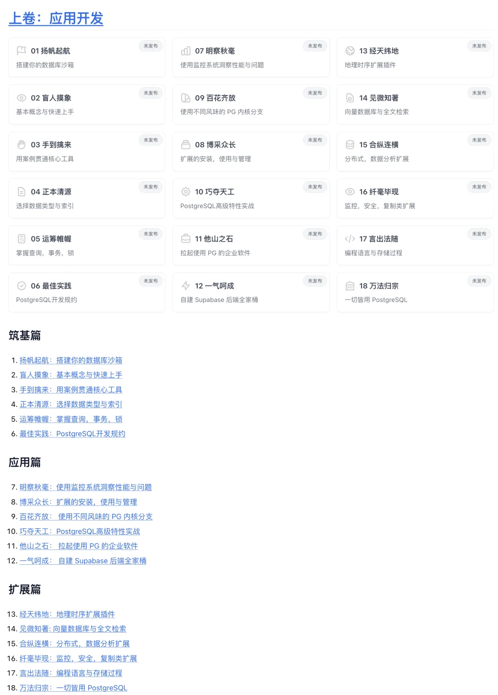
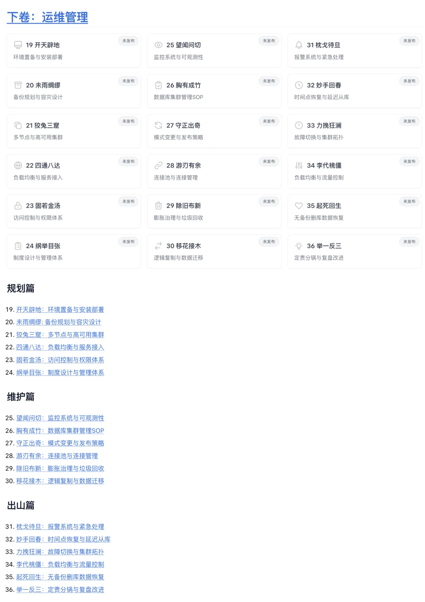

今天老冯起了一个新坑 —— PG 36 计。这是一套关于 PostgreSQL 应用开发与运维管理的教程。今天刚刚把架子搭好，准备在后面不断填充内容。

说起这个企划，这本书还是当初 2017 年翻译完 DDIA 第一版后，我想搞的一个系列，PostgreSQL 教程，分应用，管理，内核三篇。[昨天刚把 DDIA 第二版的 Claude 机翻给弄好](/db/ddia-v2/)，一下子就想到了这本书，这本书就连目录结构都是照着 DDIA 弄的，原来的版本目录如下：

当初还有两家出版社来找，怂恿我写一本。不过那时候老冯确实比较忙，所以这件事就搁置了，一搁置就是七八年过去了。不过，我倒是觉得现在确实是一个好时机，可以着手弥补这个遗憾了。

首先，PostgreSQL 在中国已经进入了高速发展通道，差不多相当于全球市场十年前的状态。我听阿里云的朋友说他们去年 PG 数量一年翻了一倍，足以看出这个势头之猛。然而不幸地是，市面上并没有多少足够好的学习材料与培训教程 —— 特别是关于生产实践中的应用开发与运维管理的主题。

第二，我搞了一个开源免费的 PostgreSQL 发行版 Pigsty，解决了 PostgreSQL 的易用性难题，也有了很多用户。但是用户群体基本都还是比较专业的开发/运维，对于初学者来说，即使你让它在 Linux 敲三条命令，也有些难为人家 —— 可能更多的是一些上下文技能：买云服务器/域名，ssh 登陆，psql 链接，图形工具，这种被 “老司机” 们忽略的隐性技能。因此，推出一个深入浅出的教程，更有利于推广普及 PostgreSQL 与 Pigsty。

第三，老冯这两年公众号写了不少，文字功底比以前好多了，起码支撑的起一套教程的编纂。而且现在 Claude Code 的水准（智商 120）已经能完成许多材料收集整理校对工作，写书写教程要相对容易多了。

所以，我觉得是时候搞一个这样的教程了。这本书我会放在 [pg36g.vonng.com](https://pg36g.vonng.com/)[1] 上面，不定期更新，争取在今年年底有一个基本完整的版本。因为 PG INTERNAL 和 PG14 INTERNAL 这两本内核书已经有了，没必要单独再写一卷，所以这次把 36 计拆分成上卷“应用开发”和下卷“运维管理”，每卷三篇 18 章。目录如下：

当然，目前的这个目录也只是一个粗略的大纲，如果读者朋友们对 PostgreSQL 有什么感兴趣的内容，欢迎在评论区留言或者私信告诉我，我会根据大家的反馈来调整内容规划。

## References

- `[1]` : <https://pg36g.vonng.com>

---

发布版本：[微信公众号](https://mp.weixin.qq.com/s/909t5Ah3ql2Ydy87cv6sxg)
