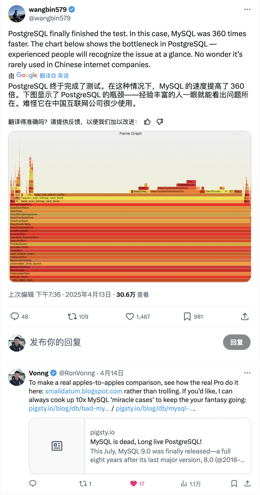
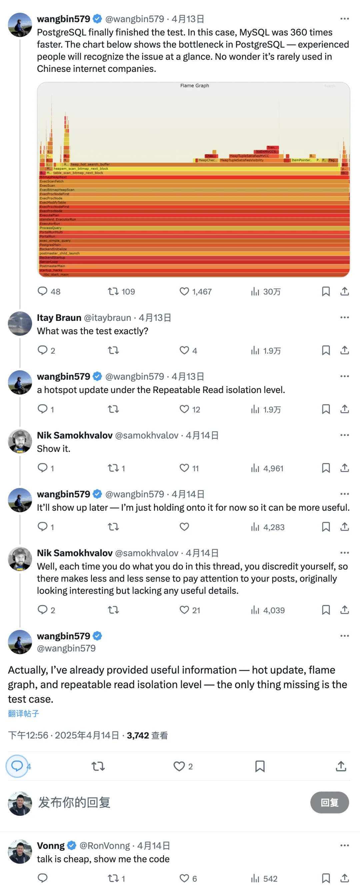
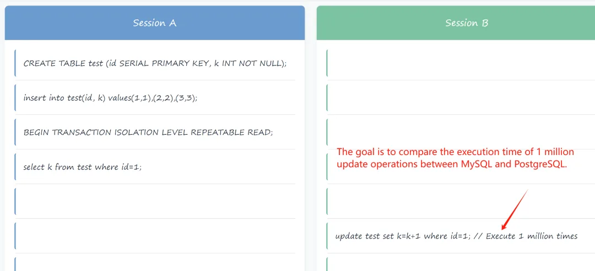
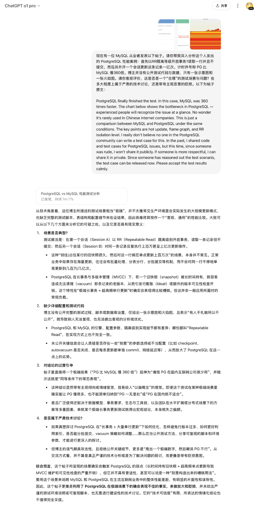

昨天，至少在十几个微信群里都有人 @ 我，发给我这条消息 《[有图有真相，MySQL 性能是 PG 的 360 倍，DS 还建议抛弃 PG](https://mp.weixin.qq.com/s?__biz=MjM5NzAzMTY4NQ==&mid=2653941901&idx=1&sn=455bd6f5bb5038900f98e31b19cae828&scene=21#wechat_redirect "有图有真相，MySQL性能是PG的360倍，DS还建议抛弃PG")》。大意就是推特上有个人发了个火焰图，说他有一个“秘密案例”：“PostgreSQL 比 MySQL 慢了 360 倍，难怪中国互联网公司不用 PG”，十几万的浏览。

于是我就去 X 上看了看原博这个帖子，挺长的一个 Thread。作为数据库老司机，我一看内容和发帖者就知道怎么回事了，这是一个很典型的伪装成技术讨论的恶意贬损。当然 MySQL / PG 国际社区可能没见过这种滚刀肉玩法，竟然还有不少人真的在尝试交流探究然后被耍的团团转。

在评论区的强烈要求下，推主仍然一直都不肯放出测试代码与数据。最后被人猜出来是个什么场景，才放出一个简单示意图

我留下了几条评论，指出他这种行为本质上是在 Trolling 根本不是严肃的技术讨论。他设计的这个案例，开个 Idle 事务锁行然后更新一 M 行来测时长，差不多类似于： “把垃圾回收关掉然后产生一 M 条垃圾，所以慢”，是一个很无聊的案例。现实中基本不可能有这种场景，真有这种场景在生产中的实际配置也会阻止这样的事情发生（咨询锁，超时，填充因子，HOT）。

这种问题类似于 MySQL 的： “表超过 2000 万行记录性能就完蛋了！说出来纯粹是让专家笑话，如果我要跟他抬杠的话，随时可以设计出无数案例让 MySQL 直接趴下，但这种没有意义的口水纯属浪费时间。

PostgreSQL 专家 德哥也在他的公众号文章《[MySQL 出息了！大败 PG 用的这个 case](https://mp.weixin.qq.com/s?__biz=MzA5MTM4MzY1Mw==&mid=2247494457&idx=1&sn=f8c125a86740616fda97a249fafb87c9&scene=21#wechat_redirect "MySQL出息了! 大败PG用的这个case")》里详细解释过这个问题了。对于德哥的分析，MySQL 社群里叶金荣评论到 “真没出息，只会对着 MySQL 汪汪吠”。

很难想象这是一个国产数据库“万里数据库”的开源生态负责人，MySQL 培训机构（知数堂）主理人能说出的话，但回想起中文 MySQL 社区其他一些成员的难绷表现，也不令人意外。毕竟我也在两年前《[MySQL vs PGSQL 直播闹剧](/pg/mysql-pg-live-drama/)》中就已经领教过这种离谱的作风了。

发推的这位 wangbin，我最近在 X 上有时候能看到。我有点儿印象，有群友说他以前在网易，然后去叶金荣的万里数据库，似乎不太顺利，领英公开信息都能对上。我看了看 LinkedIn 和 Github 曾经也是个开源开发者，有过 tcpcopy 这样的开源项目。似乎想转 PG 却因为不熟练而被拒，转论文营销号发发推抒发下愤懑之情。如果真是这样，那也是个可怜人。

网友群聊记录截图

有不少朋友说让我写篇文章批判下，我是觉得搞技术嘛，还是对事不对人。这种水平的问题也没啥好聊的，要是批判 MYSQL，我早就已经写了一系列摆事实，讲数据的文章，从各个维度进行剖析对比与批判了（见文末参考）。

至于人呢，我也能理解中年失业的这种焦虑状态，所以我建议这位博主读一读《佛说十善业道经》，多积善业，避免造妄语、两舌、恶口、绮语这样的恶业。认真严肃的技术讨论可以获得知识，提升认知，收获朋友与声望，而这样的妄语只会损耗自己的 Credit，让自己的求职路更为艰难。最好还是多干干正事，做点对 MYSQL 社区更有意义的事情吧。

## PostgreSQL vs MySQL @ 2025

回到 MySQL 和 PostgreSQL 对比这个问题，实际上我之前已经专门撰写过一系列文章对比过了。正儿八经有价值的性能对比应该是什么样子呢？我建议参考 Mark Callaghan 的博客 Small Datum[1]，里面有几十篇关于 MySQL 和 PG 的性能分析与对比，精心设计了各种读写测试，针对各种版本在不同环境下的表现给出了可复现的代码。这是真正的专业人士应该有的表现。

说起来，今天 MySQL 9.3 发布，我准备在最近重新写一篇在 2025 年，MySQL 与 PostgreSQL 的技术对比，敬请期待。

[**MySQL 安魂九霄，PostgreSQL 驶向云外**](/db/mysql-is-dead/)

[MySQL 新版恶性 Bug，表太多就崩给你看！](/db/mysql-is-dead/)

[用 PG 的开发者，年薪比 MySQL 多赚四成？](/pg/pg-dev-salary/)

[Oracle 最终还是杀死了 MySQL！](/db/oracle-kill-mysql/)

[MySQL 性能越来越差，Sakila 将何去何从？](/db/sakila-where-are-you-going/)

[MySQL 的正确性为何如此拉垮？](/db/bad-mysql/)

[如何看待 MySQL vs PGSQL 直播闹剧](/pg/mysql-pg-live-drama/)

[驳《MySQL：这个星球最成功的数据库》](/pg/rebut-mysql-best/)

[PostgreSQL 正在吞噬数据库世界](/pg/pg-eat-db-world/)

---

发布版本：[微信公众号](https://mp.weixin.qq.com/s/igxxBxP9mRCwfZvyjwgPRA)
