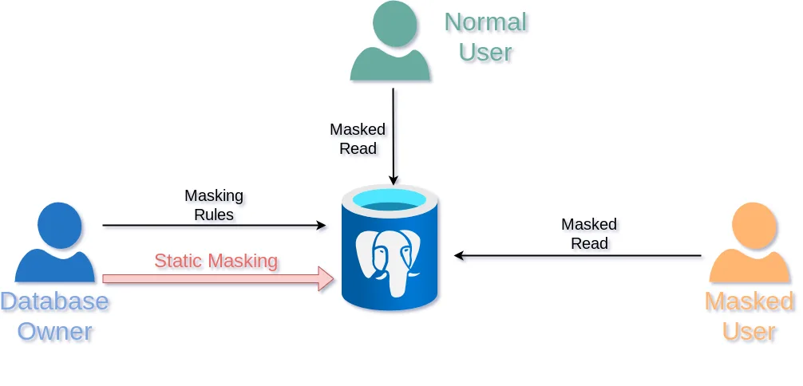
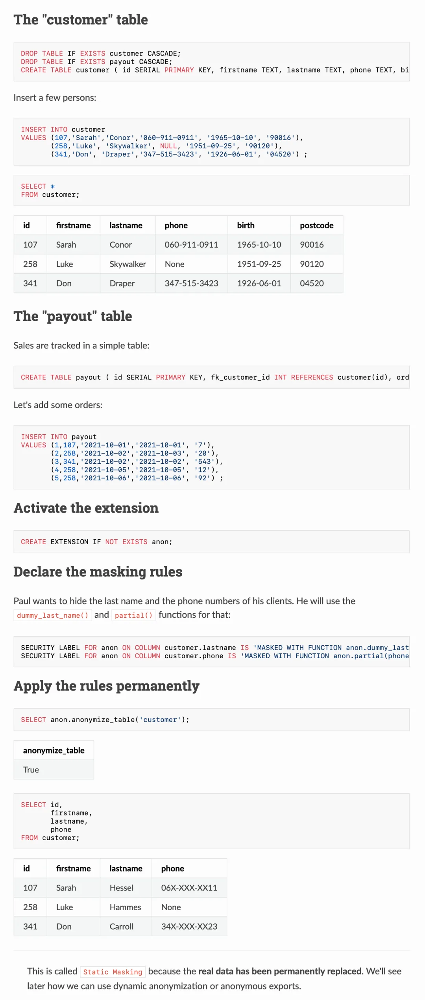
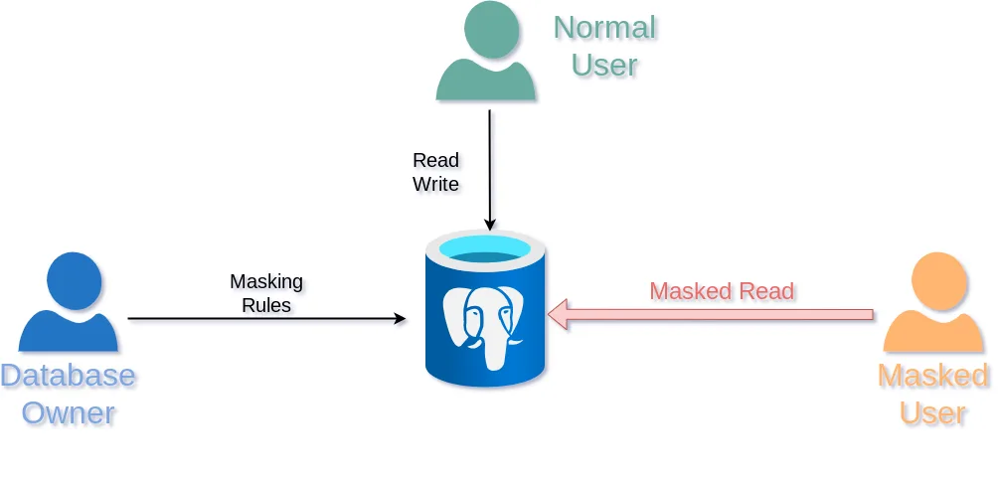
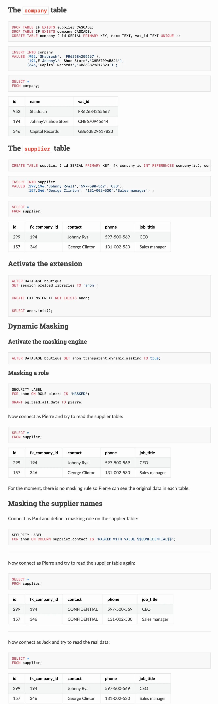
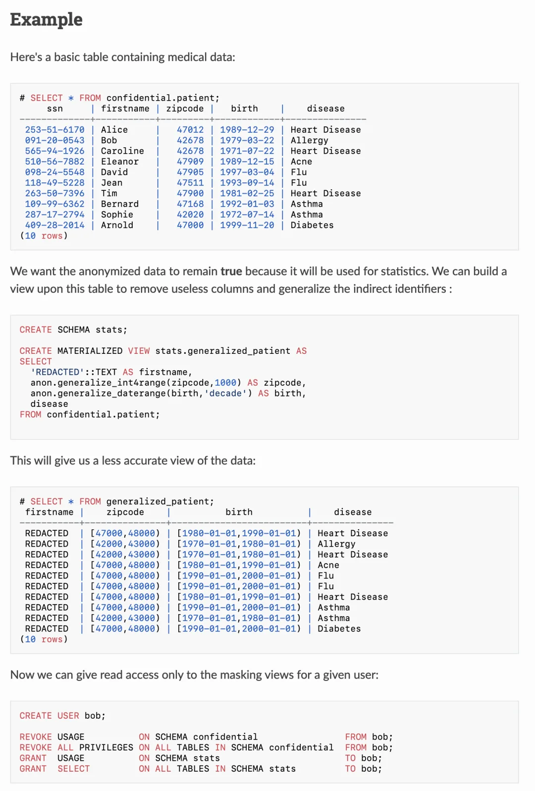

## 今天我们来聊一聊个人信息合规问题，以及如何在数据库中实践各国法律的 “匿名化” 要求。最后介绍新出炉的 PostgreSQL Anonymizer 2.0 以及使用方法。

---

## 1. 哎呀，谁在 PII 上翻车了？

还记得前几年那个堪称“翻车现场”的事件吗？滴滴公司因为在个人信息收集和使用方面存在严重违法违规问题，被监管部门找上门来并狠狠罚了一大笔钱，瞬间引爆社交媒体的讨论。再往后没多久，亚马逊因其广告业务不符合欧盟 GDPR 要求，也被卢森堡监管机构揪住“数据黑洞”，祭出了高达 7.46 亿欧元的天价罚单，让人再次瞠目结舌

无论是国内还是国外，个人信息数据安全 “翻车”事件层出不穷，动辄过亿的用户信息被“无情”泄露，让广大吃瓜群众们细思极恐，纷纷质问：“我到底还有多少隐私，没被人摸透？”

从这些轰动一时的“个人敏感数据保护大翻车”中，我们不得不意识到：数据安全合规早已不是敷衍的“选择题”，而是企业发展和社会信任的“必修课”。毕竟，无论是中国《个人信息保护法》、还是欧盟的《GDPR》，对个人信息的收集、保存、使用、处理、转让乃至跨境传输都提出了严格的要求，一旦违规，等待你的往往是“不封顶”的巨额罚单以及品牌声誉的坍塌。

当然，个人信息合规本身是一个大工程，涉及到信息主体在各个环节的权利保护，但在数据“出生”后的生命周期中，“数据库老司机”最关心的还是如何在数据库层面做好数据安全合规，而其中尤为关键与棘手的一环，就是如何对个人敏感信息进行「**去标识化**」处理。

---

## 2. 去标识化的法律要求

2021 年颁布的《中华人民共和国个人信息保护法》第五章第五十一条第三款规定：个人信息处理者的义务包括采取相应的加密、**去标识化**等安全技术措施；相应地 《GB/T 35273 信息安全技术 个人信息安全规范》（2020 版本）要求个人信息控制者在收集个人信息后，宜立即进行去标识化处理，并采取技术和管理方面的措施，将去标识化后的信息与可用于恢复识别的个人的信息分开存储并加强访问和使用的权限管理。

与此同时，欧盟的 《通用数据保护条例》（GDPR）也要求，数据控制者（Controller）及数据处理者（Processor）应评估并尽可能采用匿名化、假名化等技术手段以减少隐私风险。在美国，加州《消费者隐私法 CCPA/CPRA》 与医疗健康领域的 HIPAA 也都提出了对数据去标识化的要求。

**数据匿名化在 ISO 标准 (ISO 29100:2011)**中定义为：

> “个人身份信息[1](PII) 被不可逆地改变的过程，使得 PII 控制者无法再直接或间接地识别 PII 主体，无论是由 PII 控制者[2]单独还是与任何其他方合作”

那么真正的问题就是，在使用诸如 PostgreSQL 这样的数据库存储个人信息数据时，又怎样做到去标识化？今天，我们就聊聊 PostgreSQL 上的神秘“去标识化”扩展—— **Anomyizer**。

---

## 3. PostgreSQL Anomyizer

说到“数据脱敏”，倘若你正用的是 PostgreSQL 数据库，那么恭喜：有一款神器扩展值得关注—— **PostgreSQL Anonymizer**。这是来自法国 “大力波实验室” 的知名 PG 扩展，它能让你的敏感信息一键换个“马甲”，从而把泄露风险降到最低。

这个扩展刚刚推出了 2.0 版本，基于 Rust PGRX 框架重写，整体焕然一新，我刚刚完成编译，测试打包，在 10 个主流 Linux 发行版大版本上制作了开箱即用的 RPM / DEB 包。发现跟以前用 C 编写的版本确实大不一样了。

Anomyizer 采用了声明式的匿名化方法。也就是说，你可以使用 PostgreSQL 的数据定义语言（DDL）来声明脱敏规则，并将匿名化策略直接写在表定义中。而且它使用的是一种非常优雅的方式：`SECURITY LABEL`。

这个扩展的主要目标是从设计层面上实现匿名化。我们坚信，编写数据脱敏规则的人应该是开发应用程序的人员，因为他们对数据模型最为了解。因此，脱敏规则必须直接在数据库架构中实现。

一旦定义了脱敏规则，你可以通过以下 5 种不同的脱敏方式来应用它们：

1.**匿名转储**：将脱敏后的数据导出为 SQL 文件 2.**静态遮罩**：根据规则直接移除 PII3.**动态遮罩**：仅对被脱敏用户隐藏 PII4.**视图遮罩**：为被脱敏用户构建专用视图 5.**FDW 遮罩**：对外部数据应用脱敏规则

每种方法都有其优缺点，也适用于不同的使用场景。但无论如何，**在 PostgreSQL 实例内部直接对数据进行脱敏，而不依赖外部工具，是控制数据暴露并降低数据泄露风险的关键。**

此外，anon 扩展还提供了多种**脱敏函数**：如随机化、虚构（faking）、局部混淆（partial scrambling）、洗牌（shuffling）、添加噪声（noise），或甚至使用你自定义的函数！最后，该扩展还包含一组检测函数，可以**尝试猜测**哪些列需要匿名化。

> **“通过 PostgreSQL Anonymizer，我们在数据库设计阶段就集成了在生产环境之外必须匿名化数据的原则。这样我们不仅能增强对 GDPR 的合规性，而且在版本升级或测试时也不会影响测试质量。”**—— Thierry Aimé，法国公共财政总局 (DGFiP) 架构与标准办公室
>
> **“得益于 PostgreSQL Anonymizer，我们能够定义复杂的脱敏规则，从而在不影响功能的情况下实现对数据库的全面伪匿名化。在确保患者数据机密的同时使用真实数据进行测试，对提升功能稳健性和客户服务质量至关重要。”**—— Julien Biaggi，bioMérieux 产品负责人

## 4. 快速上手

首先，最基本的功能是**静态遮罩**（Static Masking），这个功能是为了满足法律上永久去标识化的需求，它会将原始数据直接替换为匿名化的版本。一旦处理，真实数据将无法恢复。

---

**动态屏蔽功能**：数据库所有者可以隐藏某些用户的个人数据，而其他用户仍可以读取和写入真实数据。动态遮罩提供了真实数据的视图，但不对其进行修改。一些用户可能只读取屏蔽的数据，而其他用户则可能访问真实版本。

匿名转储功能：当你将数据导出时，个人信息将自动应用遮罩，不用在手搓字符串替换之类的土办法了！当然，你也可以用遮罩视图，来控制不同的人能看到不同程度遮盖的信息。

此外，Anon 扩展还提供了许多其他功能来处理个人信息，这里就不再展开了。PostgreSQL Anomyizer 的文档网站上提供了非常丰富的示例与介绍。如果你想进一步了解这个扩展，请一定不要错过：<https://postgresql-anonymizer.readthedocs.io/>

---

## 5. 一键安装？找“pig”就对了

你可能会问：“唉，这么牛逼的扩展，安装起来会不会很麻烦？” 别怕，因为这年头有“PG 扩展管理器”这个宝贝，“pig”。它能在**10 大主流 Linux 发行版**上，针对 PG 13 - 17，为你**一键安装** PostgreSQL Anonymizer，省时省力。

当同事找你求助：“哥们儿/姐们儿，帮忙搞下脱敏扩展呗。” 你只需淡定打开命令行，敲下：`pig ext add anon`，就能全自动搞定了：

<!-- -->

    $ curl -fsSL https://repo.pigsty.io/pig | bash 安装 pig$ pig repo add pigsty pgdg -u  # 添加仓库$ pig ext install anon    # 安装扩展

当然，`anon` 这个扩展需要在 PG 配置中添加到 `shared_preload_libiraries` 中并重启才能加载生效。然后你就可以使用 `CREATE EXTENSION` 并感受这个扩展的强大能力了！

题外话，像 Anon 这样牛逼的扩展，在 pig 中还有整整 350 个（well 虽然总数不假，但这种牛逼程度的扩展大概也就是几十个吧）。

顺带一提，下周三晚，在开源中国直播 PG 扩展吞噬数据库世界，介绍包括 anon 在内的各个扩展 以及 扩展包管理器 pig，欢迎预约收看。

---

## 6. 从此 PII 不怕翻车

这一整套流程下来，让我们从“**怕暴雷的焦虑**”转向“**一键上新工具的乐呵**”。

- 先弄清楚监管要求，了解哪些字段是敏感信息；
- 然后用 PostgreSQL Anonymizer 声明脱敏规则；
- 配合日志审计、权限控制等手段，让隐私数据安全可控；如此一来，就算数据某天真的被拖库了，对方看到的也只是“张三”变成“弗拉明戈”之类的花名或假信息，难以追溯到真实身份。你的企业或团队，也能安心地研发测试，不用天天祈祷“别泄露别泄露”了。

---

## 7. 结语：在合规和效率之间找到平衡

在个人信息保护的新常态下，数据库加固、隐私合规已经不是“选择题”而是一道“必答题”。如何做好脱敏与匿名化，既满足各国法律的要求，又能保持业务灵活性？PostgreSQL Anonymizer 给出了一个值得借鉴的答案。

当然，一款工具也不是包治百病，真正的合规还需要公司战略层面的投入，完善的权限管理与审计，以及持续的数据安全文化。但至少在 PostgreSQL 领域，有了 Anonymizer 2.0 的全面升级，再加上 “pig” 一键安装辅助，你就多了一份稳妥，多了一些底气。

毕竟，没人想在下一个 PI(I) 科幻灾难片里被迫出演主角……

---

发布版本：[微信公众号](https://mp.weixin.qq.com/s/U3go6FneJhp2IPZ6wtiWAA)
