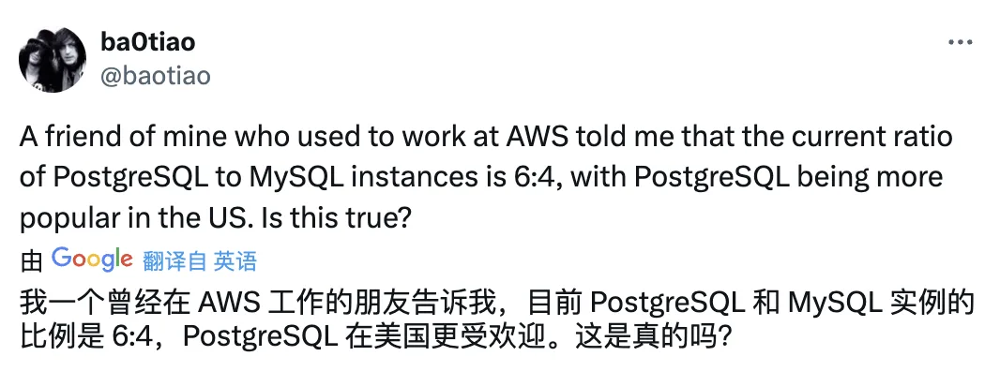
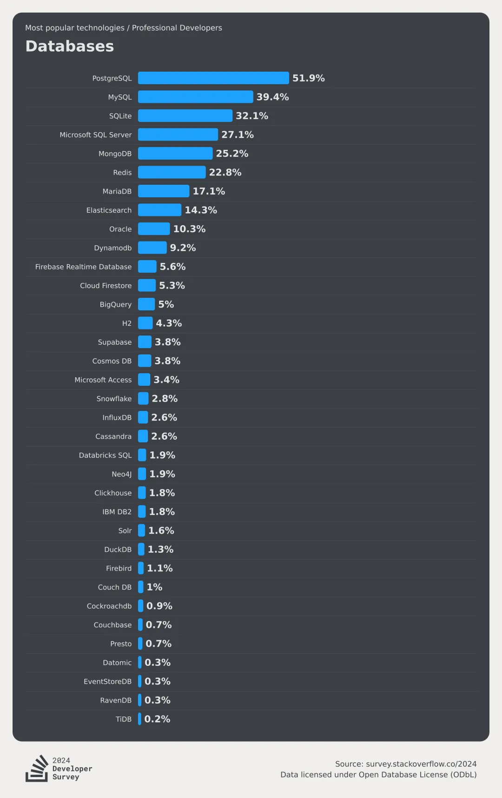
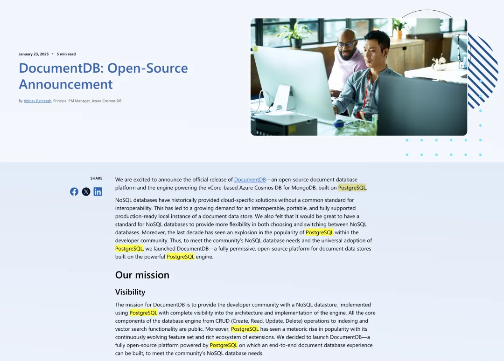
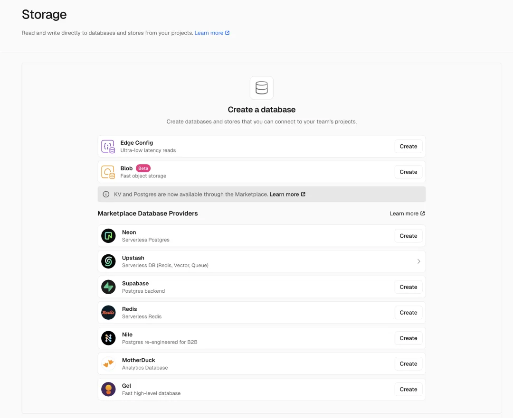
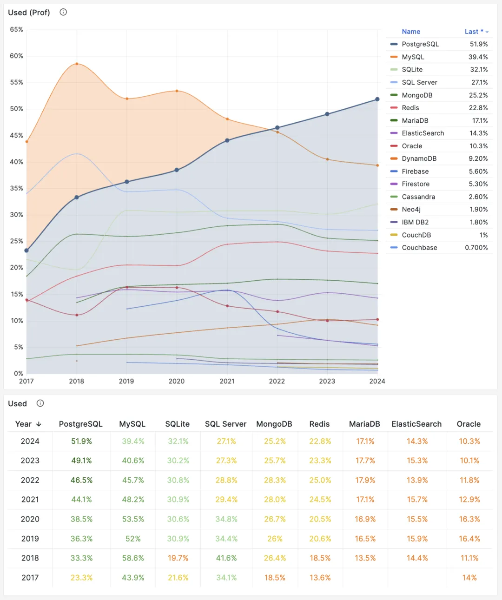

昨天在 X 上看到暴跳发了个帖。暴跳以前是 PolarDB InnoDB 引擎的负责人，现在是阿里云 RDS PG + MySQL 的头儿：

所以虽然这是个 “我朋友说” 的疑问句式，但我也并不怀疑这个数字的真实性。大概在两年～三年前，AWS 上 PostgreSQL 的实例数量刚好超过 MySQL，而按照这两年 PG 发展的迅猛势头，从 1:1 提升到 3:2 也并不算离谱。

[StackOverflow 2024 调研：PostgreSQL 已经超神了](/pg/pg-is-no1-again/)

---

当然，在去年 PGCon.Dev 上我也特意问了 AWS 的人，他们没说具体的比例，但告诉我无论是按实例数量算还是按 CPU 数量算，PostgreSQL 都已经比 MySQL 更多了。特别是 PostgreSQL 实例的平均规格要比 MySQL 大，所以如果按照 CPU 核数来算的话，PostgreSQL 就比 MySQL 多更多了。

其实从 AWS 的产品发布与技术投入路线来看，不难看出全球云计算一哥已经把重注都下在了 PostgreSQL 上，首先整个 RDS （MySQL + PGSQL）的产品经理就是 PostgreSQL 社区核心组成员 Jonathan Katz，近两年 PG/PGVECTOR 在向量数据库领域嘎嘎乱杀，背后的主要推手和贡献者就是 AWS。

然后最近的 Aurora 新品分布式 DSQL 只有 PostgreSQL 兼容，没搞 MySQL 的，放在以前这种事从来都是 MySQL 先上的。

---

与此同时，其他公司也继续在 PostgreSQL 发力。除了先前持续维护的分布式扩展 Citus 之外，最近微软还开源了 DocumentDB，一款将 PostgreSQL 转换为 MongoDB 的扩展 —— 而且支持与 Citus 深度融合，提供分布式文档数据库的能力。

当然国内的情况比较特殊，市场会滞后几年。我也特意和阿里云的朋友聊过这个事。作为国内云数据库一哥，目前他们 RDS MySQL 实例数量依然远高于 PostgreSQL。但这两年在增速上，PostgreSQL 显著超过 MySQL 了。而且阿里云用来主推信创国产化市场的 PolarDB 也是 PostgreSQL 路线，PolarDB Oracle 则是 PolarDB PG 的二级衍生分支。

当然，如果我们把目光投向前端开发者使用的 Serverless 云数据库，这个趋势就更明显了。例如在 Vercel 上，推荐的 7 个数据库存储中，四个是直接基于 PostgreSQL，两个 Redis，一个 DuckDB，根本没有 MySQL 什么事。最活跃的数据库用户群体已经系统性的抛弃 MYSQL 了。

> Neon / Nile / Supabase / Gel (原名 EdgeDB) 都是 PostgreSQL 封装

毫无疑问，[PostgreSQL 正在吞噬数据库世界](/pg/pg-eat-db-world/)，MySQL 作为数据库领域中 PostgreSQL 最大的竞争对手之一（另一个是 Oracle），正在面临严峻的挑战。

我认为 [MySQL 最大的失策就是错过了向量数据库 AI 这一波](/db/mysql-is-dead/)巨大的增量。PostgreSQL 凭借内嵌足够好的 pgvector，几乎碾压了整个专用向量数据库领域，成为 AI 时代的事实数据库标准。成为了最近几年数据库领域的最大赢家。

原因很简单：例如跑 Dify 需要一个 PG 和一个向量数据库，如果你用 pgvector，那么你只需要一个 PG 就够了 —— 无需 ETL 与额外组件额外维护！《[专用向量数据库凉了吗？](/db/svdb-is-dead/)》。

基于同样的理由，你并不需要一个专门的 MQ，缓存，全文检索，地理空间，图，文档数据库，所有这些能力都在 PostgreSQL 一个数据库中，通过内核本体或者扩展插件的方式提供。

而 MySQL 因为 Oracle 的不作为与躺平摆烂，还还将继续错过 OLAP 领域的 [DuckDB 缝合大赛](/pg/pg-duckdb/)，以及全文检索领域的 Tantivy 缝合大赛，未来与 PostgreSQL 的差距还会越拉越大。

按照现在的发展趋势，我认为大概会在几年内看到 PostgreSQL 正式成为数据库领域的 Linux 内核，而 MySQL 会变为 PHP 现在的状态 —— “PHP 是世界上最好的语言”，然而世界早已被 Javascript 吞噬。

---

[**PostgreSQL 正在吞噬数据库世界**](/pg/pg-eat-db-world/)

[**MySQL 安魂九霄，PostgreSQL 驶向云外**](/db/mysql-is-dead/)

[PostgreSQL is eating the database world](/db/mongo-powered-by-pg/)

[谁整合好 DuckDB，谁赢得 OLAP 数据库世界](/pg/pg-duckdb/)

[向量数据库凉了吗？](/db/svdb-is-dead/)

[StackOverflow 2024 调研：PostgreSQL 已经超神了](/cloud/bonus/)

[PostgreSQL 会修改开源许可证吗？](/pg/pg-license/)

[为什么 PostgreSQL 是未来数据的基石？](/pg/pg-for-everything/)

[技术极简主义：一切皆用 Postgres](/pg/just-use-pg/)

[2023 年度数据库：PostgreSQL (DB-Engine)](/pg/dbengines-2023/)

[PostgreSQL 到底有多强？](/pg/pg-performence/)

[为什么 PostgreSQL 是最成功的数据库？](/pg/pg-is-best/)

[StackOverflow 2022 数据库年度调查](/db/so2022-db/)

[为什么说 PostgreSQL 前途无量？](/pg/pg-is-great/)

[MySQL 新版恶性 Bug，表太多就崩给你看！](/db/mysql-is-dead/)

[用 PG 的开发者，年薪比 MySQL 多赚四成？](/pg/pg-dev-salary/)

[Oracle 最终还是杀死了 MySQL！](/db/oracle-kill-mysql/)

[MySQL 性能越来越差，Sakila 将何去何从？](/db/sakila-where-are-you-going/)

[MySQL 的正确性为何如此拉垮？](/db/bad-mysql/)

[如何看待 MySQL vs PGSQL 直播闹剧](/pg/mysql-pg-live-drama/)

[驳《MySQL：这个星球最成功的数据库》](/pg/rebut-mysql-best/)

---

发布版本：[微信公众号](https://mp.weixin.qq.com/s/tuzmmkEIOsuq2-8rMbmVLw)
