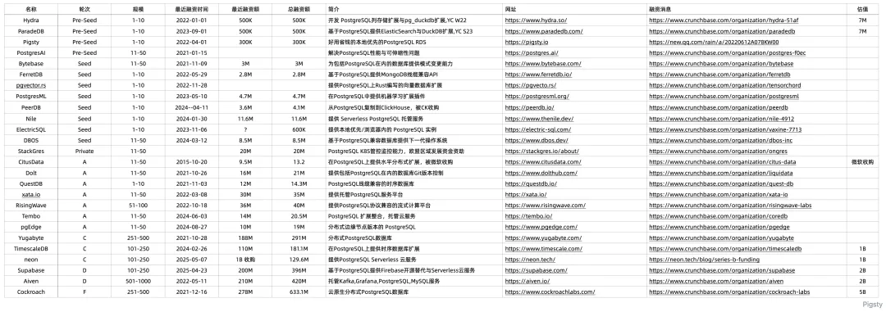
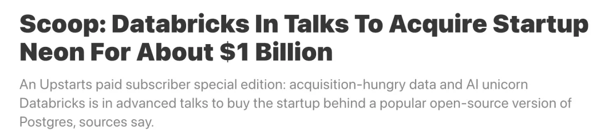
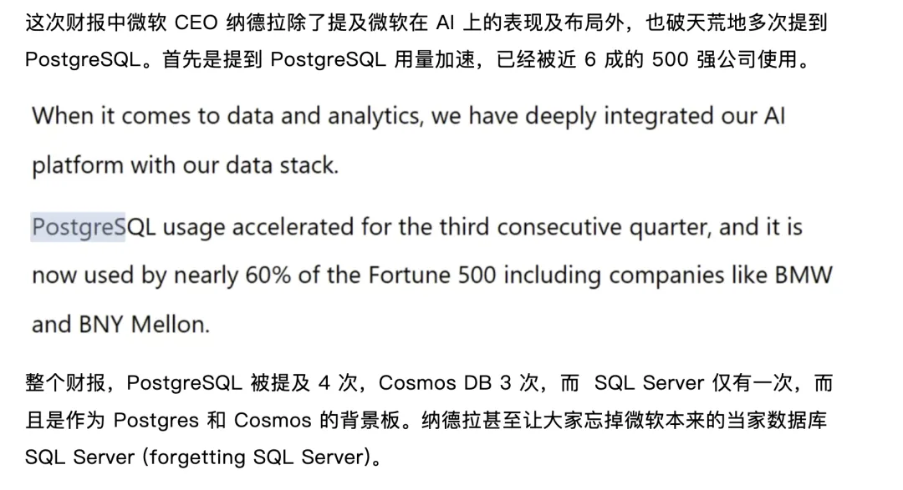
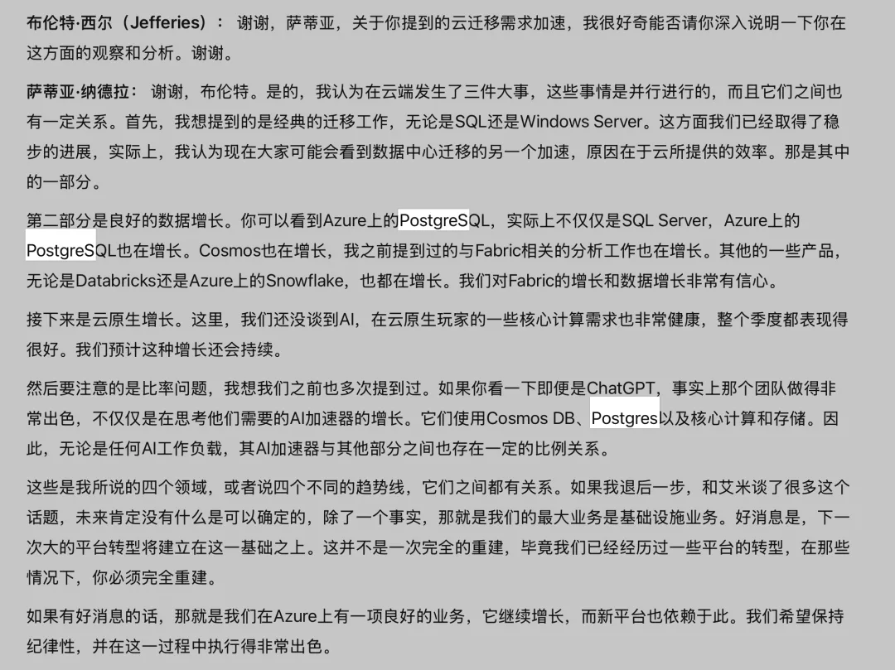
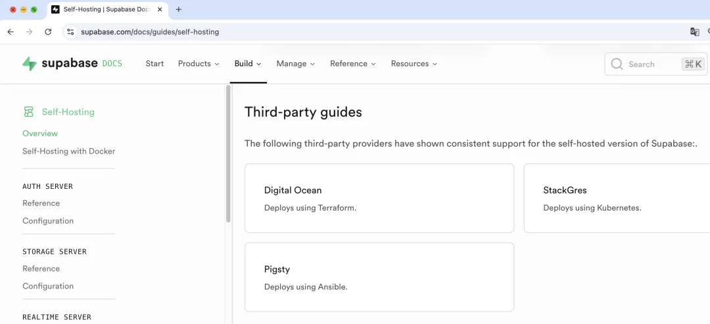

最近 PostgreSQL 生态的公司备受市场青睐，刚刚 Databricks 拟以 10 亿美金估值收购 Neon，与此同时，Supabase 则在短短半年时间融到了 D 轮整整 2 亿美金。

与此同时，微软 CEO 纳德拉在昨天的财报会议上多次提到了 PostgreSQL 的惊人表现：《[纳德拉财报点名 Postgres，助微软夺回市值第一](https://mp.weixin.qq.com/s?__biz=MzkzMjI2MDY5OQ==&mid=2247509936&idx=1&sn=e8afb1ff7203529f0550fb4b83707775&scene=21#wechat_redirect)》，PostgreSQL 赢得了资本市场的青睐。PG 生态的公司几乎拿完了数据库领域的钱

在 PostgreSQL 生态中，老冯一直特别看好 Neon，Supabase 这两家公司。前者提供了 Serverless Postgres 托管服务，后者则将 Postgres 与各种扩展，生态组件封装为后端一条龙托管服务。这两个团队都体现出敏锐的技术前沿洞察力，并解决了 PostgreSQL 生态中的一些重要问题。

现在创业起步最佳实践基本上就是把前端托管在 Cloudflare 和 Vercel 上，然后数据库配一个 Neon 或者 Supabase —— 当然也有其他选择，比如 Prisma Vercel 也都在搞托管 PG，然后各家云厂商也都有 PG RDS。当然 Pigsty 也可以在各种云服务器上自建 PG RDS 与 Supabase 甚至是 Neon。

---

而现在，Neon 已经到了收获的时刻。Upstarts 透露，Databricks 拟以 1B 的估值洽谈收购 Neon。

与此同时，Supabase 的估值已经来到了 2B，并在短短半年，从 C 轮的 80 M 融资额又干了一轮 200 M 的 D 轮融资。估计上限要比 Neon 还高一圈。

---

不仅仅是创业公司，在科技巨头中，PostgreSQL 的地位也日益凸显。例如昨天，微软上周交出了一份创纪录的财报后，股价大涨，也帮助其从苹果手里夺回了全球市值第一的宝座。

纳德拉说 PostgreSQL 的使用量连续第三个季度加速增长，现在已被近 60% 的《财富》500 强公司使用，包括宝马和 BNY Mellon 等公司。详情请看 Bytebase 发表的《[纳德拉财报点名 Postgres，助微软夺回市值第一](https://mp.weixin.qq.com/s?__biz=MzkzMjI2MDY5OQ==&mid=2247509936&idx=1&sn=e8afb1ff7203529f0550fb4b83707775&scene=21#wechat_redirect)》，

而 AWS 就更不用说了，RDS 的头都是 PostgreSQL 社区核心组成员，投入了大量的资源在 PostgreSQL，还有 pgvector 上。新出的 Aurora DSQL 干脆就是只有 PostgreSQL 兼容版了。

## 老冯评论

毫无疑问，PostgreSQL 已经积攒了充足的势能。现在明眼人都能看出，PostgreSQL 将成为整个数据库领域的主宰，占据类似于 Linux 在服务器操作系统中的生态位。而真正的竞争，很快就会变为 PostgreSQL 生态中各种发行版的内战。

老冯自己也是做 PostgreSQL 的，俺做的 Pigsty 已经成为中国在整个 PG 生态中最有影响力的开源项目，也开始走向全球，有了一张参加 PG 发行版大乱斗的门票。可惜国内能承担风险的美元基金全都跑光了。所以这几年也没拿投资，都是一个人单干。

有时候我也挺羡慕这些在美国的同行的，毕竟一个人的速度比不上一群人烧钱。但好在这几年也总算过来有稳定营收了。虽然不是那种 Billion Dollar Fly to the Moon 的故事，但自己的事业与小生意干的也确实挺开心，那就够了。

---

最后是老冯的广告时间，Pigsty 现在是 Supabase 自建的三大官方推荐方案之一，你可以用几分钟不到的时间，在自己的服务器上轻松拉起功能比 Supabase 功能更丰富的，属于你自己的 Supabase。请看：[创业出海神器 Supabase 自建指南](/db/supabase/)

---

发布版本：[微信公众号](https://mp.weixin.qq.com/s/skxFplC0ow0Hh9gqs_N4hQ)
