今天，著名的数据库流行度榜单 DB-Engine 发布了 2024 年度数据库。PostgreSQL 已经是第五次获得这个荣誉头衔了。确实印证了我的判断 —— 《[**PostgreSQL 正在吞噬数据库世界**](/pg/pg-eat-db-world/)》

当然，2023 年，2019，2018，2017 年的年度数据库也是 PostgreSQL，如果不是 2020 和 2021 年的风头被 Snowflake 夺走了，屈居第二，否则 PG 就是连续七年的全冠王了。

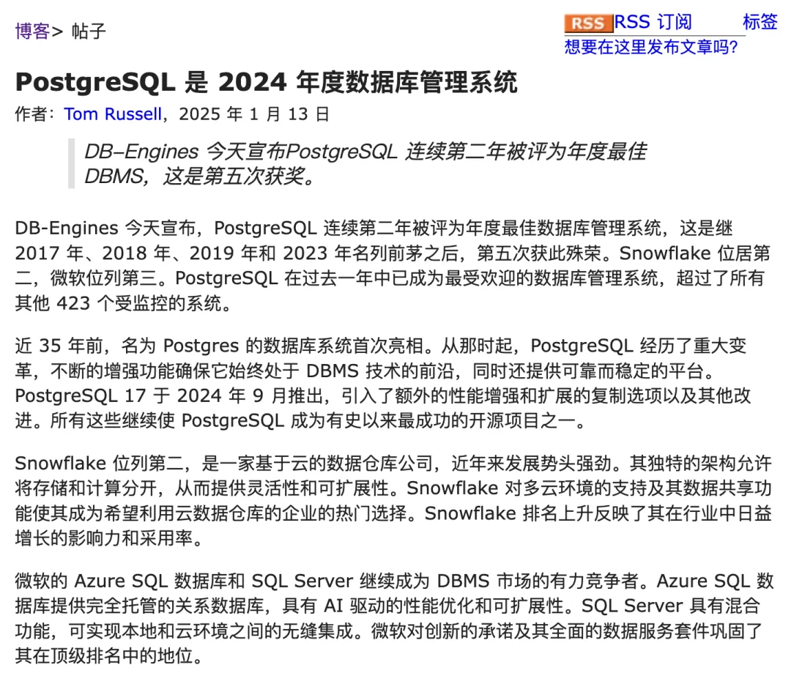

最有意思的是，其实今年按照 DB-Engine 的流行度榜单分数增量来看，Snowflake 增长了 28 分，PG 增长了 14.5 分，按照他们的年度数据库计算规则（2025 年 1 月 - 2024 年 1 月的流行度分数）来看，应该是 “Snowflake” 拿下 “年度数据库”，但编辑依然还是选择 PG 作为年度数据库。

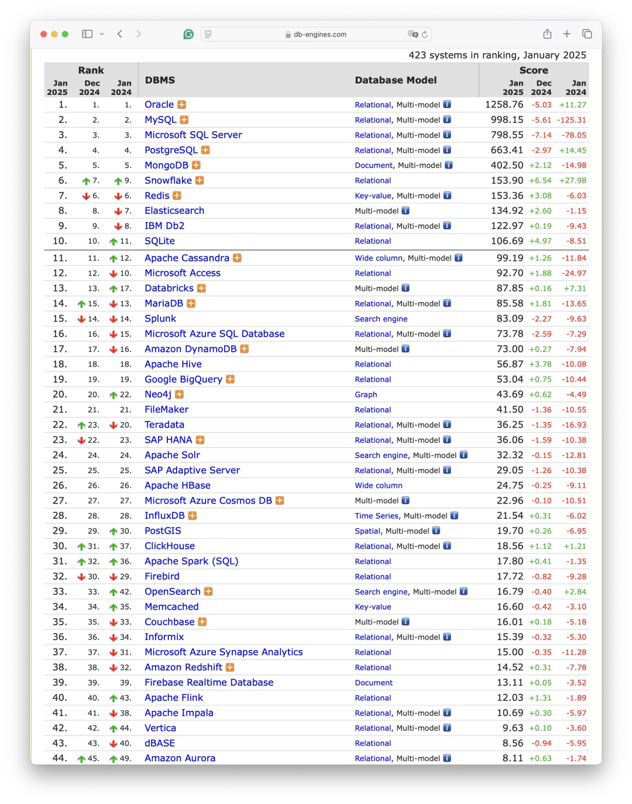

当然我不认为 DB-Engine 的编辑会犯这么愚蠢的小学数学错误。然而以 PostgreSQL 在 2024 年的惊人增长与亮眼数据来看，如果他们没有将 PG 评为年度数据库的话，那么丧失公信力和丢脸的也只能是这个榜单自己。

这就跟如果旷野之息和巫师 3 不算年度游戏，那丢脸的只会是游戏评测媒体一样。所以我猜编辑也只能在无奈之下悖着自己的数据与规则梗着脖子将 PG 捧上 No.1。

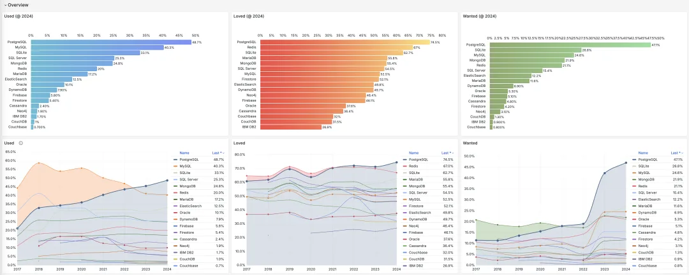

过去 8 年 StackOverflow 数据库问卷调查

老实说，比起 《[**StackOverflow 年度全球开发者调研**](/pg/pg-is-no1-again/)》这样的第一手大样本量问卷调查，DB-Engine 这样的热度榜单只能作为一个模糊参考 —— 鉴于它采用了相对恒定的标准，因此在研究数据库相对于自己本身的历史流行度变化来说有不错的参考价值（纵向可比性），但是在水平比较不同数据库的流行度（横向可比性）时的参考价值就要大打折扣。

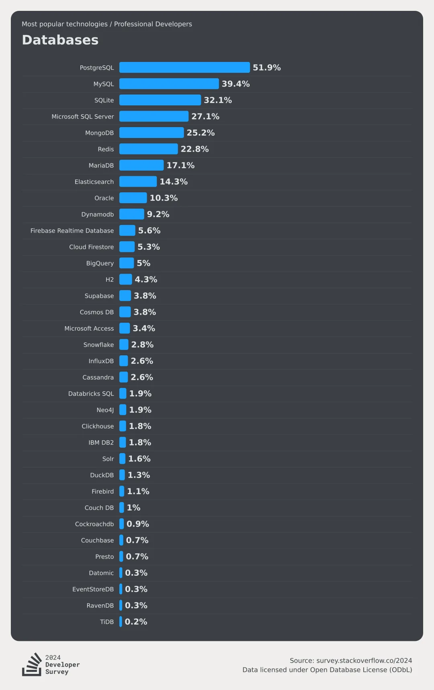

2024 年 StackOverflow 数据库流行度问卷调查：真·遥遥领先

尽管如此，让我们还是来看一看这份榜单，看看 2024 年，数据库领域又有哪些趋势与趣事？

## 让我们来看看更多详细的数据

首先，我们来看这份榜单从 2012 至今 13 年的全部数据走势。不难看出，整个图表中基本只有 PostgreSQL （以及 Snowflake）一直都在高速增长，成为了这个时代中数据库最大的赢家，注意这是对数坐标系。

虽然 Snowflake 也很不错，也有着“流行度”上高速增长，还拿过 20，21 年度的数据库，但在使用率上跟 PostgreSQL 完全不是一个数量级的选手（根据 StackOverflow 调研数据，开发者中 PG 使用率 52%，Snowflake 使用率 2.8% 差了 20 倍）。

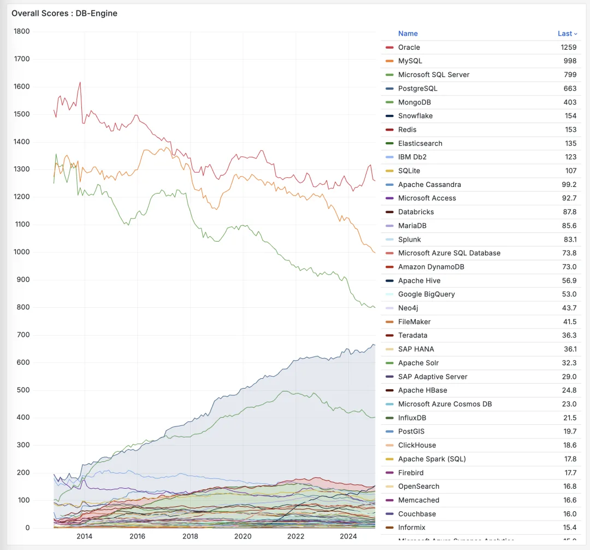

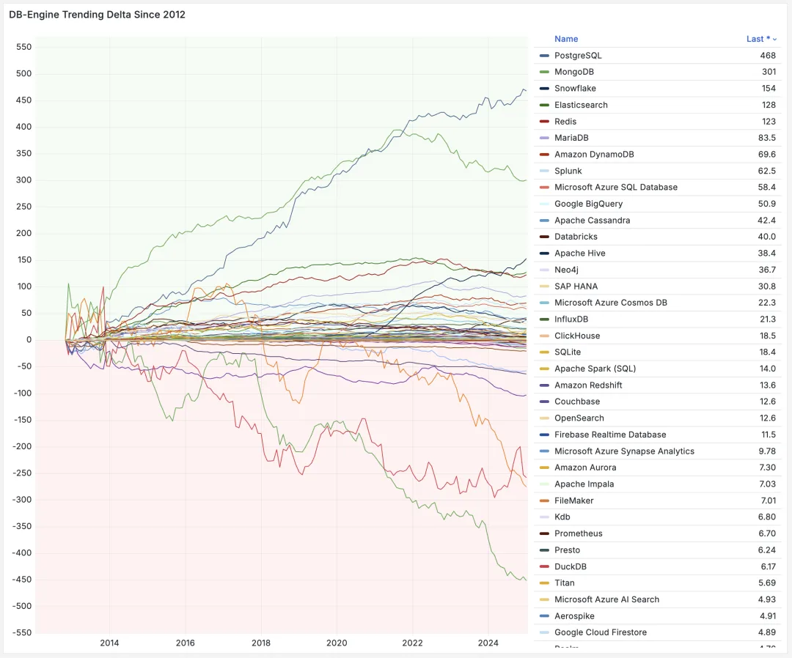

如果我们看分数的变化量，这个趋势就会更加明显。

然后，让我们再来看看最近一年，在流行度上得分与丢分最厉害的选手。年度数据库是 PostgreSQL，那么年度最大输家，依然是 MySQL，Oracle 躺平摆烂，MySQL 在过去一年的表现只能用灾难来形容。

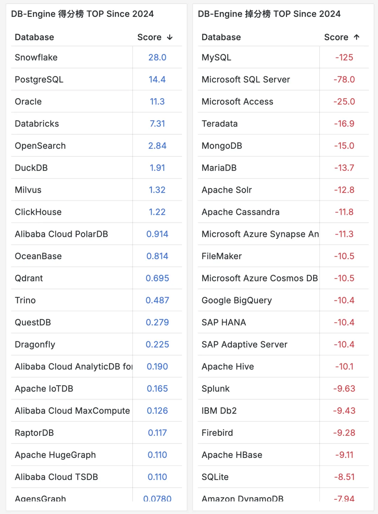

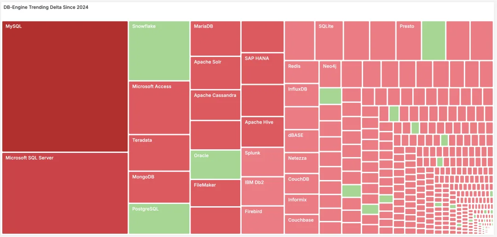

接下来，我们看看主流关系型数据库的表现，看起来 MariaDB 和 SQLite 最近几年也要把流行度增长给跌回去了。如果这样那真只剩 PG 一枝独秀了。

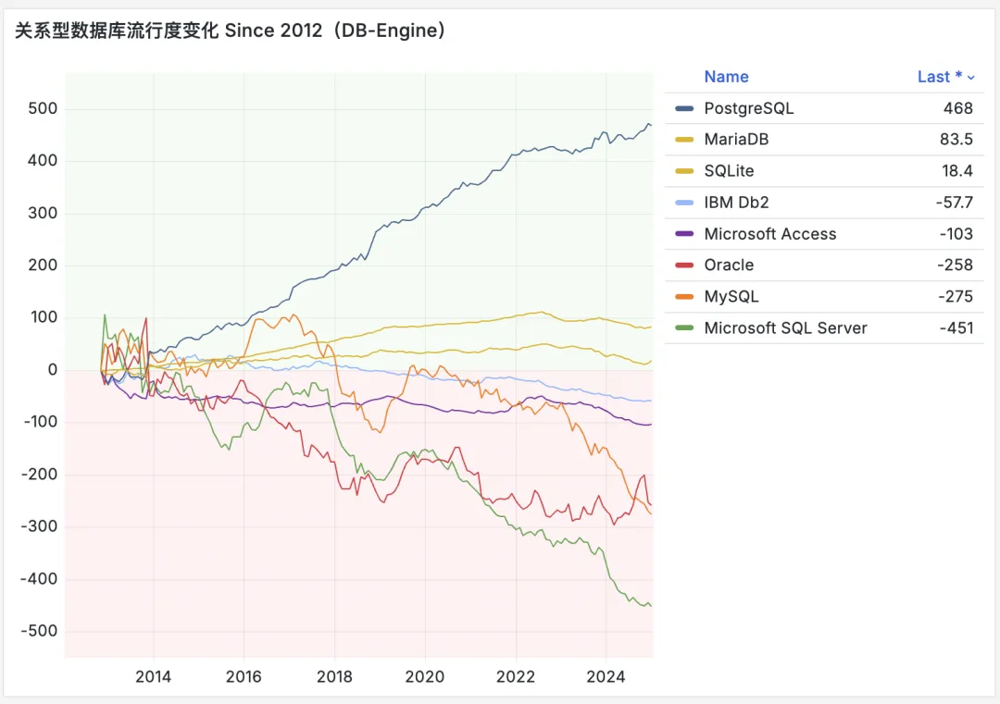

看看 NoSQL 的流行度趋势，22 年后都不太乐观。\

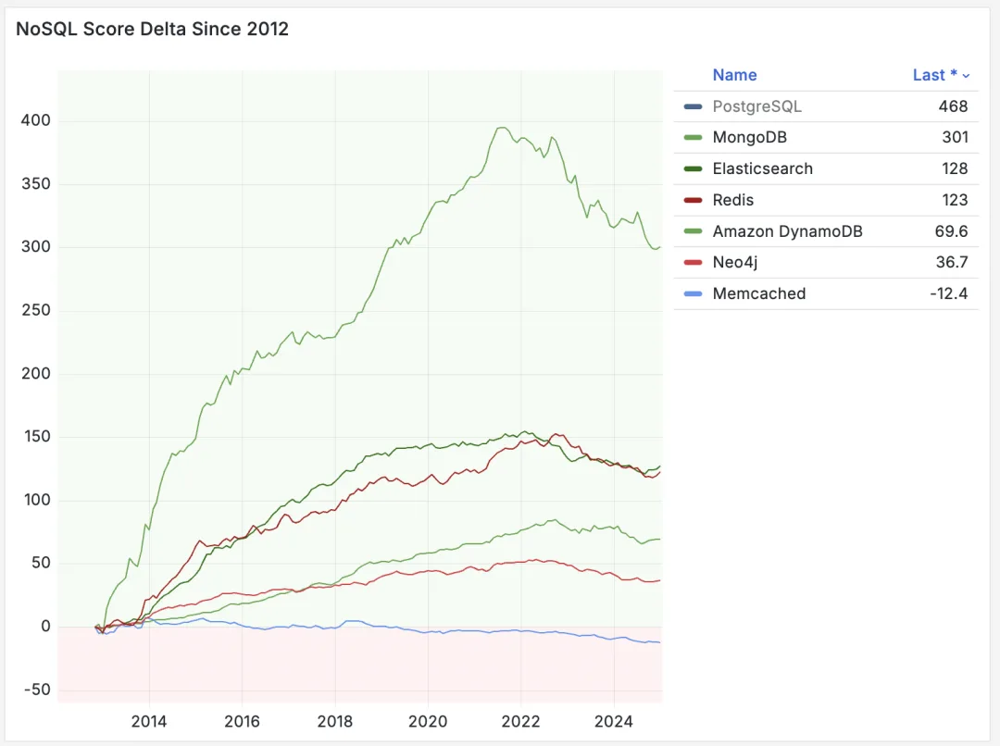

接下来，我们看看 NewSQL 的流行度变化，看上去也不太乐观。

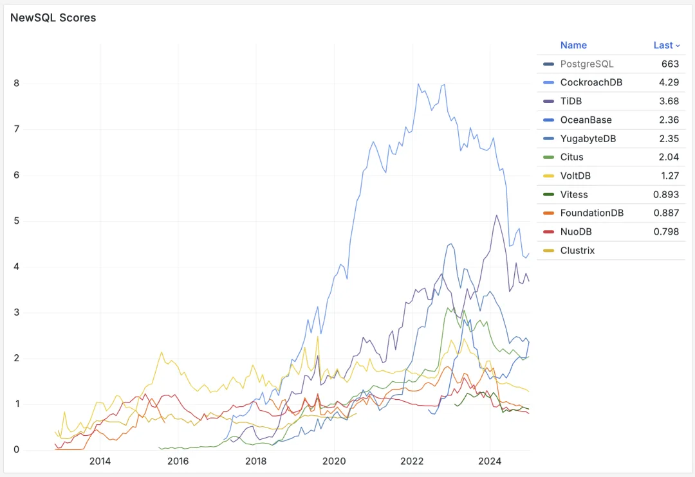

最后来看一眼“国产数据库”，总的来说在下滑，但也有个别逆势增长者，有人欢喜有人愁。

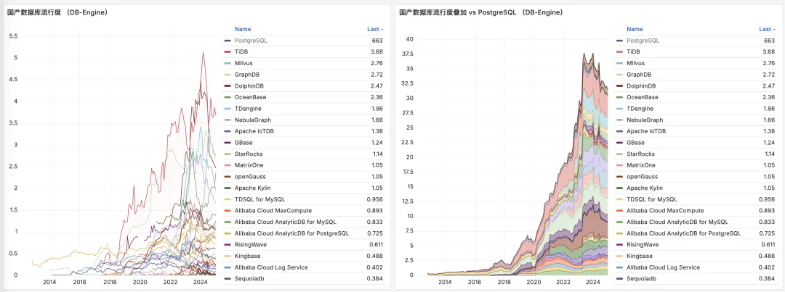

---

## DB-Engine 博客原文

2024 年度“数据库管理系统之王”花落 PostgreSQL

作者：Tom Russell，2025 年 1 月 13 日

<https://db-engines.com/en/blog_post/109>

DB-Engines 今日正式宣布，PostgreSQL 再度加冕“年度 DBMS”——这是它连续第二年赢得此殊荣，也是在 2017、2018、2019 和 2023 年称霸之后，第五次荣登榜首。亚军则由近年攻势凶猛的 Snowflake 获得，而季军归属微软。在过去一年中，PostgreSQL 已成为最受欢迎的数据库管理系统，超过了所有其他 423 个由 DB-Engine 监测的数据库。

让我们把时光拨回到将近 35 年前，“Postgres” 刚刚闪亮登场。此后，为了紧跟数据库技术潮流，PostgreSQL 一直在不断演化，功能愈发强悍，稳定性丝毫不打折扣。2024 年 9 月推出的 PostgreSQL 17 在性能和复制（replication）方面又有了新的优化和功能扩展，将这位“常青树”推向了新的高度。放眼当今开源社区，PostgreSQL 可谓长盛不衰，堪称人气与实力兼具的典范。

而在这一年里表现同样抢眼的 Snowflake，可不是“雪花”那么简单——它是基于云的数仓服务，以将存储和计算分离的独特架构吸引大批追随者，再加上多云环境支持与数据共享功能，成为行业内炙手可热的后起之秀。Snowflake 的名次一路飙升，充分说明它在业界的影响力正与日俱增。

排名第三的微软，也依旧是数据库领域的“老将”：Azure SQL Database 提供了全托管的关系型数据库服务，还加入了 AI 驱动的性能优化和弹性伸缩；SQL Server 则凭借混合云能力，打通本地和云端之间的壁垒。微软在数据库层面推陈出新的投入与其全面的数据服务生态相得益彰，实力不容小觑。

---

## PostgreSQL 为什么这么牛逼？

PostgreSQL 为什么这么牛逼，能从所有数据库中杀出来，成为 “最流行” / 的数据库，以及最成功的开源项目之一。我其实做过很多分析，除了 “开源” 与 “先进” 之外，我认为其最大的杀手锏与独一无二的特点是 “扩展”。

为了促进 PostgreSQL 的成功，我打包维护了 PostgreSQL 生态中超过一半的扩展插件，[**让 351 个扩展**](/pg/pig/)在主流 Linux 平台上开箱即用。而明天晚上，我将直播带大家领略 PG 扩展生态的神奇，欢迎预约收看直播，敬请期待。

---

发布版本：[微信公众号](https://mp.weixin.qq.com/s/nm7wQ8U13YqO7SP2tI9PHw)
