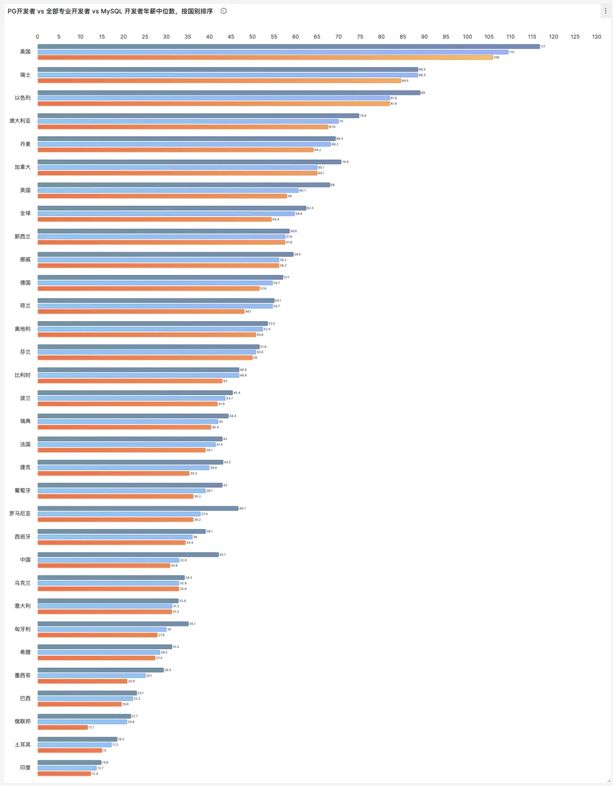
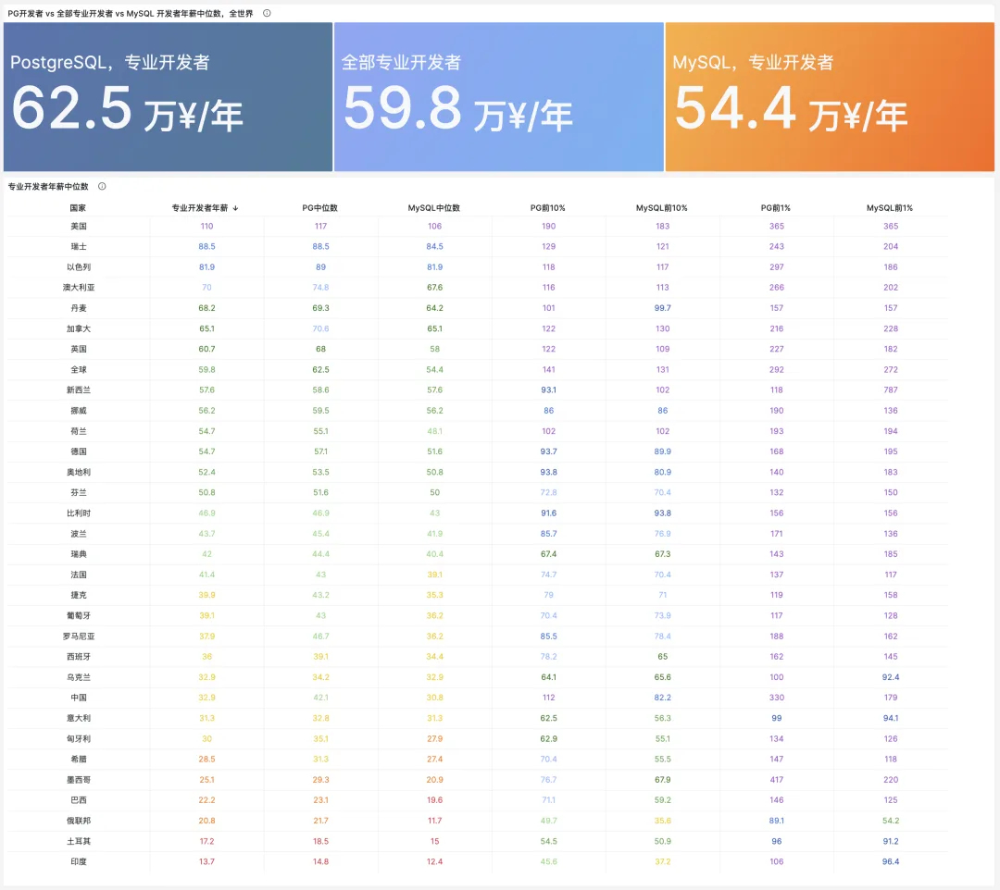
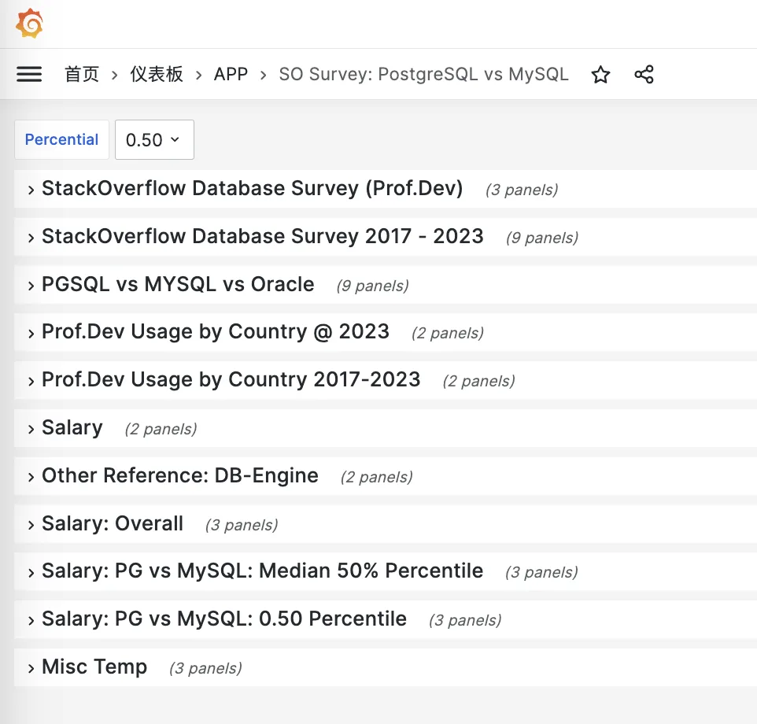
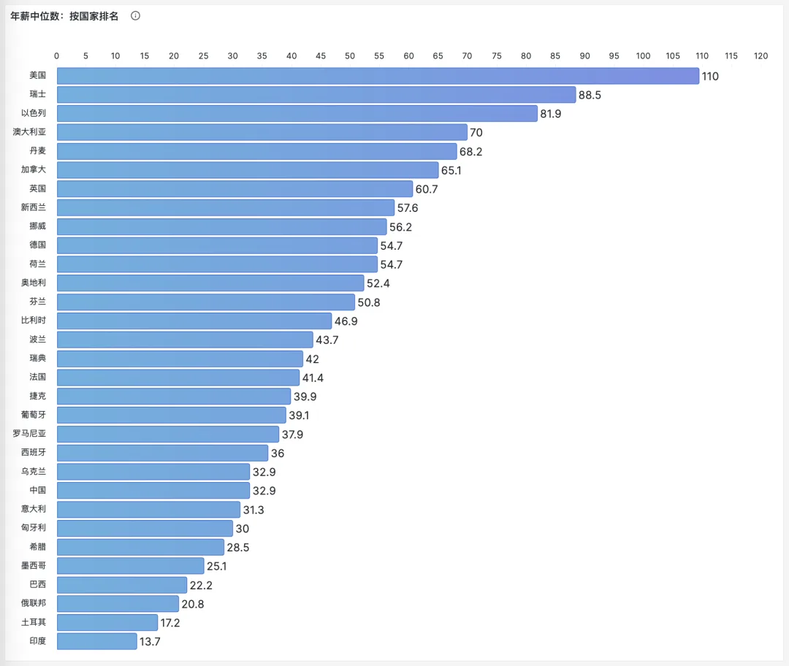
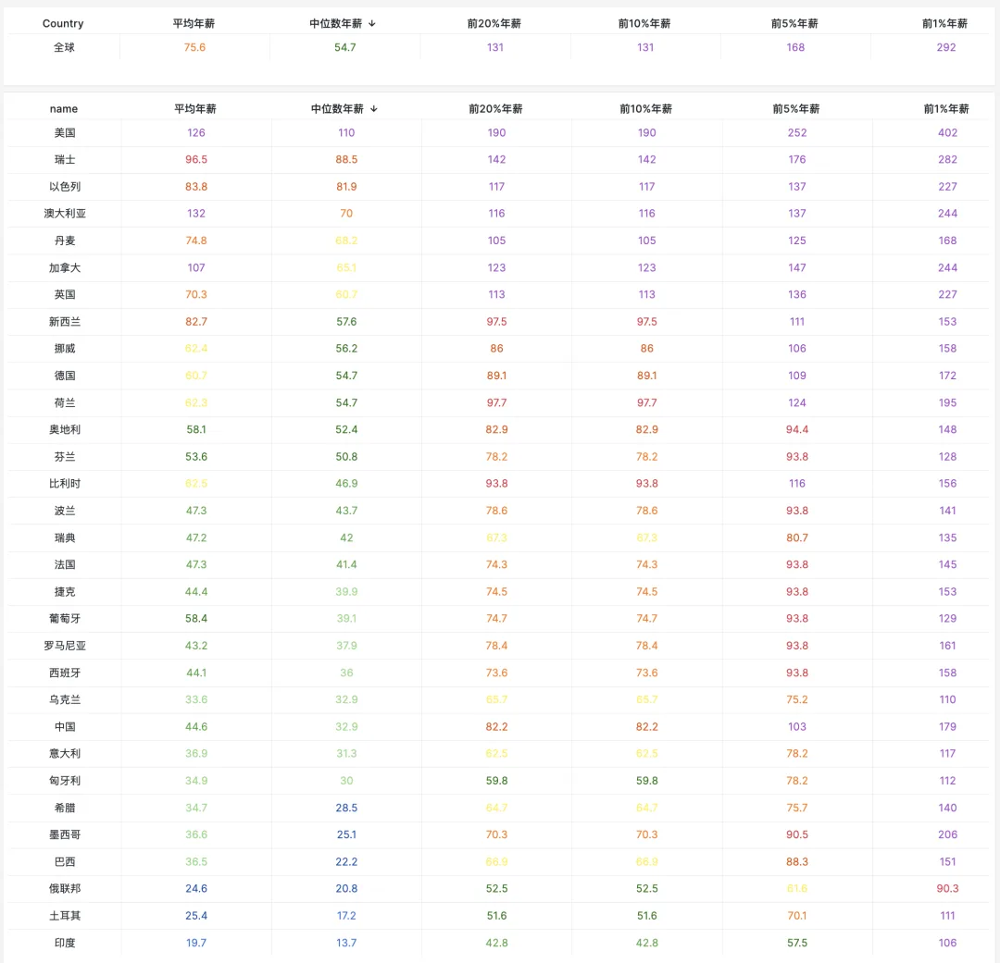
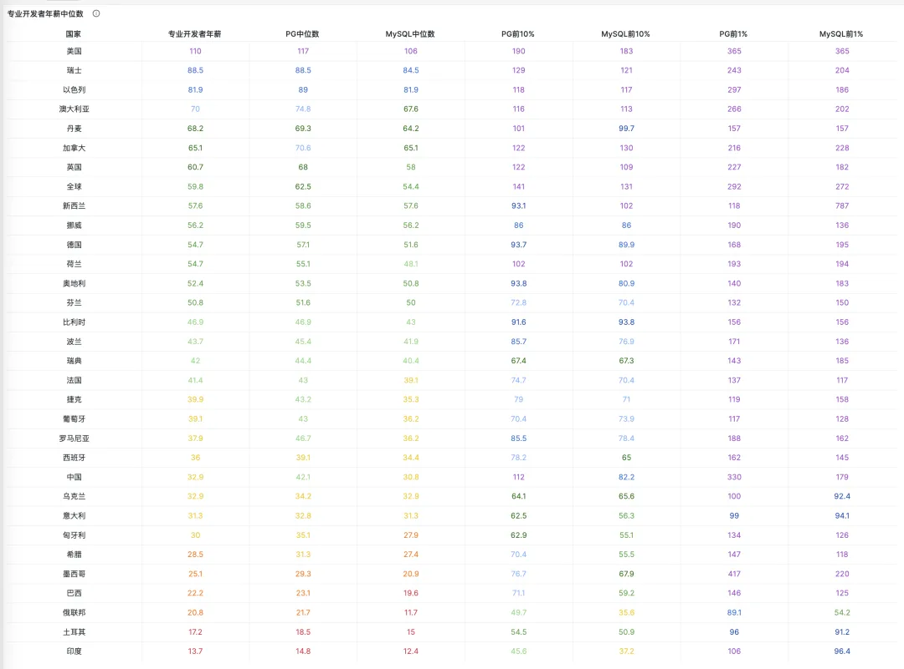
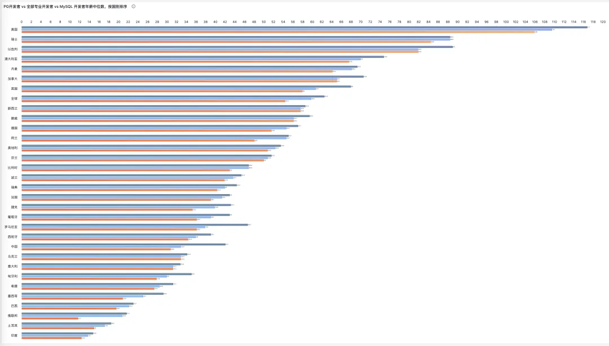
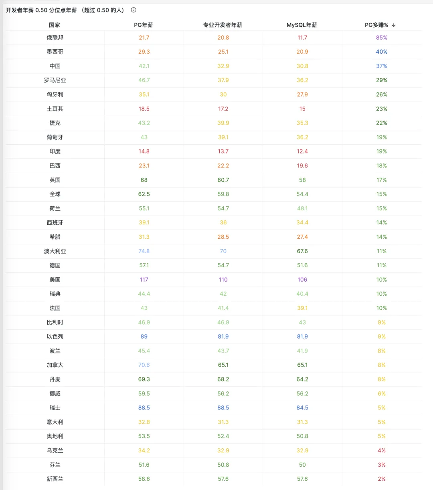
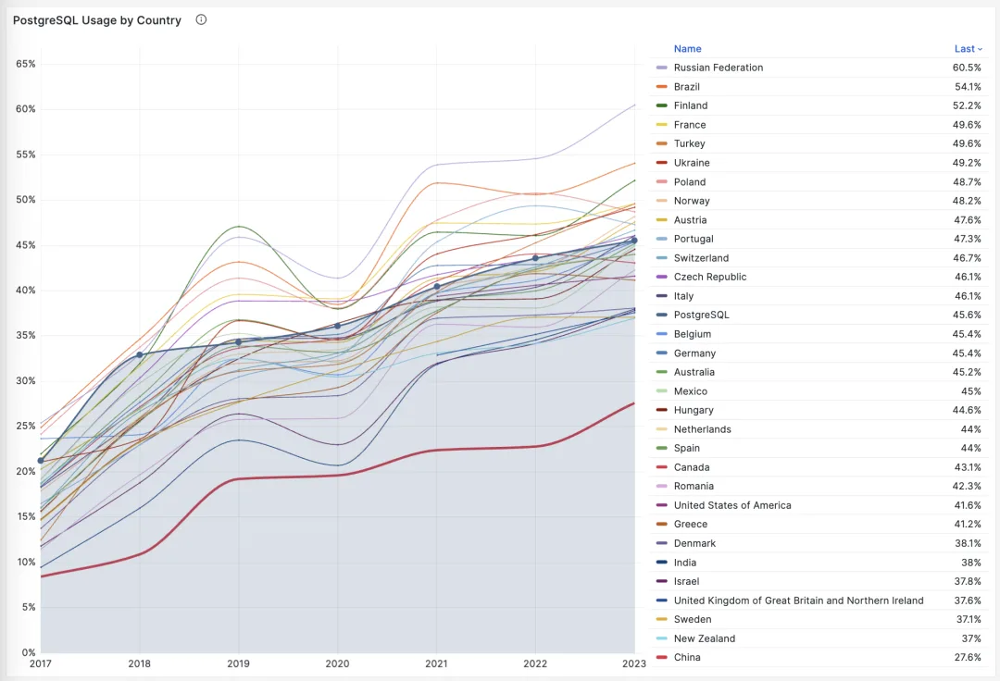
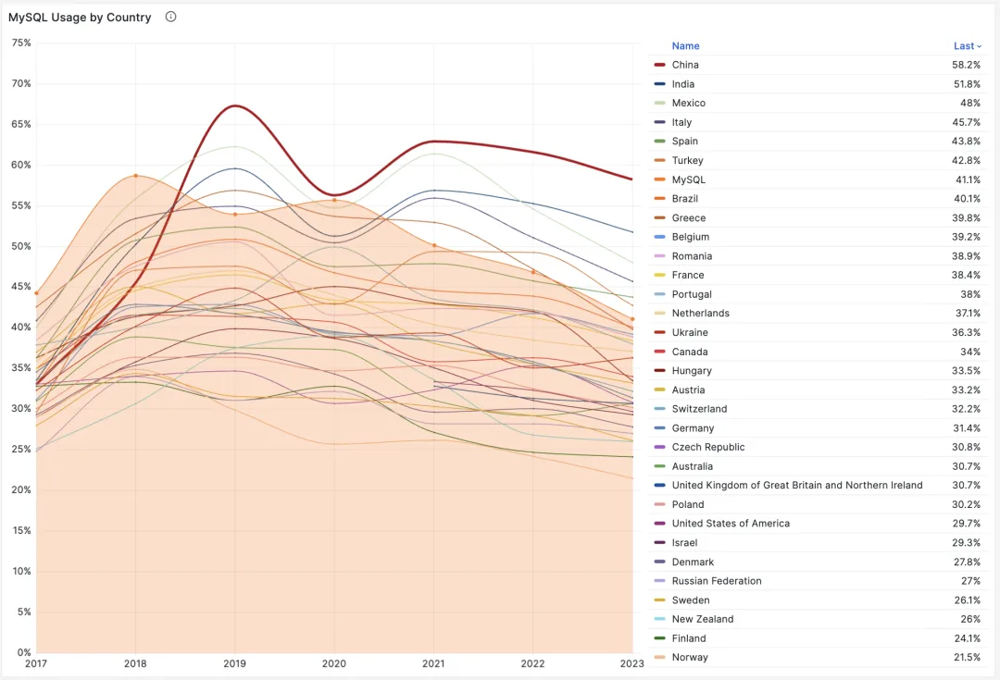

尽管有少部分人人钻研折腾数据库是出于兴趣，但大多数开发者学一门技术的主要动机还是赚钱。那么今天我们就来看看，懂 MySQL 和 PostgreSQL 的开发者，在不同的国家都能赚多少钱？

StackOverflow 2023 年全球开发者调研的数据，可以作为我们分析的重要参考依据。这份问卷调研总共采访了 89184 名开发者，其中 69098 位专业开发者，在这些专业开发者中，共有 44354 名开发者上报了年薪（按照货币种类，数量，与即时汇率核算为万元人民币年薪）

---

## 太长不看

一言以蔽之：**MySQL 掉价，PostgreSQL 赚钱**

在全球专业开发者中，使用 PostgreSQL 的开发者年薪中位数 / 平均数是使用 MySQL 开发者的 1.15 倍，即多赚 **15%。** 不同国家里，专业开发者的年薪中位数的情况各不相同，但在纳入统计的 31 个头部国家中，全部都都满足：

**PG 开发者** **\> 全体开发者 \>** **MySQL 开发者** **这一规律**。

在中国的专业开发者中，使用 PostgreSQL 的开发者年薪中位数是使用 MySQL 开发者的 1.37 倍，即多赚 **37%**。这个差距在全球范围内仅次于俄罗斯与墨西哥（`85%`, `40%`）。

从全球水平来看，PG 开发者的年薪中位数是 **62.5** 万，所有专业开发者年 薪的中位数是 **59.8** 万，而 MySQL 开发者的年薪中位数是 **54.3** 万。

用 PostgreSQL 的开发者比平均水平多赚 **4.5%**，用 MySQL 的开发者比平均水平**少赚 9%**。

从中国来看，PG 开发者的年薪中位数是 **42.1 万**，所有专业开发者年薪的中位数是 **32.9 万**，而 MySQL 开发者的年薪中位数是 **30.8 万**。用 PostgreSQL 的开发者比平均水平多赚高达 **28%**，用 MySQL 的开发者则比平均水平少 **25%**。

为什么在中国，使用 PostgreSQL 的开发者能比使用 MySQL 的开发者年薪多赚接近四成？这可能是由于物以稀为贵 —— 中国的 PostgreSQL 专业开发者使用率只有 27.6%，在 远低于 MySQL 的 58.2%。PG 使用率远低于国际平均水平

---

## 研究方法

我们的研究使用了 StackOverflow 2023 年全球开发者调研[1] （以下简称 SO2023）的数据。

这份问卷调研总共采访了 89184 名开发者，其中 69098 位专业开发者。我们主要关注占总体比例绝大多数（77%+）专业开发者群体，刨除掉学生，初学者，爱好者。而在这些专业开发者中，共有 44354 名开发者上报了年薪（按照货币种类，数量，与即时汇率核算为万元人民币年薪），可以作为薪资水平的参考依据。

当然，不同国家的薪资水平有显著的区别。因此在研究按照国家细分的薪资水平时，我们设定了一个阈值，有效样本 600 个以上的国家才纳入研究与考虑 —— **这样刚好可以把中国兜进来**，同时避免那些没几个用户样本的小国产生的失真杂音。在这样的过滤标准下，就只剩 31 个国家了。

这里，我们首要使用的薪资统计指标为**中位数**（50 百分位点），因为平均数极易受到极端数据的影响。同时，我们也会研究 90 分位点的数据，以了解头部开发者（前 10%）的薪资水平。

我们的原始数据是 CSV 格式，下载地址[2]。经过清洗、转换、导入得到一张 PostgreSQL 表备用，其模式如下：

<!-- -->

    CREATE TABLE sf_survey_db(    year      integer,    pro       boolean,    country   text,    dev_type  text,    age       text,    years     text,    years_pro text,    education text,    org_size  text,    salary    NUMERIC,    pl_used   text[],    pl_wanted text[],    db_used   text[],    db_wanted text[]) PARTITION BY LIST (year);

接下来，我们就可以使用以下查询语句获取各国薪资百分位点数据了：

<!-- -->

SELECT name,

round((percentile_cont($percentile) WITHIN GROUP (ORDER BY salary) FILTER (WHERE pro) * 7.3 / 10000 )::NUMERIC, 1) AS pro,

round((percentile_cont($percentile) WITHIN GROUP (ORDER BY salary) FILTER (WHERE pro AND 'PostgreSQL' = ANY(db_used)) * 7.3 / 10000 )::NUMERIC, 1) AS pgsql,

round((percentile_cont($percentile) WITHIN GROUP (ORDER BY salary) FILTER (WHERE pro AND 'MySQL' = ANY(db_used)) * 7.3 / 10000 )::NUMERIC, 1) AS mysqlFROM sf_survey_db_2023 d JOIN sf_country c USING (country) WHERE salary IS NOT NULL GROUP BY name

这里我们使用的条件是 `ANY(db_used)` = `PostgreSQL` 或 `MySQL`，即用户表明当前（在过去一年中）我深度使用了该数据库，它的年薪便会纳入统计。我们使用的 `$percentile` 默认为 `0.5`，即中位数。

本文涉及的数据与图表公开于：<http://demo.pigsty.cc/ui/d/sf-db-pg-mysq>

---

## 关键发现

无论是用 PostgreSQL 开发者还是用 MySQL 的开发者，年薪的主要决定因素是**国别**。

专业开发者年薪水平（中位数）最高的国家是美国（约 110 万¥/年），最低的是印度（约 13.7 万¥/年），中国为 32.9 万¥/年，位列第 23 位。

而使用 PostgreSQL 的开发者年薪通常在总体水平的基础上上调 **5% ～ 10%** 等，而使用 MySQL 的开发者年薪通常在总体水平的基础上下调 **5% ～ 10%** 不等。

> 图：各国专业开发者，PG/MySQL 年薪，2023

从柱状图上，也不难看出这一规律。深蓝色的 PostgreSQL 年薪通常是最长的，而橙色的 MySQL 通常是最短的。

> 图：各国专业开发者，中位数年薪，2023

如果我们将数据表按照 PG 溢价排序，可以看出，中国的 PostgreSQL **使用率**是最低的，相应，PostgreSQL 的溢价率也是最高的。

> 图：年薪按 PG 相比 MySQL 多赚比例排序

---

## 关于数据库流行度

在 [世界上最成功的数据库](/pg/pg-is-no1/)[3] 中，我们已经分析了过去七年，根据 StackOverflow 全球开发者调研得到的数据库流行度趋势，如下图所示。

如果我们将这张图进一步拆分，按照国家细分，也能看到非常清楚的增长与下降趋势

> 

PostgreSQL 在各个国家专业开发者中的使用
>
> 
>
> MySQL 在各个国家专业开发者中的使用率

当然这里值得注意的是 **中国**（标粗红线），PostgreSQL 的使用率远低于全球平均水平，而 MySQL 使用率远高于全球平均水平。整体数据库生态大概是全球 10 - 15 年前的状态。

为什么会有这种现象？我个人的推测是：以阿里为代表的老一代中国互联网企业，给社会输出了大量 MySQL 开发者/用户，打破了国内数据库生态自然发展的节奏。

但是也不用太过担心 —— 数据很明显地揭示出，即使是数据库生态相对隔离封闭的中国，也依然在坚定地沿着全球 PG 升，MySQL 降的轨道前行。而正是因为在主要国家中有着 PG 最低的采用率，这里的增长空间与潜力反而是所有国家中最高的。而在追赶期间，PostgreSQL 人才的供不应求也体现为相对平均工资的高溢价 —— 学习 PostgreSQL 正当时。

---

## 数据库老司机

### 最近 3 群全满，新开 4 群，前 200 位朋友免拉

#### 欢迎直接扫码加入 PGSQL x Pigsty 交流群 4

---

发布版本：[微信公众号](https://mp.weixin.qq.com/s/73EVmMRVGBJmGCuoMaUu4Q)
