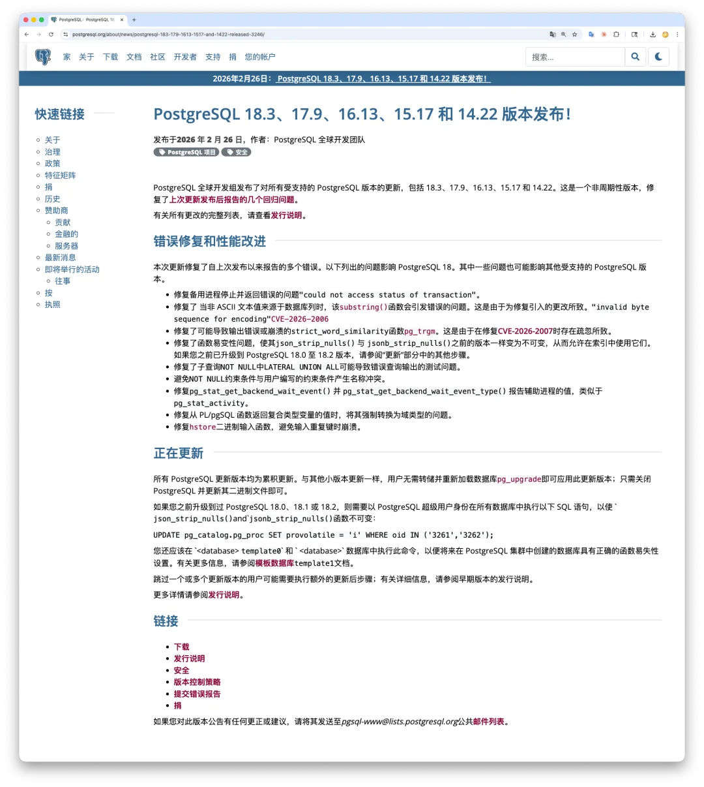
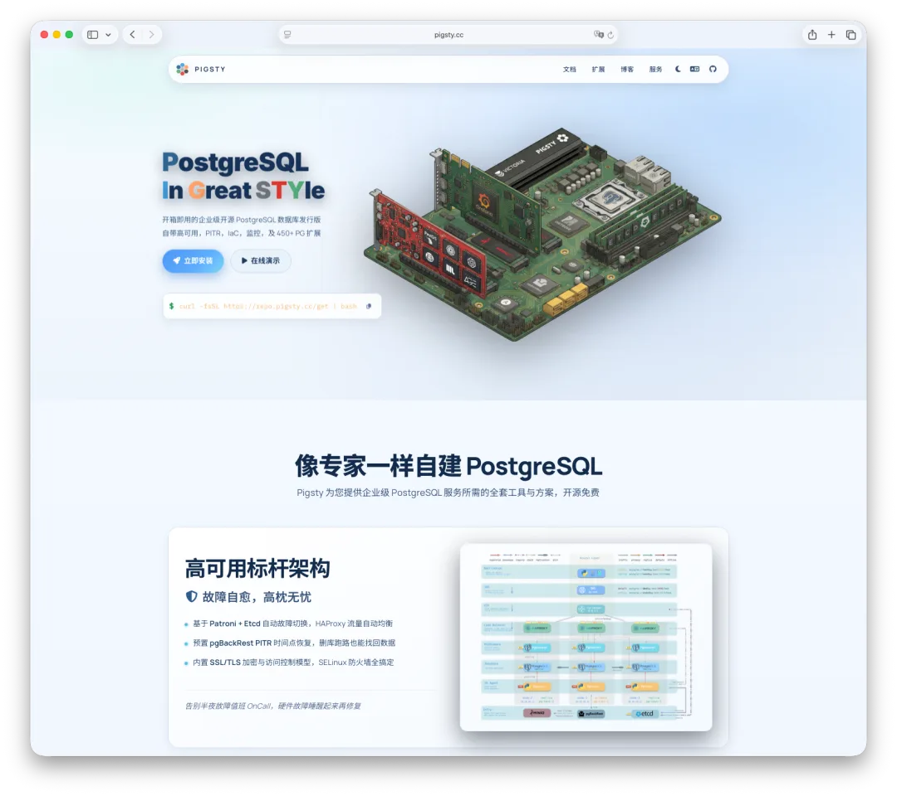
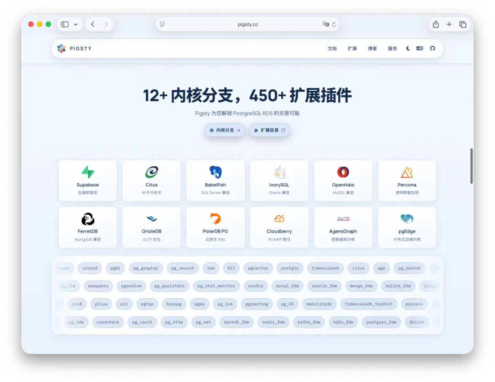
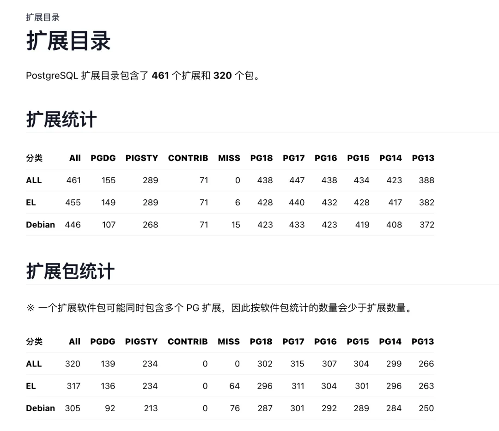

老冯之前在[号外：PG 小版本 BUG，暂缓一周再安装升级](/pg/pg-out-of-sync-202602/)里面说过，之前发布的 PG 小版本有 BUG，需要等新的号外小版本更新之后再部署合适。这不，PG 18.3，17.9 …… 系列小版本如期而至，10 天不到就新鲜出炉了。

不过目前 PGDG 还没出包，镜像站可能还要再晚一天才行。老冯正在快马加鞭测试准备 Pigsty v4.2，等 PGDG 一出包就制作离线软件包，发布一个新版本。

## PostgreSQL 18.3、17.9、16.13、15.17 和 14.22 发布！

**发布日期：2026-02-26**　\|　PostgreSQL 全球开发组

PostgreSQL 全球开发组已发布所有受支持版本的更新，包括 18.3、17.9、16.13、15.17 和 14.22。这是一次**计划外的紧急发布**，修复了上次更新发布后报告的若干回归问题[1]。

完整变更列表请参阅发布说明[2]。

## Bug 修复与改进

本次更新修复了上一版本发布以来报告的多个 Bug。以下列出的问题影响 PostgreSQL 18，其中部分问题也可能影响其他受支持版本。

- 修复备库（standby）停止运行并报错 `"could not access status of transaction"` 的问题。
- 修复 `substring()`[3] 函数在处理非 ASCII 文本值时，当该值来源于数据库列时抛出 `"invalid byte sequence for encoding"` 错误的问题。该问题由 `CVE-2026-2006`[4] 的修复引入。
- 修复 `pg_trgm`[5] 扩展中 `strict_word_similarity` 函数可能导致错误输出或崩溃的问题。该问题由 CVE-2026-2007[6] 的修复疏忽引入。
- 修复 `json_strip_nulls()` 和 `jsonb_strip_nulls()` 的函数易变性（volatility）标记，恢复为与之前版本一致的 `IMMUTABLE`，使其可以用于索引。如果您之前已升级到 PostgreSQL 18.0 至 18.2，请参阅下方"升级"章节中的额外操作步骤。
- 修复 `LATERAL UNION ALL` 子查询中 `NOT NULL` 判断可能导致查询结果错误的问题。
- 避免 `NOT NULL` 约束自动生成的名称与用户自定义约束产生命名冲突。
- 修复 `pg_stat_get_backend_wait_event()` 和 `pg_stat_get_backend_wait_event_type()` 函数，使其与 `pg_stat_activity` 一样能报告辅助进程（auxiliary processes）的等待事件信息。
- 修复在 PL/pgSQL 函数中将复合类型变量强制转换为域类型（domain type）后返回值时的错误。
- 修复 `hstore`[7] 的二进制输入函数在处理含重复键的输入时可能崩溃的问题。

## 升级

所有 PostgreSQL 更新版本都是累积性的。与其他小版本更新一样，用户无需执行数据库转储和重新加载，也无需使用 `pg_upgrade`[8]，只需关闭 PostgreSQL 并更新二进制文件即可。

如果您之前已升级到 PostgreSQL 18.0、18.1 或 18.2，需要以 PostgreSQL 超级用户身份在**所有数据库**中执行以下 SQL，将 `json_strip_nulls()` 和 `jsonb_strip_nulls()` 函数标记为 `IMMUTABLE`：

sql

<!-- -->

    UPDATE pg_catalog.pg_proc SET provolatile = 'i' WHERE oid IN ('3261','3262');

您还应在 `template0` 和 `template1` 数据库中执行此命令，以确保后续在该 PostgreSQL 集簇中创建的新数据库具有正确的函数易变性设置。更多信息请参阅模板数据库[9]文档。

如果您跳过了一个或多个更新版本，升级后可能需要执行额外的操作步骤，请参阅早期版本的发布说明了解详情。

更多细节请查阅发布说明[10]。

### References

- `[1]` 上次更新发布后报告的若干回归问题： <https://www.postgresql.org/about/news/out-of-cycle-release-scheduled-for-february-26-2026-3241/>
- `[2]` 发布说明： <https://www.postgresql.org/docs/release/>
- `[3]` `substring()`: <https://www.postgresql.org/docs/current/functions-string.html#FUNCTIONS-STRING-FORMAT>
- `[4]` `CVE-2026-2006`: <https://www.postgresql.org/support/security/CVE-2026-2006/>
- `[5]` `pg_trgm`: <https://www.postgresql.org/docs/current/pgtrgm.html>
- `[6]` CVE-2026-2007: <https://www.postgresql.org/support/security/CVE-2026-2007/>
- `[7]` `hstore`: <https://www.postgresql.org/docs/current/hstore.html>
- `[8]` `pg_upgrade`: <https://www.postgresql.org/docs/current/pgupgrade.html>
- `[9]` 模板数据库： <https://www.postgresql.org/docs/current/manage-ag-templatedbs.html>
- `[10]` 发布说明： <https://www.postgresql.org/docs/release/>

## Pigsty v4.2 预告

**Pigsty v4.2 计划于明天或后天发布。提供 PostgreSQL 18.3 的离线安装包。**

**除此之外，还有一些非常强大的特性，Pigsty 现在构建了 Cloudberry（Greenplum 7 MPP 数仓），AgensGraph（原生图数据库内核），pgEdge（多主复制），重新打包了 OpenHalo（MySQL 兼容）与最新版本的 OrioleDB（OLTP 存储引擎，beta14）。**

**在这个版本中，总共可用的内核数量达到了 12 个（其实有 16+）。基本上覆盖了 PG 生态中所有提供独特价值主张的内核。**

****与此同时，可用 PG 扩展的总数达到了破纪录的 461 个。****

****更多特性，敬请期待。****

---

发布版本：[微信公众号](https://mp.weixin.qq.com/s/whfw9Om3aGI7po1TpKJxtA)
