把数据库拉起来是一回事，部署**专业水准**的数据库集群又是另一回事。想要真正用好管好数据库，需要良好的架构设计让多种组件协同配合起来。今天我们就来介绍一下典型的高可用 PgSQL 集群架构及其 **落地方式**。

本文将以 Pigsty v0.8 为例，介绍高可用集群的设计与部署。

**“** Pigsty 针对大规模数据库集群监控与管理而设计，提供业界顶尖的 PostgreSQL 监控系统与开箱即用的高可用数据库供给方案，为用户带来极致的**可观测性**与丝滑的数据库使用体验。

Pigsty 基于**开源生态**构建，旨在降低 PostgreSQL 使用管理的门槛，让所有人都能轻松享受到数据库的乐趣。**”**\

01

—

概览

**Pigsty 创建的数据库集群是**分布式**、高可用的数据库集群。**

从效果上讲，**只要集群中有任意实例存活，集群就可以对外提供完整的读写服务与只读服务**。数据库集群中的每个数据库实例在**使用**上都是**幂等**的，任意实例都可以通过内建负载均衡组件提供完整的读写服务。

数据库集群可以自动进行故障检测与**主从切换**，普通故障能在几秒到几十秒内自愈，且期间只读流量不受影响。

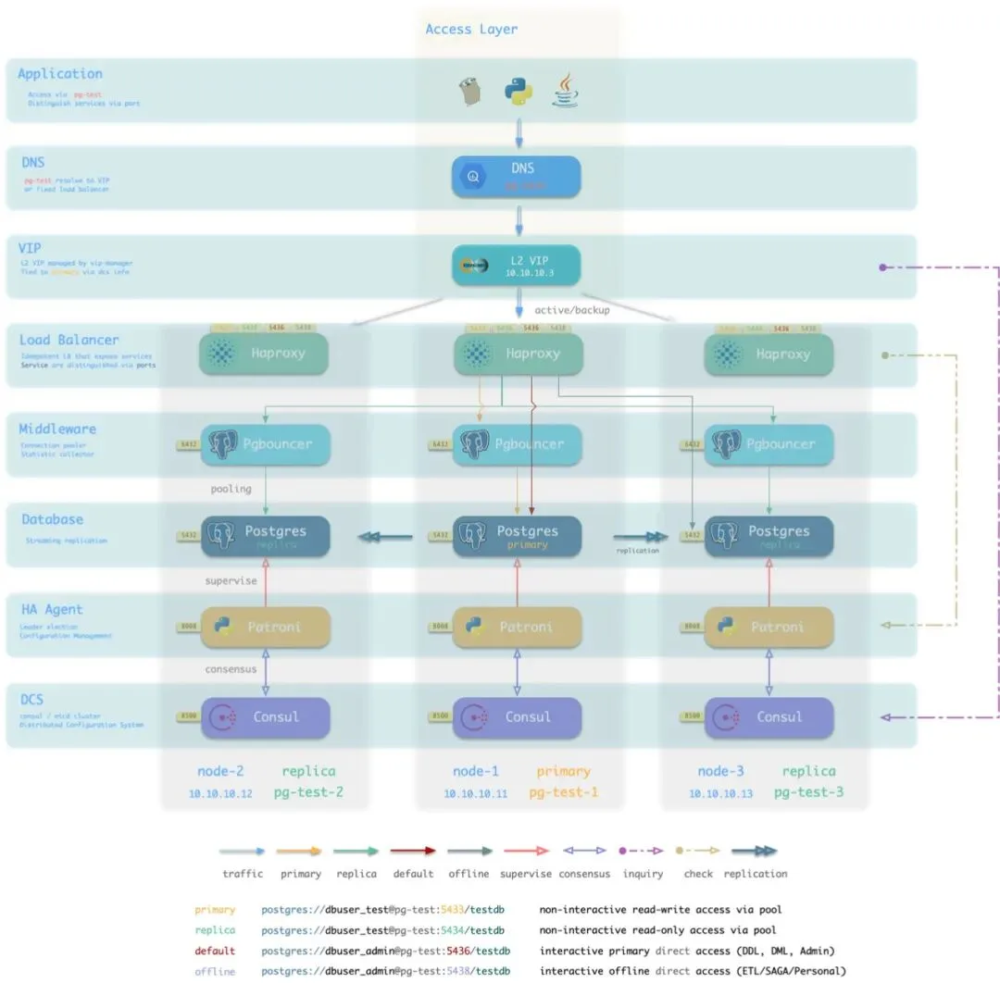

> 图：Pigsty 数据库集群样例

一套 Pigsty 部署在架构上分为两个部分：

- **基础设施（Infra）**：部署于**元节点**上，监控，DNS，NTP，DCS，Yum 源等**基础服务**。

- **数据库集群（PgSQL）**：部署于**数据库节点**上，以集群为单位对外提供**数据库服务**。

所谓**节点**，是指用于部署的机器，物理机，虚拟机或 Pod，节点分为两种：

- **元节点**（**Meta**）：部署基础设施，执行控制逻辑，每个 Pigsty 部署至少需要一个元节点。

- **数据库节点**（**Node**）：用于部署数据库集群/实例，节点与数据库实例一一对应。

02

—\

## 沙箱样例

以 Pigsty 附带的四节点**沙箱环境**为例，沙箱由一个元节点与四个数据库节点组成。其中元节点也被复用为一个数据库节点。沙箱部署有一套基础设施与两套数据库集群。

**`meta`** 为元节点，部署有**基础设施**组件，同时部署有单主数据库集群`pg-meta`。

`node-1`，`node-2`，`node-3` 为普通数据库节点，部署有一主两从数据库集群`pg-test`。组件在节点上的分布如下图所示：

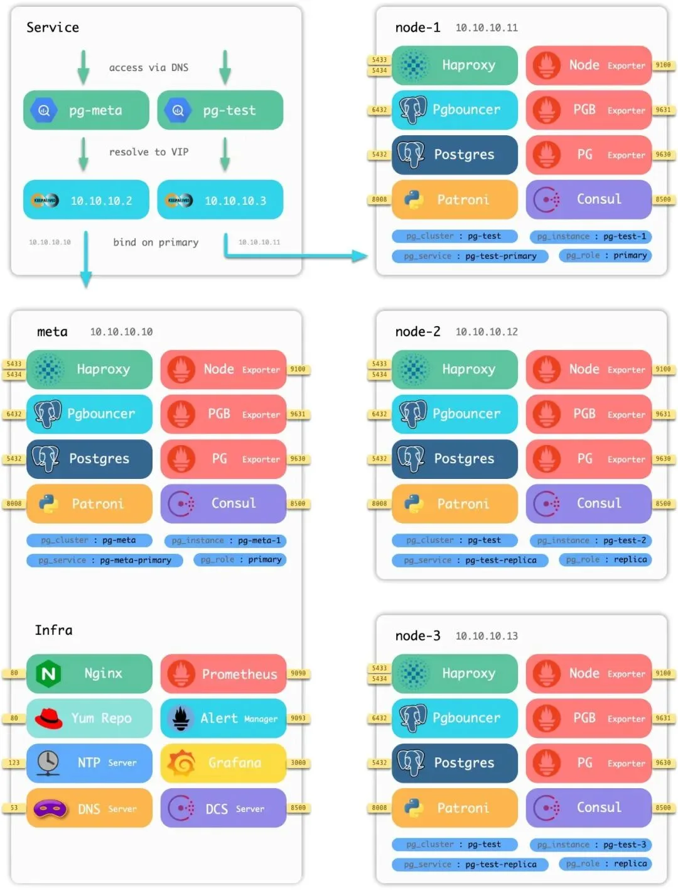

> 图：Pigsty 沙箱中包含的节点与组件

下面，我们将依次介绍这几个部分：**数据库节点**，**数据库集群**，**基础设施**

03

—\

### 数据库节点

**数据库节点**负责运行**数据库实例**，在 Pigsty 中数据库实例固定采用**独占式部署**，一个节点上有且仅有一个数据库实例，因此节点与数据库实例可以互用唯一标识（IP 地址与实例名）。所以下面提到**数据库节点**时，既可以指称数据库实例，也指称数据库实例所运行的节点。

最简单的数据库部署，就是单个 PostgreSQL 进程裸跑在单台机器上，实际上不少用户真的就是这么用的。玩一玩当然无所谓，但生产中这样佛系是不行的啊朋友们。

在 Pigsty 中，一个数据库节点，除了数据库本身还包含了一系列附属组件。

这里以一个典型的主库节点为例，一个典型数据库节点架构如下所示：

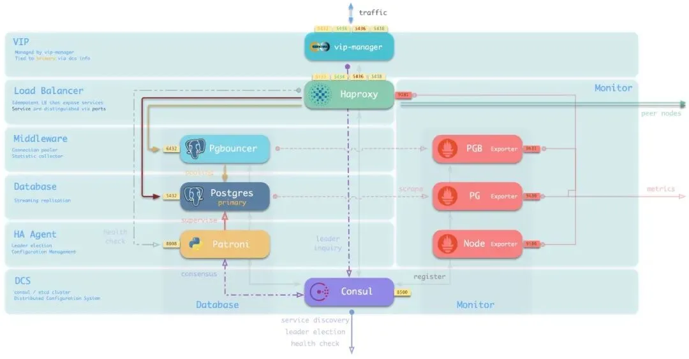

> 图：单个数据库节点架构

业务流量通过 VIP 进入主库上的**负载均衡器 HAProxy**。HAProxy 通过不同的端口将不同性质的流量（生产/离线，读写/只读）分流至具体的节点上。

典型的生产读写流量将通过 Pgbouncer 池化后打到对应的 Postgres 数据库实例上。

Postgres 数据库由高可用组件 Patroni 管理，Patroni 则依赖 Consul 进行状态同步与领导者选举。所有服务都会注册至 Consul 中。其中包括各类用于收集监控指标的 Exporter。

当业务访问 HAPrxoy 上的只读服务时（在线 or 离线），主库上的 HAProxy 会将流量分发至集群中的**从库节点**。HAProxy 会通过**健康检查**，从 Patroni 或 PG Exporter 获取集群成员的主从身份，完成流量分发工作。

监控基础设施中的 Prometheus 会从 Consul 获取所有数据库服务及监控组件的地址，拉取监控数据，并将监控数据与数据库实例相关联。

### 节点组件

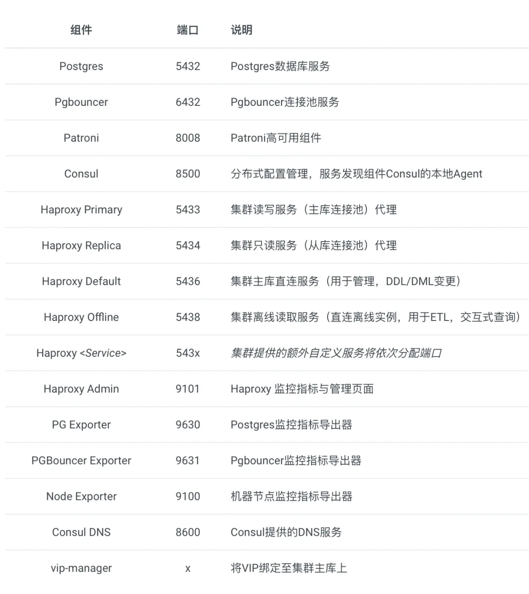

### 组件交互

- `vip-manager`通过**查询**Consul 获取集群主库信息，将集群专用 L2 VIP 绑定至主库节点。\

- Haproxy 是数据库**流量**入口，用于对外暴露服务，使用不同端口（543x）区分不同的服务。

  - Haproxy 的 9101 端口暴露 Haproxy 的内部监控指标，同时提供 Admin 界面控制流量。

  - Haproxy 5433 端口默认指向集群主库连接池 6432 端口

  - Haproxy 5434 端口默认指向集群从库连接池 6432 端口

  - Haproxy 5436 端口默认直接指向集群主库 5432 端口

  - Haproxy 5438 端口默认直接指向集群离线实例 5432 端口

- Pgbouncer 用于**池化**数据库连接，缓冲故障冲击，暴露额外指标。

  - 生产服务（高频非交互，5433/5434）必须通过 Pgbouncer 访问。

  - 直连服务（管理与 ETL，5436/5438）必须绕开 Pgbouncer 直连。

- Postgres 提供实际数据库服务，通过**流复制**构成主从数据库集群。

- Patroni 用于**监管**Postgres 服务，负责主从选举与切换，健康检查，配置管理。

  - Patroni 使用 Consul 达成**共识**，作为集群领导者选举的依据。

- Consul Agent 用于下发配置，接受服务注册，服务发现，提供 DNS 查询。

  - 所有使用端口的进程服务都会**注册**至 Consul 中

- PGB Exporter，PG Exporter，Node Exporter 分别用于**暴露**数据库，连接池，节点的监控指标

04

—\

#### 数据库集群

生产环境的数据库以**集群**为单位进行组织，**集群**是一个由**主从复制**所关联的一组数据库**实例**所构成的**逻辑实体**。每个**数据库集群**是一个**自组织**的业务服务单元，由至少一个**数据库实例**组成。

下图是 Pigsty 沙箱中提供的测试集群`pg-test`架构示意图。按照集群视角进行重排并去除了次要组件。这是一个一主两从的三节点集群。通过 DNS，L2VIP 与 HAProxy 接入外部流量。

> 图：从数据库集群的逻辑视角审视架构

集群中的三个数据库节点在部署与使用上是完全**幂等**的，尽管 Postgres 数据库有主从之别，但这种主从区别被幂等部署的 HAProxy 所**屏蔽**。

HAProxy 采用 Node Port 的方式对外暴露**集群服务**：例如从效果上说，访问**任意实例**的 5433 端口即可访问主库，访问任意实例的 5434 端口即可访问从库。而且只要集群一息尚存，还有任何一个节点活着，读与写服务都不会中止。这是通过 Patroni 自动故障切换与 Haproxy 自动流量切换实现的。如下图所示。

05

—\

#### 数据库接入

一个高可用方案有两个最重要的部分，**主从切换**与**流量切换**。

**主从切换**即集群主库发生故障时，集群可以自动选举出新的领导者来。这一点是通过 Patroni 与 Consul 保证的。

另一个重要的问题是，当集群发生**主从切换**后，如何将客户端的**流量**正确分发至正确的节点上，这一点是通过 HAproxy 保证的。**但是 HAProxy 本身的可用性又如何保证？**

**数据库集群提供的服务边界在负载均衡 HAPrxoy 处止步**。**用户只需要确保自己可以连接到任何一个存活的集群成员 HAProxy 即可享受完整的数据库服务**。

在上面的例子中，我们使用了一个二层 VIP 确保多个 HAProxy 实例的可用性。还有多种变体接入方案可供选择。

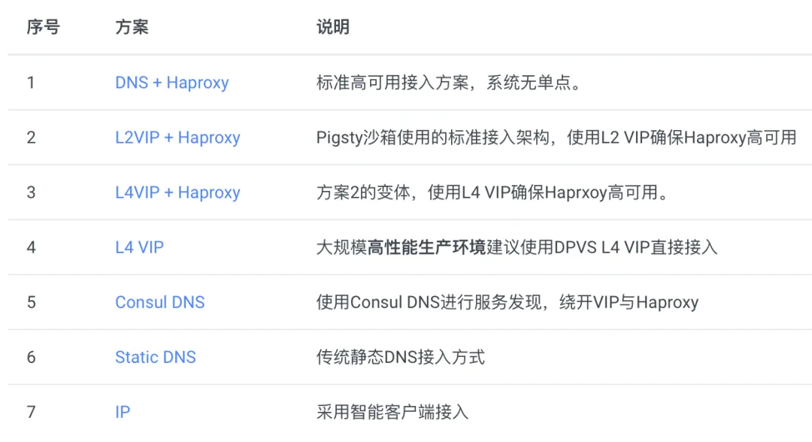

每一种方案都有自己的优势与局限性，需要用户自行权衡。\

### 变体：DNS 接入

在上面对例子中，使用了二层 VIP 接入 HAproxy，但 L2 VIP 要求所有数据库实例位于同一个二层网络中。这通常意味着集群位于同一个交换机下，因此交换机反而成为了系统的**单点**。

使用**DNS**直接解析至 HAProxy 则不存在此问题，但流量切换无法如 VIP 一般快速灵敏：当某节点宕机时，客户端需要及时连接至其他健康节点，DNS 使得该过程更为缓慢。**DNS 与客户端需要更多的工作**（轮询/长连接/建连重试）才能绕过此问题。

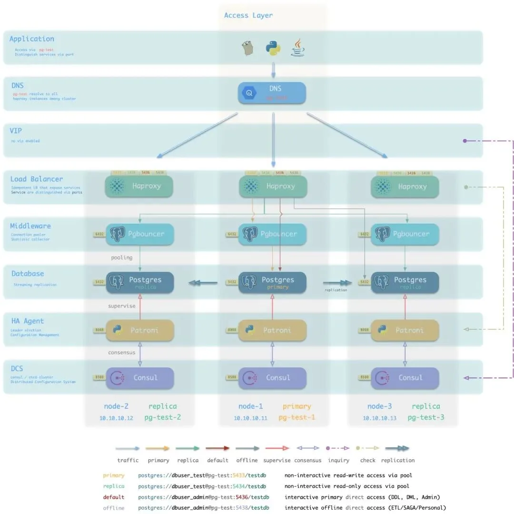

> 图：使用 DNS 接入数据库集群

### 变体：L4 VIP 接入

一种备选项是通过 L4 VIP 接入。相比 DNS，L4 VIP 可以实时对所有 HAProxy 实例进行健康检测与流量分发。允许用户同时使用**所有**的 Haproxy 实例均匀承载流量。相比 L2 VIP 则没有同一二层网络的限制。

但 L4 VIP 在网络路径中又增加了**额外的一跳**，会降低性能与吞吐量。

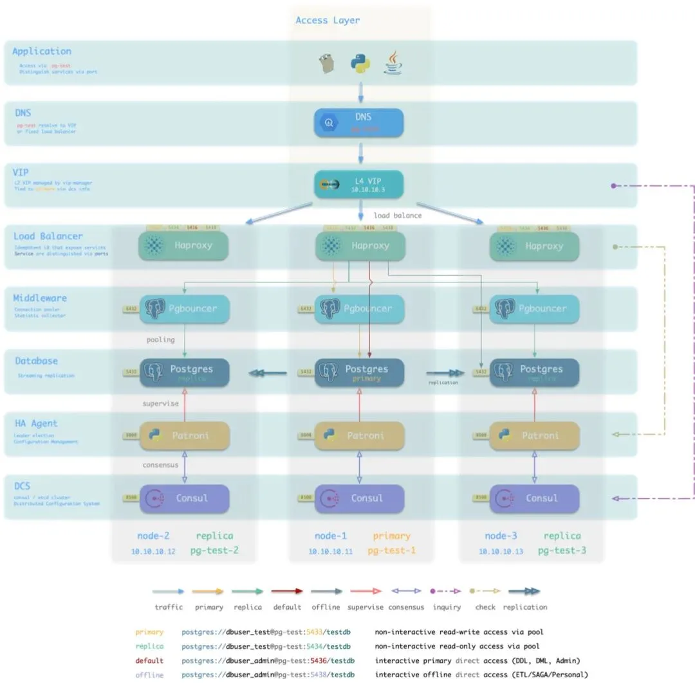

> 图：使用 L4 VIP 接入数据库集群

### 变体：L4 VIP 直接接入

L4 VIP 与 HAProxy 都是四层代理，L4 VIP 也可以直接取代 HAproxy，完成负载均衡的工作，直接将流量分发至数据库或连接池。

在生产环境中，基于 DPVS 集群的 L4 VIP 提供了更好的性能与可靠性，同时也可以通过`toa`模块解决传统 4 层负载均衡 **客户端 IP 丢失** 的问题。

当然，这种方案虽然好处很多，它**对基础设施的要求会更高**，实施更为复杂。同时没有 Haproxy 屏蔽主从差异，集群中的每个节点也不再“**幂等**”。

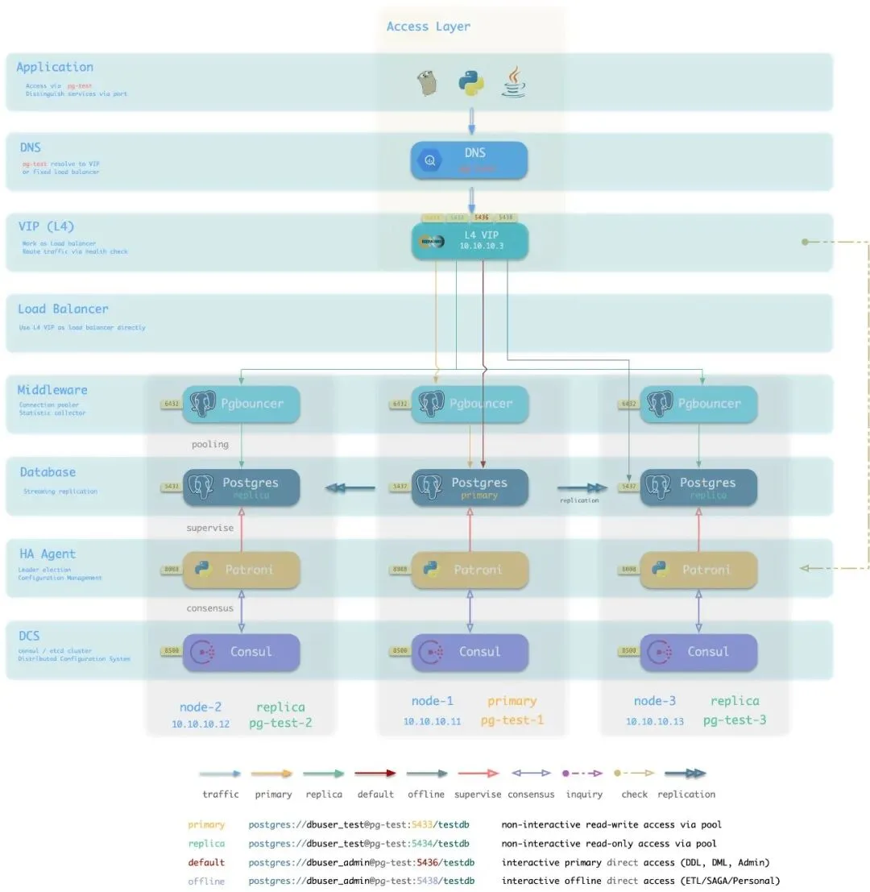

图：使用 L4 VIP 直接接入数据库集群

### 变体：自行解决

此外，用户也可以选择完全绕开 HAProxy，采用传统的静态 DNS 方式，或 Consul 动态服务发现，或 Consul DNS 的方式来连接数据库。**只要用户能自行确保连接至正确的数据库实例**（读写连主库，只读连从库，在线连连接池，离线直连数据库），那么就没有问题。

例如，用户可以使用 Consul 服务发现寻找集群的主库，或者通过连接串中指定多个 IP 地址与连接属性的方式定位集群主库，或者通过传统静态 DNS 的方式手工维护主从信息。

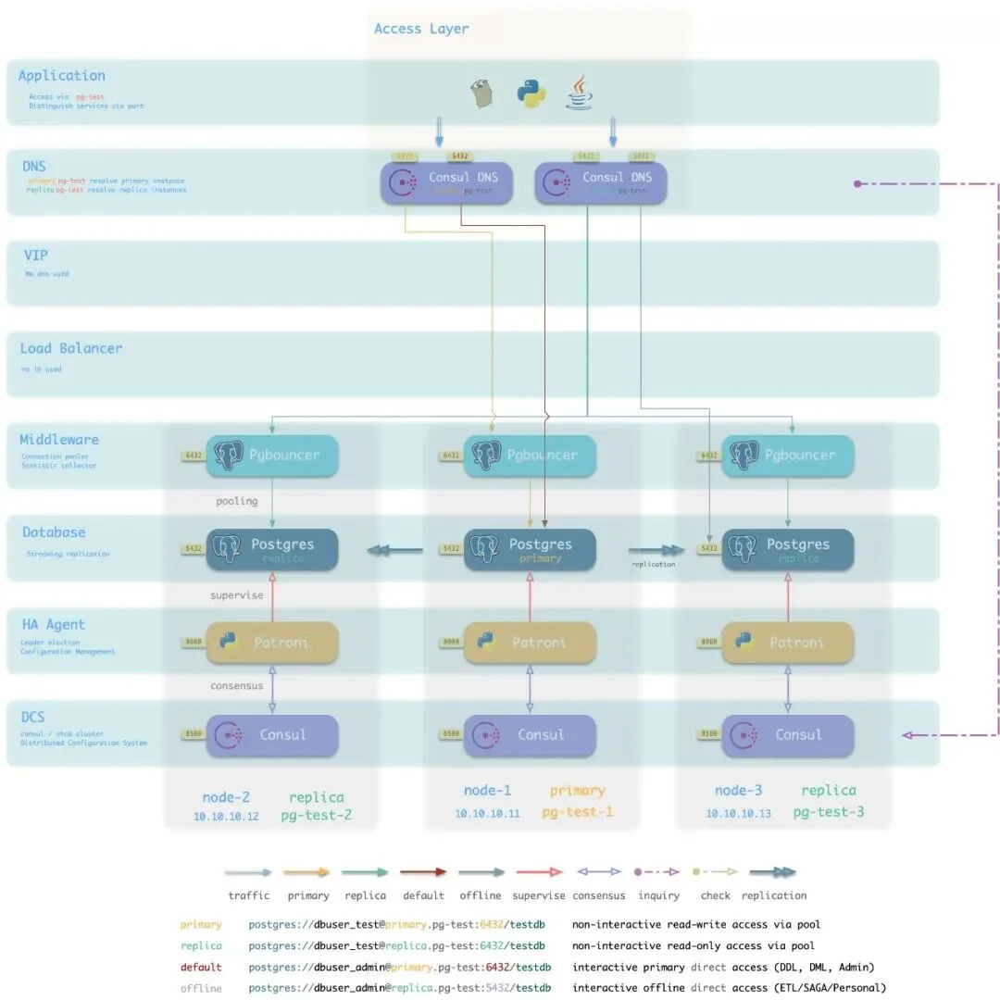

图：使用 Consul DNS 服务发现接入数据库集群

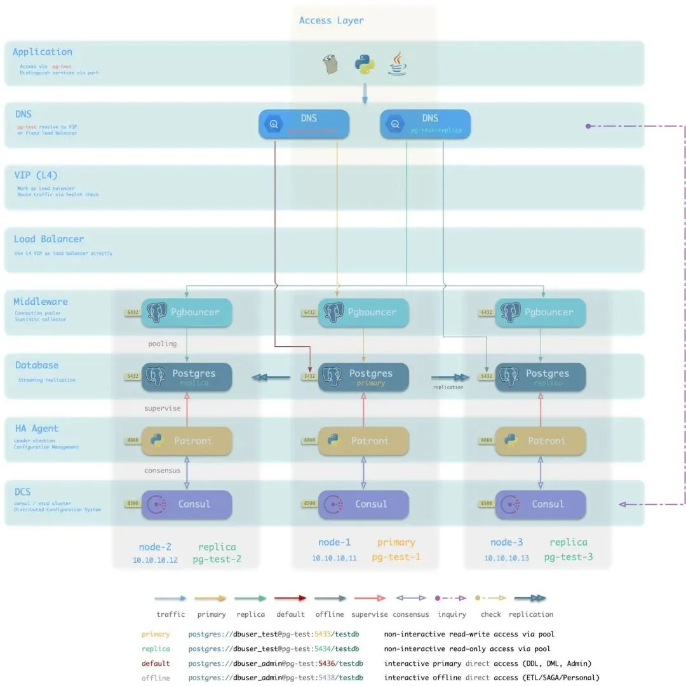

图：使用传统静态 DNS 接入数据库集群\

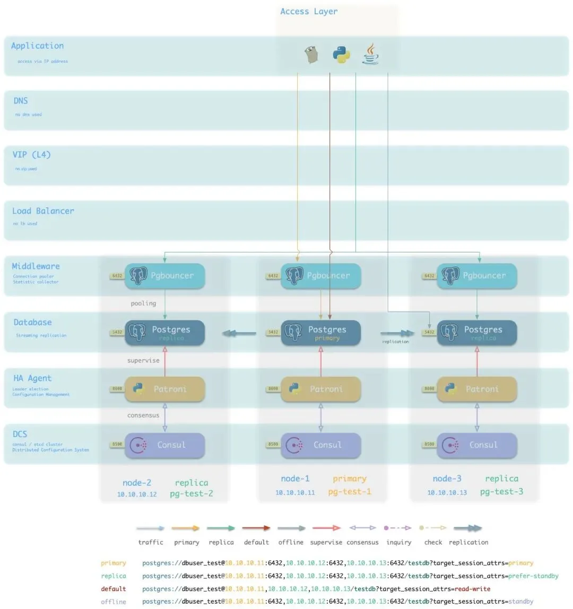

> 图：使用 IP 地址直连

06

—\

**基础设施**\

介绍完数据库集群后，让我们再来看一下数据库集群赖以运行的环境 —— 基础设施。所谓**基础设施**，就是介于操作系统与数据库集群中间的那一部分 **运行时（Runtime）**。

每一套 Pigsty **部署**（Deployment） 中，都需要有一些基础设施，才能使整个系统正常工作。基础设施通常由专业的运维团队或云厂商负责，但 Pigsty 作为一个开箱即用的产品解决方案，将基本的基础设施集成至供给方案中。包括：

- 域名基础设施：Dnsmasq（部分请求转发至 Consul DNS 处理）

- 时间基础设施：NTP

- 监控基础设施：Prometheus

- 报警基础设施：Altermanager

- 可视化基础设施：Grafana

- 本地源基础设施：Yum/Nginx

- 分布式配置存储：Consul/etcd

- Pigsty 基础设施：元数据库 MetaDB，管理组件 Ansible，定时任务，与其他高级特性组件。

基础设施部署于 **元节点** 上。每一套部署中都包含一个或多个**元节点**用于基础设施部署。

### 元节点

在每套环境中，Pigsty**最少**需要一个 **元节点**，该节点将作为整个环境的控制中心。元节点负责各种管理工作：保存状态，管理配置，发起任务，收集指标，等等。整个环境的基础设施组件，Nginx，Grafana，Prometheus，Alertmanager，NTP，DNS Nameserver，DCS 都将部署在元节点上。

同时，元节点也将用于部署元数据库 （Consul 或 Etcd），用户也可以使用已有的**外部 DCS 集群**。如果将 DCS 部署至元节点上，建议在**生产环境**使用 3 个元节点，以充分保证 DCS 服务的可用性。DCS 外的基础设施组件都将以对等副本的方式部署在所有元节点上。元节点的数量要求最少 1 个，推荐 3 个，建议不超过 5 个。

元节点上运行的服务如下所示：

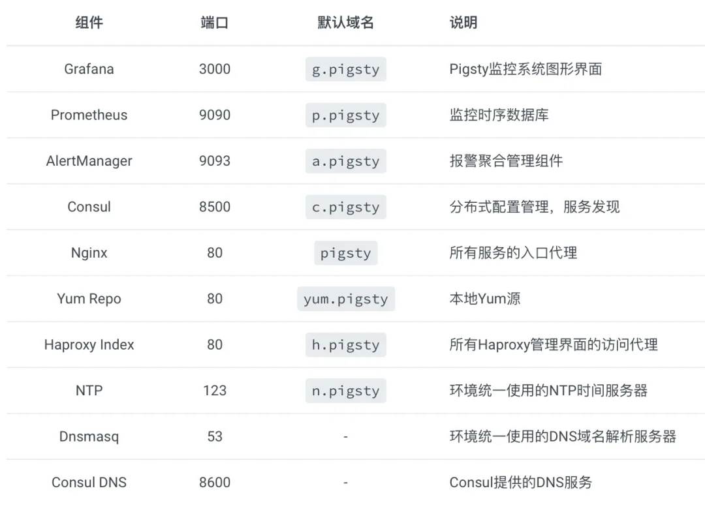

部署于元节点上的基础设置架构如下图所示：

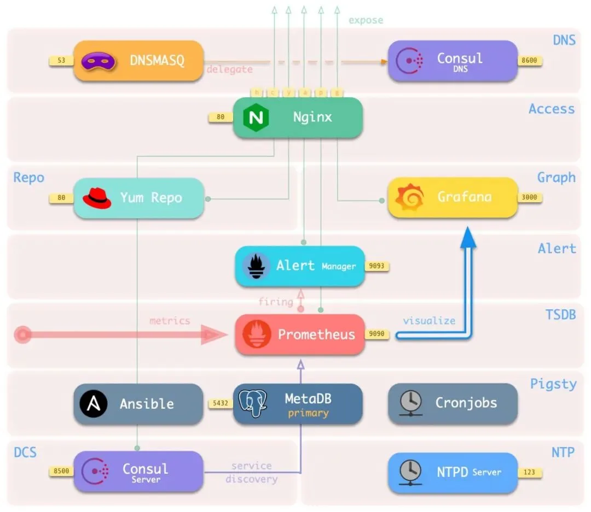

> 图：部署于元节点上的基础设施组件

其主要交互关系如下：

- Dnsmasq 提供环境内的 DNS**解析**服务（可选用已有 Nameserver）

  部分 DNS 解析将**转交**由 Consul DNS 进行

- Nginx 对外**暴露**所有 Web 服务，通过域名进行区分转发。

- Yum Repo 是 Nginx 的默认服务器，为环境中所有节点提供从离线安装软件的能力。

- Grafana 是 Pigsty 监控系统的载体，用于**可视化**Prometheus 与 CMDB 中的数据。

- Prometheus 是监控用时序数据库。

  Prometheus 默认从 Consul 获取所有需要抓取的 Exporter，并为其关联身份信息。

  Prometheus 从 Exporter 拉取监控指标数据，进行预计算加工后存入自己的 TSDB 中。

  Prometheus 计算报警规则，将报警事件发往 Alertmanager 处理。

- Consul Server 用于保存 DCS 的状态，达成共识，服务元数据查询。

- NTP 服务用于同步环境内所有节点的时间（可选用已有 NTP 服务器）

- Pigsty 相关组件：

  - 用于执行剧本，发起控制的 Ansible

  - 用于支持各种高级功能的 MetaDB（也是一个标准的数据库集群）

  - 定时任务控制器（备份，清理，统计，巡检，高级特性暂未加入）

## 基础设施与数据库的关系

以单个 元节点 和 单个 数据库节点 构成的环境为例，架构如下图所示：

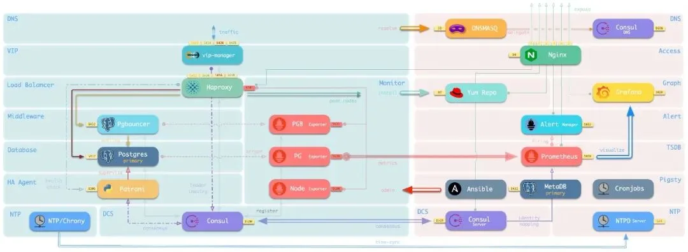

图：基础设施与数据库节点

元节点与数据库节点之间的交互主要包括：

- 数据库集群/节点的域名依赖元节点的 Nameserver 进行**解析**。

- 数据库节点软件**安装**需要用到元节点上的 Yum Repo。

- 数据库集群/节点的监控**指标**会被元节点的 Prometheus 收集。

- Pigsty 会从元节点上发起对数据库节点的**管理**

  执行集群创建，扩缩容，用户、服务、HBA 修改；日志收集、垃圾清理，备份，巡检等

- 数据库节点的 Consul 会向元节点的 DCS 同步本地**注册**的服务，并代理状态读写操作。

- 数据库节点会从元节点（或其他 NTP 服务器）**同步**时间

07

—\

**如何拥有？**\

介绍完 Pigsty 中高可用数据库集群的架构之后，让我们回到用户最关心的问题上来。如何拥有这样一套生产级数据库集群方案？

负责任的开发者不应该装完逼就跑，只讲自己多牛逼，不给别人解决实际问题。

Pigsty 是开源免费（您想赞助掏钱我举双手资瓷！）的数据库供给方案。在 Pigsty 中拥有这样的数据库集群，只需要两步：

首先准备好机器，填入集群基本信息（IP 地址，集群名，实例编号，实例角色）

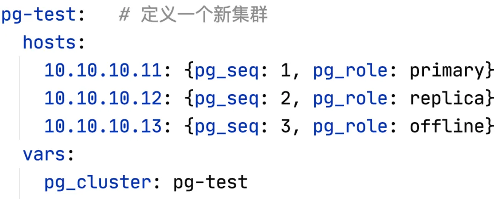

然后运行剧本，一键拉起

    ./pgsql.yml -l pg-test

实际上，不仅仅是数据库集群，整个基础设施与所有数据库集群都可以通过这样的命令一键拉起，而且还附带有开箱即用的**顶级 PostgreSQL 监控系统**。\

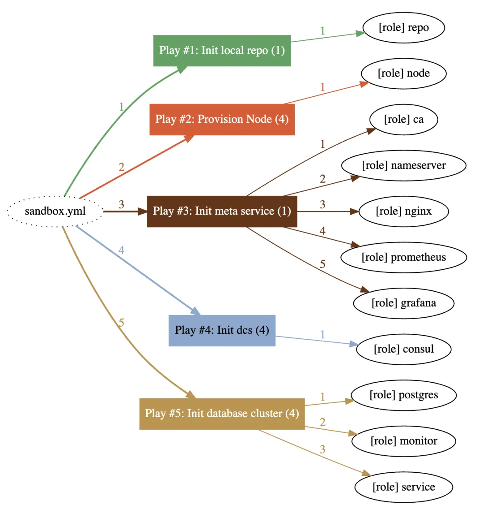

详细的文档，可以参考这里：<https://pigsty.cc>

08

—\

**广告时间**\

Pigsty v0.8 已经进入**RC 阶段**，**冻结新功能**，**承诺 API 稳定**，可放心用于生产。

**v1.0 GA** 版本将于近期释出，不晚于 2021-06-01。

另外据悉有数据库厂商在**洗稿集成**，说到底**模仿是最高的致敬**。我并**不介意**别人拿去卖钱商用，Apache2.0 协议允许闭源商用。但**很介意**弄点字符串替换和样式替换然后说这是**自研自主独立创新**blahblah。这违反了 Apache2.0 协议中对于**Copyright Notice**的要求。

**后续 Pigsty 开源版本除了升级 PG 大版本与 Bug 修复不会再有功能更新**，当然这对于生产使用来说**也许是一件好事**。

---

发布版本：[微信公众号](https://mp.weixin.qq.com/s/0GA_WTIsSHnboJ6TLNr7zQ)
