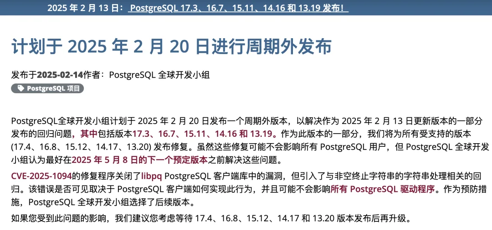
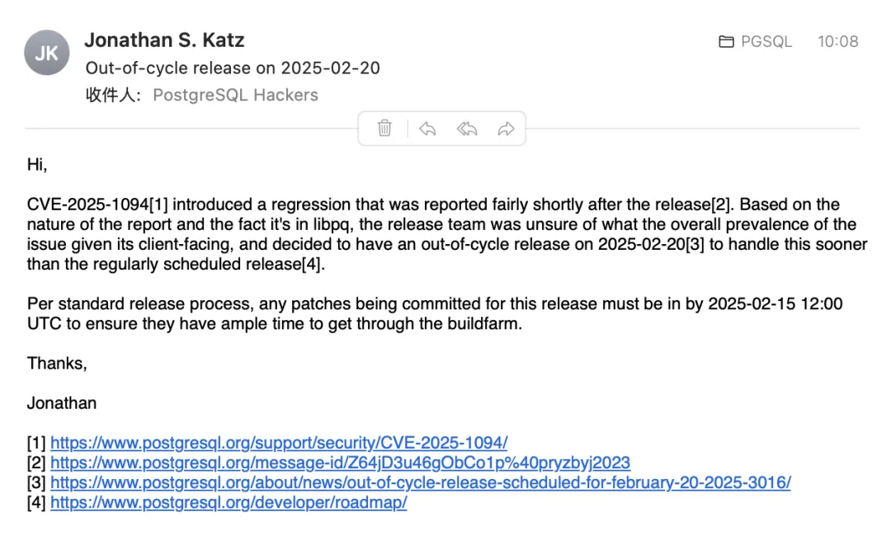

老话说的好，不要在星期五发布。昨天晚上，PostgreSQL 全球开发者宣布发布了每季度一次的例行小版本更新，我没有立刻发布一个中文翻译，因为上次 11 月的小版本更新翻车场景《[**号外：发布当日叫停，PG 也躲不过翻车**](/pg/pg-faint/)》还历历在目。

不过我没想到的是，还真的又让我连着撞上第二次翻车。仅仅十二小时后，PGDG 就宣布了将在 2 月 20 号紧急发布一个号外小版本，来回滚这次的错误。

在 2.14 号例行发布的 17.3，16.7，15.11，14.16，以及 13.19 小版本中，修复了 CVE-2025-1094 安全漏洞。不过这个修复引入了新的问题：非空终止字符串的字符串处理相关。这是一个 libpq 客户端库的问题，所以通常来说对用户的影响并不大，但为了保险起见，PGDG 决定通过在一周后进行号外发布来及时修复这个问题。

对于用户来说，我们建议您在此期间（2025-02-14 - 2025-02-20）不要升级 PostgreSQL，同时，如果您在此期间使用 Pigsty 全新在线安装 PostgreSQL 集群或升级现有集群的版本，则默认会安装受此缺陷影响的 PG 版本，请务必谨慎。与此同时，暂定于明日发布的 Pigsty v3.3 也将跟随 PostgreSQL 下一个小版本的发布节奏向后顺延。我们将在 2 月 20 号的小版本更新后重新编译并发布受支持的 400 个 PG 扩展插件。

老实说，连续两次小版本发布都出现这种问题，确实是不太好。在《[**PostgreSQL 17 发布：摊牌了，我不装了！**](/pg/pg-17/)》我提到过：PG 开发者社区在过去一年中出现了非常显著的精神转变 —— Just use PostgreSQL for Everything 成为社区津津乐道的话题，而且官方更是直白的喊出了干翻顶级商业数据库（Oracle） 的口号。\

这种昂扬乐观进取的精神一方面促使社区飞速前进，并诞生出 [**DuckDB 缝合大赛**](/pg/pg-duckdb/)这种生态奇观。但另一方面也让 PG 社区开始飘起来了，这确实是需要注意的一件事。

---

## 计划于 2025 年 2 月 20 日发布非周期性更新

发布于 **2025-02-14**，由 PostgreSQL 全球开发组

### PostgreSQL 项目组

<https://www.postgresql.org/about/news/out-of-cycle-release-scheduled-for-february-20-2025-3016/>

PostgreSQL[1] 全球开发组计划于 2025 年 2 月 20 日发布一个非周期性更新，以解决在 2025 年 2 月 13 日更新版本[2]中发布的回归问题，该版本包括了 17.3、16.7、15.11、14.16 和 13.19[3]。此次更新将为所有受支持版本发布修复（17.4、16.8、15.12、14.17、13.20）。虽然这些修复可能不会影响所有 PostgreSQL 用户，但 PostgreSQL 全球开发组认为，提前解决这些问题要比等到下一次计划更新（2025 年 5 月 8 日）[4]更为合适。

针对 CVE-2025-1094[5]，该漏洞关闭了 libpq[6] PostgreSQL 客户端库中的一个漏洞，修复过程中引入了与非空终止字符串处理相关的回归错误。此错误的可见性取决于 PostgreSQL 客户端实现此行为的方式，可能不会影响所有 PostgreSQL 驱动程序[7]。作为预防措施，PostgreSQL 全球开发组决定发布跟进更新。

如果您受此问题影响，建议等待 17.4、16.8、15.12、14.17 和 13.20 版本的发布后再进行升级。

---

## PostgreSQL 17.3，16.7，15.11，14.16，以及 13.19 发布！

<https://www.postgresql.org/about/news/postgresql-173-167-1511-1416-and-1319-released-3015/>

PostgreSQL 全球开发组已发布更新，涵盖所有受支持版本的 PostgreSQL，包括 17.3、16.7、15.11、14.16 和 13.19。本次更新修复了 1 个安全漏洞和过去几个月内报告的 70 多个错误。

有关更改的完整列表，请查看发布说明[8]。

### 安全问题

### CVE-2025-1094[9]: PostgreSQL 引号 API 未能中和文本中的引号语法，导致编码验证失败

CVSS v3.1 基础分数：8.1[10]

受支持的易受攻击版本：13 - 17。

PostgreSQL `libpq`[11] 函数 `PQescapeLiteral()`、`PQescapeIdentifier()`、`PQescapeString()` 和 `PQescapeStringConn()` 中的引号语法未正确中和，允许数据库输入提供者在某些使用模式下实现 SQL 注入。具体来说，SQL 注入要求应用程序使用函数结果构造输入到 psql（PostgreSQL 交互终端）。同样，PostgreSQL 命令行工具程序中引号语法的错误中和也允许命令行参数源在`client_encoding`[12]为`BIG5`且`server_encoding`[13]为`EUC_TW`或`MULE_INTERNAL`时实现 SQL 注入。受影响的版本为 PostgreSQL 17.3、16.7、15.11、14.16 和 13.19 之前的版本。

PostgreSQL 项目感谢 Rapid7 的首席安全研究员 Stephen Fewer 报告此问题。

### 错误修复与改进

本次更新修复了过去几个月内报告的 70 多个错误。以下列出的问题影响了 PostgreSQL 17。其中一些问题也可能影响其他受支持版本的 PostgreSQL。

- 恢复 v17 之前对超过 63 字节的数据库名称和用户名的截断行为。
- 在并行工作进程中不执行连接权限检查和限制，而是从主进程继承这些权限。
- 从`LWLock`等待事件名称中移除`Lock`后缀。
- 修复窗口聚合中可能出现的陈旧结果重复使用问题，这可能导致错误的结果。
- 多个`vacuum`问题修复，最严重的情况下可能导致系统目录损坏。
- 多个截断表和索引的修复，防止潜在的损坏。
- 修复在其自身外键约束引用分区表时分离分区的问题。
- 修复`to_timestamp`中的`FFn`（例如，`FF1`）格式代码，其中整数格式代码在`FFn`之前会消耗所有可用数字。
- 对 SQL/JSON 和`XMLTABLE()`进行修复，确保在必要时对特定条目进行双引号处理。
- 在`pg_hba_file_rules()`[14]中包含`ldapscheme`选项。
- 对`UNION`的多个修复，包括不合并具有不兼容排序规则的列。
- 多个可能影响连接到 PostgreSQL 的可用性或启动速度的修复。
- 修复逻辑解码输出中的多个内存泄漏。
- 修复 PL/Python[15]中的多个内存泄漏。
- 为`COPY (MERGE INTO)`[16]添加 psql 标签补全。
- 使`pg_controldata`[17]在显示损坏的 pg_control[18]文件信息时更具韧性。
- 修复`pg_restore`[19]在处理 zstd 压缩数据时的内存泄漏。
- 修复`pg_basebackup`[20]在 Windows 上正确处理超过 2GB 的 pg_wal.tar 文件。
- 将 earthdistance[21]修改为使用 SQL 标准函数体，解决了当数据库使用此扩展并升级到 v17 时可能出现的问题。
- 修复 pageinspect[22]中的崩溃问题，当`brin_page_items()`函数定义未更新到最新版本时会发生该问题。
- 修复在尝试取消`postgres_fdw`[23]远程查询时的竞争条件问题。

本次更新还将时区数据文件更新为 tzdata 2025a 版，包含了巴拉圭的夏令时法律变化和菲律宾的历史性更正。

### 更新

所有 PostgreSQL 更新版本都是累积性的。与其他次要版本更新一样，用户不需要转储并重新加载数据库或使用`pg_upgrade`来应用此更新版本；只需关闭 PostgreSQL 并更新其二进制文件即可。

跳过一个或多个更新版本的用户可能需要执行额外的更新后步骤；有关详细信息，请参阅早期版本的发布说明。

欲了解更多详细信息，请查看发布说明[24]。

### 链接

- 下载[25]
- 发布说明[26]
- 安全[27]
- 版本政策[28]
- 捐赠[29]

如果您对本次发布公告有任何更正或建议，请将其发送到公共邮件列表 <pgsql-www@lists.postgresql.org>[30]。邮件列表说明见参考资料[31]。

[https://mp.weixin.qq.com/s/l1BgfLaRKNNEqHyfx33E6A?token=40546795&lang=zh_CN](/pg/pg-faint/)

### References

- `[1]` PostgreSQL: <https://www.postgresql.org/>
- `[2]` 2025 年 2 月 13 日更新版本： <https://www.postgresql.org/about/news/postgresql-173-167-1511-1416-and-1319-released-3015/>
- `[3]` 17.3、16.7、15.11、14.16 和 13.19: <https://www.postgresql.org/about/news/postgresql-173-167-1511-1416-and-1319-released-3015/>
- `[4]` 下一次计划更新（2025 年 5 月 8 日）： <https://www.postgresql.org/developer/roadmap/>
- `[5]` CVE-2025-1094: <https://www.postgresql.org/support/security/CVE-2025-1094/>
- `[6]` libpq: <https://www.postgresql.org/docs/current/libpq.html>
- `[7]` 所有 PostgreSQL 驱动程序： <https://wiki.postgresql.org/wiki/List_of_drivers>
- `[8]` 发布说明： <https://www.postgresql.org/docs/release/>
- `[9]` CVE-2025-1094: <https://www.postgresql.org/support/security/CVE-2025-1094/>
- `[10]` 8.1: <https://nvd.nist.gov/vuln-metrics/cvss/v3-calculator?version=3.1&vector=AV:N/AC:H/PR:N/UI:N/S:U/C:H/I:H/A:H>
- `[11]` `libpq`: <https://www.postgresql.org/docs/current/libpq.html>
- `[12]` `client_encoding`: <https://www.postgresql.org/docs/current/runtime-config-client.html#GUC-CLIENT-ENCODING>
- `[13]` `server_encoding`: <https://www.postgresql.org/docs/current/runtime-config-preset.html#GUC-SERVER-ENCODING>
- `[14]` `pg_hba_file_rules()`: <https://www.postgresql.org/docs/current/view-pg-hba-file-rules.html>
- `[15]` PL/Python: <https://www.postgresql.org/docs/current/plpython.html>
- `[16]` `COPY (MERGE INTO)`: <https://www.postgresql.org/docs/current/sql-copy.html>
- `[17]` `pg_controldata`: <https://www.postgresql.org/docs/current/app-pgcontroldata.html>
- `[18]` pg_control: <https://www.postgresql.org/docs/current/wal-internals.html>
- `[19]` `pg_restore`: <https://www.postgresql.org/docs/current/app-pgrestore.html>
- `[20]` `pg_basebackup`: <https://www.postgresql.org/docs/current/app-pgbasebackup.html>
- `[21]` earthdistance: <https://www.postgresql.org/docs/current/earthdistance.html>
- `[22]` pageinspect: <https://www.postgresql.org/docs/current/pageinspect.html>
- `[23]` `postgres_fdw`: <https://www.postgresql.org/docs/current/postgres-fdw.html>
- `[24]` 发布说明： <https://www.postgresql.org/docs/release/>
- `[25]` 下载： <https://www.postgresql.org/download/>
- `[26]` 发布说明： <https://www.postgresql.org/docs/release/>
- `[27]` 安全： <https://www.postgresql.org/support/security/>
- `[28]` 版本政策： <https://www.postgresql.org/support/versioning/>
- `[29]` 捐赠： <https://www.postgresql.org/about/donate/>
- `[30]` <pgsql-www@lists.postgresql.org>
- `[31]` 邮件列表： <https://www.postgresql.org/list/>

---

发布版本：[微信公众号](https://mp.weixin.qq.com/s/5HqebxJvBkNu4JybKvTCwQ)
