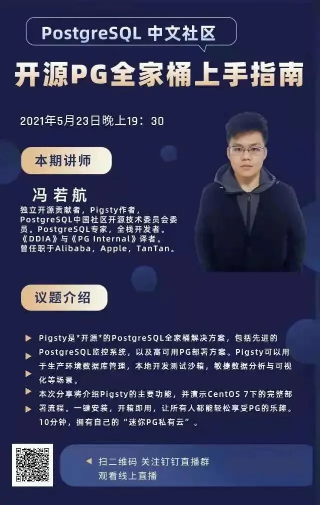
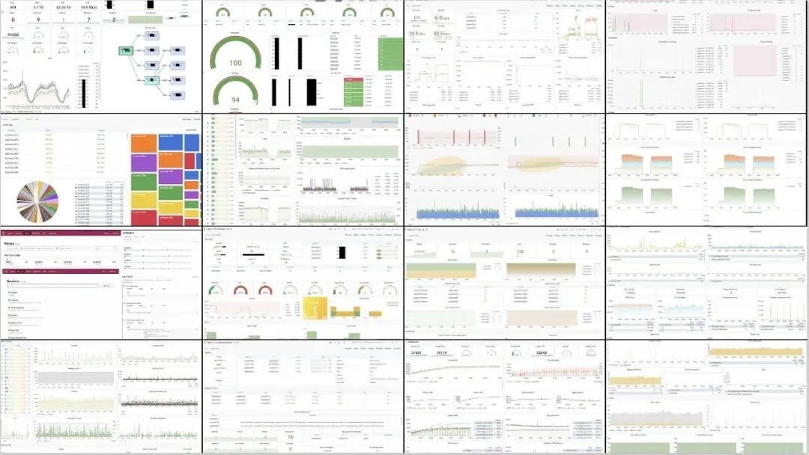
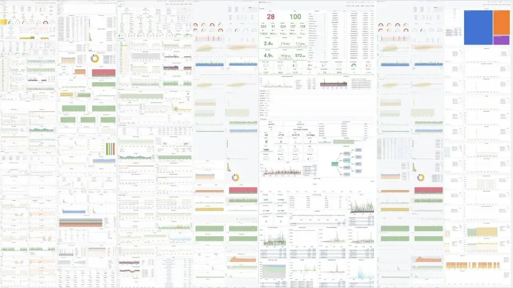
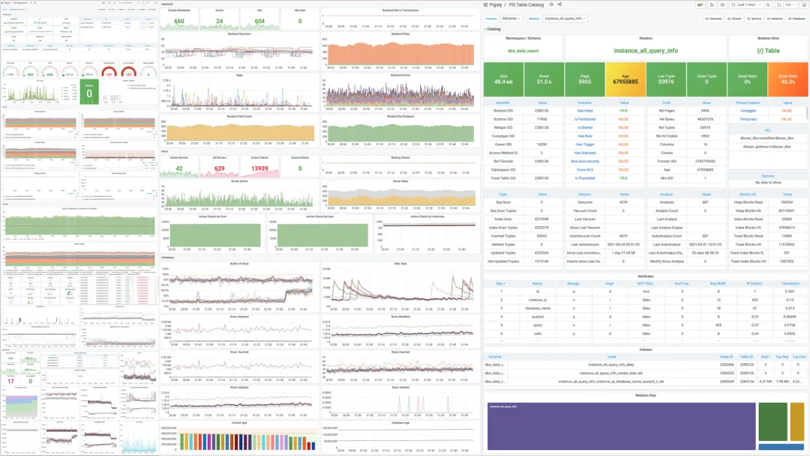
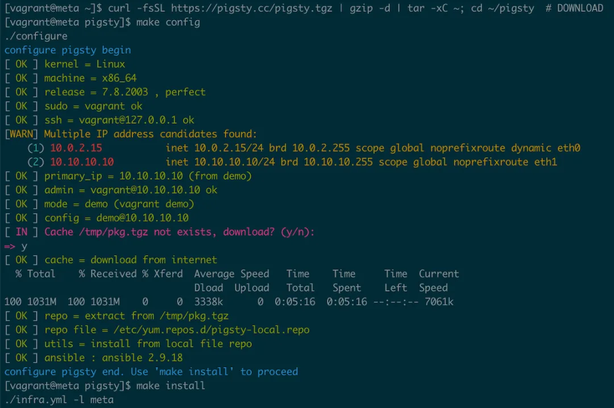
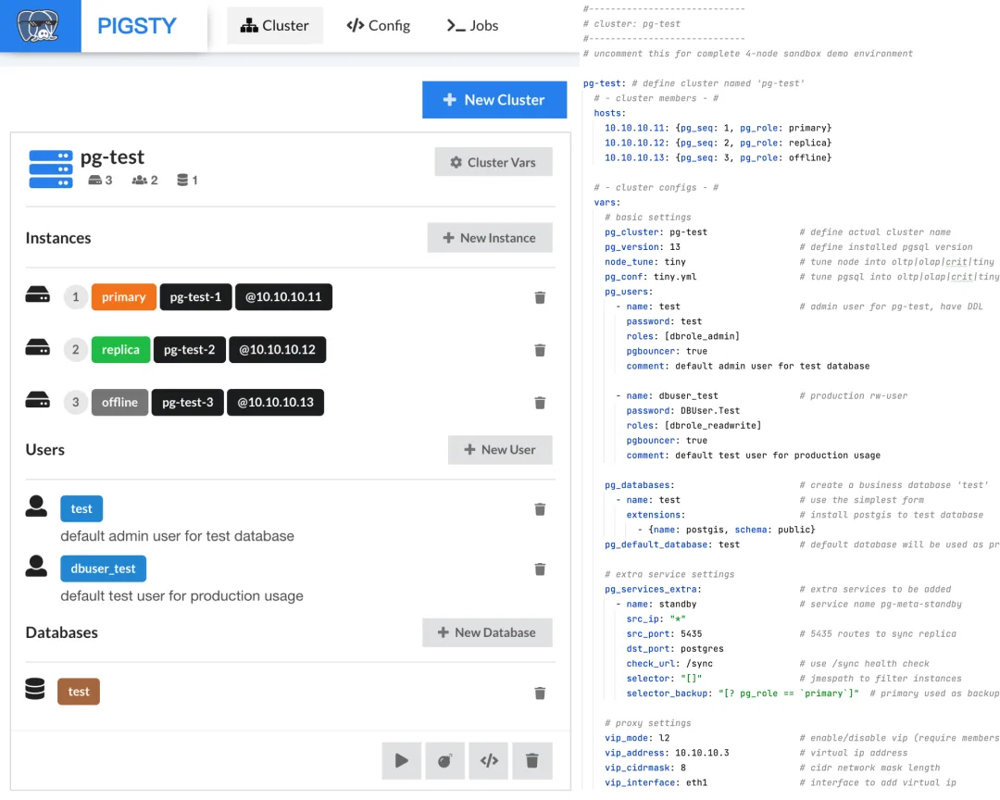

PostgreSQL 中文社区又开始在线直播啦！本周日（5 月 23 日晚 7:30），由我带给大家来一段单口相声 —— **《开源 PG 全家桶上手指南》**。

Pigsty 是 **开源** 的 PostgreSQL 一条龙解决方案，主要有以下三个目标：

- **做最顶尖最专业的** **开源 PostgreSQL** **监控系统**

- **做门槛最低最好用的** **开源 PostgreSQL** **管控方案**

- **做开箱即用的数据分析可视化集成环境**

## 详情参考：<https://pigsty.cc>

## 谁会感兴趣？

**PostgreSQL DBA，运维，DevOps**：Pigsty 提供了一体化的生产级**监控系统**与**部署方案**，可以极大提高数据库的管理 &使用水平下限。肯定比自己 yum install & systemctl start 强大到不知道哪里去了。其监控系统指标覆盖率完爆市面上所有同类产品。

**PostgreSQL 用户，后端开发者，数据研发工程师，内核研发**：Pigsty 提供了**与生产环境完全一致**的本地沙箱，其中包含单节点的默认沙箱与 4 节点的集群沙箱。用户可以方便地在本地进行开发测试，并通过监控系统获得即时反馈。

**对**数据分析**，**数据可视化**感兴趣的人**：Pigsty 提供了本地、单机即可运行，开箱即用的**集成数据分析环境**：包括分析功能强大的 PostgreSQL（内嵌 PostGIS，TimeScale 地理空间时序数据等扩展），敏捷的数据库可视化平台 Grafana，以及内建的 Echarts 可视化支持。

**学生，新手程序员，以及任何有兴趣尝试 PostgreSQL 数据库的用户**。Pigsty 上手门槛极低：您只需要有一台虚拟机，或者一台笔记本即可运行。三行命令，一键安装，10 分钟搞定。

## 相关分享

先前我在 PostgreSQL 中文社区做过三次相关的直播分享，分别关于监控系统，高可用架构，数据可视化：

- **PostgreSQL 监控实战：集群监控**: <https://www.bilibili.com/video/BV1tV411r7hy>

- **PG 高可用落地实践之 Patroni**：<https://www.bilibili.com/video/BV1fp4y1S7Hg>

- **PostgreSQL 与数据可视化**：<https://www.bilibili.com/video/BV1Gh411o7FG>

其实这些分享中已经可以看到 Pigsty 的三个核心抓手：**监控**，**管控**，**可视化**。这次分享将浓缩三者精华，直接以实例介绍这些功能。并现手把手演示如何用 10 分钟从上手到**交付**，**敬请期待**～

### 主要内容

---

发布版本：[微信公众号](https://mp.weixin.qq.com/s/FbXJpeOR1VpGdrlCJpoirA)
