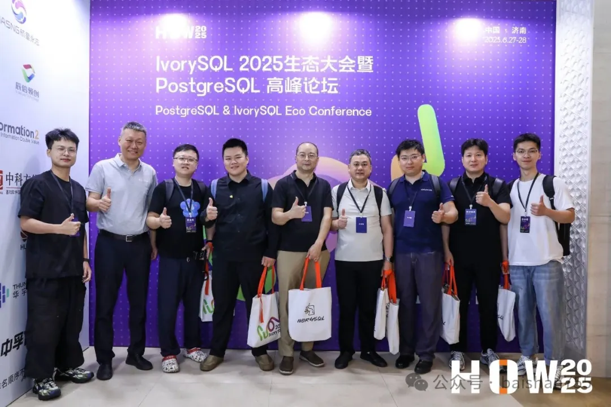
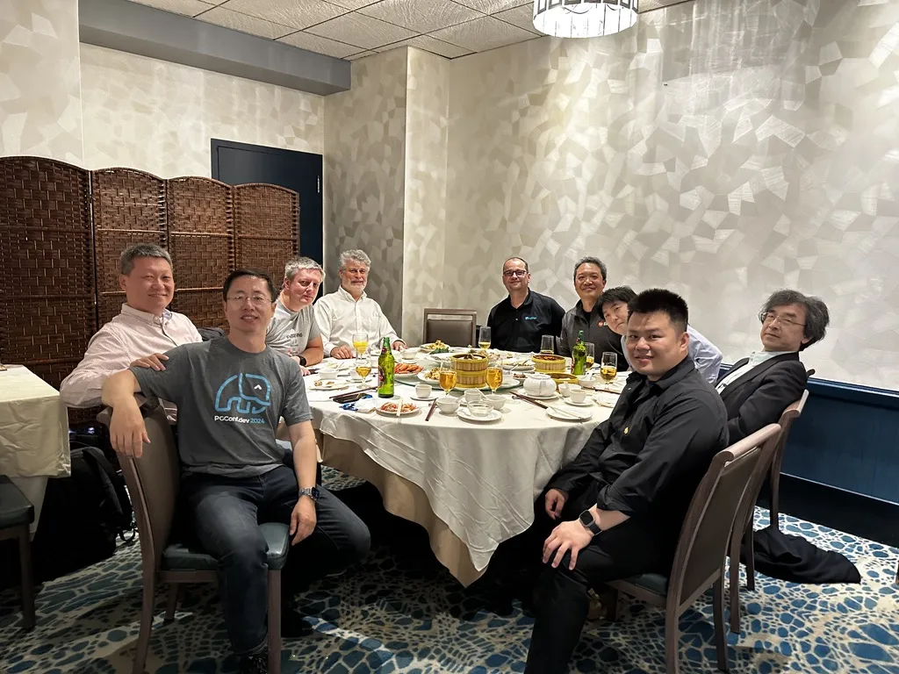
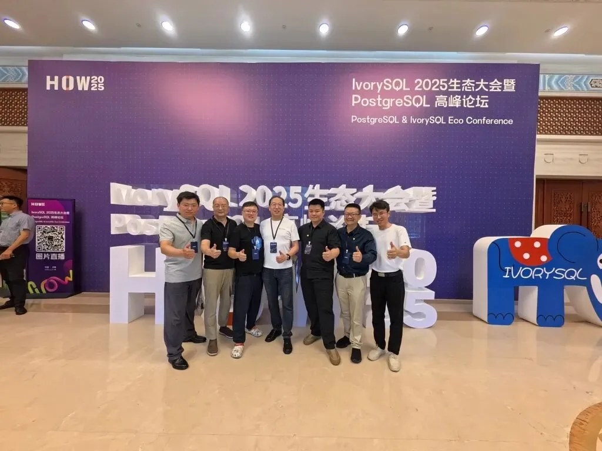
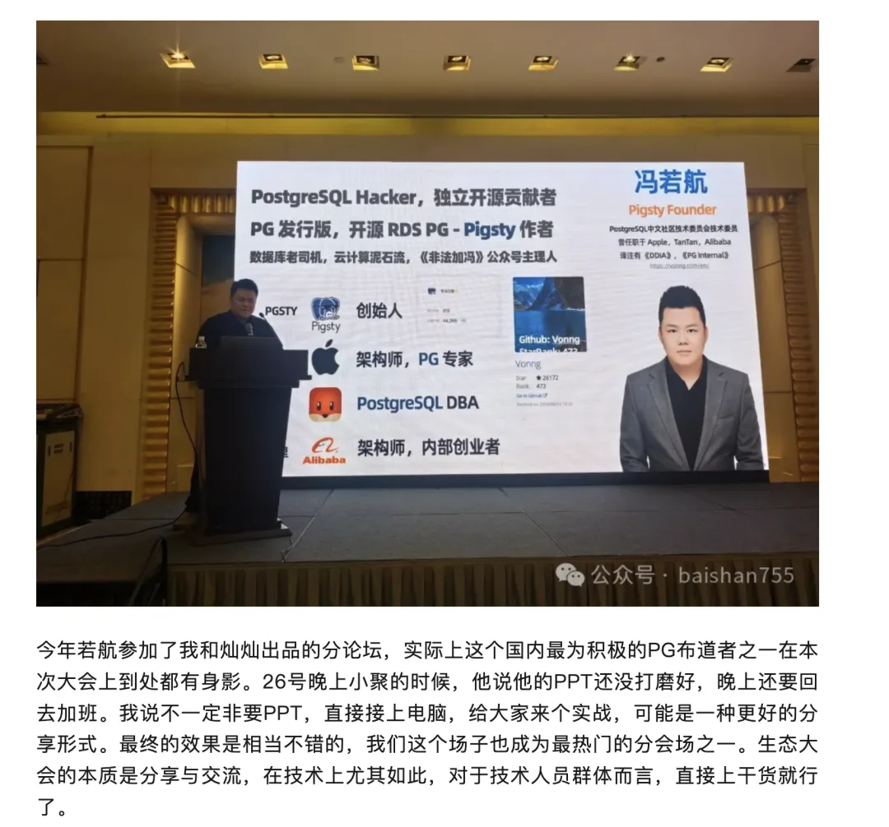
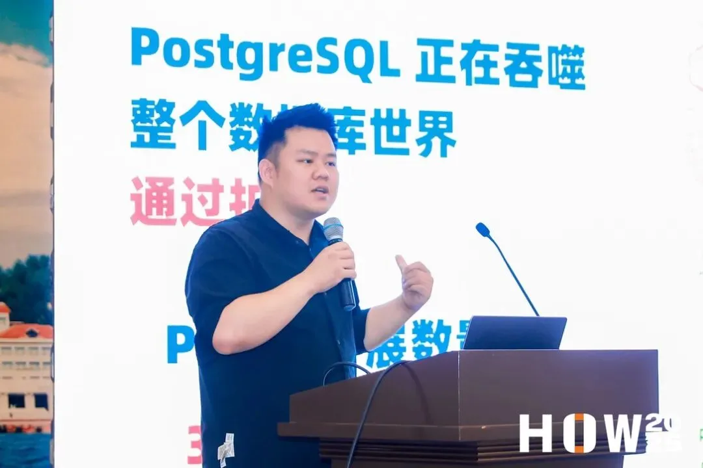
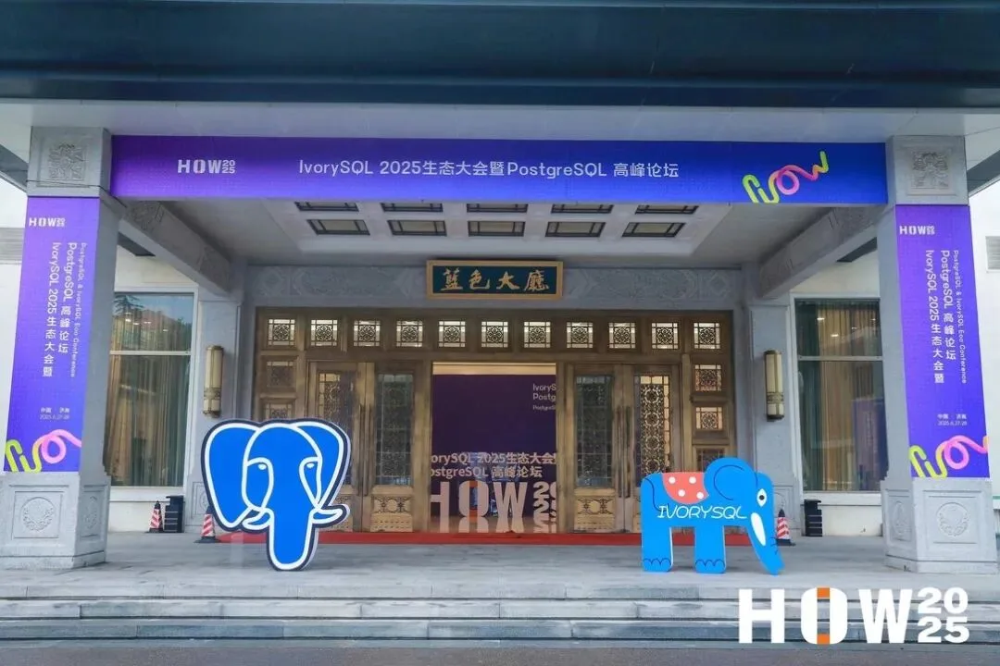

这两天老冯在济南参加完 PostgreSQL 高峰论坛，正在回家路上。这次大会的规模有些超出预期 —— 主会场坐的满满当当，听说有一千五百多人。PG 圈的老朋友基本都来了，还有几位刚在蒙特利尔见过的国际友人也在，今天应该跟着大巴在济南一日游呢。

这次大会主办方是瀚高 / IvorySQL 社区，能摇来这么多人，估计得一百多万。听说[最近农行投了主办方瀚高几个亿](https://mp.weixin.qq.com/s?__biz=MzA3ODM2NTUyNA==&mid=2650945531&idx=1&sn=78b7abd706abfd6873f0d501db01607a&scene=21#wechat_redirect)，这场大会也算是秀了秀肌肉。我觉得是挺好的一件事，资源就应该投向做实事的公司，为他们和社区感到高兴。

在中国的 PG 生态中，瀚高算是极个别的愿意做实事，并有能力进行国际参与的公司。这两年的 PGCon.Dev 全球开发者大会都能看到瀚高的身影，苗老板也算是我在 PG 国际大会第一位看到的中国数据库公司老板。

瀚高在北美有一个研究院办事处，Grant Zhou 与 Carry Huang 在国际社区中有很多参与，某种程度上堪称中文世界与全球社区的桥梁，[PGCon.Dev 上，周老师在闪电演讲上专门介绍了这场活动](/pg/pgcondev-lightning/)，这次有不少国际社区的 PG 大咖都是 GrantZhou 与 CarryHuang 邀请来的。我去加拿大参会的时候，他们也帮了我不少忙，哈哈。

最主要的是，这次大会举办的非常成功 —— 这么多人要安排妥帖，布展，组织议题，宣发，再加上选了个非北上广的城市举办，就更加不容易了。我想不出上次在中国有这种规模的 PG 活动是什么时候了，也许这应该是第一次吧。从结果上看，基本上接过了 PostgreSQL 中文社区的生态位。听说年底在深圳还有一场大会，这里衷心祝愿他们越办越好。

当然，要说最成功的莫过于主会场的大广告，主办方说录个十几秒到一分钟左右到祝福视频，我就真录了一分钟。我本来想的是可能几十个人一人一段混剪，结果最后也就六七个朋友录了十几秒，然后我这个大脸盘子叭叭在一千多人面前循环了十来次，这广告效果真是绝了。不过早知道这么多人看，应该开个美颜，再放个 Logo 的。

老冯这次有好几项日程，比如第一天在白鳝老师和灿灿出品的运维分论坛里讲了一个关于 Pigsty 如何用开源撺出免费的 “企业级云数据库方案” 的主题，然后在第二天介绍了一个 PG 扩展仓库与包管理器，帮助扩展作者分发作品，帮助 PG 用户找到并安装扩展。我也都参加了两天下午的圆桌，一个信创数据库圆桌，一个 AI 数据库圆桌。

白鳝老师写了一篇参会小记 [PG 生态大会 2025 观感](https://mp.weixin.qq.com/s?__biz=MzA5MzQxNjk1NQ==&mid=2647854488&idx=1&sn=ed72079404d77bf60d6c85357af26cd6&scene=21#wechat_redirect)，哈哈，引用一段儿：

我越来越觉得，其实最有意思的其实还是即兴问答与圆桌交流，大家即时地针对最感兴趣的问题进行实时交流与 QA，可能是效果最好的形式。我也准备在以后的分享中尽可能尝试这种形式。

另一个分享主题介绍了最近做的 PostgreSQL 扩展仓库，包管理器，以及扩展百科全书，我希望在场的 PG 系 “国产数据库” 们不要再闭门造车了，看看生态最前沿都在搞什么，把这些扩展赶紧弄进去吧 —— 我这儿都现成打包好开源免费的 RPM/DEB 包了，加几行代码客户就能用上四百多个 PG 扩展，这难道不好吗？

这场大会我觉得一个比较有亮点的地方，就是大家对于信创这个东西总算还是实事求是了。毕竟都是搞技术出身的人为主，一个东西到底行不行，大家总算是能畅所欲言一把。

起码来参加的厂商，还都是敢于光明正大的承认自己的产品就是基于 PG，拥抱 PG 来做的。而不是像一些遮遮掩掩，宣称 100% 自研自主可控实际上就是土法手搓，邪路分叉换皮套壳，没有出息与前途的垃圾。我将一刀切要求换所谓 “国产” 的行为比做数据库领域的 “3C 充电宝贴纸”，伤害的最终还是用户，与公信力。

顺便一提，吕海波老师《[HOW2025 参会归来](https://mp.weixin.qq.com/s?__biz=MzkyMjQzOTkyMQ==&mid=2247484679&idx=1&sn=8f45615f57e0d32092c286b26cd6c07d&scene=21#wechat_redirect)》的分享，用 CPU Profiling 的定量研究方法，指出了 OpenGauss 和 Oceabase 性能的拉垮，实名骑脸输出，老冯大呼过瘾，在这里要给吕老师点赞。

所以，这是本场大会最让我感到高兴的一点 —— 开源链接世界，只有拥抱开源，融入开源，才是基础软件领域的康庄大道。要想真正提升中国数据库产业水平，地位，供应链话语权，拥抱 PostgreSQL，共建繁荣开源生态才是正路 —— 按理来说这本来应该是常识，不过我还是感到很欣慰，常识最终还是能成为了大家的共识。

---

发布版本：[微信公众号](https://mp.weixin.qq.com/s/uoZ1-RqCJd8vPGtUFaLauA)
